# End-to-End Node.js CI/CD DevSecOps Pipeline on AWS


> A comprehensive portfolio project demonstrating modern DevOps and DevSecOps practices using Node.js, Docker, Terraform, Jenkins, AWS, Kubernetes, Prometheus, and Grafana.


---
## Table of Contents

1. [Project Overview](#project-overview)
2. [Current Progress](#current-progress)
3. [Project Objectives](#project-objectives)
4. [Solution Architecture](#solution-architecture)
5. [AWS Infrastructure Provisioned](#aws-infrastructure-provisioned)
6. [Technology Stack](#technology-stack)
7. [Project Structure](#project-structure)
8. [Repository Structure](#repository-structure)
9. [Project Workflow](#project-workflow)
10. [Project Phases](#project-phases)
11. [Latest Milestone](#latest-milestone)
12. [Documentation](#documentation)
13. [Screenshots](#screenshots)
14. [Prerequisites](#prerequisites)
15. [Running the Project Locally](#running-the-project-locally)
16. [Future CI/CD Pipeline](#future-cicd-pipeline)
17. [Future Enhancements](#future-enhancements)
18. [Current Status](#current-status)
19. [Author](#author)

---


## Project Overview

This repository demonstrates the design, implementation, and deployment of a complete end-to-end DevSecOps pipeline for a containerized Node.js monitoring application on Amazon Web Services (AWS).

The project combines modern DevOps and DevSecOps practices by integrating Infrastructure as Code (Terraform), containerization (Docker), continuous integration and continuous deployment (Jenkins), automated security scanning (SonarCloud, Snyk, Trivy, and OWASP ZAP), container orchestration (Amazon Elastic Kubernetes Service), and application monitoring (Prometheus and Grafana).

Rather than focusing on a single technology, this project demonstrates how industry-standard DevOps and DevSecOps tools integrate to automate the complete software delivery lifecycle—from application development and infrastructure provisioning to deployment, security validation, and monitoring.

The repository is being developed incrementally using a phased implementation approach. Each phase is independently designed, implemented, tested, and documented to demonstrate both the engineering process and the practical application of modern cloud-native DevOps and DevSecOps practices.


---

## Key Features

- Infrastructure provisioned using Terraform (IaC)
- Dedicated Jenkins automation server on Amazon EC2
- Dockerized Node.js monitoring application
- Amazon Elastic Kubernetes Service (EKS) deployment platform
- Amazon Elastic Container Registry (ECR)
- Automated unit testing with Jest and Supertest
- Jenkins CI/CD pipeline with automated source-code checkout and dependency installation
- SonarCloud Static Application Security Testing (SAST)
- SonarCloud Quality Gate enforcement
- Snyk Software Composition Analysis (SCA)
- Dependency vulnerability analysis with Snyk
- Automated Docker image build within the Jenkins pipeline
- Trivy container security scanning *(upcoming)*
- OWASP ZAP Dynamic Application Security Testing (DAST) *(upcoming)*
- Monitoring with Prometheus and Grafana *(upcoming)*

---

## Current Progress

The project is being developed incrementally, with each phase documented in detail. The following milestones have been completed or are currently in progress.

### ✅ Completed

- ✔ Node.js Monitoring Application
- ✔ Application Refactoring
- ✔ Unit Testing (Jest & Supertest)
- ✔ Docker Containerization
- ✔ AWS Infrastructure Provisioned with Terraform
- ✔ Amazon EKS Cluster
- ✔ Amazon ECR Repository
- ✔ Jenkins EC2 Infrastructure
- ✔ IAM Roles & Instance Profiles
- ✔ Elastic IP Configuration
- ✔ Jenkins Installation & Configuration
- ✔ Docker Installation on Jenkins Server
- ✔ AWS CLI Installation
- ✔ kubectl Installation
- ✔ Helm Installation
- ✔ Trivy Installation
- ✔ Jenkins Initial Configuration
- ✔ Jenkins Pipeline Job Configuration
- ✔ Jenkinsfile Configuration
- ✔ Jenkins Pipeline Agent Initialization
- ✔ JDK 21 Tool Resolution
- ✔ Node.js 18.20.8 Tool Resolution
- ✔ Explicit Source Code Checkout
- ✔ Default Jenkins SCM Checkout Disabled
- ✔ Install Dependencies Stage
- ✔ Jenkins Workspace Dependency Preparation
- ✔ Unit Testing Stage
- ✔ Jest Test Suite Execution
- ✔ 3 Automated Tests Passed
- ✔ Successful Unit Testing Pipeline Execution
- ✔ Successful Initial Pipeline Execution
- ✔ SonarCloud Project Configuration
- ✔ Jenkins SonarCloud Server Configuration
- ✔ Jenkins SonarScanner Configuration
- ✔ SonarCloud Authentication Credential Configuration
- ✔ SonarCloud SAST Analysis Stage
- ✔ Jenkins-Managed SonarScanner Integration
- ✔ Successful SonarCloud Source-Code Analysis
- ✔ Successful SonarCloud Analysis Report Upload
- ✔ SonarCloud Quality Gate Wait Configuration
- ✔ Successful SonarCloud Quality Gate Evaluation
- ✔ SonarCloud Quality Gate Passed
- ✔ SonarCloud Project Dashboard Verification
- ✔ SonarCloud Project Analysis Results Verification
- ✔ Successful SonarCloud Pipeline Execution
- ✔ Snyk Security Plugin Installation
- ✔ Snyk Authentication Credential Configuration
- ✔ Snyk Tool Configuration
- ✔ Snyk Software Composition Analysis (SCA) Stage
- ✔ Jenkinsfile Snyk SCA Integration
- ✔ Snyk SCA Pipeline Execution
- ✔ Snyk Dependency Vulnerability Analysis
- ✔ Snyk Vulnerability Results Verification
- ✔ Docker Image Build Stage
- ✔ Jenkins Docker Image Build Integration
- ✔ Successful Docker Image Creation

### 🚧 In Progress

- Jenkins CI/CD & DevSecOps Pipeline
- Incremental integration of remaining container security, registry, deployment, and runtime security stages

### 📌 Next Pipeline Milestone

- Trivy container security scanning
- Amazon ECR image publishing
- Amazon EKS deployment
- Kubernetes rollout verification
- OWASP ZAP Dynamic Application Security Testing (DAST)

---

## Project Roadmap

The project is being implemented in incremental phases, with each milestone building toward a complete end-to-end DevSecOps platform.

| Phase | Status |
|--------|:------:|
| Project Initialization | ✅ |
| Application Refactoring | ✅ |
| Unit Testing | ✅ |
| Docker Containerization | ✅ |
| Terraform Infrastructure | ✅ |
| Jenkins Server Setup | ✅ |
| Jenkins Installation & Configuration | ✅ |
| Jenkins CI/CD & DevSecOps Pipeline | 🚧 |
| Amazon EKS Deployment | ⏳ |
| Prometheus & Grafana | ⏳ |

**Legend**

- ✅ Completed
- 🚧 In Progress
- ⏳ Planned

---

## Project Objectives

The objectives of this project are to:

- Develop a production-ready Node.js monitoring application.
- Containerize the application using Docker.
- Provision AWS infrastructure using Terraform.
- Build an automated Jenkins CI/CD pipeline.
- Integrate DevSecOps security tools into the deployment workflow.
- Deploy the application to Amazon Elastic Kubernetes Service (EKS).
- Implement application monitoring using Prometheus and Grafana.
- Demonstrate Infrastructure as Code (IaC), CI/CD, Kubernetes, and DevSecOps best practices.

---

## Solution Architecture (Planned)

The final solution architecture will illustrate the complete DevSecOps workflow, demonstrating how application code progresses from source control through automated testing, security validation, containerization, deployment, and monitoring.

The architecture will include the following components:

- GitHub
- Jenkins
- SonarCloud (SAST)
- Snyk (SCA)
- Docker
- Trivy
- Amazon Elastic Container Registry (ECR)
- Amazon Elastic Kubernetes Service (EKS)
- OWASP ZAP (DAST)
- Prometheus
- Grafana
- AWS Infrastructure provisioned with Terraform

> **Architecture Diagram:** A comprehensive architecture diagram illustrating the end-to-end DevSecOps workflow will be added after the CI/CD pipeline has been fully implemented.


---

## AWS Infrastructure Provisioned

The AWS infrastructure for this project has been fully provisioned using Terraform and currently includes:

- Amazon VPC
- Public and Private Subnets
- Internet Gateway
- NAT Gateway
- Route Tables
- Security Groups
- Amazon Elastic Container Registry (ECR)
- Amazon Elastic Kubernetes Service (EKS)
- Jenkins Amazon EC2 Instance
- Jenkins IAM Role
- Jenkins IAM Instance Profile
- Jenkins Elastic IP

---

## Technology Stack

| Layer | Technology |
|---|---|
| **Programming Language** | Node.js |
| **Backend Framework** | Express.js |
| **Monitoring Library** | Prometheus Client |
| **Unit Testing** | Jest, Supertest |
| **Containerization** | Docker |
| **Infrastructure as Code** | Terraform |
| **Cloud Provider** | Amazon Web Services (AWS) |
| **Container Registry** | Amazon Elastic Container Registry (Amazon ECR) |
| **Container Orchestration** | Amazon Elastic Kubernetes Service (Amazon EKS) |
| **Continuous Integration** | Jenkins |
| **Static Application Security Testing (SAST)** | SonarCloud |
| **Dependency Scanning / Software Composition Analysis (SCA)** | Snyk |
| **Container Security** | Trivy *(Upcoming)* |
| **Dynamic Application Security Testing (DAST)** | OWASP ZAP *(Upcoming)* |
| **Monitoring** | Prometheus *(Upcoming)* |
| **Visualization** | Grafana *(Upcoming)* |
| **Version Control** | Git |
| **Repository Hosting** | GitHub |

---

## Project Structure

The project consists of four major components:

- Application source code
- Infrastructure as Code
- Project documentation
- Supporting screenshots

As additional phases are completed, the project will continue to expand with Kubernetes manifests, Jenkins pipeline definitions, monitoring resources, and DevSecOps automation.

---

## Repository Structure

```text
end-to-end-node-ci-cd-devsecops/
├── app/
│   ├── app.js
│   ├── app.test.js
│   ├── server.js
│   ├── Dockerfile
│   ├── package.json
│   └── package-lock.json
│
├── docs/
│   ├── 01-project-initialization.md
│   ├── 02-application-refactoring.md
│   ├── 03-unit-testing.md
│   ├── 04-containerization.md
│   ├── 05-terraform-infrastructure.md
│   ├── 06-jenkins-server-setup.md
│   ├── 07-jenkins-installation.md
│   └── 08-jenkins-ci-cd-devsecops-pipeline.md
│
├── infra/
│   ├── provider.tf
│   ├── variables.tf
│   ├── terraform.tfvars
│   ├── versions.tf
│   ├── vpc.tf
│   ├── security-groups.tf
│   ├── iam.tf
│   ├── ecr.tf
│   ├── eks.tf
│   ├── jenkins.tf
│   ├── outputs.tf
│   └── ...
│
├── screenshots/
│   ├── 01-project-initialization/
│   ├── 02-application-refactoring/
│   ├── 03-unit-testing/
│   ├── 04-containerization/
│   ├── 05-terraform-infrastructure/
│   ├── 06-jenkins-server-setup/
│   ├── 07-jenkins-installation/
│   └── 08-jenkins-ci-cd-devsecops-pipeline/
│
├── .gitignore
├── Jenkinsfile
└── README.md
```
The Phase 8 screenshot directory currently documents the initial Jenkins Pipeline implementation, including Jenkinsfile configuration, pipeline execution, source-code checkout, console output, and Jenkins workspace verification.

> **Additional screenshots will be added as subsequent CI/CD and DevSecOps stages are implemented.**
---

## Project Workflow

This project is developed using an **incremental engineering approach**, where each phase builds upon the previous one to deliver a complete end-to-end DevSecOps platform. Rather than implementing all components simultaneously, the solution is constructed in logical stages, allowing each layer to be designed, tested, validated, and documented before progressing to the next.

The implementation roadmap is illustrated below:

```text
Application Development
            │
            ▼
Application Refactoring
            │
            ▼
Unit Testing
            │
            ▼
Docker Containerization
            │
            ▼
Terraform Infrastructure
            │
            ▼
Jenkins Server Provisioning
            │
            ▼
Jenkins Installation & Configuration
            │
            ▼
Jenkins CI/CD Pipeline
            │
            ▼
SonarCloud (SAST)
            │
            ▼
Snyk (SCA)
            │
            ▼
Docker Build
            │
            ▼
Trivy Scan
            │
            ▼
Amazon ECR
            │
            ▼
Amazon EKS
            │
            ▼
OWASP ZAP (DAST)
            │
            ▼
Prometheus
            │
            ▼
Grafana
```

### Implementation Phases

| Phase | Objective |
|--------|-----------|
| **Application Development** | Develop the Node.js monitoring application and establish the project foundation. |
| **Application Refactoring** | Improve the application's structure, maintainability, and production readiness. |
| **Unit Testing** | Validate application functionality through automated unit tests. |
| **Docker Containerization** | Package the application into a portable and reproducible Docker container. |
| **Terraform Infrastructure** | Provision AWS infrastructure using Infrastructure as Code (IaC). |
| **Jenkins Server Provisioning** | Deploy a dedicated Jenkins automation server on Amazon EC2. |
| **Jenkins Installation & Configuration** | Configure Jenkins, required plugins, build tools, Docker, AWS CLI, and Kubernetes tooling. |
| **CI/CD Pipeline** | Automate application build, testing, containerization, and deployment workflows. |
| **DevSecOps Security Scanning** | Integrate SonarCloud, Snyk, Trivy, and OWASP ZAP to perform security validation throughout the software delivery lifecycle. |
| **Amazon EKS Deployment** | Deploy the containerized application to an Amazon Elastic Kubernetes Service (EKS) cluster. |
| **Prometheus Monitoring** | Collect infrastructure and application metrics for operational visibility. |
| **Grafana Dashboards** | Visualize system health and performance using interactive monitoring dashboards. |

This phased implementation approach ensures that every component of the platform is independently validated before introducing the next layer of functionality. The result is a reproducible, secure, and production-oriented DevSecOps environment that follows Infrastructure as Code (IaC), Continuous Integration/Continuous Deployment (CI/CD), and cloud-native best practices.

---

## Project Phases

The project is being implemented incrementally, with each phase building upon the previous one to create a complete cloud-native DevSecOps platform. The following table summarizes the implementation progress and the primary objective of each phase.

| Phase | Description | Status |
|-------|-------------|:------:|
| **Phase 1 – Project Initialization** | Established the project structure, repository, and development environment. | ✅ Completed |
| **Phase 2 – Application Refactoring** | Refactored the Node.js application to improve maintainability and production readiness. | ✅ Completed |
| **Phase 3 – Unit Testing** | Implemented automated unit tests to validate application functionality. | ✅ Completed |
| **Phase 4 – Docker Containerization** | Containerized the application using Docker for consistent and portable deployments. | ✅ Completed |
| **Phase 5 – AWS Infrastructure with Terraform** | Provisioned AWS infrastructure using Terraform, including networking, IAM, Amazon ECR, Amazon EKS, and the supporting cloud resources. | ✅ Completed |
| **Phase 6 – Jenkins Server Setup** | Provisioned the Jenkins automation server on Amazon EC2 with secure networking, IAM integration, and Elastic IP configuration. | ✅ Completed |
| **Phase 7 – Jenkins Installation & Configuration** | Installed and configured Jenkins, Docker, AWS CLI, kubectl, Helm, Trivy, completed the initial Jenkins setup, and verified the Jenkins dashboard. | ✅ Completed |
| **Phase 8 – Jenkins CI/CD & DevSecOps Pipeline** | Build an end-to-end Jenkins CI/CD pipeline integrating automated testing, SonarCloud, Snyk, Trivy, Docker image creation, Amazon ECR, Amazon EKS deployment, and OWASP ZAP security scanning. | 🚧 In Progress |
| **Phase 9 – Amazon EKS Deployment** | Deploy the containerized application to Amazon Elastic Kubernetes Service (EKS) using Kubernetes manifests. | 🚧 Planned |
| **Phase 10 – Prometheus & Grafana Monitoring** | Implement monitoring, metrics collection, and visualization using Prometheus and Grafana. | 🚧 Planned |

### Project Progress

| Status | Meaning |
|:------:|---------|
| ✅ | Completed |
| 🚧 | In Progress / Planned |

The project follows a phased implementation strategy to ensure that each component is designed, tested, and documented before progressing to the next stage. This incremental approach improves maintainability, simplifies troubleshooting, and demonstrates the complete lifecycle of building a production-ready DevSecOps platform on AWS.


---

### Latest Milestone

The latest Phase 8 milestone is the successful implementation and validation of the **Docker Image Build stage** within the Jenkins CI/CD and DevSecOps Pipeline.

Following the successful implementation of SonarCloud SAST and Snyk Software Composition Analysis (SCA), the pipeline has now been extended to build the application into a Docker container image.

The Jenkins Pipeline successfully:

1. Initialized the configured Jenkins build environment.
2. Checked out the application source code.
3. Installed application dependencies.
4. Executed the automated unit tests.
5. Completed SonarCloud SAST analysis.
6. Passed the SonarCloud Quality Gate.
7. Executed Snyk Software Composition Analysis (SCA).
8. Analyzed the application's third-party dependencies.
9. Initiated the Docker Image Build stage.
10. Built the Node.js application Docker image successfully.
11. Created the Docker image on the Jenkins server.
12. Validated successful Docker image creation.

The Docker Image Build stage represents the transition from **application and dependency security validation** to **container security validation** within the DevSecOps pipeline.

### Docker Build → Trivy Security Scanning

The Docker image is now successfully created within the Jenkins pipeline.

The next stage is **Trivy Container Security Scanning**, which will analyze the newly built Docker image for known vulnerabilities before the image is pushed to **Amazon Elastic Container Registry (ECR)**.

The sequence is therefore:

Snyk SCA
   │
   ▼
Docker Image Build       ✅
   │
   ▼
Trivy Container Scan     ⏳
   │
   ▼
Amazon ECR Push           ⏳
   │
   ▼
Amazon EKS Deployment     ⏳

---

### Current Pipeline Flow

The current Phase 8 Jenkins CI/CD and DevSecOps pipeline has successfully implemented and validated the following stages:

- Source-code checkout
- Dependency installation
- Automated unit testing
- SonarCloud Static Application Security Testing (SAST)
- SonarCloud Quality Gate validation
- Snyk Software Composition Analysis (SCA)
- Docker image build and creation

The pipeline has therefore progressed from **source-code validation and dependency security analysis to automated container image creation**. The next stage is **Trivy Container Security Scanning**, which will analyze the newly built Docker image for known vulnerabilities before it is pushed to Amazon Elastic Container Registry (ECR).

#### Phase 8 – Jenkins CI/CD & DevSecOps Pipeline Flow

Jenkins Pipeline
      │
      ├── Checkout Source Code        ✅
      │
      ├── Install Dependencies        ✅
      │
      ├── Unit Testing                ✅
      │      └── Jest: 3 Tests Passed
      │
      ├── SonarCloud SAST             ✅
      │      └── Quality Gate: PASSED
      │
      ├── Snyk SCA                    ✅
      │      └── Dependency Vulnerability Analysis
      │
      ├── Docker Build                ✅
      │      └── Docker Image Created
      │
      ├── Trivy Container Scan        ⏳
      │
      ├── Amazon ECR Push             ⏳
      │
      ├── Amazon EKS Deployment       ⏳
      │
      ├── Rollout Verification        ⏳
      │
      └── OWASP ZAP DAST              ⏳

---

### Current Phase 8 Status

| Pipeline Component | Status |
|---|:---:|
| **Jenkinsfile Configuration** | ✅ |
| **Tool Initialization** | ✅ |
| **Checkout Source Code** | ✅ |
| **Install Dependencies** | ✅ |
| **Unit Testing** | ✅ |
| **SonarCloud Analysis** | **✅ PASSED** |
| **SonarCloud Quality Gate Evaluation** | **✅ PASSED** |
| **Snyk SCA Integration** | **✅** |
| **Snyk SCA Pipeline Execution** | **✅** |
| **Snyk Dependency Vulnerability Analysis** | **✅** |
| **Snyk Vulnerability Results Verification** | **✅** |
| **Docker Build** | **✅ PASSED** |
| **Docker Image Creation** | **✅** |
| **Trivy Container Scan** | ⏳ |
| **Amazon ECR Push** | ⏳ |
| **Amazon EKS Deployment** | ⏳ |
| **Rollout Verification** | ⏳ |
| **OWASP ZAP DAST** | ⏳ |

> **Latest Milestone:** The Jenkins Pipeline has successfully implemented and validated the **Docker Image Build stage**, following the successful integration of SonarCloud SAST and Snyk SCA.

> **Next Milestone:** The next Phase 8 milestone is **Trivy Container Security Scanning**, which will analyze the Docker image for known vulnerabilities before the image is pushed to Amazon ECR.

---

## Documentation

Detailed documentation for each implementation phase is available in the `docs/` directory.

| Document | Description |
|----------|-------------|
| `01-project-initialization.md` | Project setup |
| `02-application-refactoring.md` | Application restructuring |
| `03-unit-testing.md` | Unit testing with Jest |
| `04-containerization.md` | Docker image creation |
| `05-terraform-infrastructure.md` | AWS networking, EKS, ECR, and IAM provisioning |
| `06-jenkins-server-setup.md` | Provisioning a dedicated Jenkins server on Amazon EC2 using Terraform, including IAM roles, instance profile, networking, Elastic IP, Terraform validation, verification, and SSH connectivity |
| `07-jenkins-installation.md` | Installation and configuration of Jenkins and the supporting DevOps toolchain, including Java, Docker, AWS CLI, kubectl, Helm, and Trivy |
| `08-jenkins-ci-cd-devsecops-pipeline.md` | Jenkins CI/CD and DevSecOps pipeline implementation, including Jenkinsfile configuration, tool resolution, source-code checkout, dependency installation, unit testing, Jest execution, SonarCloud SAST integration, SonarCloud Quality Gate validation, Snyk Software Composition Analysis (SCA), Snyk plugin and credential configuration, dependency vulnerability analysis, Docker Image Build integration, Docker image creation, pipeline execution, security observations, validation, and documented implementation evidence. |

> **Additional documentation will be added as new pipeline stages and phases are completed.**

---

## Screenshots

Project screenshots are organized by implementation phase.

```text
screenshots/
├── 01-project-initialization/
├── 02-application-refactoring/
├── 03-unit-testing/
├── 04-containerization/
├── 05-terraform-infrastructure/
├── 06-jenkins-server-setup/
├── 07-jenkins-installation/
└── 08-jenkins-ci-cd-devsecops-pipeline/
```

The Phase 8 screenshot directory currently contains evidence for:

- Jenkins plugin configuration
- Global tool configuration
- Credentials configuration
- SonarCloud configuration
- Snyk configuration
- Jenkins Pipeline job configuration
- Jenkinsfile creation
- Source-code checkout
- Jenkins Pipeline execution
- Install Dependencies stage
- `npm ci` execution
- Jenkins workspace dependency verification
- Unit Testing stage configuration
- Jenkins Unit Testing Pipeline build
- Successful Unit Testing stage execution
- Jest test execution and console output

### CI/CD and DevSecOps Evidence

The latest Jenkins CI/CD and DevSecOps implementations are documented through the following screenshots.

#### Unit Testing Evidence

The Unit Testing implementation is documented through the following screenshots:

| Screenshot | Evidence |
|---|---|
| `30-jenkinsfile-unit-testing-stage.png` | Jenkinsfile containing the **Unit Testing** stage using `dir('app')` and `npm test`. |
| `31-jenkins-pipeline-unit-testing-build.png` | Jenkins Pipeline build showing execution of the **Unit Testing** stage. |
| `32-unit-testing-stage-success.png` | Successful completion of the Jenkins **Unit Testing** stage. |
| `33-unit-testing-console-output.png` | Jenkins console output showing the **Jest test suite** and all **3 tests passing**. |


#### SonarCloud SAST Evidence

The SonarCloud Static Application Security Testing (SAST) implementation is documented through the following screenshots:

| Screenshot | Evidence |
|---|---|
| `34-jenkinsfile-showing-sonarcloud-analysis-stage.png` | Jenkinsfile containing the **SonarCloud Analysis** stage and Jenkins-managed SonarScanner configuration. |
| `35-jenkins-pipeline-showing-sonarcloud-analysis-stage.png` | Jenkins Pipeline showing the **SonarCloud Analysis** stage as part of the CI/CD workflow. |
| `36-sonarcloud-analysis-success-in-jenkins-console.png` | Jenkins console output confirming successful SonarCloud analysis and report processing. |
| `37-sonarcloud-project-dashboard.png` | SonarCloud project dashboard confirming that the Jenkins analysis reached the configured project. |
| `38-sonarcloud-project-overview-results.png` | SonarCloud project overview displaying the results generated by the static analysis. |
| `39-jenkins-pipeline-stages-overview.png` | Jenkins Pipeline stages overview showing the completed stages through **SonarCloud Analysis**. |
| `40-sonarcloud-quality-gate-success.png` | Jenkins Pipeline stages overview showing the completed **quality gate success**. |


#### #### Snyk Software Composition Analysis (SCA) Evidence

The Snyk Software Composition Analysis (SCA) implementation is documented through the following screenshots:

| Screenshot | Evidence |
|---|---|
| `41-snyk-security-plugin-installed.png` | Jenkins Plugin Manager showing the installed Snyk Security plugin. |
| `42-snyk-credential-configured.png` | Jenkins credential configuration for Snyk authentication. |
| `43-snyk-tool-configuration.png` | Jenkins global tool configuration showing the configured Snyk tool. |
| `44-jenkinsfile-snyk-sca-stage.png` | Jenkinsfile containing the Snyk Software Composition Analysis (SCA) stage. |
| `45-jenkins-pipeline-snyk-sca-stage.png` | Jenkins Pipeline showing execution of the Snyk SCA stage. |
| `46-snyk-vulnerability-results.png` | Snyk vulnerability analysis results identifying vulnerabilities within the application's third-party dependencies. |
| `47-snyk-sca-success.png` | Snyk Software Composition Analysis Success. |


#### Docker Image Build Evidence

The Docker Image Build implementation is documented through the following screenshots:

| Screenshot | Evidence |
|---|---|
| `48-jenkinsfile-docker-build-stage.png` | Jenkinsfile containing the **Docker Image Build** stage used to build the application container image. |
| `49-jenkins-pipeline-docker-build-stage.png` | Jenkins Pipeline showing execution of the **Docker Image Build** stage. |
| `50-docker-build-success.png` | Jenkins console output confirming the **successful Docker image build**. |
| `51-docker-image-created-on-jenkins.png` | Jenkins server showing the successfully created Docker image. |

> **Evidence Status:** Screenshots 48–51 provide documented evidence of the Docker Image Build stage, Jenkins pipeline integration, successful image creation, and Docker image availability on the Jenkins server.

> Additional screenshots will be added as subsequent CI/CD and DevSecOps stages are implemented and validated.


#### Jenkinsfile — Unit Testing Stage

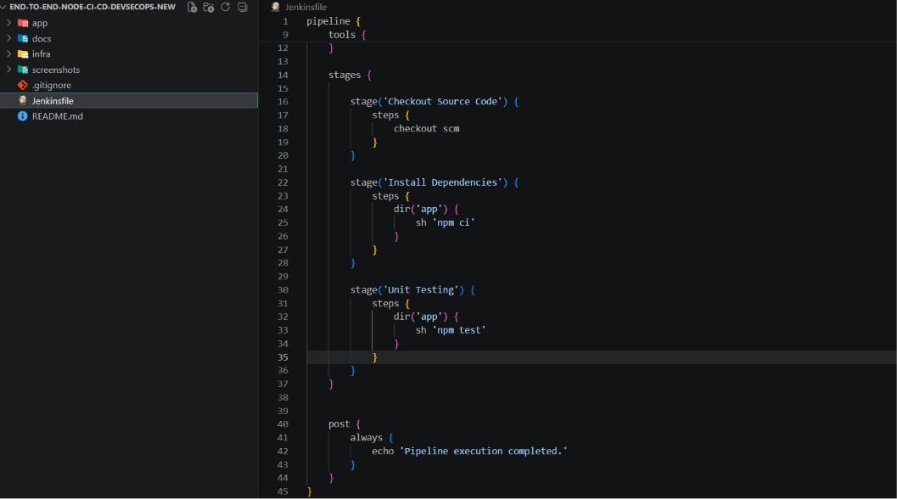


#### Jenkins Pipeline — Unit Testing Build

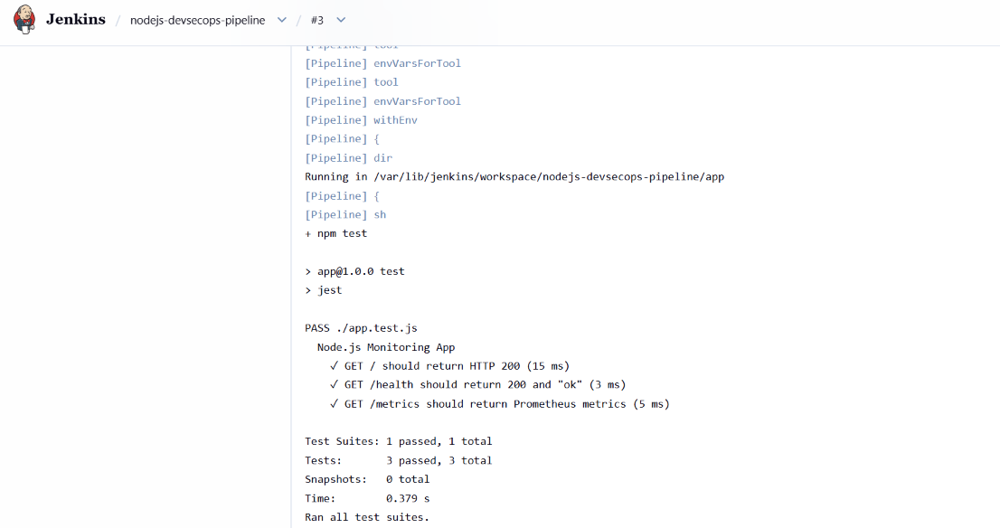

#### Unit Testing Stage — Successful Execution

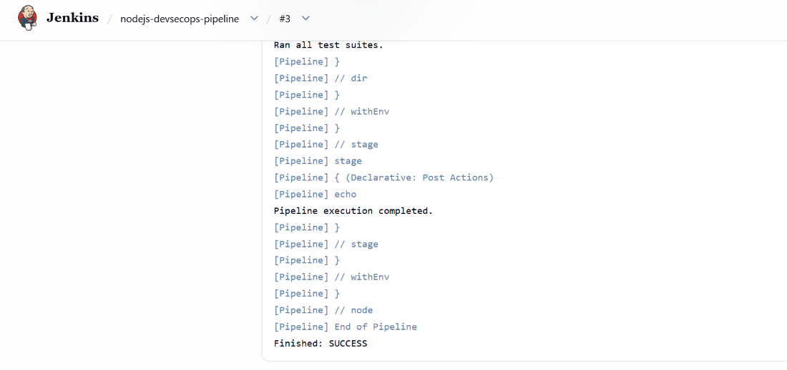

#### Unit Testing — Jenkins Console Output

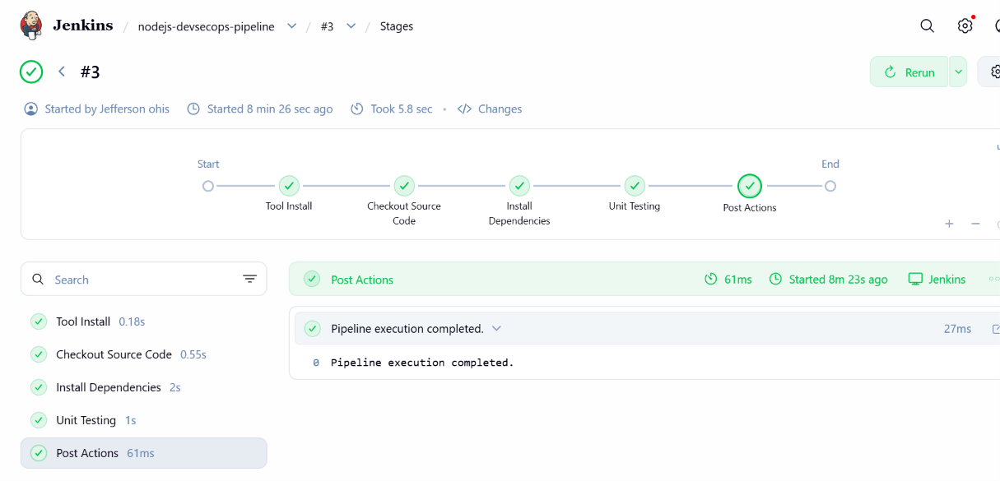


#### Jenkinsfile showing SonarCloud Analysis stage

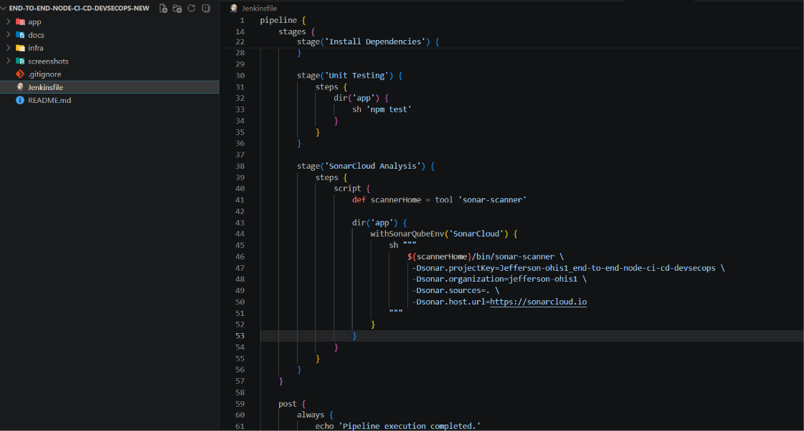


#### Jenkins Pipeline showing SonarCloud Analysis stage

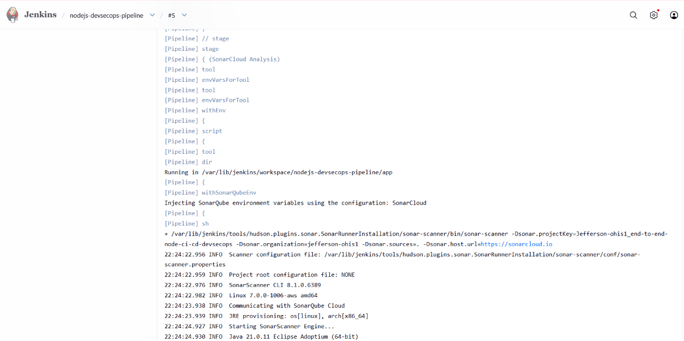


#### Jenkins Console — Successful SonarCloud Analysis

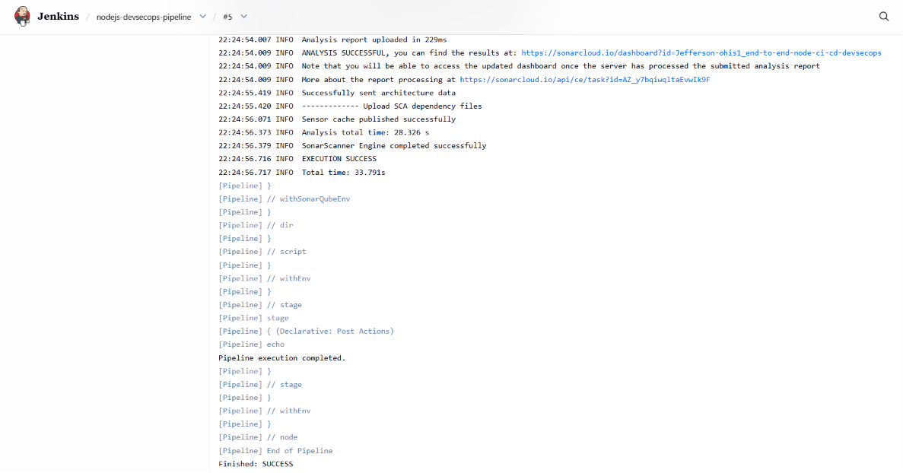


#### SonarCloud project Dashboard

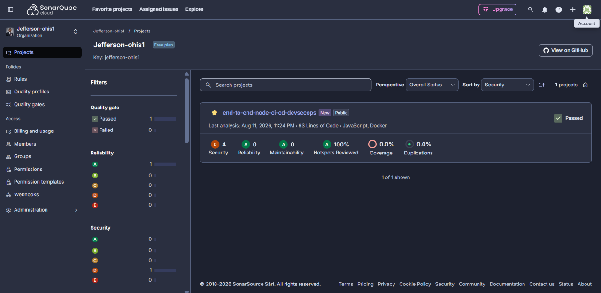


#### SonarCloud Project Overview and Results

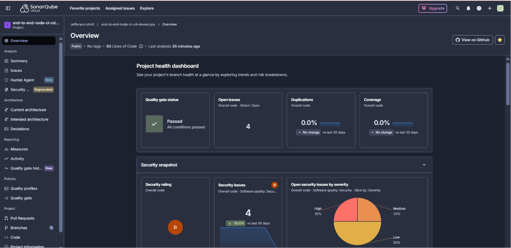


##### Jenkins Pipeline stages overview

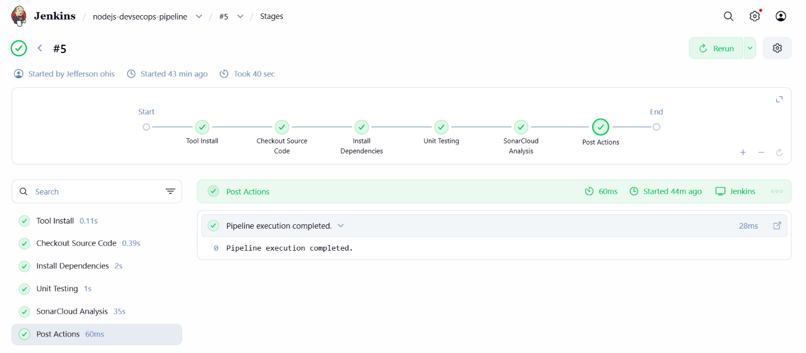


#### sonarcloud-quality-gate-success
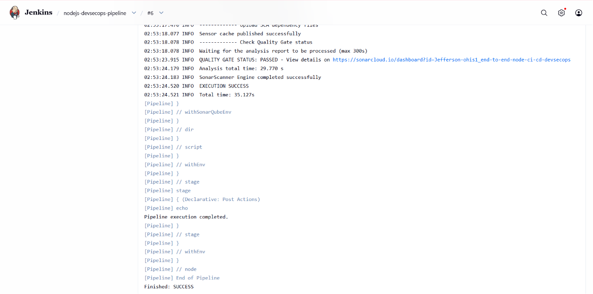

#### Snyk Security Plugin Installed

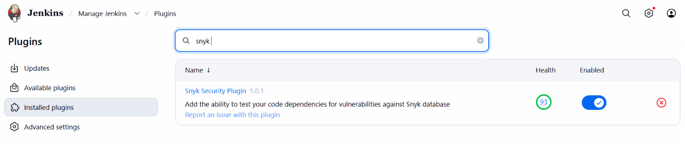

#### Snyk Credential Configuration

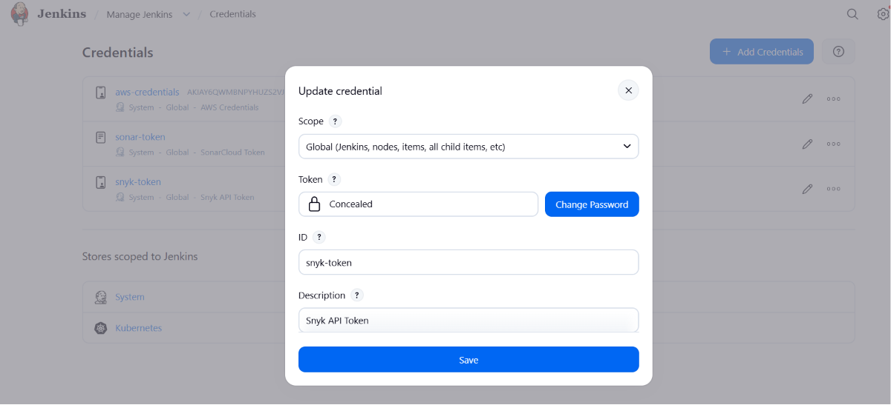

#### Snyk Tool Configuration

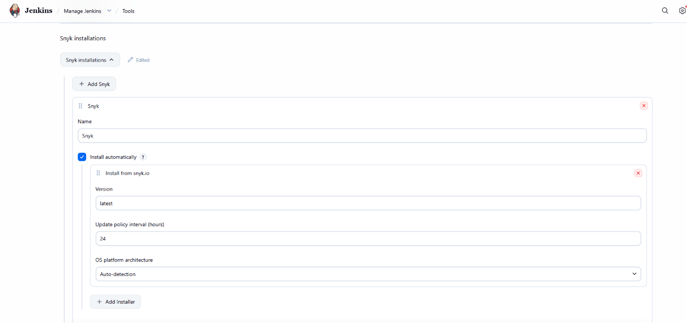

#### Jenkinsfile — Snyk SCA Stage

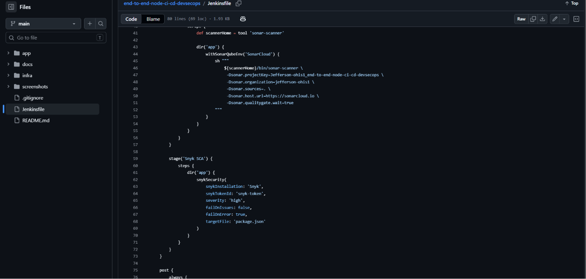

#### Jenkins Pipeline — Snyk SCA Stage

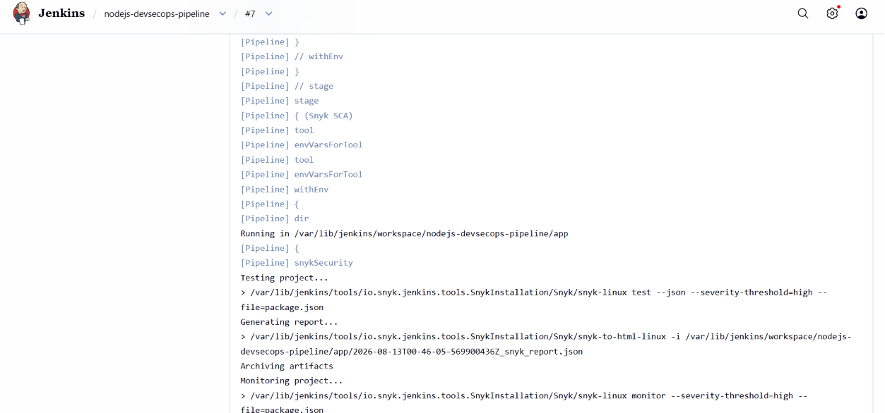

#### Snyk Vulnerability Results

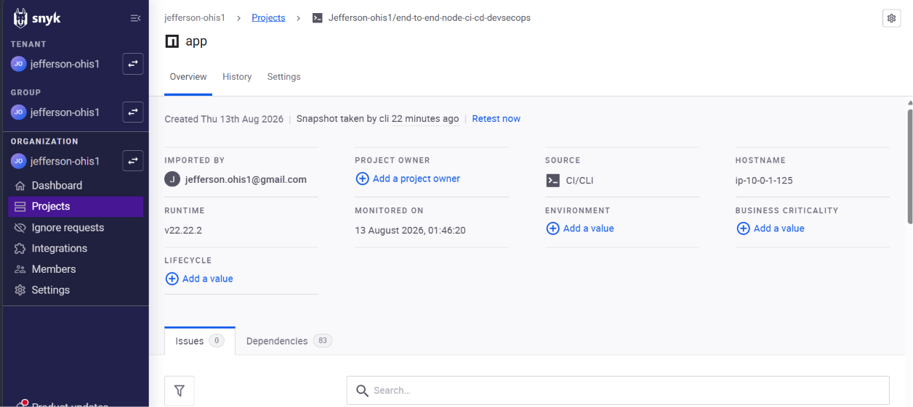


#### Snyk Software Compsition Analysis Success
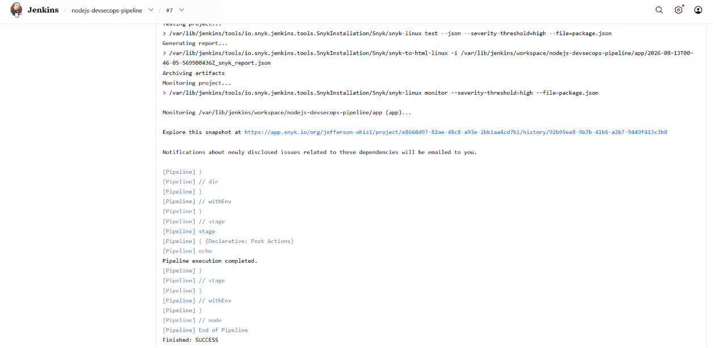


**#### Jenkinsfile — Docker Image Build Stage**

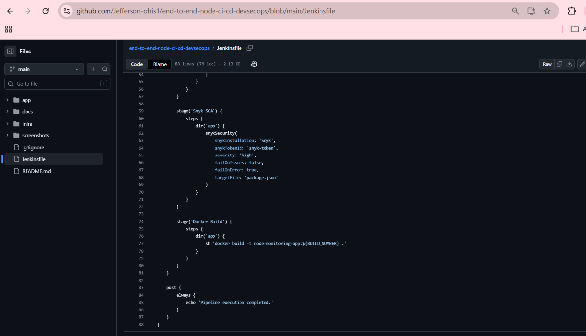

**#### Jenkins Pipeline — Docker Build Stage**

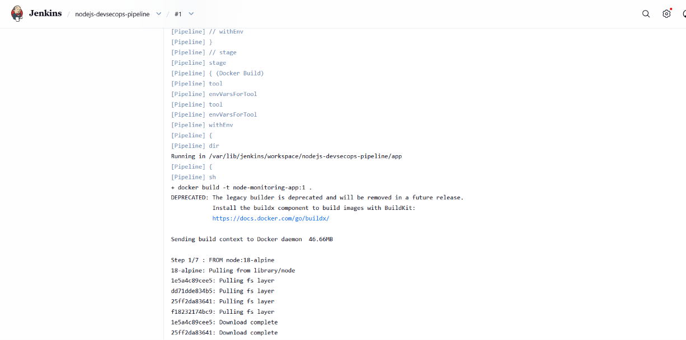

**#### Docker Build — Successful Execution**

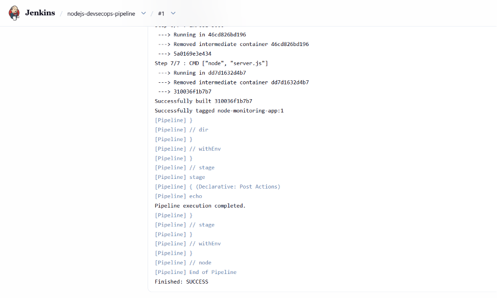

**#### Docker Image Created on Jenkins**

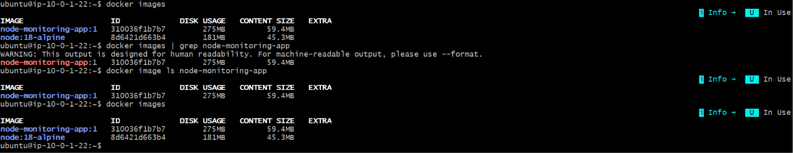

---

## Prerequisites

To build and run this project locally, ensure the following tools are installed:

- Git
- Node.js
- npm
- Docker Desktop
- Visual Studio Code
- AWS CLI
- Terraform
- kubectl
- Minikube *(Optional for local Kubernetes testing)*
- Jenkins

---

## Running the Project Locally

Clone the repository:

```bash
git clone https://github.com/Jefferson-ohis1/end-to-end-node-ci-cd-devsecops.git
```

Navigate to the application directory:

```bash
cd end-to-end-node-ci-cd-devsecops/app
```

Install dependencies:

```bash
npm install
```

Run the application:

```bash
npm start
```

Run unit tests:

```bash
npm test
```

Build the Docker image:

```bash
docker build -t node-monitoring-app:v1 .
```

Run the Docker container:

```bash
docker run -d --name node-monitoring-container -p 3000:3000 node-monitoring-app:v1
```

Open your browser:

http://localhost:3000

---

## CI/CD Pipeline Roadmap

The Jenkins CI/CD and DevSecOps pipeline is being implemented incrementally. Each pipeline stage is implemented, executed, verified, and documented using actual Jenkins Pipeline builds.

The current pipeline progress is:

```text
GitHub
   │
   ▼
Jenkins
   │
   ├── Checkout Source Code          ✅
   ├── Install Dependencies          ✅
   ├── Unit Testing                  ✅
   │
   ├── SonarCloud Analysis           ✅
   │      ├── SAST Analysis
   │      ├── Report Upload
   │      ├── Quality Gate Wait
   │      └── Quality Gate PASSED
   │
   ├── Snyk SCA                     ✅
   │      ├── Dependency Analysis
   │      ├── Vulnerability Scan
   │      └── Vulnerability Results
   │
   ├── Docker Build                 ✅
   │      └── Docker Image Created
   │
   ├── Trivy Container Scan         ⏳
   ├── Push Image to Amazon ECR     ⏳
   ├── Deploy to Amazon EKS         ⏳
   ├── Verify Rollout               ⏳
   └── OWASP ZAP DAST               ⏳
```

> **Latest milestone:** The Docker Image Build stage has been successfully integrated into the Jenkins DevSecOps Pipeline. The pipeline now builds the Node.js application into a Docker container image on the Jenkins server.

> **Next milestone:** Trivy Container Security Scanning will analyze the Docker image for known vulnerabilities before the image is pushed to Amazon ECR.

---

## Future Enhancements

The following enhancements will be implemented as the project progresses:

- Integrate Docker image security scanning with Trivy
- Publish container images to Amazon ECR
- Deploy automatically to Amazon EKS
- Implement Kubernetes rollout verification
- Integrate OWASP ZAP Dynamic Application Security Testing (DAST)
- Configure Prometheus monitoring
- Configure Grafana dashboards
- Add architecture diagrams
- Add pipeline workflow diagrams
- Implement GitHub Actions (Optional)

---

## Author

**Jefferson Ohis**

DevOps & Cloud Engineer | AWS Certified Cloud Practitioner

Passionate about building secure, automated, and scalable cloud infrastructure using DevOps and DevSecOps best practices.

- **GitHub:** https://github.com/Jefferson-ohis1
- **LinkedIn:** https://www.linkedin.com/in/jefferson-ohis-oviosu-5a982a168

---

