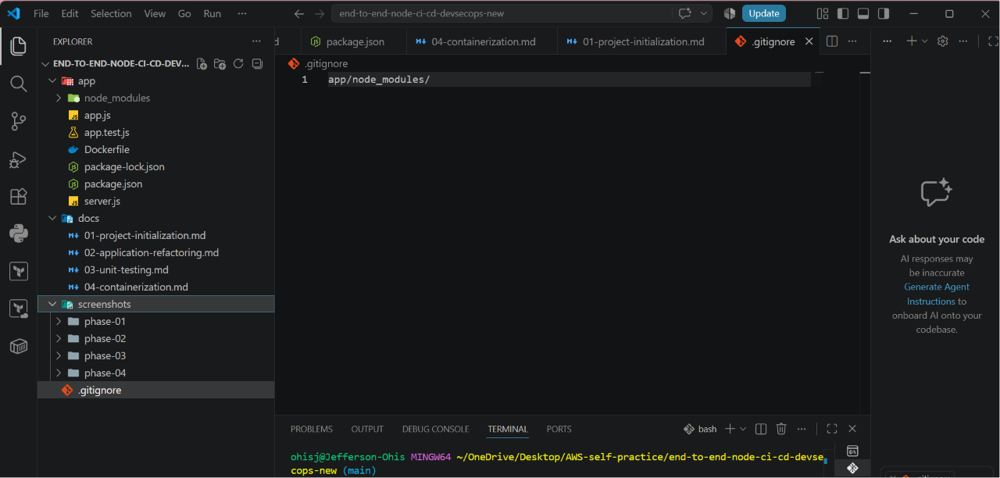
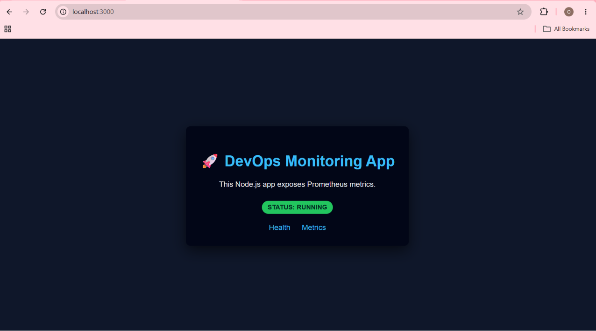
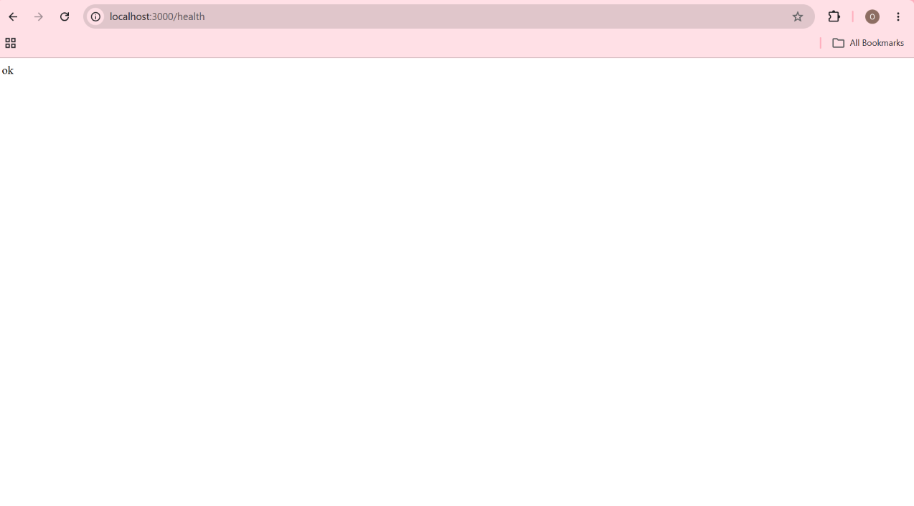
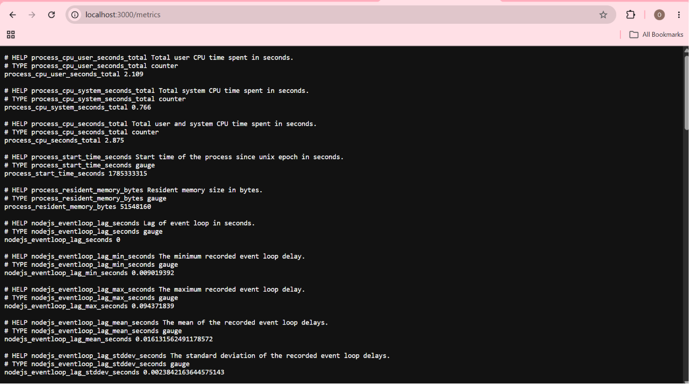

# Project Initialization

## Objective

Initialize the project, create the Node.js application, install the required dependencies, and verify that the application is functioning correctly before introducing any architectural improvements.

---

## Initial Project Setup

The project repository was created and initialized using Git.

```bash
mkdir end-to-end-node-ci-cd-devsecops-new
cd end-to-end-node-ci-cd-devsecops-new
git init
code .
```

---

## Create the Application

Create the application directory and the initial JavaScript file.

```bash
mkdir app
cd app
touch app.js
```

The initial `app.js` contained:

- Express application
- Prometheus metrics collection
- Home (`/`) endpoint
- Health (`/health`) endpoint
- Metrics (`/metrics`) endpoint
- HTTP server startup

### Project Structure

The initial project structure after creating the application files:



---

## Initialize the Node.js Project

Generate the project manifest.

```bash
npm init -y
```

This created the project's `package.json`.

---

## Install Dependencies

Install the application dependencies.

```bash
npm install express prom-client
```

This automatically generated:

```text
app/
├── app.js
├── package.json
├── package-lock.json
└── node_modules/
```

---

## Verify the Application

Start the application.

```bash
node server.js
```

Expected output:

```text
Listening on port 3000
```

### Application Startup

The application started successfully and began listening on port 3000.


Verify the following endpoints:

| Endpoint | Expected Result |
|----------|-----------------|
| `/` | Application Home Page |
| `/health` | `ok` |
| `/metrics` | Prometheus metrics |

### Home Page

The application's home page was successfully rendered.



### Health Endpoint

The health endpoint returned the expected response.



### Prometheus Metrics

The metrics endpoint successfully exposed Prometheus application metrics.



---

## Configure Git

Create a `.gitignore` file in the project root.

```text
app/node_modules/
```

This prevents installed packages from being committed to the repository.

---

## First Commit

```bash
git add .
git commit -m "Create initial Node.js monitoring application"
```

---

## Outcome

At the end of this phase:

- Initialized the Git repository.
- Created the Node.js application.
- Installed Express and Prometheus Client.
- Verified all application endpoints.
- Configured Git to ignore `node_modules`.
- Created the initial project commit.

This completed the foundation of the project and prepared it for architectural improvements.