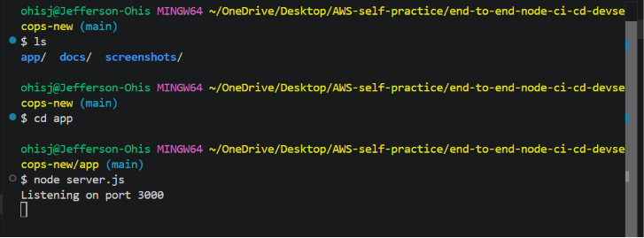
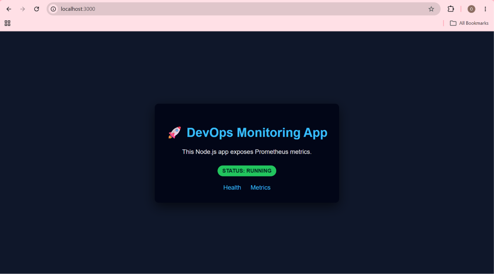

# Application Refactoring

## Objective

Refactor the application by separating the Express application from the HTTP server to improve maintainability and enable automated testing.

---

## Background

Initially, `app.js` performed two responsibilities:

1. Creating the Express application.
2. Starting the HTTP server.

Although functional, this structure made automated testing more difficult because importing the application also started the server.

---

## Architecture Before Refactoring

```text
app.js
│
├── Create Express application
├── Register routes
├── Register Prometheus metrics
└── Start HTTP server
```

---

## Refactoring

### Update `app.js`

Replace:

```javascript
app.listen(3000, () => console.log('Listening on port 3000'));
```

with:

```javascript
module.exports = app;
```

---

### Create `server.js`

```javascript
const app = require('./app');

const PORT = process.env.PORT || 3000;

app.listen(PORT, () => {
    console.log(`Listening on port ${PORT}`);
});
```

The responsibilities are now separated:

- **app.js**
  - Create the Express application
  - Register application routes
  - Configure Prometheus metrics
  - Export the application

- **server.js**
  - Start the HTTP server

---

## Project Structure

After completing the application refactoring, the project structure was organized as follows:

```text
end-to-end-node-ci-cd-devsecops-new/
├── app/
│   ├── app.js
│   ├── server.js
│   ├── package.json
│   └── package-lock.json
└── docs/
    ├── 01-project-initialization.md
    └── 02-application-refactoring.md
```

### Structure Overview

| File | Purpose |
|------|---------|
| `app.js` | Creates and configures the Express application, registers routes, initializes Prometheus metrics, and exports the application. |
| `server.js` | Starts the HTTP server by importing the Express application from `app.js`. |
| `package.json` | Defines project metadata, dependencies, and npm scripts. |
| `package-lock.json` | Locks dependency versions to ensure consistent installations across environments. |
| `01-project-initialization.md` | Documents the initial project setup and application creation. |
| `02-application-refactoring.md` | Documents the architectural refactoring that separated the Express application from the server startup. |

---

## Verify the Refactoring

Start the application.

```bash
node server.js
```

Expected output:

```text
Listening on port 3000
```

### Server Startup

The refactored application starts successfully using `node server.js`.



Verify the application endpoints:

| Endpoint | Expected Result |
|----------|-----------------|
| `/` | Application Home Page |
| `/health` | `ok` |
| `/metrics` | Prometheus metrics |

The application's behavior remained unchanged after the refactoring.

### Browser Verification

The refactored application was verified by accessing the available endpoints.

- `http://localhost:3000`
- `http://localhost:3000/health`
- `http://localhost:3000/metrics`


---

## Second Commit

```bash
git add .
git commit -m "Refactor Express application for testability"
```

---

## Outcome

The application was successfully refactored without changing its functionality.

Separating the application from the server startup follows standard Express.js project structure and prepares the project for automated unit testing using Jest and Supertest.