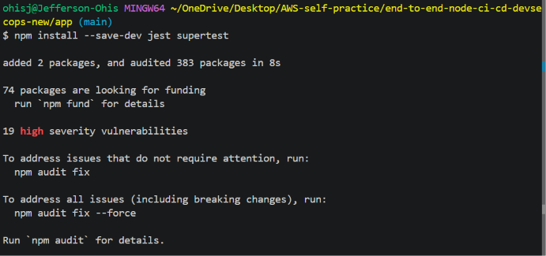
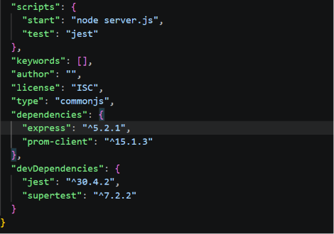
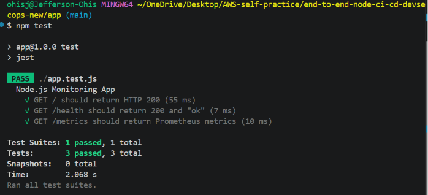

# Phase 3 – Automated Unit Testing

## Objective

Introduce automated unit testing to validate the application's functionality without relying on manual browser testing.

Following the application refactoring completed in Phase 2, the Express application can now be tested independently of the HTTP server, making it suitable for automated testing and CI/CD pipelines.

---

## Why Unit Testing?

Manual browser testing is useful during development, but it cannot be automated within a CI/CD pipeline.

Automated unit testing provides several benefits:

- Verifies application functionality automatically
- Detects regressions early in the development lifecycle
- Increases confidence before building Docker images
- Prevents faulty code from progressing through the deployment pipeline
- Establishes a foundation for Continuous Integration (CI)

---

## Implementation Steps

### 1. Verify Existing Test Configuration

Initially, running:

```bash
npm test
```

produced:

```text
Error: no test specified
```

This is the default behavior generated by `npm init -y`, indicating that no testing framework had been configured.

The default `package.json` contained:

```json
"scripts": {
  "test": "echo \"Error: no test specified\" && exit 1"
}
```

---

### 2. Install the Testing Framework

Install Jest and Supertest as development dependencies.

```bash
npm install --save-dev jest supertest
```

**Jest** provides the testing framework.

**Supertest** enables HTTP endpoint testing directly against the Express application without starting an actual web server.

### Installation Output

The following screenshot shows the successful installation of Jest and Supertest.



---

### 3. Update package.json

Replace the default test script with Jest.

**Before**

```json
"scripts": {
  "test": "echo \"Error: no test specified\" && exit 1"
}
```

**After**

```json
"scripts": {
  "start": "node server.js",
  "test": "jest"
}
```

Verify that the development dependencies now include:

```json
"devDependencies": {
  "jest": "^30.4.2",
  "supertest": "^7.2.2"
}
```

> **Note:** Version numbers may vary depending on when the dependencies are installed.

### Updated package.json

After installing the testing dependencies and updating the test script, the `package.json` file reflects the new configuration.



---

### 4. Create the Unit Test Suite

Create the following file:

```text
app/
└── app.test.js
```

The test suite verifies the application's core endpoints:

- `GET /`
- `GET /health`
- `GET /metrics`

using **Jest** together with **Supertest**.

---

### 5. Execute the Tests

Run:

```bash
npm test
```

Successful execution produces output similar to:

```text
PASS ./app.test.js

✓ GET / should return HTTP 200
✓ GET /health should return 200 and "ok"
✓ GET /metrics should return Prometheus metrics

Test Suites: 1 passed, 1 total
Tests:       3 passed, 3 total
Snapshots:   0 total
```

### Test Execution

The following screenshot shows the successful execution of the automated unit tests.



---

## Results

The successful execution confirms that:

- The Express application exports correctly.
- Server startup is separated from application logic.
- The homepage responds successfully.
- The health endpoint returns the expected response.
- The Prometheus metrics endpoint is operational.
- All automated tests execute successfully.

---

## Engineering Outcome

After completing this phase, the application evolved from being manually tested to supporting automated verification.

The project progression is now:

### Phase 1 – Initial Node.js Application

- Created the Node.js project
- Initialized the project using `npm init -y`
- Installed Express and Prometheus Client
- Built a working monitoring application
- Verified:
  - `/`
  - `/health`
  - `/metrics`

### Phase 2 – Application Refactoring

- Separated the Express application from server startup
- Introduced:
  - `app.js`
  - `server.js`
- Improved application architecture without changing functionality
- Prepared the project for automated testing

### Phase 3 – Automated Unit Testing

- Installed Jest
- Installed Supertest
- Updated `package.json`
- Created `app.test.js`
- Implemented automated endpoint tests
- Successfully executed all unit tests

The application is now prepared for integration into a Jenkins CI/CD pipeline, where automated tests can be executed before containerization and deployment.

---

## Commands Used

| Step | Command | Purpose |
|------|---------|---------|
| 1 | `npm install --save-dev jest supertest` | Install Jest and Supertest |
| 2 | `npm test` | Execute automated unit tests |

---

## Files Added

```text
app/
└── app.test.js
```

---

## Files Modified

```text
app/
└── package.json
```

---

## Key Takeaway

Separating the Express application (`app.js`) from the server startup (`server.js`) enabled automated testing with Jest and Supertest.

This architectural improvement allows the Express application to be tested entirely in memory without starting an HTTP server, making it well suited for modern CI/CD pipelines where automated validation is performed before containerization, security scanning, and deployment.