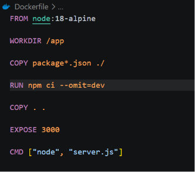
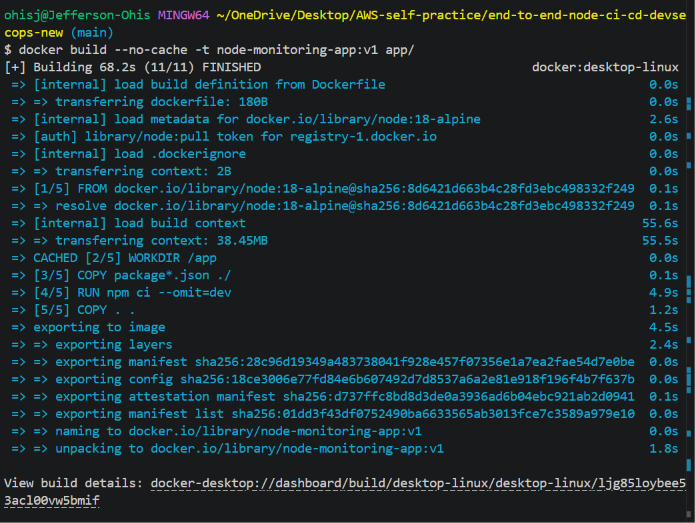
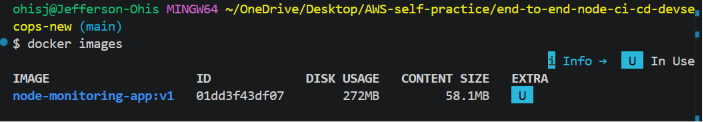
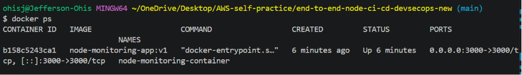
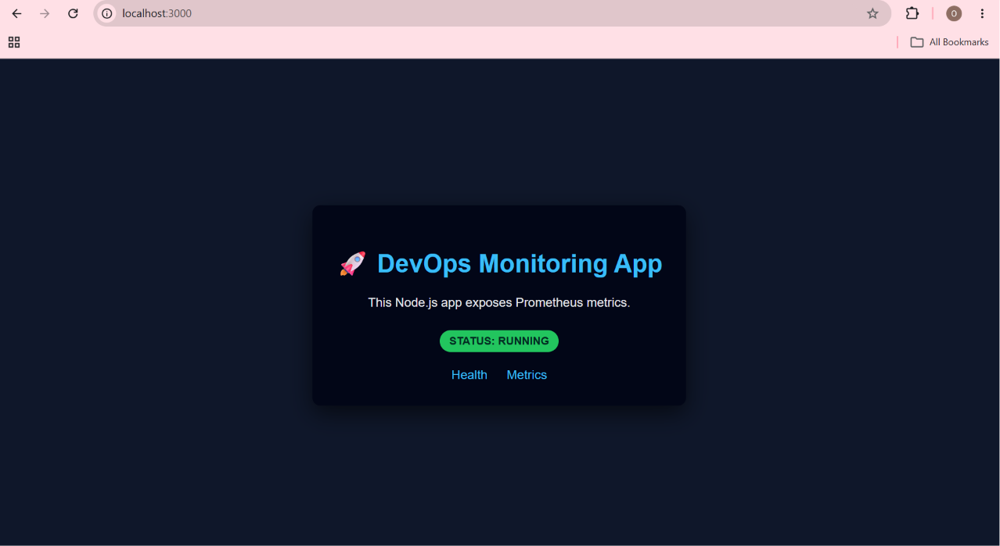
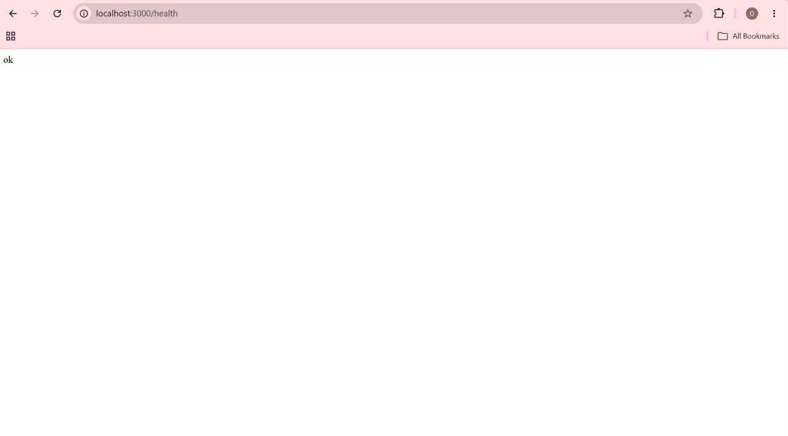
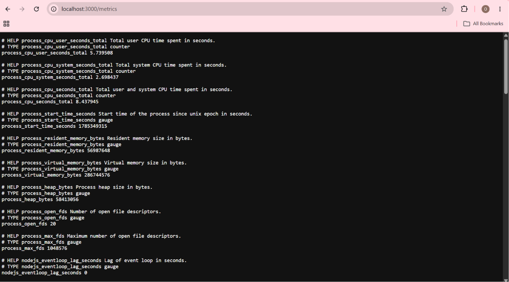
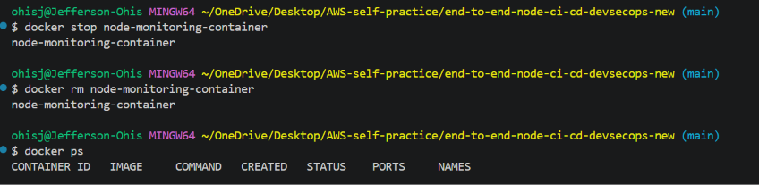

# Phase 4 – Containerizing the Application with Docker

## Objective

Package the Node.js monitoring application into a Docker container to provide a consistent, portable runtime environment that can be deployed across development, testing, and production systems.

Containerization also prepares the application for cloud deployment by producing a reusable Docker image that will later be integrated into the automated Jenkins CI/CD pipeline.

---

## Why Containerize the Application?

Running applications directly on a host machine can introduce inconsistencies caused by differences in operating systems, installed software, or runtime versions.

Docker solves this problem by packaging the application together with its runtime and dependencies into a single portable image.

Benefits include:

- Consistent runtime environment
- Simplified deployments
- Improved portability
- Faster application startup
- Standardized builds for CI/CD pipelines

---

## Dockerfile Creation

A `Dockerfile` was created inside the `app/` directory to define the steps required to package the Node.js monitoring application into a Docker image. The Dockerfile uses an official lightweight Node.js base image, installs only production dependencies, copies the application source code, exposes the application port, and specifies the startup command.

```dockerfile
FROM node:18-alpine

WORKDIR /app

COPY package*.json ./

RUN npm ci --omit=dev

COPY . .

EXPOSE 3000

CMD ["node", "server.js"]
```

The following screenshot shows the completed Dockerfile in Visual Studio Code.



### Dockerfile Design

| Instruction | Purpose |
|-------------|---------|
| `FROM node:18-alpine` | Uses a lightweight Node.js 18 base image |
| `WORKDIR /app` | Sets the working directory inside the container |
| `COPY package*.json ./` | Copies dependency definition files |
| `RUN npm ci --omit=dev` | Installs only production dependencies |
| `COPY . .` | Copies the application source code |
| `EXPOSE 3000` | Documents the application listening port |
| `CMD ["node", "server.js"]` | Starts the Express application |


---

## Building the Docker Image

From the project root, the Docker image was built using the following command:

```bash
docker build --no-cache -t node-monitoring-app:v1 app/
```

During the build process, Docker downloaded the Node.js 18 Alpine base image, installed the application dependencies, copied the application source code, and packaged everything into a reusable container image tagged as `node-monitoring-app:v1`.

The following screenshot shows the successful Docker image build using Docker BuildKit.



---

## Verify the Image

To confirm the image was created successfully:

```bash
docker images
```

The output included the newly created image `node-monitoring-app` with the `v1` tag, confirming that the build completed successfully.

The following screenshot shows the Docker image available in the local image repository.



---

## Run the Container

After verifying that the image had been created successfully, a container was started from the image using the following command:

```bash
docker run -d \
  --name node-monitoring-container \
  -p 3000:3000 \
  node-monitoring-app:v1
```

The `-p 3000:3000` option maps port **3000** on the host machine to port **3000** inside the container, making the application accessible through a web browser.

---

## Verify the Running Container

Confirm the container is running:

```bash
docker ps
```

The output showed the container in the **Up** state with port **3000** mapped to the host.

The following screenshot confirms that the container is running successfully.



---

## Verify the Application

After starting the container, the application was accessed through a web browser to verify that it was functioning correctly.

### Home Page

The root endpoint loaded successfully, confirming that the Express application was running inside the Docker container.



### Health Endpoint

The `/health` endpoint returned an `ok` response, confirming that the application's health check endpoint was operational.



### Metrics Endpoint

The `/metrics` endpoint exposed Prometheus metrics, confirming that application monitoring remained functional after containerization.



---

## Stop and Remove the Container

After validation, the running container was stopped and removed to clean up the local Docker environment.

```bash
docker stop node-monitoring-container

docker rm node-monitoring-container
```

The `docker ps` command returned no running containers, confirming that the application container had been successfully stopped and removed.

The following screenshot shows the successful cleanup of the Docker container.



---

## Challenges Encountered

During the initial Docker build, the following error occurred:

```text
npm ci can only install packages when your package.json
and package-lock.json are in sync.
```

### Root Cause

The local `package-lock.json` file had become inconsistent with the installed dependencies.

### Resolution

The project dependencies were regenerated using:

```bash
rm -rf node_modules

rm package-lock.json

npm cache clean --force

npm install

npm test
```

After regenerating the dependency lock file, reinstalling the project dependencies, and confirming that all unit tests passed successfully, the Docker image built without errors.

---

## Commands Used

| Step             | Command                                                                       |
|------------------|-------------------------------------------------------------------------------|
| Build image      | `docker build --no-cache -t node-monitoring-app:v1 app/`                      |
| List images      | `docker images`                                                               |
| Run container    | `docker run -d --name node-monitoring-container -p 3000:3000 node-monitoring-app:v1` |
| Verify container | `docker ps`                                                                   |
| Stop container   | `docker stop node-monitoring-container`                                       |
| Remove container | `docker rm node-monitoring-container`                                         |

---

## Files Added

```
app/
└── Dockerfile
```

---

## Files Modified

```
app/
├── package.json
└── package-lock.json
```

---

## Results

This phase successfully achieved the following:

- Created a production-ready Dockerfile for the Node.js monitoring application
- Built a reusable Docker image using Docker BuildKit
- Verified that the Docker image was created successfully
- Started the application inside a Docker container
- Confirmed the container was running correctly
- Validated the home, health, and metrics endpoints
- Verified that the application behaved identically in both the local and containerized environments

---

## Key Takeaway

Containerizing the application provides a consistent and reproducible runtime environment, eliminating dependency differences between development and deployment environments. The resulting Docker image serves as the deployment artifact for the remainder of the project and establishes a solid foundation for provisioning the required AWS infrastructure using Terraform before implementing the Jenkins CI/CD pipeline.

---

## Next Phase

With the application successfully containerized, the next phase focuses on provisioning the cloud infrastructure required to support an automated CI/CD pipeline and Kubernetes deployment.

Using Terraform, the infrastructure will be defined as code and deployed to AWS, including the resources required for image storage, continuous integration, and container orchestration.

The infrastructure provisioning phase will include:

- Configuring the AWS provider
- Creating an Amazon Elastic Container Registry (ECR) repository
- Provisioning the networking resources required for deployment
- Creating an Amazon EKS cluster and managed worker nodes
- Configuring IAM roles and permissions
- Producing reusable Infrastructure as Code (IaC) for future deployments

Once the infrastructure has been provisioned successfully, the following phase will integrate the Dockerized application into a Jenkins CI/CD pipeline that automates code quality analysis, security validation, container image publishing, and deployment to Amazon EKS.