# Phase 5 – Provisioning AWS Infrastructure with Terraform

## Objective

Provision the AWS infrastructure required to support the end-to-end DevSecOps pipeline using Terraform.

The infrastructure will be defined as code (Infrastructure as Code) to enable automated provisioning, version control, repeatable deployments, and simplified infrastructure management.

This phase establishes the cloud foundation required for container image storage, Kubernetes orchestration, continuous integration, and future application deployments.

---

## Why Infrastructure as Code?

Provisioning cloud resources manually through the AWS Management Console can become repetitive, error-prone, and difficult to reproduce consistently across environments.

Infrastructure as Code (IaC) addresses these challenges by describing infrastructure using declarative configuration files that can be version-controlled alongside application source code.

Using Terraform provides several advantages:

- Consistent infrastructure provisioning
- Repeatable deployments
- Version-controlled infrastructure
- Reduced manual configuration errors
- Simplified infrastructure maintenance
- Easier collaboration across engineering teams

Terraform will be used throughout this project to provision and manage the AWS infrastructure required by the DevSecOps pipeline.

---

## Why Design Before Implementation?

Before provisioning any AWS resources, it is important to design the target architecture and understand how each component contributes to the overall solution.

Rather than immediately writing Terraform configuration files, the infrastructure should first answer several important engineering questions:

- What are we building?
- Which AWS services are required?
- How do the services interact?
- Which resources should Terraform manage?
- Which components will remain outside AWS?

Answering these questions before implementation produces a clearer architecture, simplifies Terraform development, and reduces unnecessary redesign later in the project.

---

## AWS Architecture Design

### What Are We Building?

The goal of this project is to build a complete end-to-end DevSecOps platform capable of automatically building, securing, deploying, and monitoring a containerized Node.js application.

Once the project is complete, a developer will only need to push code to GitHub for the automated deployment workflow to begin.

---

## Overall Workflow

The following workflow illustrates the complete DevSecOps lifecycle implemented in this project, from source code management through automated security validation, containerization, deployment to Kubernetes, dynamic application security testing, and continuous monitoring.

```text
Developer
    │
    ▼
GitHub Repository
    │
    ▼
Jenkins Pipeline
    │
    ├──────────────► SonarCloud (SAST)
    │
    ├──────────────► Snyk (Software Composition Analysis)
    │
    ▼
Docker Build
    │
    ▼
Trivy Scan (Container Security)
    │
    ▼
Amazon Elastic Container Registry (ECR)
    │
    ▼
Amazon Elastic Kubernetes Service (EKS)
    │
    ▼
Node.js Monitoring Application
    │
    ├──────────────► OWASP ZAP (DAST)
    │
    ├──────────────► Prometheus
    │
    ▼
Grafana Dashboard
```

This workflow demonstrates the complete software delivery lifecycle implemented in this project. Code changes are pushed to GitHub, where Jenkins automatically triggers the CI/CD pipeline. During the build process, SonarCloud performs Static Application Security Testing (SAST) to identify code quality issues and security vulnerabilities, while Snyk analyzes third-party dependencies using Software Composition Analysis (SCA). The application is then containerized using Docker, and Trivy scans the resulting image for operating system and application package vulnerabilities before it is published to Amazon Elastic Container Registry (ECR).

After the container image passes all security checks, it is deployed to an Amazon Elastic Kubernetes Service (EKS) cluster. Once the application is running, OWASP ZAP performs Dynamic Application Security Testing (DAST) against the live deployment to identify runtime security vulnerabilities that cannot be detected through static analysis alone. Finally, Prometheus continuously collects infrastructure and application metrics, while Grafana visualizes those metrics through interactive dashboards, providing real-time observability into the health and performance of the deployed application.

### Why OWASP ZAP Is Placed After Amazon EKS

OWASP ZAP performs Dynamic Application Security Testing (DAST), which requires a running application that is accessible over HTTP or HTTPS. Unlike SonarCloud, Snyk, and Trivy—which analyze the application before deployment—OWASP ZAP interacts with the deployed application to simulate real-world attacks and identify vulnerabilities that are only exposed during runtime.

For this reason, OWASP ZAP is executed only after the application has been successfully deployed to Amazon EKS.

| Pipeline Stage | Security Tool | Primary Purpose |
|----------------|--------------|-----------------|
| Source Code | SonarCloud | Static Application Security Testing (SAST) |
| Dependency Analysis | Snyk | Software Composition Analysis (SCA) |
| Container Image | Trivy | Container vulnerability scanning |
| Running Application | OWASP ZAP | Dynamic Application Security Testing (DAST) |
| Monitoring | Prometheus + Grafana | Metrics collection, visualization, and observability |

This layered approach follows DevSecOps best practices by integrating security throughout the software delivery lifecycle rather than treating it as a final step. Each security tool operates at the stage where it provides the greatest value: SonarCloud analyzes the source code, Snyk evaluates third-party dependencies, Trivy scans the container image before deployment, and OWASP ZAP validates the security of the live application after deployment to Amazon EKS. Continuous monitoring with Prometheus and Grafana then provides ongoing visibility into the application's availability, performance, and operational health.

---

## AWS Services Used

The following AWS services will be provisioned or used throughout this project.

| AWS Service | Purpose |
|-------------|---------|
| IAM | Secure authentication and authorization for Terraform, Jenkins, Amazon EKS, and AWS services |
| Amazon Elastic Container Registry (ECR) | Stores versioned Docker images built by Jenkins |
| Amazon Elastic Kubernetes Service (EKS) | Hosts the containerized Node.js monitoring application |
| Amazon VPC | Provides isolated networking for the Kubernetes cluster |
| Public and Private Subnets | Separate public-facing and internal infrastructure |
| Internet Gateway | Enables internet connectivity |
| Route Tables | Manage network routing |
| Security Groups | Control inbound and outbound network traffic |
| Elastic IP | Supports outbound internet connectivity through a NAT Gateway |
| NAT Gateway | Allows private subnets to access the internet securely |
| Amazon CloudWatch *(optional)* | Provides AWS infrastructure metrics and logs |

Although CloudWatch is available by default for AWS resources, application-level monitoring in this project will primarily be performed using Prometheus and Grafana.

---

## Services Outside AWS

Not every component of the DevSecOps platform resides within AWS.

The following services will be integrated during later phases of the project.

| Service | Location |
|----------|----------|
| GitHub | External |
| Jenkins | Amazon EC2 |
| SonarCloud | Software as a Service (SaaS) |
| Snyk | Software as a Service (SaaS) |
| Docker | Jenkins Server |
| Trivy | Jenkins Server |
| OWASP ZAP | Jenkins Server |
| Prometheus | Kubernetes Cluster |
| Grafana | Kubernetes Cluster |

Terraform will provision only the AWS infrastructure required to support these services.

---

## High-Level Architecture

The completed platform will resemble the following high-level architecture.

```text
                   Developer
                       │
                       ▼
                GitHub Repository
                       │
                       ▼
                Jenkins Server (EC2)
                       │
      ┌────────────────┼────────────────┐
      │                │                │
      ▼                ▼                ▼
 SonarCloud         Snyk          OWASP ZAP
      │                │                │
      └────────────────┼────────────────┘
                       │
                  Docker Build
                       │
                       ▼
                  Trivy Scan
                       │
                       ▼
             Amazon Elastic Container Registry
                       │
                       ▼
             Amazon Elastic Kubernetes Service
                       │
                       ▼
          Node.js Monitoring Application
                       │
            ┌──────────┴──────────┐
            ▼                     ▼
      Prometheus             Grafana
```

This architecture separates responsibilities across source control, continuous integration, security validation, cloud infrastructure, container orchestration, and monitoring.

---

## What Terraform Will Manage

Terraform will provision and manage the AWS infrastructure required by this project.

The resources include:

- AWS provider configuration
- Amazon Elastic Container Registry (ECR)
- Amazon VPC
- Public and private subnets
- Internet Gateway
- Route tables
- Security groups
- IAM roles and policies
- Amazon Elastic Kubernetes Service (EKS)
- Amazon EKS managed node groups
- Terraform outputs

Managing these resources as code ensures that the infrastructure can be recreated consistently, version-controlled, and maintained alongside the application source code.

---

## Deliverables

By the end of the architecture design stage, the following deliverables have been completed:

- Defined the target AWS architecture
- Identified the AWS services required by the platform
- Distinguished AWS-managed resources from externally managed services
- Defined the infrastructure components that Terraform will provision
- Established a roadmap for implementing the cloud infrastructure

---

> **Note:** The remaining sections of this document will be completed incrementally as each Terraform component is designed, implemented, and verified throughout Phase 5.

## Terraform Project Structure

Before writing any Terraform configuration, it is important to organize the infrastructure into logical components.

Rather than placing every AWS resource inside a single Terraform file, the infrastructure will be separated into multiple files based on responsibility. This modular approach improves readability, simplifies maintenance, and allows individual infrastructure components to evolve independently as the project grows.

The `infra/` directory will contain all Terraform configuration files required to provision the AWS infrastructure.

```text
infra/
├── provider.tf
├── variables.tf
├── terraform.tfvars
├── vpc.tf
├── security-groups.tf
├── iam.tf
├── ecr.tf
├── eks.tf
├── outputs.tf
├── versions.tf
```

Each file has a clearly defined responsibility within the infrastructure.

| Terraform File | Purpose |
|----------------|---------|
| `versions.tf` | Specifies the required Terraform version and AWS provider version. |
| `provider.tf` | Configures the AWS provider, including the target region. |
| `variables.tf` | Defines reusable input variables used throughout the infrastructure. |
| `terraform.tfvars` | Stores environment-specific values assigned to input variables. |
| `vpc.tf` | Creates the Virtual Private Cloud (VPC), subnets, Internet Gateway, NAT Gateway, and routing resources. |
| `security-groups.tf` | Defines network security rules that control inbound and outbound traffic for AWS resources. |
| `iam.tf` | Creates IAM roles, policies, and permissions required by Amazon EKS and other AWS services. |
| `ecr.tf` | Creates the Amazon Elastic Container Registry (ECR) repository used to store Docker images. |
| `eks.tf` | Provisions the Amazon Elastic Kubernetes Service (EKS) cluster and managed worker nodes. |
| `outputs.tf` | Displays useful infrastructure information after deployment, such as the ECR repository URL, VPC ID, and EKS cluster name. |

Organizing the infrastructure into dedicated files provides several advantages:

- Improves readability by separating infrastructure components into logical units.
- Simplifies troubleshooting by isolating configuration changes.
- Encourages code reuse through variables and outputs.
- Makes collaboration easier when multiple engineers work on the same infrastructure.
- Supports future expansion without requiring major refactoring.

This modular structure follows Terraform best practices and establishes a scalable foundation for the remaining infrastructure implementation throughout this project.

---

## Initializing the Terraform Project

Before provisioning any AWS resources, the Terraform configuration was initialized, validated, and reviewed to ensure that the infrastructure definition was syntactically correct and that the execution plan matched the intended architecture.

### Terraform Initialization

The following command initialized the Terraform working directory and downloaded the required AWS provider plugins.

```bash
terraform init
```

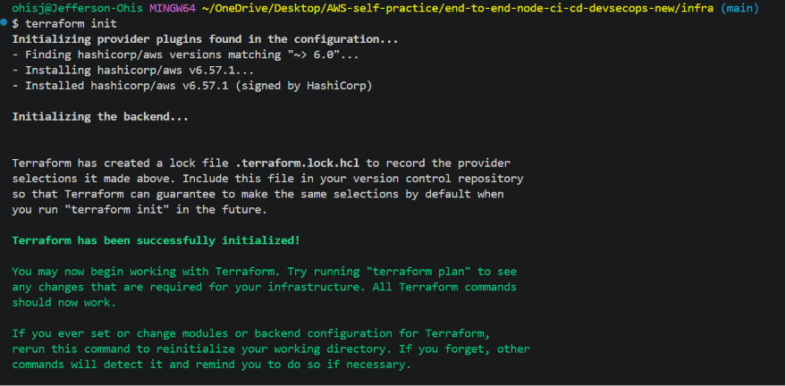

Terraform successfully initialized the working directory, downloaded the required providers, and prepared the project for infrastructure provisioning.

### Terraform Validation

Terraform validation was performed to verify that all configuration files were syntactically correct before deployment.

```bash
terraform validate
```

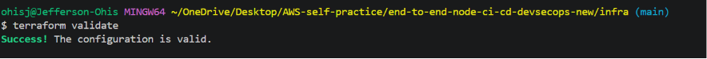

The validation completed successfully, confirming that the Terraform configuration contained no syntax or configuration errors.


### Terraform Execution Plan

Before creating any AWS resources, Terraform generated an execution plan showing every resource that would be created.

```bash
terraform plan
```

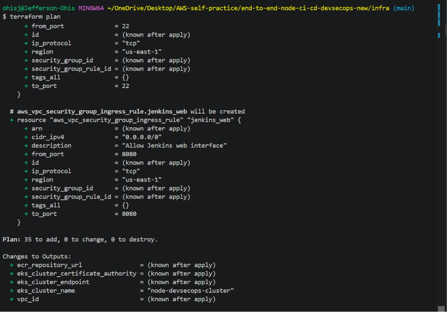

Reviewing the execution plan provides an opportunity to verify the infrastructure before any changes are applied to the AWS account.

### Applying the Infrastructure

After reviewing the execution plan, the infrastructure was provisioned using Terraform.

```bash
terraform apply
```
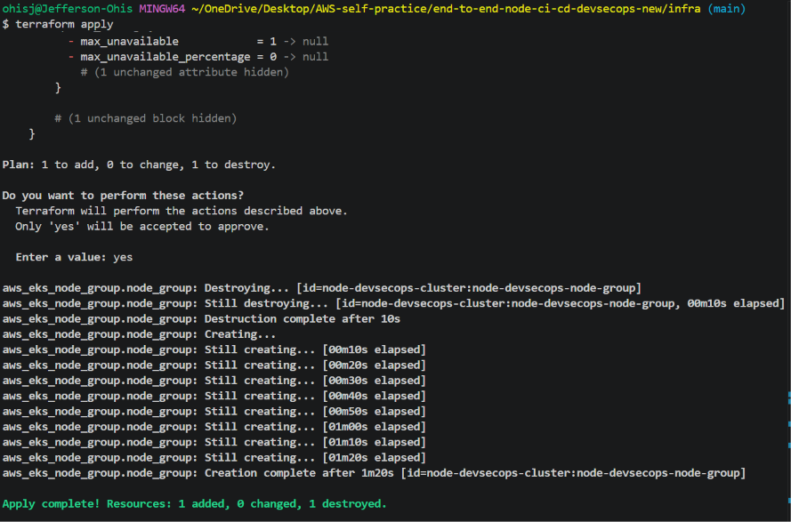

Terraform successfully provisioned all AWS resources defined within the infrastructure configuration.

---

## AWS Provider Configuration

Terraform uses the AWS provider to authenticate with AWS and provision infrastructure resources within the target region.

The provider configuration specifies the AWS Region where all resources in this project are created.

```hcl
provider "aws" {
  region = var.aws_region
}
```

The AWS provider was successfully initialized during `terraform init`, enabling Terraform to communicate with AWS and provision the infrastructure defined throughout this project.


---


## Amazon VPC

The Amazon Virtual Private Cloud (VPC) provides an isolated network within AWS where all infrastructure for this project will be deployed. Rather than relying on the default VPC created by AWS, a dedicated VPC is provisioned to provide complete control over IP addressing, network segmentation, routing, and security.

The VPC serves as the networking foundation for the DevSecOps platform and will host all infrastructure components, including the Amazon EKS cluster, worker nodes, load balancers, and supporting networking resources.

### VPC Configuration

The VPC is defined in `infra/vpc.tf` using the following Terraform resource:

```hcl
resource "aws_vpc" "node_vpc" {
  cidr_block           = var.vpc_cidr
  enable_dns_support   = true
  enable_dns_hostnames = true

  tags = {
    Name = "${var.project_name}-vpc"
  }
}
```

The VPC is configured with:

- A CIDR block of `10.0.0.0/16`
- DNS resolution enabled
- DNS hostnames enabled
- Resource tags generated from the project name variable

Enabling DNS support and DNS hostnames is required for services such as Amazon EKS, which rely on internal DNS for communication between Kubernetes components.


### Infrastructure Verification

After the infrastructure was provisioned, the Amazon VPC was verified in the AWS Management Console.

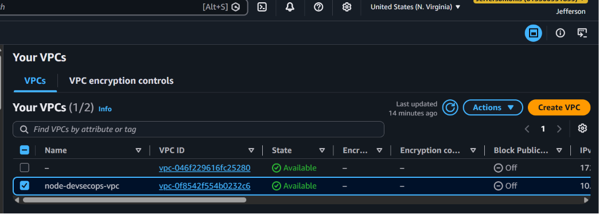

The VPC list confirms that Terraform successfully created the dedicated VPC used throughout this project.

---

The detailed VPC configuration confirms that DNS resolution, CIDR allocation, and resource tagging were configured correctly.

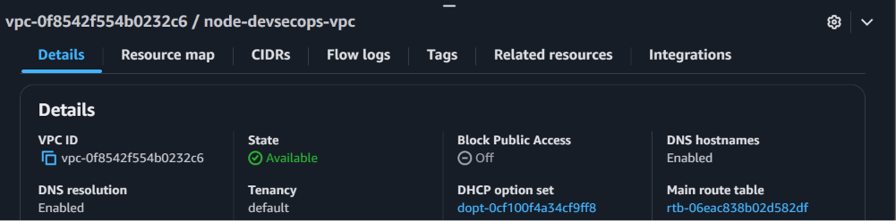


---

### Internet Gateway

An Internet Gateway (IGW) is attached to the VPC to enable communication between resources in public subnets and the internet.

Without an Internet Gateway, resources inside the VPC would remain completely isolated and would be unable to receive or initiate internet traffic.

The Internet Gateway is defined as follows:

```hcl
resource "aws_internet_gateway" "node_igw" {
  vpc_id = aws_vpc.node_vpc.id

  tags = {
    Name = "${var.project_name}-igw"
  }
}
```

The Internet Gateway will later be associated with the public route table, allowing internet access for public-facing resources such as load balancers and the NAT Gateway.

---

#### Infrastructure Verification

The Internet Gateway was verified after deployment.

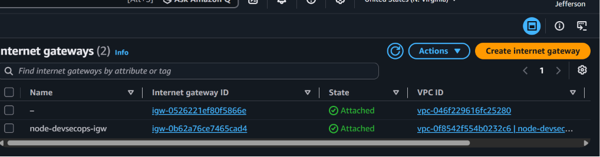

The Internet Gateway is attached to the project VPC, enabling internet connectivity for resources located in the public subnets.

---

### Public Subnets

Two public subnets are created across separate Availability Zones to provide high availability and fault tolerance.

| Subnet | CIDR Block | Availability Zone |
|---------|------------|-------------------|
| Public Subnet 1 | `10.0.1.0/24` | `us-east-1a` |
| Public Subnet 2 | `10.0.2.0/24` | `us-east-1b` |

Each public subnet is configured with:

- Automatic public IP assignment
- Association with a different Availability Zone
- Kubernetes public load balancer tag

```hcl
map_public_ip_on_launch = true
```

Automatically assigning public IP addresses allows resources launched within these subnets to communicate directly with the internet once routing is configured.

Each public subnet also includes the Kubernetes tag:

```text
kubernetes.io/role/elb = 1
```

This tag allows Amazon EKS to automatically provision internet-facing Elastic Load Balancers when Kubernetes Services of type `LoadBalancer` are created.

---

#### Infrastructure Verification

The public subnets were verified in the AWS Management Console.

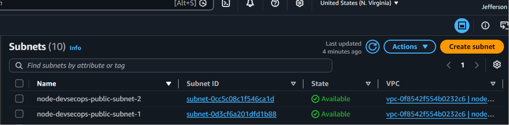

Both public subnets were successfully created in separate Availability Zones and configured for internet-facing resources.

---

### Private Subnets

Two private subnets are also created across separate Availability Zones.

| Subnet | CIDR Block | Availability Zone |
|---------|------------|-------------------|
| Private Subnet 1 | `10.0.3.0/24` | `us-east-1a` |
| Private Subnet 2 | `10.0.4.0/24` | `us-east-1b` |

Unlike the public subnets, the private subnets do not automatically assign public IP addresses to instances.

This design improves security by ensuring that workloads running inside these subnets cannot be accessed directly from the internet.

The Amazon EKS managed worker nodes will later be deployed into these private subnets, following AWS recommended architecture for production Kubernetes clusters.

Each private subnet includes the Kubernetes tag:

```text
kubernetes.io/role/internal-elb = 1
```

This tag enables Amazon EKS to provision internal Elastic Load Balancers for Kubernetes Services that should only be accessible within the VPC.

Private subnets will later access the internet securely through a NAT Gateway, allowing the worker nodes to download container images, retrieve software updates, and communicate with AWS services without exposing them to inbound internet traffic.


---

#### Infrastructure Verification

The private subnets were verified after deployment.

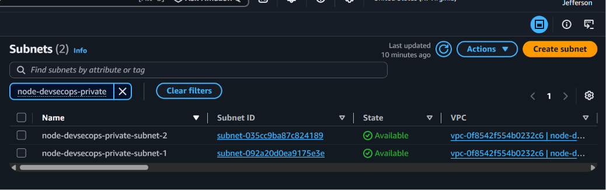

The private subnets were successfully provisioned across multiple Availability Zones and will host the Amazon EKS worker nodes.
---

### Elastic IP

An Elastic IP (EIP) is a static public IPv4 address allocated by AWS.

In this project, the Elastic IP is reserved specifically for the NAT Gateway. Rather than assigning public IP addresses directly to resources running in private subnets, the NAT Gateway uses the Elastic IP to provide outbound internet connectivity on their behalf.

This architecture allows Amazon EKS worker nodes to:

- Pull container images from Amazon Elastic Container Registry (ECR)
- Download operating system updates
- Communicate with AWS services
- Access external package repositories

while remaining inaccessible from the public internet.

The Elastic IP is defined in Terraform as:


```hcl
resource "aws_eip" "nat_eip" {
  domain = "vpc"

  tags = {
    Name = "${var.project_name}-nat-eip"
  }
}
```

---

### NAT Gateway

A Network Address Translation (NAT) Gateway enables resources within private subnets to access the internet without exposing them to inbound internet traffic.

In this project, the NAT Gateway is deployed into the first public subnet and is associated with the Elastic IP created earlier. The private subnets will later use this NAT Gateway through their route table, allowing Amazon EKS worker nodes to communicate with external services while remaining isolated from direct internet access.

The NAT Gateway is defined in Terraform as:

```hcl
resource "aws_nat_gateway" "node_nat" {
  allocation_id = aws_eip.nat_eip.id
  subnet_id     = aws_subnet.public_subnet_1.id

  depends_on = [
    aws_internet_gateway.node_igw
  ]

  tags = {
    Name = "${var.project_name}-nat-gateway"
  }
}
```

Placing the NAT Gateway in a public subnet allows it to communicate with the Internet Gateway, while private subnets route outbound traffic through it. This design follows AWS networking best practices for production Amazon EKS deployments.

---

#### Infrastructure Verification

The NAT Gateway was verified after provisioning.

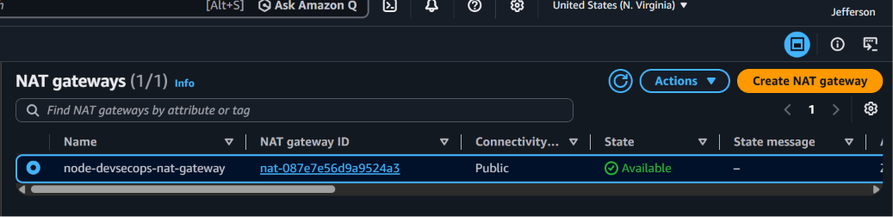

The NAT Gateway was successfully deployed into the public subnet and associated with an Elastic IP, allowing private subnets to access the internet securely.

---

### Public Route Table

A route table determines how network traffic is directed within a Virtual Private Cloud (VPC). In this project, a dedicated public route table is created to provide internet connectivity for resources deployed inside the public subnets.

The public route table is associated with the Internet Gateway attached to the VPC. This allows publicly accessible resources, such as the NAT Gateway and internet-facing load balancers, to send and receive traffic from the internet.

The route table is defined in Terraform as:

```hcl
resource "aws_route_table" "public_rt" {
  vpc_id = aws_vpc.node_vpc.id

  route {
    cidr_block = "0.0.0.0/0"
    gateway_id = aws_internet_gateway.node_igw.id
  }

  tags = {
    Name = "${var.project_name}-public-route-table"
  }
}
```

---

#### Infrastructure Verification

Terraform successfully created both the public and private route tables.

#### Route Table List

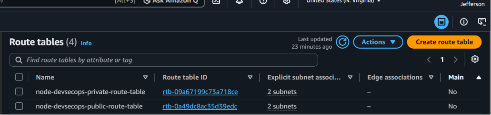

The route table list confirms that both routing tables were provisioned.

---

#### Public Route Table

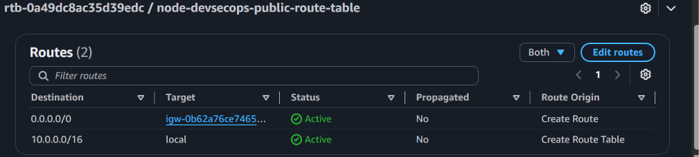

The public route table routes internet-bound traffic through the Internet Gateway.


---

### Default Internet Route

The public route table contains a default route with the destination CIDR block:

```text
0.0.0.0/0
```

This route represents all IPv4 addresses outside the VPC.

Rather than routing traffic internally, the default route forwards all outbound internet traffic through the Internet Gateway.

Without this route, resources located in the public subnets would be unable to communicate with external networks even if an Internet Gateway were attached to the VPC.

The default route is configured as:

```hcl
route {
  cidr_block = "0.0.0.0/0"
  gateway_id = aws_internet_gateway.node_igw.id
}
```

---

### Public Route Table Associations

Creating a route table alone does not affect any subnet. Each subnet must be explicitly associated with the appropriate route table.

Both public subnets are associated with the public route table, ensuring that resources launched within those subnets inherit the internet routing configuration.

The first association connects Public Subnet 1:

```hcl
resource "aws_route_table_association" "public_subnet_1_assoc" {
  subnet_id      = aws_subnet.public_subnet_1.id
  route_table_id = aws_route_table.public_rt.id
}
```

The second association connects Public Subnet 2:

```hcl
resource "aws_route_table_association" "public_subnet_2_assoc" {
  subnet_id      = aws_subnet.public_subnet_2.id
  route_table_id = aws_route_table.public_rt.id
}
```

Once these associations are created, both public subnets inherit the routing configuration defined in the public route table. Resources deployed into these subnets can communicate with the internet through the Internet Gateway, provided they have public IP addresses and appropriate security group rules.

---

### Private Route Table

The private route table controls network traffic for resources deployed within the private subnets of the Virtual Private Cloud (VPC).

Unlike the public route table, the private route table is not connected directly to the Internet Gateway. Instead, it routes outbound internet traffic through the NAT Gateway, allowing private resources to initiate outbound connections while remaining inaccessible from the public internet.

This approach follows AWS networking best practices for production workloads by ensuring that application servers and Amazon EKS worker nodes remain isolated within private subnets.

The private route table is defined in Terraform as:

```hcl
resource "aws_route_table" "private_rt" {
  vpc_id = aws_vpc.node_vpc.id

  route {
    cidr_block     = "0.0.0.0/0"
    nat_gateway_id = aws_nat_gateway.node_nat.id
  }

  tags = {
    Name = "${var.project_name}-private-route-table"
  }
}
```

---

#### Private Route Table

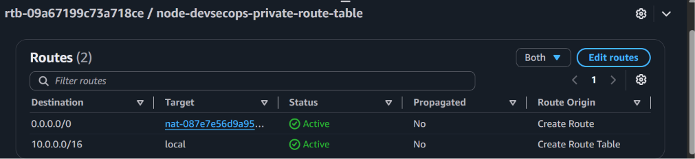

The private route table routes outbound traffic through the NAT Gateway while preventing direct inbound internet access.

---

### Default Route to the NAT Gateway

Similar to the public route table, the private route table contains a default route that matches all IPv4 addresses using the destination CIDR block:

```text
0.0.0.0/0
```

However, instead of forwarding traffic to the Internet Gateway, the private route table directs all outbound internet traffic to the NAT Gateway.

```hcl
route {
  cidr_block     = "0.0.0.0/0"
  nat_gateway_id = aws_nat_gateway.node_nat.id
}
```

The NAT Gateway then forwards outbound traffic to the Internet Gateway using its associated Elastic IP address. Response traffic is automatically returned to the originating resources within the private subnets.

This architecture enables Amazon EKS worker nodes and other private workloads to:

- Download operating system updates
- Pull container images from Amazon Elastic Container Registry (ECR)
- Communicate with AWS services
- Access external package repositories

while remaining protected from unsolicited inbound internet traffic.

---

### Private Route Table Associations

After creating the private route table, it must be associated with each private subnet so that the routing configuration is applied.

The first association connects Private Subnet 1 to the private route table:

```hcl
resource "aws_route_table_association" "private_subnet_1_assoc" {
  subnet_id      = aws_subnet.private_subnet_1.id
  route_table_id = aws_route_table.private_rt.id
}
```
The second association connects Private Subnet 2:

```hcl
resource "aws_route_table_association" "private_subnet_2_assoc" {
  subnet_id      = aws_subnet.private_subnet_2.id
  route_table_id = aws_route_table.private_rt.id
}
```

Once these associations are created, both private subnets inherit the routing configuration defined in the private route table.

Resources launched within these private subnets are unable to receive inbound internet traffic directly. Instead, outbound connections are securely routed through the NAT Gateway, providing internet access while preserving the isolation of the private network.

This networking model aligns with AWS best practices for Amazon EKS, where worker nodes are typically deployed in private subnets to improve the overall security posture of the Kubernetes cluster.

---


### Current VPC Networking Architecture

At this stage of the implementation, the networking architecture consists of:

- Amazon VPC
- Internet Gateway
- Two public subnets
- Two private subnets
- Elastic IP
- NAT Gateway
- Public Route Table
- Private Route Table
- Public Route Table Associations
- Private Route Table Associations

The VPC networking layer is now fully configured. Public subnets provide internet connectivity through the Internet Gateway, while private subnets securely access external resources through the NAT Gateway. This architecture follows AWS networking best practices and provides the secure foundation required for deploying an Amazon EKS cluster.

---

## Security Groups

Security groups act as virtual firewalls that control inbound and outbound network traffic for AWS resources deployed within a Virtual Private Cloud (VPC).

Unlike route tables, which determine where network traffic is routed, security groups determine whether that traffic is permitted. Every Amazon EC2 instance, including the Jenkins server, must be associated with at least one security group.

As part of this project, separate security groups will be created for the Jenkins server, the Amazon EKS control plane, and the Amazon EKS worker nodes. Assigning dedicated security groups to each component follows the principle of least privilege by allowing each resource to expose only the network access it requires.


---

### Jenkins Security Group

The Jenkins server requires its own security group to control administrative and application traffic.

Initially, the security group is created without any ingress or egress rules. Defining the security group separately from its rules follows Terraform best practices by improving modularity and making future rule management easier.

The Jenkins security group is defined in Terraform as:

```hcl
resource "aws_security_group" "jenkins_sg" {
  name        = "${var.project_name}-jenkins-sg"
  description = "Security group for the Jenkins server"
  vpc_id      = aws_vpc.node_vpc.id

  tags = {
    Name = "${var.project_name}-jenkins-sg"
  }
}
```

At this stage, the security group defines only the logical boundary for the Jenkins server. No inbound or outbound traffic is permitted until explicit security group rules are added.

Separating the security group resource from its ingress and egress rules improves readability, simplifies future modifications, and aligns with Terraform best practices for managing network security. In the following implementation steps, ingress rules will be added to allow administrative access via SSH, web access over HTTP, and access to the Jenkins web interface over TCP port 8080, while an egress rule will permit outbound communication with external services such as GitHub, Amazon ECR, and the Amazon EKS cluster.

---

### SSH Ingress Rule

Secure Shell (SSH) provides encrypted remote administrative access to the Jenkins server. During the initial setup and maintenance of the DevSecOps platform, SSH access is required to install software, perform system administration tasks, troubleshoot issues, and manage the Jenkins environment.

The SSH ingress rule permits inbound TCP traffic on port 22.

```hcl
resource "aws_vpc_security_group_ingress_rule" "jenkins_ssh" {
  security_group_id = aws_security_group.jenkins_sg.id

  cidr_ipv4 = "0.0.0.0/0"

  from_port = 22
  to_port   = 22

  ip_protocol = "tcp"

  description = "Allow SSH access"
}
```

Although the Terraform configuration currently permits SSH access from any IPv4 address (`0.0.0.0/0`) to simplify the initial infrastructure deployment, this configuration should be restricted in production environments. A production implementation should limit SSH access to trusted administrative IP addresses or use more secure access methods such as AWS Systems Manager Session Manager or a bastion host.

This rule represents the first inbound policy associated with the Jenkins security group and enables secure remote administration of the EC2 instance that hosts the Jenkins automation server.

---

### HTTP Ingress Rule

Hypertext Transfer Protocol (HTTP) allows web browsers and other HTTP clients to communicate with services hosted on the Jenkins server. In this project, opening TCP port 80 provides support for standard web traffic and prepares the infrastructure for hosting web-based services, such as a reverse proxy or future application endpoints.

The HTTP ingress rule permits inbound TCP traffic on port 80.

```hcl
resource "aws_vpc_security_group_ingress_rule" "jenkins_http" {
  security_group_id = aws_security_group.jenkins_sg.id

  cidr_ipv4 = "0.0.0.0/0"

  from_port = 80
  to_port   = 80

  ip_protocol = "tcp"

  description = "Allow HTTP access"
}
```

Although Jenkins listens on TCP port 8080 by default, port 80 is commonly exposed when a reverse proxy such as NGINX or Apache is configured in front of Jenkins. Using a reverse proxy enables users to access Jenkins through the standard HTTP port while allowing the proxy to forward requests internally to the Jenkins service.

In the current implementation, the rule permits HTTP access from any IPv4 address (`0.0.0.0/0`) to simplify development and testing. In a production environment, HTTP traffic should typically be redirected to HTTPS to provide encrypted communication. Public access should also be limited according to organizational security requirements, and access should be protected through a reverse proxy or load balancer with TLS enabled.

This rule represents the second inbound policy associated with the Jenkins security group and enables web-based communication with services hosted on the Jenkins EC2 instance.

---


### Jenkins Web Interface Ingress Rule

Jenkins provides a web-based user interface that administrators and developers use to configure jobs, manage plugins, monitor build pipelines, and review build results. By default, Jenkins listens for HTTP requests on TCP port `8080`.

To allow access to the Jenkins dashboard, an ingress rule is added to the Jenkins security group permitting inbound TCP traffic on port `8080`.

The Jenkins web interface ingress rule is defined in Terraform as:

```hcl
resource "aws_vpc_security_group_ingress_rule" "jenkins_web" {
  security_group_id = aws_security_group.jenkins_sg.id

  cidr_ipv4 = "0.0.0.0/0"

  from_port = 8080
  to_port   = 8080

  ip_protocol = "tcp"

  description = "Allow Jenkins web interface"
}
```

Opening TCP port `8080` enables administrators and developers to access the Jenkins dashboard through a web browser during the initial deployment and configuration of the DevSecOps platform. This interface is used to create and manage pipelines, configure credentials, install plugins, monitor build execution, and administer the Jenkins server.

For development purposes, the rule currently permits access from any IPv4 address (`0.0.0.0/0`) to simplify testing and remote administration. However, exposing the Jenkins web interface directly to the internet is not recommended for production environments.

In a production deployment, Jenkins should typically be placed behind an Application Load Balancer (ALB) or a reverse proxy such as NGINX or Apache. The reverse proxy should terminate TLS connections, enforce HTTPS, and forward requests securely to the Jenkins service. Direct access to TCP port `8080` should be restricted to trusted administrative networks or disabled entirely, significantly reducing the attack surface of the Jenkins server.

This rule represents the third inbound policy associated with the Jenkins security group and enables secure administrative access to the Jenkins automation platform during the infrastructure provisioning and pipeline configuration phases.

---

### Jenkins Egress Rule

In addition to controlling inbound traffic, a security group must also define which outbound connections are permitted. Unlike ingress rules, which protect resources from unsolicited inbound traffic, egress rules determine where an instance is allowed to initiate network communication.

The Jenkins server performs numerous outbound operations throughout the DevSecOps pipeline. It retrieves application source code from GitHub, downloads software packages and Jenkins plugins, communicates with AWS services, authenticates with Amazon Elastic Container Registry (ECR), pushes container images, interacts with the Amazon Elastic Kubernetes Service (EKS) cluster, and integrates with external security platforms such as SonarCloud and Snyk.

To support these operations, an egress rule is created that permits outbound traffic to any IPv4 destination using any protocol.

The Jenkins egress rule is defined in Terraform as:

```hcl
resource "aws_vpc_security_group_egress_rule" "jenkins_egress" {
  security_group_id = aws_security_group.jenkins_sg.id

  cidr_ipv4 = "0.0.0.0/0"

  ip_protocol = "-1"

  description = "Allow all outbound traffic"
}
```

Unlike ingress rules, this configuration does not expose the Jenkins server to unsolicited inbound connections. Instead, it allows the server to initiate outbound network communication while response traffic is automatically permitted because AWS security groups are stateful.

The rule enables Jenkins to communicate with the services and resources required throughout the DevSecOps pipeline, including:

- GitHub repositories for source code retrieval
- Amazon Elastic Container Registry (ECR) for Docker image authentication and image pushes
- Amazon Elastic Kubernetes Service (EKS) for Kubernetes deployments
- SonarCloud for Static Application Security Testing (SAST)
- Snyk for Software Composition Analysis (SCA)
- The deployed Node.js application when performing OWASP ZAP Dynamic Application Security Testing (DAST)
- Docker image registries
- Linux package repositories used during software installation and operating system updates

Permitting unrestricted outbound traffic is a common practice for build servers because they frequently communicate with numerous trusted external services. Restricting outbound connectivity too aggressively can interrupt automated builds, security scans, dependency downloads, and deployment operations.

In highly regulated production environments, organizations may choose to implement more restrictive outbound policies by limiting communication to approved destinations, routing traffic through network firewalls, or inspecting outbound traffic using AWS Network Firewall or similar security controls.

This rule completes the Jenkins security group's initial network configuration by allowing the server to communicate with the external services required to build, secure, and deploy applications throughout the DevSecOps pipeline.

---

#### Infrastructure Verification

The security groups created by Terraform were verified in the AWS Management Console.

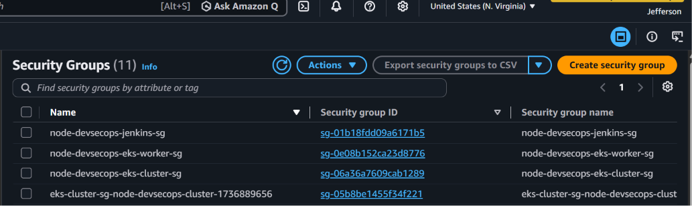

The security groups for Jenkins, the Amazon EKS control plane, and the Amazon EKS worker nodes were successfully provisioned with the required network policies.

---

### Amazon EKS Cluster Security Group

Amazon Elastic Kubernetes Service (EKS) separates the Kubernetes control plane from the worker nodes that run application workloads. The control plane is a fully managed AWS service responsible for orchestrating the Kubernetes cluster, exposing the Kubernetes API server, scheduling workloads, maintaining cluster state, and managing communication between Kubernetes components.

To control network access to the Amazon EKS control plane, a dedicated security group is created. Defining a separate security group establishes a logical security boundary for the Kubernetes control plane and enables network policies to be managed independently from the Jenkins server and the Amazon EKS worker nodes.

The Amazon EKS cluster security group is defined in Terraform as:

```hcl
resource "aws_security_group" "eks_cluster_sg" {
  name        = "${var.project_name}-eks-cluster-sg"
  description = "Security group for the Amazon EKS control plane"
  vpc_id      = aws_vpc.node_vpc.id

  tags = {
    Name = "${var.project_name}-eks-cluster-sg"
  }
}
```

At this stage, the security group defines only the network security boundary for the Amazon EKS control plane. No ingress or egress rules have been associated with the security group yet, meaning that no network communication is explicitly permitted until additional security group rules are configured.

Separating the security group resource from its ingress and egress rules follows Terraform best practices by improving readability, simplifying future modifications, and allowing individual network policies to be managed independently throughout the infrastructure lifecycle.

In the following implementation steps, dedicated security group rules will be added to allow secure communication between the Amazon EKS control plane and the worker nodes. These rules will permit only the network traffic required for Kubernetes cluster management while maintaining the principle of least privilege.

Using a dedicated security group for the Amazon EKS control plane provides several advantages:

- Isolates Kubernetes control plane traffic from other infrastructure components.
- Simplifies security rule management by separating cluster communication from application traffic.
- Supports the principle of least privilege by allowing only required network communication.
- Improves maintainability by enabling security policies to evolve independently as the infrastructure grows.
- Aligns with AWS and Terraform best practices for managing Amazon EKS networking.

This security group establishes the foundation for securing communication between the Amazon EKS control plane and the worker nodes that will be provisioned during the subsequent stages of the infrastructure implementation.


---

### Amazon EKS Worker Node Security Group

While the Amazon EKS control plane is managed by AWS, the applications deployed to the Kubernetes cluster run on worker nodes. These worker nodes are Amazon EC2 instances that execute containerized workloads, host Kubernetes pods, run the kubelet agent, and communicate with the Kubernetes control plane to receive scheduling instructions and report cluster status.

To secure these instances, a dedicated security group is created for the Amazon EKS worker nodes. Using a separate security group isolates worker node traffic from the Jenkins server and the Amazon EKS control plane, allowing each infrastructure component to enforce its own network security policies.

The Amazon EKS worker node security group is defined in Terraform as:

```hcl
resource "aws_security_group" "eks_worker_sg" {
  name        = "${var.project_name}-eks-worker-sg"
  description = "Security group for the Amazon EKS worker nodes"
  vpc_id      = aws_vpc.node_vpc.id

  tags = {
    Name = "${var.project_name}-eks-worker-sg"
  }
}
```

At this stage, the security group establishes the logical network boundary for the worker nodes but does not yet contain any ingress or egress rules. As a result, no network communication is explicitly permitted until the required security group rules are defined.

Separating the security group resource from its associated ingress and egress rules follows Terraform best practices by improving code organization, simplifying future maintenance, and enabling individual network policies to be managed independently throughout the infrastructure lifecycle.

Once the Amazon EKS cluster is provisioned, the worker nodes will require network communication with several components, including:

- The Amazon EKS control plane for Kubernetes cluster management.
- Other worker nodes within the cluster for pod-to-pod communication.
- Amazon Elastic Container Registry (ECR) for downloading container images.
- AWS services required by Kubernetes and the container runtime.
- External package repositories and operating system update services through the NAT Gateway.

Dedicated ingress and egress rules will be added during the subsequent implementation steps to permit only the network traffic required for Kubernetes operation while maintaining the principle of least privilege.

Creating a dedicated security group for the worker nodes provides several benefits:

- Separates application traffic from Kubernetes control plane traffic.
- Simplifies network policy management by isolating worker node communication.
- Supports the principle of least privilege by allowing only necessary network access.
- Improves maintainability as the Kubernetes environment expands.
- Aligns with AWS networking recommendations and Terraform best practices for Amazon EKS deployments.

This security group establishes the security boundary for the Amazon EKS worker nodes and prepares the infrastructure for the Kubernetes networking rules that will be implemented during the next stage of the project.


---

### Amazon EKS Cluster Egress Rule

In addition to controlling inbound communication, the Amazon EKS cluster security group must also define which outbound network connections the Kubernetes control plane is permitted to initiate. While ingress rules determine which resources can communicate with the control plane, egress rules specify the destinations that the control plane can reach.

The Amazon EKS control plane performs several essential cluster management operations that require outbound network communication. These operations include scheduling workloads, maintaining cluster state, communicating with the kubelet running on worker nodes, performing health checks, and interacting with AWS-managed infrastructure services.

To support these operations, an egress rule is created that permits the Amazon EKS control plane to initiate outbound communication to any IPv4 destination using any network protocol.

The Amazon EKS cluster egress rule is defined in Terraform as:

```hcl
resource "aws_vpc_security_group_egress_rule" "eks_cluster_egress" {
  security_group_id = aws_security_group.eks_cluster_sg.id

  cidr_ipv4 = "0.0.0.0/0"

  ip_protocol = "-1"

  description = "Allow outbound traffic from the EKS control plane"
}
```

This rule allows the Amazon EKS control plane to establish outbound connections while continuing to rely on the stateful behavior of AWS security groups. Because AWS security groups are stateful, response traffic associated with established outbound connections is automatically permitted without requiring additional inbound rules.

The egress rule enables the Amazon EKS control plane to communicate with the services and resources required for normal Kubernetes operation, including:

- Amazon EKS worker nodes
- AWS-managed Kubernetes control plane services
- Elastic Network Interfaces (ENIs)
- Amazon Elastic Container Registry (ECR)
- AWS Identity and Access Management (IAM)
- Amazon CloudWatch and other AWS service endpoints
- Additional AWS networking and infrastructure services used by the Kubernetes cluster

Although the rule currently permits outbound traffic to any IPv4 destination (`0.0.0.0/0`), it does not expose the Kubernetes control plane to unsolicited inbound connections. Instead, it allows the control plane to initiate the outbound communication required to manage the Kubernetes cluster while automatically permitting only the corresponding return traffic.

Allowing unrestricted outbound communication from the Amazon EKS control plane is consistent with common AWS deployment practices because the control plane must interact with multiple AWS-managed services and cluster components during normal operation. Restricting outbound connectivity too aggressively can interfere with Kubernetes management functions, cluster health monitoring, and communication with required AWS services.

In highly regulated production environments, organizations may choose to implement more restrictive outbound policies by routing traffic through centralized inspection points, enforcing firewall policies, or limiting communication to approved AWS service endpoints in accordance with organizational security requirements.

This egress rule represents the first network policy associated with the Amazon EKS control plane security group. In the following implementation steps, dedicated ingress rules will be created to allow secure communication between the Amazon EKS control plane and the worker nodes. These rules will ensure that only the network traffic required for Kubernetes cluster operation is permitted while maintaining the principle of least privilege.

---

### Amazon EKS Cluster API Server Ingress Rule

The Amazon Elastic Kubernetes Service (EKS) control plane exposes the Kubernetes API server, which serves as the primary management interface for the Kubernetes cluster. All communication between the Amazon EKS worker nodes and the control plane occurs through this API endpoint. The Kubernetes API server processes cluster management requests, maintains the desired cluster state, coordinates workload scheduling, and facilitates communication between Kubernetes components.

To enable secure communication with the Kubernetes API server, an ingress rule is created that permits inbound HTTPS traffic on TCP port 443 from the Amazon EKS worker node security group.

Unlike the ingress rules configured for the Jenkins server, this rule does not permit access from arbitrary IPv4 addresses. Instead, it references the Amazon EKS worker node security group directly, ensuring that only authorized worker nodes belonging to the Kubernetes cluster can communicate with the control plane.

The Amazon EKS cluster API server ingress rule is defined in Terraform as:

```hcl
resource "aws_vpc_security_group_ingress_rule" "eks_cluster_https" {
  security_group_id            = aws_security_group.eks_cluster_sg.id
  referenced_security_group_id = aws_security_group.eks_worker_sg.id

  from_port = 443
  to_port   = 443

  ip_protocol = "tcp"

  description = "Allow worker nodes to communicate with the EKS API server"
}
```

This rule allows Amazon EKS worker nodes to establish secure HTTPS connections with the Kubernetes API server. Through these encrypted connections, the worker nodes can:

- Register with the Amazon EKS cluster 
- Receive workload scheduling decisions
- Report node health and status
- Synchronize cluster state
- Retrieve Kubernetes resources and configuration required for normal cluster operation

Rather than specifying a CIDR block, the rule uses the referenced_security_group_id attribute to reference the Amazon EKS worker node security group. This approach significantly strengthens security by ensuring that only EC2 instances associated with the worker node security group are permitted to communicate with the Kubernetes API server. As a result, unauthorized systems—even those located within the same VPC—cannot access the control plane unless they belong to the designated security group.

The ingress rule enables several essential Kubernetes operations, including:

- Worker node registration with the Amazon EKS cluster
- Secure communication with the Kubernetes API server
- Pod scheduling and orchestration
- Cluster state synchronization
- Node health monitoring and status reporting
- Retrieval of Kubernetes resources and configuration

Restricting access to the Kubernetes API server is a fundamental security best practice for Amazon EKS deployments. Exposing the API server to unnecessary network sources increases the attack surface of the Kubernetes control plane and may allow unauthorized systems to attempt administrative communication with the cluster.

By limiting inbound access exclusively to the Amazon EKS worker node security group, this implementation adheres to the principle of least privilege while allowing only the network communication required for normal Kubernetes operation.

This ingress rule represents the first inbound policy associated with the Amazon EKS control plane security group. Combined with the previously configured egress rule, it establishes secure bidirectional communication between the Amazon EKS control plane and the worker nodes, providing the network connectivity required for Kubernetes cluster management while maintaining a strong security posture.

---

### Amazon EKS Worker Node Egress Rule

Amazon Elastic Kubernetes Service (EKS) worker nodes host the Kubernetes workloads that run containerized applications within the cluster. In addition to communicating with the Kubernetes control plane, the worker nodes must initiate outbound network connections to various AWS services and external resources required for normal cluster operation.

To support these requirements, an egress rule is created that permits the Amazon EKS worker nodes to initiate outbound communication to any IPv4 destination using any network protocol.

The Amazon EKS worker node egress rule is defined in Terraform as:

```hcl
resource "aws_vpc_security_group_egress_rule" "eks_worker_egress" {
  security_group_id = aws_security_group.eks_worker_sg.id

  cidr_ipv4 = "0.0.0.0/0"

  ip_protocol = "-1"

  description = "Allow outbound traffic from the EKS worker nodes"
}
```

This rule allows the Amazon EKS worker nodes to establish outbound connections while relying on the stateful behavior of AWS security groups. Because security groups are stateful, response traffic associated with established outbound connections is automatically permitted without requiring additional inbound rules.

The egress rule enables the worker nodes to communicate with the services and resources required for Kubernetes operation, including:

- Amazon EKS control plane
- Amazon Elastic Container Registry (ECR)
- AWS Identity and Access Management (IAM)
- AWS Security Token Service (STS)
- Amazon CloudWatch
- Amazon Simple Storage Service (S3)
- Elastic Network Interfaces (ENIs)
- External package repositories
- Additional AWS service endpoints required by Kubernetes

Although the rule currently permits outbound traffic to any IPv4 destination (0.0.0.0/0), it does not expose the worker nodes to unsolicited inbound connections. Instead, it enables the worker nodes to initiate the outbound communication required to download container images, retrieve software updates, communicate with AWS-managed services, and interact with the Kubernetes control plane while automatically permitting only the associated response traffic.

Allowing unrestricted outbound communication from the Amazon EKS worker nodes is consistent with common Amazon EKS deployment practices because the nodes must communicate with multiple AWS services and external endpoints during normal cluster operation. Restricting outbound connectivity too aggressively may prevent worker nodes from joining the cluster, retrieving container images, obtaining temporary AWS credentials, or accessing required software repositories.

In highly regulated production environments, organizations may choose to implement more restrictive outbound policies by routing traffic through centralized inspection points, enforcing firewall policies, or limiting communication to approved AWS service endpoints.

This egress rule establishes the outbound network connectivity required by the Amazon EKS worker nodes and complements the security policies already configured for the Amazon EKS control plane. Together, these rules provide the foundation for secure communication between the Kubernetes control plane, worker nodes, and the AWS services required to operate the cluster.

---

### Amazon EKS Worker Node Ingress Rule (Node-to-Node Communication)

Amazon Elastic Kubernetes Service (EKS) worker nodes frequently communicate with one another to support normal Kubernetes networking and cluster operations. Containerized applications may be scheduled across multiple worker nodes, requiring secure inter-node communication for workload coordination, service discovery, and pod networking.

To enable this communication, an ingress rule is created that allows inbound traffic from the Amazon EKS worker node security group itself. Rather than permitting access from a CIDR block, the rule references the worker node security group directly, ensuring that only EC2 instances belonging to the Kubernetes worker node group can communicate with one another.

The Amazon EKS worker node ingress rule is defined in Terraform as:

```hcl
resource "aws_vpc_security_group_ingress_rule" "eks_worker_self" {
  security_group_id            = aws_security_group.eks_worker_sg.id
  referenced_security_group_id = aws_security_group.eks_worker_sg.id

  ip_protocol = "-1"

  description = "Allow worker nodes to communicate with each other"
}
```

This rule permits unrestricted communication between worker nodes that are members of the same security group. Because the rule references the worker node security group instead of an IPv4 CIDR range, communication is limited exclusively to authorized Kubernetes worker nodes within the cluster.

The ingress rule supports several essential Kubernetes functions, including:

- Pod-to-pod communication across worker nodes
- Kubernetes networking (Amazon VPC CNI)
- Service discovery
- Inter-node communication
- Distributed application workloads
- Internal cluster networking

Allowing communication only between worker nodes strengthens the security posture of the cluster by preventing unrelated resources from initiating network connections to the worker nodes. This approach follows the principle of least privilege while providing the connectivity required for normal Kubernetes operation.

Together with the previously configured ingress and egress rules, this rule establishes secure communication between the Amazon EKS control plane and the worker nodes, while also enabling worker nodes to communicate with one another as required for Kubernetes cluster networking.

---

### Amazon EKS Worker Node Ingress Rule (Kubelet Communication)

Each Amazon Elastic Kubernetes Service (EKS) worker node runs the kubelet, a Kubernetes agent responsible for managing containers, reporting node health, and maintaining communication with the Kubernetes control plane. The Amazon EKS control plane uses the kubelet to monitor worker nodes, retrieve node status, and coordinate workload execution.

To enable this communication, an ingress rule is created that permits inbound TCP traffic on port 10250 from the Amazon EKS control plane security group.

Rather than allowing access from a CIDR block, the rule references the Amazon EKS control plane security group directly, ensuring that only the Kubernetes control plane can communicate with the kubelet running on the worker nodes.

The Amazon EKS worker node kubelet ingress rule is defined in Terraform as:

```hcl
resource "aws_vpc_security_group_ingress_rule" "eks_worker_kubelet" {
  security_group_id            = aws_security_group.eks_worker_sg.id
  referenced_security_group_id = aws_security_group.eks_cluster_sg.id

  from_port = 10250
  to_port   = 10250

  ip_protocol = "tcp"

  description = "Allow the EKS control plane to communicate with the kubelet"
}
```

This rule allows the Amazon EKS control plane to establish secure communication with the kubelet running on each worker node. Through this connection, the control plane can monitor node health, manage workload execution, retrieve node status, and coordinate Kubernetes operations across the cluster.

Using the referenced_security_group_id attribute instead of a CIDR block restricts access exclusively to resources associated with the Amazon EKS control plane security group. This approach reduces the attack surface by preventing unauthorized systems from communicating directly with the kubelet while allowing only the trusted control plane to perform cluster management tasks.

The ingress rule supports several essential Kubernetes functions, including:

- Worker node health monitoring
- Pod lifecycle management
- Retrieval of node status
- Workload coordination
- Communication between the Amazon EKS control plane and kubelet

Restricting kubelet access to the Amazon EKS control plane follows the principle of least privilege and aligns with AWS networking best practices for Amazon EKS deployments.

Together with the previously configured security group rules, this ingress rule completes the core communication required between the Amazon EKS control plane and the worker nodes, providing the secure connectivity necessary for normal Kubernetes cluster operation.


---

## IAM

### Amazon EKS Cluster IAM Role

AWS Identity and Access Management (IAM) controls which AWS services and resources are permitted to perform specific actions within an AWS account. Unlike security groups, which regulate network communication, IAM defines permissions and establishes trust relationships between AWS services.

Amazon Elastic Kubernetes Service (EKS) requires a dedicated IAM role for the Kubernetes control plane. This role allows the Amazon EKS service to assume an identity within the AWS account and perform the operations required to provision, manage, and maintain the Kubernetes control plane.

The Amazon EKS cluster IAM role is defined in Terraform as:

```hcl
resource "aws_iam_role" "eks_cluster_role" {
  name = "${var.project_name}-eks-cluster-role"

  assume_role_policy = jsonencode({
    Version = "2012-10-17"

    Statement = [
      {
        Effect = "Allow"

        Principal = {
          Service = "eks.amazonaws.com"
        }

        Action = "sts:AssumeRole"
      }
    ]
  })

  tags = {
    Name = "${var.project_name}-eks-cluster-role"
    }
}
```

The IAM role defines a trust policy that allows the Amazon EKS service (`eks.amazonaws.com`) to assume the role using the AWS Security Token Service (STS). At this stage, the role establishes only the trust relationship and does not grant any permissions to the Kubernetes control plane.

Permissions required by Amazon EKS are attached separately using AWS-managed IAM policies. Separating the IAM role from its policy attachments follows Terraform best practices by improving readability, simplifying future maintenance, and allowing permissions to be managed independently.

Creating a dedicated IAM role for the Amazon EKS control plane provides several benefits:

- Establishes a secure trust relationship between AWS and Amazon EKS.
- Separates trust configuration from permission management.
- Supports the principle of least privilege.
- Simplifies future policy management and auditing.
- Aligns with AWS and Terraform best practices for Amazon EKS deployments.

This IAM role establishes the identity that the Amazon EKS control plane will use. In the next implementation step, the required AWS-managed IAM policy will be attached to grant the permissions necessary for Amazon EKS to provision and manage the Kubernetes cluster.


---

### Amazon EKS Cluster IAM Policy Attachment

Although the Amazon EKS cluster IAM role establishes a trust relationship between AWS and the Amazon EKS service, it does not grant any permissions by itself. To allow the Kubernetes control plane to provision and manage cluster resources, an AWS-managed IAM policy must be attached to the role.

The Amazon EKS cluster IAM policy attachment is defined in Terraform as:

```hcl
resource "aws_iam_role_policy_attachment" "eks_cluster_policy" {
  role       = aws_iam_role.eks_cluster_role.name
  policy_arn = "arn:aws:iam::aws:policy/AmazonEKSClusterPolicy"
}
```

The `AmazonEKSClusterPolicy` is an AWS-managed policy that grants the permissions required for the Amazon EKS control plane to manage the Kubernetes cluster. These permissions include interacting with AWS networking components, creating and managing Elastic Network Interfaces (ENIs), and communicating with other AWS services required for normal cluster operation.

Attaching the policy separately from the IAM role follows Terraform best practices by separating the trust relationship from permission management. This approach improves readability, simplifies future maintenance, and allows IAM policies to be managed independently of the IAM role.

Using the AWS-managed `AmazonEKSClusterPolicy` provides several benefits:

- Grants the permissions required by the Amazon EKS control plane.
- Uses an AWS-managed policy that is maintained and updated by AWS.
- Separates trust configuration from permission management.
- Simplifies infrastructure maintenance and auditing.
- Aligns with AWS and Terraform best practices for Amazon EKS deployments.

Together, the Amazon EKS cluster IAM role and the attached AWS-managed policy provide the identity and permissions required for Amazon EKS to provision and manage the Kubernetes control plane. The next implementation step creates the IAM role for the Amazon EKS worker nodes, which enables the EC2 instances in the managed node group to join and operate within the Kubernetes cluster.

---

### Amazon EKS Worker Node IAM Role

While the Amazon EKS control plane requires its own IAM role, the worker nodes also require a dedicated IAM role to perform operations on behalf of the Kubernetes workloads they host. Each worker node is an Amazon EC2 instance that must authenticate with the Amazon EKS cluster and interact with AWS services during normal Kubernetes operation.

The Amazon EKS worker node IAM role is defined in Terraform as:

```hcl
resource "aws_iam_role" "eks_node_role" {
  name = "${var.project_name}-eks-node-role"

  assume_role_policy = jsonencode({
    Version = "2012-10-17"

    Statement = [
      {
        Effect = "Allow"

        Principal = {
          Service = "ec2.amazonaws.com"
        }

        Action = "sts:AssumeRole"
      }
    ]
  })

  tags = {
    Name = "${var.project_name}-eks-node-role"
  }
}
```

The IAM role defines a trust policy that allows Amazon EC2 (`ec2.amazonaws.com`) to assume the role using the AWS Security Token Service (STS). This trust relationship enables the EC2 instances that form the Amazon EKS managed node group to obtain temporary AWS credentials during startup and normal cluster operation.

At this stage, the IAM role establishes only the identity of the worker nodes and does not grant any permissions. The permissions required to join the Kubernetes cluster, pull container images from Amazon Elastic Container Registry (ECR), and manage Kubernetes networking will be attached separately using AWS-managed IAM policies.

Creating a dedicated IAM role for the Amazon EKS worker nodes provides several benefits:

- Establishes a secure trust relationship between Amazon EC2 and AWS IAM.
- Separates worker node permissions from the Amazon EKS control plane.
- Supports the principle of least privilege.
- Simplifies future policy management and auditing.
- Aligns with AWS and Terraform best practices for Amazon EKS deployments.

This IAM role establishes the identity that the Amazon EKS worker nodes will use. In the next implementation step, AWS-managed IAM policies will be attached to grant the permissions required for the worker nodes to join and operate within the Kubernetes cluster.


---


### Amazon EKS Worker Node Policy Attachment

After creating the Amazon EKS worker node IAM role, the permissions required for the worker nodes to operate within the Kubernetes cluster must be granted. Rather than assigning permissions directly to the IAM role, Terraform attaches an AWS-managed IAM policy that provides the permissions required for normal Amazon EKS worker node operation.

The Amazon EKS worker node policy attachment is defined in Terraform as:

```hcl
resource "aws_iam_role_policy_attachment" "eks_worker_node_policy" {
  role       = aws_iam_role.eks_node_role.name
  policy_arn = "arn:aws:iam::aws:policy/AmazonEKSWorkerNodePolicy"
}
```

The `AmazonEKSWorkerNodePolicy` is an AWS-managed policy that grants the permissions required for Amazon EC2 instances to function as Amazon EKS worker nodes. These permissions allow the worker nodes to communicate with the Kubernetes API server, register with the cluster, report node health, and participate in workload scheduling.

Attaching the policy separately from the IAM role follows Terraform best practices by separating the worker node identity from its permissions. This approach improves readability, simplifies maintenance, and allows IAM policies to be managed independently.

Using the AWS-managed `AmazonEKSWorkerNodePolicy` provides several benefits:

- Grants the permissions required for worker nodes to join the Amazon EKS cluster.
- Enables communication with the Kubernetes control plane.
- Uses an AWS-managed policy that is maintained and updated by AWS.
- Simplifies infrastructure maintenance and auditing.
- Aligns with AWS and Terraform best practices for Amazon EKS deployments.

Together, the Amazon EKS worker node IAM role and the attached `AmazonEKSWorkerNodePolicy` establish the identity and core permissions required for the EC2 instances in the managed node group. Additional AWS-managed policies will be attached in the following implementation steps to allow the worker nodes to pull container images from Amazon Elastic Container Registry (ECR) and manage Kubernetes networking.


---

#### Infrastructure Verification

The IAM roles created for Amazon EKS were verified in the AWS Management Console.

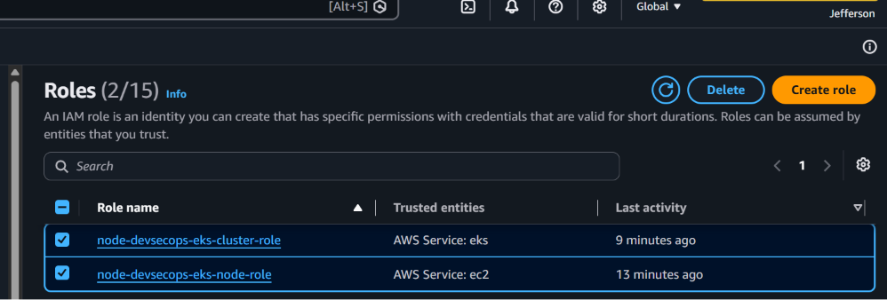

Terraform successfully provisioned the IAM roles and policy attachments required for the Amazon EKS control plane and managed worker nodes.

---

### Amazon ECR Read-Only Policy Attachment

After granting the worker nodes permission to join the Amazon EKS cluster, they must also be able to retrieve container images from Amazon Elastic Container Registry (ECR). Because the Node.js application will be packaged as a Docker image and stored in an Amazon ECR repository, the worker nodes require read-only access to that repository.

The Amazon ECR read-only policy attachment is defined in Terraform as:

```hcl
resource "aws_iam_role_policy_attachment" "eks_ecr_read_only" {
  role       = aws_iam_role.eks_node_role.name
  policy_arn = "arn:aws:iam::aws:policy/AmazonEC2ContainerRegistryReadOnly"
}
```

The `AmazonEC2ContainerRegistryReadOnly` AWS-managed policy grants the permissions required for Amazon EKS worker nodes to authenticate with Amazon ECR and pull container images during Pod creation. These permissions include retrieving image metadata, downloading image layers, and obtaining authorization tokens required for secure access to the container registry.

Attaching the policy separately from the IAM role follows Terraform best practices by keeping permissions modular and allowing individual policy attachments to be managed independently.

Using the AWS-managed `AmazonEC2ContainerRegistryReadOnly` policy provides several benefits:

- Grants worker nodes permission to pull container images from Amazon ECR.
- Supports Kubernetes Pod deployment by allowing images to be downloaded when workloads are scheduled.
- Uses an AWS-managed policy maintained and updated by AWS.
- Simplifies IAM policy management and auditing.
- Aligns with AWS and Terraform best practices for Amazon EKS deployments.

Together with the previously attached worker node policy, this policy enables the Amazon EKS worker nodes to join the Kubernetes cluster and retrieve the container images required to run the deployed applications. The next implementation step attaches the Amazon EKS CNI policy, which grants the permissions required for Kubernetes pod networking within the Amazon VPC.


---

### Amazon EKS CNI Policy Attachment

In addition to joining the Amazon EKS cluster and retrieving container images from Amazon Elastic Container Registry (ECR), the worker nodes must also manage Kubernetes pod networking within the Amazon Virtual Private Cloud (VPC). Amazon EKS uses the Amazon VPC Container Network Interface (CNI) plugin to assign VPC IP addresses directly to Kubernetes Pods, requiring additional permissions to manage AWS networking resources.

The Amazon EKS CNI policy attachment is defined in Terraform as:

```hcl
resource "aws_iam_role_policy_attachment" "eks_cni_policy" {
  role       = aws_iam_role.eks_node_role.name
  policy_arn = "arn:aws:iam::aws:policy/AmazonEKS_CNI_Policy"
}
```

The `AmazonEKS_CNI_Policy` is an AWS-managed policy that grants the permissions required for the Amazon VPC CNI plugin to manage Elastic Network Interfaces (ENIs), assign secondary private IP addresses, and configure networking for Kubernetes Pods running on the Amazon EKS worker nodes.

Attaching the policy separately from the IAM role follows Terraform best practices by keeping the worker node identity independent from its permissions. This modular approach improves readability, simplifies maintenance, and allows IAM policies to be managed individually.

Using the AWS-managed `AmazonEKS_CNI_Policy` provides several benefits:

- Grants the permissions required for Kubernetes pod networking.
- Allows the Amazon VPC CNI plugin to manage Elastic Network Interfaces and IP addresses.
- Supports communication between Pods within the Amazon VPC.
- Uses an AWS-managed policy maintained and updated by AWS.
- Aligns with AWS and Terraform best practices for Amazon EKS deployments.

Together with the previously attached worker node policies, this policy completes the IAM permissions required for a standard Amazon EKS managed node group. The worker nodes can now join the Kubernetes cluster, pull container images from Amazon Elastic Container Registry (ECR), and provide networking for Kubernetes Pods within the Amazon VPC.


---

## Amazon Elastic Container Registry (ECR)

After defining the networking infrastructure and IAM permissions, the next component provisioned is the Amazon Elastic Container Registry (ECR). Amazon ECR is a fully managed AWS container registry that stores Docker images built by the Jenkins CI/CD pipeline. Once the application image has been built and scanned with Trivy, it is pushed to Amazon ECR, where it becomes available for deployment to Amazon Elastic Kubernetes Service (EKS). Within this project, Jenkins builds the Node.js application into a Docker image and pushes the image to Amazon ECR. Amazon EKS then pulls the image from the repository whenever the application is deployed or updated.

The provisioning sequence is:

```text
GitHub
    │
    ▼
Jenkins Pipeline
    │
    ▼
Docker Build
    │
    ▼
Trivy Scan
    │
    ▼
Amazon ECR
    │
    ▼
Amazon EKS
```

The ECR repository is defined in Terraform as:

```hcl
resource "aws_ecr_repository" "node_app_repository" {
  name                 = "${var.project_name}-repository"
  image_tag_mutability = "MUTABLE"

  image_scanning_configuration {
    scan_on_push = true
  }

  tags = {
    Name = "${var.project_name}-repository"
  }
}
```
The repository is configured to allow mutable image tags, enabling newer image versions to reuse existing tags such as `latest` during development. Automatic image scanning is also enabled so that Amazon ECR performs vulnerability scans whenever a new image is pushed to the repository.

Provisioning the repository with Terraform provides several benefits:

- Creates a centralized repository for Docker images.
- Enables Jenkins to push container images after successful builds.
- Allows Amazon EKS worker nodes to pull application images during deployment.
- Automatically scans newly pushed images for known vulnerabilities.
- Manages the container registry as code alongside the rest of the AWS infrastructure.

This repository serves as the bridge between the CI pipeline and the Kubernetes deployment. Once Jenkins builds and validates the application, the Docker image is pushed to Amazon ECR, where it becomes available for deployment to the Amazon EKS cluster.

### Why ECR Is Provisioned Before Amazon EKS

Although Amazon EKS runs the application, it cannot deploy container workloads until the application image exists in a container registry.

For this reason, the Amazon ECR repository is provisioned before the Amazon EKS cluster. Although Amazon EKS is responsible for running the application, it cannot deploy workloads until a container image is available in a registry. For this reason, the Amazon ECR repository is provisioned before the Amazon EKS cluster. During the CI/CD pipeline, Jenkins builds the Docker image, Trivy scans it for vulnerabilities, and the validated image is pushed to Amazon ECR. The Amazon EKS worker nodes then pull the image from the repository whenever a deployment or application update is performed.

---

### Infrastructure Verification

The Amazon Elastic Container Registry repository was verified after deployment.

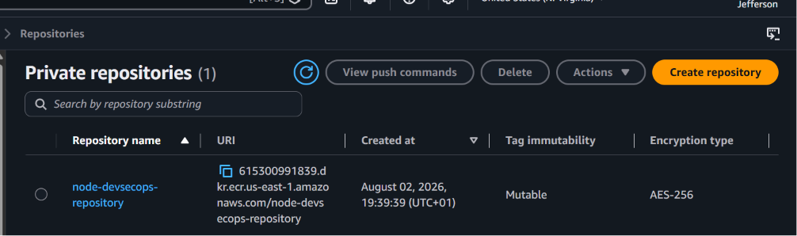

Terraform successfully created the Amazon ECR repository that will later store Docker images produced by the Jenkins CI/CD pipeline.

---

## Amazon Elastic Kubernetes Service (EKS) Cluster

After provisioning the networking infrastructure, IAM roles, and Amazon Elastic Container Registry (ECR), the next component created is the Amazon Elastic Kubernetes Service (EKS) cluster. Amazon EKS is a fully managed Kubernetes service that provides the control plane required to orchestrate and manage containerized applications.

The EKS cluster serves as the deployment platform for the Node.js monitoring application. Rather than managing Kubernetes control plane components manually, AWS operates the API server, scheduler, and other core services, allowing the project to focus on deploying and operating workloads.

The Amazon EKS cluster is defined in Terraform as:

```hcl
resource "aws_eks_cluster" "node_cluster" {
  name     = "${var.project_name}-cluster"
  role_arn = aws_iam_role.eks_cluster_role.arn

  version = "1.33"

  vpc_config {
    subnet_ids = [
      aws_subnet.public_subnet_1.id,
      aws_subnet.public_subnet_2.id,
      aws_subnet.private_subnet_1.id,
      aws_subnet.private_subnet_2.id
    ]

    security_group_ids = [
      aws_security_group.eks_cluster_sg.id
    ]
  }

  depends_on = [
    aws_iam_role_policy_attachment.eks_cluster_policy
  ]

  tags = {
    Name = "${var.project_name}-cluster"
  }
}
```

The cluster is deployed across multiple Availability Zones by using both public and private subnets. The control plane uses the IAM role created earlier to interact securely with AWS services, while the dedicated security group controls communication with the worker nodes.

Provisioning the Amazon EKS cluster with Terraform provides several benefits:

- Creates a managed Kubernetes control plane.
- Integrates with the previously configured VPC and networking resources.
- Uses IAM for secure authentication and authorization.
- Supports high availability across multiple Availability Zones.
- Establishes the foundation for deploying Kubernetes workloads.

### Why the Amazon EKS Cluster Is Created Before the Managed Node Group

The Amazon EKS cluster represents the Kubernetes control plane and must exist before worker nodes can join the cluster. Once the control plane is available, Terraform provisions the managed node group, whose EC2 instances automatically register with the cluster and become available to run containerized workloads.

### Infrastructure Verification

The Amazon EKS cluster was verified after provisioning.

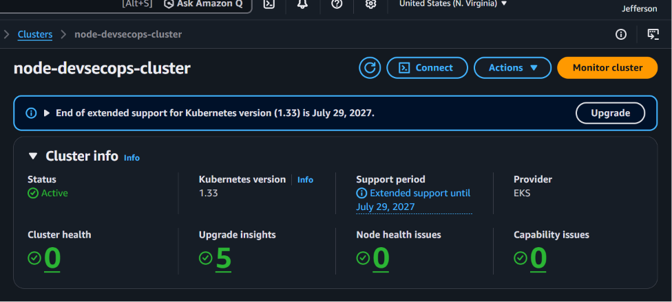

The cluster entered the Active state, confirming that the Kubernetes control plane was successfully provisioned.

---

## Amazon EKS Managed Node Group

After creating the Amazon EKS cluster, the next component provisioned is the Amazon EKS Managed Node Group. While the Kubernetes control plane manages cluster operations, the managed node group provides the Amazon EC2 instances that execute containerized workloads.

The managed node group is associated with the IAM role created earlier and is deployed into the private subnets of the VPC. Deploying worker nodes in private subnets follows AWS security best practices by preventing direct inbound internet access while still allowing outbound connectivity through the NAT Gateway.

The managed node group is defined in Terraform as:

```hcl
resource "aws_eks_node_group" "node_group" {
  cluster_name    = aws_eks_cluster.node_cluster.name
  node_group_name = "${var.project_name}-node-group"
  node_role_arn   = aws_iam_role.eks_node_role.arn

  subnet_ids = [
    aws_subnet.private_subnet_1.id,
    aws_subnet.private_subnet_2.id
  ]

  scaling_config {
    desired_size = 2
    max_size     = 3
    min_size     = 1
  }

  instance_types = ["t3.medium"]

  depends_on = [
    aws_iam_role_policy_attachment.eks_worker_node_policy,
    aws_iam_role_policy_attachment.eks_ecr_read_only,
    aws_iam_role_policy_attachment.eks_cni_policy
  ]

  tags = {
    Name = "${var.project_name}-node-group"
  }
}
```
The managed node group is configured with a desired capacity of two worker nodes and can automatically scale between one and three nodes based on future scaling requirements. The worker nodes use the IAM role configured earlier, enabling them to join the Kubernetes cluster, retrieve container images from Amazon ECR, and manage Kubernetes networking.

Provisioning the managed node group with Terraform provides several benefits:

- Creates the compute resources required to run Kubernetes workloads.
- Automatically joins worker nodes to the Amazon EKS cluster.
- Deploys worker nodes into private subnets for improved security.
- Supports automatic scaling based on workload requirements.
- Uses AWS-managed lifecycle operations for updates and maintenance.

### Why the Managed Node Group Is Created After the Amazon EKS Cluster

The managed node group depends on an existing Amazon EKS cluster. During provisioning, the EC2 instances automatically register with the Kubernetes control plane and become available for scheduling Pods. Creating the cluster first ensures that worker nodes have a Kubernetes control plane to register with. Once the managed node group is provisioned, the EC2 instances automatically join the cluster and become available to schedule and run containerized workloads.

### Infrastructure Verification

The managed node group was verified after deployment.

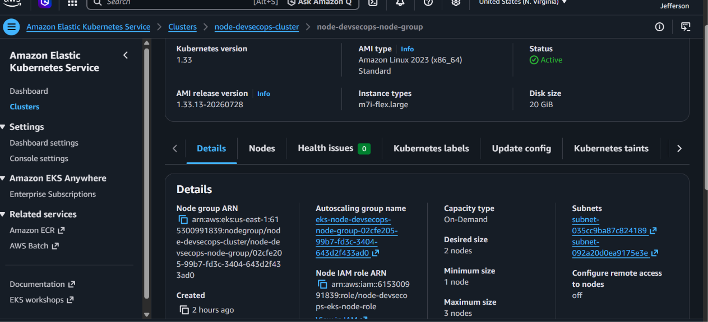

The managed node group successfully launched the worker nodes required to execute Kubernetes workloads.

---

## Verifying Cluster Connectivity

After the Amazon EKS cluster and managed node group were provisioned successfully, `kubectl` was configured to communicate with the Kubernetes API server.

The following command was used to verify that the worker nodes successfully joined the cluster.

```bash
kubectl get nodes
```

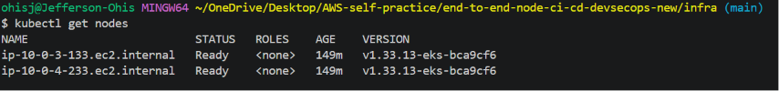

The output confirms that the worker nodes successfully registered with the Amazon EKS control plane and are in the Ready state, indicating that the Kubernetes cluster is operational and ready to host workloads.

---

## Terraform Outputs

After provisioning the AWS infrastructure, Terraform outputs expose selected resource attributes that can be referenced after a successful deployment. These outputs simplify infrastructure verification and provide important information that will be used during later phases of the project, including Kubernetes configuration and the CI/CD pipeline. 

The outputs are defined in infra/outputs.tf.

```hcl
output "vpc_id" {
  description = "ID of the project VPC"
  value       = aws_vpc.node_vpc.id
}

output "ecr_repository_url" {
  description = "URL of the Amazon ECR repository"
  value       = aws_ecr_repository.node_app_repository.repository_url
}

output "eks_cluster_name" {
  description = "Name of the Amazon EKS cluster"
  value       = aws_eks_cluster.node_cluster.name
}

output "eks_cluster_endpoint" {
  description = "Endpoint for the Amazon EKS cluster"
  value       = aws_eks_cluster.node_cluster.endpoint
}

output "eks_cluster_certificate_authority" {
  description = "Certificate authority data for the Amazon EKS cluster"
  value       = aws_eks_cluster.node_cluster.certificate_authority[0].data
}
```

After terraform apply completes successfully, Terraform displays these outputs in the terminal, providing quick access to important infrastructure details.

| Terraform Output | Description | Used For |
|------------------|-------------|----------|
| `vpc_id` | Displays the ID of the provisioned Amazon VPC. | Infrastructure verification and future resource integration. |
| `ecr_repository_url` | Displays the Amazon ECR repository URL. | Allows Jenkins to tag and push Docker images to Amazon ECR. |
| `eks_cluster_name` | Displays the Amazon EKS cluster name. | Used when configuring `kubectl` and interacting with the Kubernetes cluster. |
| `eks_cluster_endpoint` | Displays the Kubernetes API server endpoint. | Enables secure communication with the Amazon EKS control plane. |
| `eks_cluster_certificate_authority` | Displays the certificate authority data for the cluster. | Allows Kubernetes clients to establish trusted TLS connections to the API server. |

### Infrastructure Verification

Terraform displayed the output values after the deployment completed successfully.

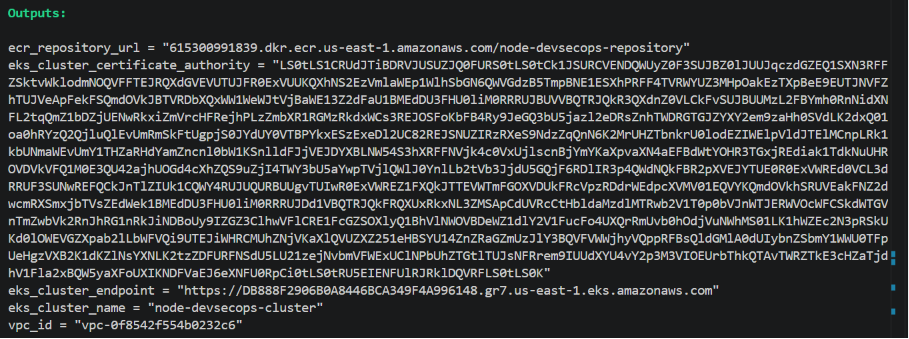

The outputs provide convenient access to resource identifiers, including the VPC ID, Amazon ECR repository URL, Amazon EKS cluster name, API endpoint, and certificate authority data. These values will be used in later phases when configuring `kubectl`, integrating Jenkins, and deploying the application.

### Why Terraform Outputs Are Used

Terraform outputs provide a convenient way to expose important infrastructure information after deployment. Rather than manually locating resource details in the AWS Management Console, outputs make key values immediately available for verification, automation, and integration with deployment tools.

In this project, the outputs simplify Kubernetes configuration, support the Jenkins CI/CD pipeline, and provide quick access to the resources required for deploying and managing the Node.js application on Amazon EKS.

---

## Commands Used

The following Terraform and Kubernetes commands were used throughout this phase.

```bash
terraform init
terraform validate
terraform plan
terraform apply

aws eks update-kubeconfig --region us-east-1 --name node-devsecops-cluster

kubectl get nodes

terraform output
```

These commands initialized the Terraform project, validated the infrastructure configuration, provisioned the AWS resources, configured Kubernetes access, verified the Amazon EKS cluster, and displayed the generated Terraform outputs.

---

## Results

Terraform successfully provisioned the AWS infrastructure required for the DevSecOps platform.

The completed infrastructure includes:

- Amazon VPC
- Public and private subnets
- Internet Gateway
- NAT Gateway
- Route tables and subnet associations
- Security groups
- IAM roles and policy attachments
- Amazon Elastic Container Registry (ECR)
- Amazon Elastic Kubernetes Service (EKS) cluster
- Amazon EKS managed node group
- Terraform outputs

The Amazon EKS worker nodes successfully joined the Kubernetes cluster, confirming that the infrastructure was provisioned correctly and is ready for application deployment.

---

## Key Takeaway

Provisioning the AWS infrastructure with Terraform demonstrates the value of Infrastructure as Code (IaC). The project's networking components, security configurations, IAM roles, Amazon ECR repository, and Amazon EKS cluster were all created from version-controlled Terraform configuration files rather than through manual configuration in the AWS Management Console.

This approach improves consistency, repeatability, maintainability, and simplifies future infrastructure changes while establishing a secure and scalable cloud foundation for the remaining phases of the DevSecOps pipeline, including automated application deployment, security scanning, and continuous monitoring.

---

## Next Step

With the AWS infrastructure successfully provisioned, the next phase is to deploy the containerized Node.js application to the Amazon EKS cluster and integrate the deployment into the automated DevSecOps pipeline.

The next implementation will include:

- Creating Kubernetes deployment manifests
- Creating Kubernetes service manifests
- Deploying the Node.js application to Amazon EKS
- Verifying application availability within the Kubernetes cluster
- Integrating the deployment into the Jenkins CI/CD pipeline
- Automating image deployment from Amazon ECR to Amazon EKS

This phase marks the transition from infrastructure provisioning to automated application deployment, where code changes pushed to GitHub will ultimately trigger the complete CI/CD workflow, including security scanning, container image deployment, and Kubernetes-based application delivery.

---
