# Phase 6 — Jenkins Server Setup

## Overview

## Objectives

## Architecture

## Why Provision Jenkins with Terraform?

## Jenkins EC2 Infrastructure

## Terraform Configuration

## Terraform Initialization

## Terraform Validation

## Terraform Plan

## Terraform Apply

## Verification

## Commands Used

## Results

## Key Takeaway

## Next Step

---

## Overview

This phase begins the implementation of the continuous integration and continuous deployment (CI/CD) environment by provisioning a dedicated Jenkins server on Amazon EC2 using Terraform.

Rather than manually creating infrastructure through the AWS Management Console, the Jenkins server is defined as Infrastructure as Code (IaC), ensuring the environment can be recreated consistently across deployments.

After the server is provisioned, it will be configured with the software required to automate application build, security scanning, container image creation, and deployment to Amazon EKS.


---

## Objectives

The objectives of this phase are to:

- Provision a Jenkins EC2 instance using Terraform
- Configure networking and security access
- Allocate an Elastic IP for consistent access
- Prepare the server for CI/CD tooling installation
- Document the provisioning process

---

## Architecture

The Jenkins server will be provisioned inside the existing AWS infrastructure created during Phase 5.

The server will communicate with:

- GitHub
- Amazon Elastic Container Registry (ECR)
- Amazon Elastic Kubernetes Service (EKS)
- SonarCloud
- Snyk
- Docker Engine
- Trivy

**Note: Later we'll replace this with an architecture diagram.

---

## Why Provision Jenkins with Terraform?

Provisioning Jenkins with Terraform provides several advantages over manual deployment.

- Infrastructure becomes reproducible.
- Configuration remains version controlled.
- Server creation is automated.
- Disaster recovery becomes significantly easier.
- Infrastructure changes can be reviewed before deployment.

---

## Jenkins EC2 Infrastructure

The Jenkins server will be provisioned with the following configuration:

| Resource | Configuration |
|-----------|---------------|
| Service | Amazon EC2 |
| Operating System | Ubuntu Server 26.04 LTS |
| Instance Type | m7i-flex.large |
| Storage | 30 GB gp3 |
| Elastic IP | Yes |
| IAM Role | Jenkins EC2 Role |
| Security Group | Jenkins Security Group |


### IAM Role Attached to EC2

The Jenkins EC2 instance is associated with the IAM Instance Profile created by Terraform.

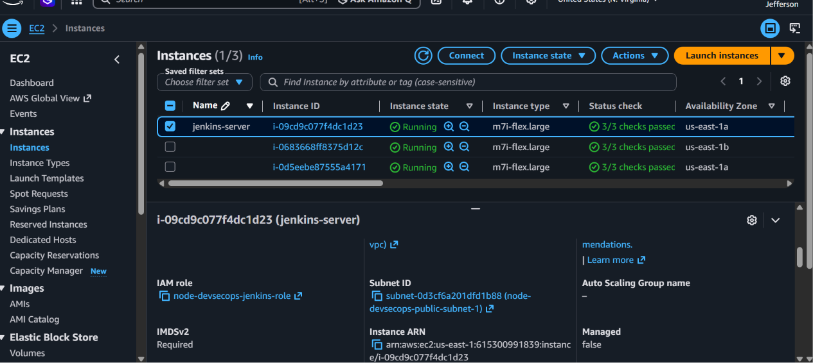


### Jenkins server details

The Jenkins server was successfully provisioned and is running.

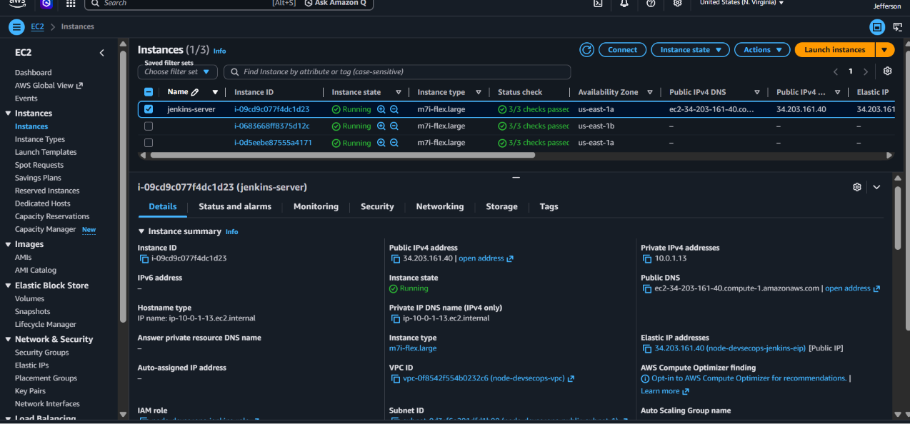

### Root Volume

The Jenkins server uses a 30 GB gp3 root volume.

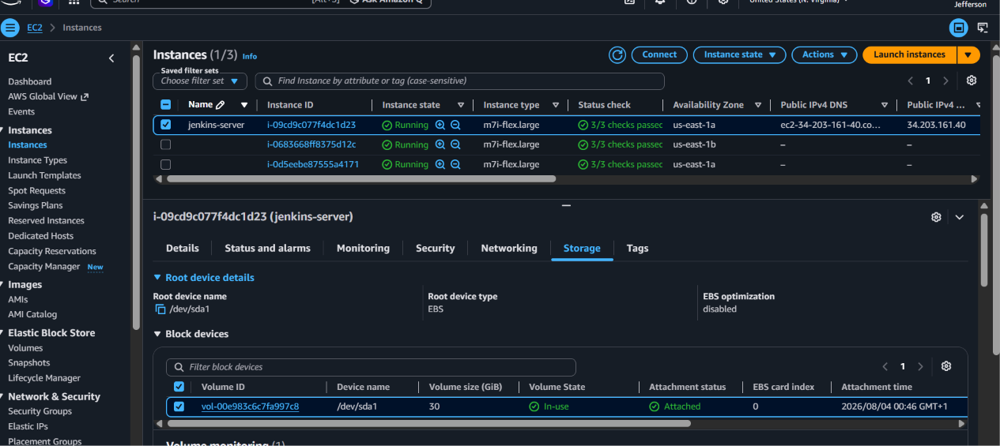

---

## Terraform Configuration

### Jenkins EC2 IAM Role

The first resource provisioned for the Jenkins server is an AWS Identity and Access Management (IAM) role. Rather than storing long-term AWS access keys on the EC2 instance, Jenkins assumes this IAM role to obtain temporary security credentials whenever it interacts with AWS services.

This approach follows AWS security best practices by eliminating hard-coded credentials while allowing Jenkins to securely deploy applications, authenticate with Amazon Elastic Container Registry (ECR), and interact with Amazon Elastic Kubernetes Service (EKS).

The IAM role is created with a trust relationship that allows the Amazon EC2 service to assume the role.

### IAM Trust Relationship

The following screenshot shows the trust policy associated with the Jenkins IAM role. The policy allows the **Amazon EC2** service (`ec2.amazonaws.com`) to assume the IAM role, enabling the EC2 instance to obtain temporary AWS credentials through the attached IAM Instance Profile.

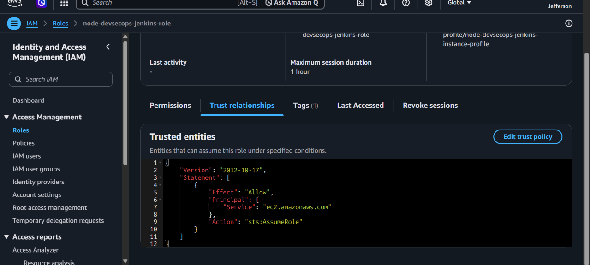


### Jenkins IAM Role

The IAM role created for the Jenkins EC2 instance.

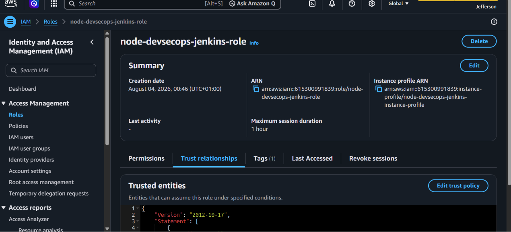


---

### AWS IAM Policies Attached to the Jenkins Role

To enable Jenkins to execute the complete CI/CD pipeline, the EC2 instance IAM role is attached to a set of AWS-managed policies. These policies grant the minimum AWS service permissions required for building, scanning, storing, and deploying the application while allowing Jenkins to interact securely with Amazon EKS, Amazon ECR, and AWS Systems Manager.

| AWS Managed Policy | Purpose |
|--------------------|---------|
| `AmazonEKSClusterPolicy` | Grants Jenkins permission to manage and interact with the Amazon EKS cluster during application deployment. |
| `AmazonEKSWorkerNodePolicy` | Allows communication with Amazon EKS worker nodes required for cluster operations. |
| `AmazonEC2ContainerRegistryFullAccess` | Enables Jenkins to authenticate with Amazon Elastic Container Registry (ECR) and push or pull Docker images as part of the CI/CD pipeline. |
| `AmazonSSMManagedInstanceCore` | Enables AWS Systems Manager (SSM) capabilities, allowing secure instance management without relying solely on SSH access. |

These AWS-managed policies provide the permissions necessary for Jenkins to automate container image management, Kubernetes deployments, and secure administration of the build server. Attaching the required IAM policies to the EC2 instance role also eliminates the need to store long-term AWS access keys within the Jenkins environment, following AWS security best practices by using temporary credentials provided through the instance's IAM role.

### Attached IAM Policies

The following screenshot shows the AWS-managed policies attached to the Jenkins IAM role.

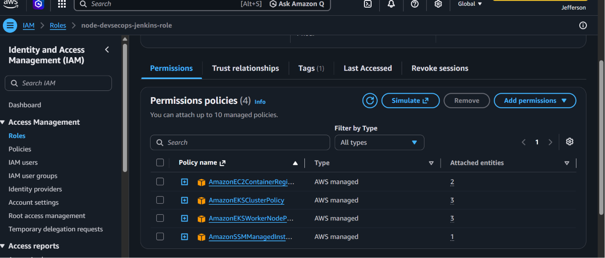


---

### Why Use an IAM Role?

Instead of configuring long-term AWS access keys on the Jenkins server, this project uses an IAM role attached directly to the Amazon EC2 instance. When an application or service running on the instance requests AWS credentials, the IAM role provides temporary security credentials through the EC2 Instance Metadata Service (IMDS). This approach improves security, simplifies credential management, and follows AWS Identity and Access Management (IAM) best practices.

The IAM role provides the following benefits:

| Benefit | Description |
|----------|-------------|
| **Enhanced Security** | Eliminates the need to store long-term AWS access keys on the Jenkins server, reducing the risk of credential exposure. |
| **Temporary Credentials** | AWS automatically issues and rotates temporary security credentials, minimizing the impact of compromised credentials. |
| **Simplified Authentication** | Jenkins can securely authenticate with AWS services without manually configuring or managing access keys. |
| **AWS Best Practice** | Aligns with AWS recommendations to use IAM roles for workloads running on Amazon EC2 instead of IAM users with static credentials. |
| **Secure CI/CD Operations** | Enables Jenkins to securely interact with Amazon EKS, Amazon ECR, and other AWS services required during pipeline execution. |

Using an IAM role allows Jenkins to securely perform infrastructure provisioning, container image management, and Kubernetes deployments while reducing administrative overhead and strengthening the overall security posture of the CI/CD pipeline.


---

## Jenkins IAM Instance Profile

An IAM role defines the AWS permissions required by the Jenkins server, but an Amazon EC2 instance cannot assume an IAM role directly. Instead, AWS uses an **IAM Instance Profile** as the mechanism for associating an IAM role with an EC2 instance.

When the Jenkins EC2 instance is launched, the attached IAM Instance Profile enables the instance to obtain temporary AWS security credentials from the **EC2 Instance Metadata Service (IMDS)**. AWS automatically manages and rotates these credentials, allowing Jenkins to securely authenticate with AWS services without storing long-term access keys.

This approach follows AWS security best practices by eliminating static credentials, reducing administrative overhead, and providing secure access to AWS resources required by the CI/CD pipeline.

---

### AWS Services Accessed Through the IAM Instance Profile

Using the IAM Instance Profile allows Jenkins to securely interact with the following AWS services:

- **Amazon Elastic Container Registry (ECR)** – Store and retrieve Docker container images.
- **Amazon Elastic Kubernetes Service (EKS)** – Deploy and manage Kubernetes workloads.
- **AWS Systems Manager (SSM)** – Securely manage the EC2 instance without relying solely on SSH access.

---

### Relationship Between the Components

The authentication flow can be visualized as follows:

```text
Amazon EC2 Instance
        │
        ▼
IAM Instance Profile
        │
        ▼
IAM Role
        │
        ▼
AWS Managed Policies
        │
        ▼
AWS Services (ECR, EKS, SSM)
```

---

### How It Works

1. The Jenkins server runs on an Amazon EC2 instance.
2. An IAM Instance Profile is attached to the EC2 instance during provisioning.
3. The Instance Profile references the Jenkins IAM role.
4. The IAM role contains the AWS-managed policies that define the permissions Jenkins is allowed to use.
5. When Jenkins interacts with AWS services, the EC2 Instance Metadata Service (IMDS) provides temporary security credentials based on the attached IAM role.
6. Jenkins uses these temporary credentials to securely authenticate with AWS services such as Amazon ECR, Amazon EKS, and AWS Systems Manager.

This architecture follows the AWS recommended security model for Amazon EC2 workloads by using temporary, automatically rotated credentials instead of long-term access keys. As a result, the Jenkins server can securely perform container image management, Kubernetes deployments, and infrastructure automation while reducing the risk of credential exposure.


---

## Jenkins EC2 Instance

The Jenkins automation server is provisioned as an **Amazon EC2 instance** using Terraform. Hosting Jenkins on Amazon EC2 provides a dedicated and scalable build server capable of executing the complete CI/CD pipeline while integrating securely with the AWS infrastructure provisioned during this phase.

The EC2 instance is deployed within the existing Amazon Virtual Private Cloud (VPC) and is associated with both the Jenkins Security Group and the Jenkins IAM Instance Profile. This configuration provides secure network connectivity, temporary AWS credentials through IAM, and authenticated access to AWS services required throughout the CI/CD pipeline.

### Infrastructure Configuration

The Jenkins EC2 instance is configured with the following AWS resources:

| Resource | Purpose |
|----------|---------|
| **Amazon VPC** | Provides an isolated networking environment for the Jenkins server. |
| **Security Group** | Controls inbound and outbound network traffic to the Jenkins EC2 instance. |
| **IAM Instance Profile** | Supplies temporary AWS credentials without requiring static access keys. |
| **Amazon ECR** | Allows Jenkins to authenticate and push Docker images to Amazon Elastic Container Registry. |
| **Amazon EKS** | Enables automated deployment of Kubernetes workloads. |
| **AWS Systems Manager (SSM)** | Supports secure instance management without relying solely on SSH access. |

### Infrastructure Relationship

The relationship between the Jenkins server and the supporting AWS resources is illustrated below:

```text
Amazon EC2 (Jenkins Server)
            │
            ├──────────► Security Group
            │
            ├──────────► IAM Instance Profile
            │                 │
            │                 ▼
            │            IAM Role
            │                 │
            │                 ▼
            │         AWS Managed Policies
            │
            ├──────────► Amazon ECR
            │
            ├──────────► Amazon EKS
            │
            └──────────► AWS Systems Manager (SSM)
```
---

### Benefits

Provisioning Jenkins as infrastructure using Terraform provides several operational and security advantages:

- Infrastructure is fully automated and reproducible.
- Jenkins integrates securely with AWS services using IAM roles instead of long-term access keys.
- Security Groups enforce controlled network access.
- The build server can authenticate securely with Amazon ECR, Amazon EKS, and AWS Systems Manager using temporary AWS credentials.
- The entire Jenkins infrastructure can be version-controlled, recreated, and maintained using Infrastructure as Code (IaC) principles.

This architecture establishes Jenkins as the central automation server responsible for orchestrating the complete DevSecOps pipeline, including source code integration, security scanning, container image management, Kubernetes deployments, and infrastructure automation.

---

## EC2 Instance Configuration

The following table summarizes the configuration of the Jenkins Amazon EC2 instance provisioned using Terraform. These settings were selected to provide a secure and reliable build server capable of supporting the complete CI/CD and DevSecOps pipeline.

| Resource | Configuration |
|----------|---------------|
| **Service** | Amazon EC2 |
| **Operating System** | Ubuntu Server 26.04 LTS |
| **Architecture** | x86_64 |
| **Instance Type** | `m7i-flex.large` |
| **Root Volume** | 30 GB `gp3` |
| **Public IP** | Enabled |
| **Subnet** | Public Subnet 1 |
| **Security Group** | Jenkins Security Group |
| **IAM Instance Profile** | Jenkins Instance Profile |
| **SSH Key Pair** | `jefferson-key-pair-1` |

---

## Networking Configuration

The Jenkins Amazon EC2 instance is deployed within the networking infrastructure provisioned during the Terraform deployment. Hosting the server inside the existing Amazon VPC enables secure communication with AWS services while allowing controlled administrative access from the internet.

The networking configuration is designed to balance accessibility and security by providing a public endpoint for Jenkins administration while restricting traffic through Security Group rules and isolating resources within the VPC.

### Networking Components

| Component | Purpose |
|-----------|---------|
| **Amazon VPC** | Provides an isolated virtual network for the Jenkins server and supporting AWS resources. |
| **Public Subnet 1** | Hosts the Jenkins EC2 instance and enables internet connectivity through the Internet Gateway. |
| **Internet Gateway** | Allows inbound and outbound internet communication for the Jenkins server. |
| **Route Table** | Routes internet-bound traffic from the public subnet through the Internet Gateway. |
| **Jenkins Security Group** | Controls inbound and outbound network traffic, allowing secure administrative access while protecting the server. |
| **Elastic IP** | Provides a permanent public IPv4 address for consistent browser, SSH, and webhook access. |

### Networking Architecture

The relationship between the networking components is illustrated below:

```text
Internet
    │
    ▼
Internet Gateway
    │
    ▼
Amazon VPC
    │
    ▼
Public Subnet 1
    │
    ▼
Jenkins EC2 Instance
    │
    ├────────► Jenkins Security Group
    │
    └────────► Elastic IP
```

### Networking Configuration

The following screenshot shows the networking configuration associated with the Jenkins EC2 instance.

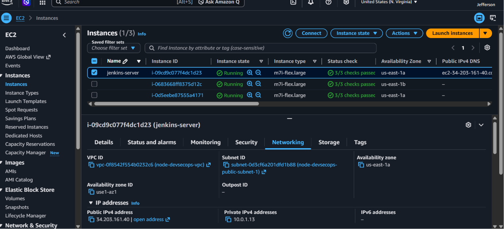

### Networking Highlights

- **Amazon VPC** provides an isolated and secure networking environment for the Jenkins infrastructure.
- **Public Subnet 1** enables controlled internet connectivity required for Jenkins administration and external integrations.
- The **Internet Gateway** allows the Jenkins server to communicate with GitHub, AWS services, and software repositories.
- The **Route Table** directs internet-bound traffic from the public subnet through the Internet Gateway.
- The **Jenkins Security Group** restricts inbound access to only the required ports while allowing outbound communication with AWS services.
- The **Elastic IP** provides a stable public endpoint for browser access, SSH administration, GitHub webhooks, and CI/CD integrations.

This networking architecture follows AWS networking best practices by combining network isolation, controlled internet access, and Infrastructure as Code (IaC). Together, these components provide a secure and reliable foundation for the Jenkins automation server and the project's DevSecOps pipeline.

---

### Configuration Highlights

- **Ubuntu Server 26.04 LTS** provides a stable, long-term support operating system suitable for hosting Jenkins and related DevOps tooling.
- **m7i-flex.large** offers sufficient CPU and memory resources to run Jenkins builds, Docker workloads, security scanning tools, and Kubernetes command-line utilities efficiently.
- A **30 GB gp3** root volume provides adequate storage for the operating system, Jenkins workspace, Docker images, and build artifacts while delivering consistent SSD performance.
- Assigning a **Public IP** allows administrators to securely access the Jenkins server over the internet, subject to Security Group rules.
- Deploying the instance into **Public Subnet 1** enables controlled external connectivity while maintaining integration with the surrounding AWS network infrastructure.
- The **Jenkins Security Group** restricts inbound and outbound traffic according to the requirements of the CI/CD environment.
- The **Jenkins Instance Profile** supplies temporary AWS credentials through IAM, allowing Jenkins to securely interact with Amazon ECR, Amazon EKS, AWS Systems Manager (SSM), and other AWS services without using long-term access keys.
- The **`jefferson-key-pair-1`** SSH key pair provides secure administrative access to the EC2 instance when required.

This configuration establishes a secure, scalable, and reproducible Jenkins build server that integrates seamlessly with the AWS infrastructure provisioned using Terraform and serves as the central automation engine for the project's DevSecOps pipeline.

---

## Why Use a Dedicated Jenkins Server?

A dedicated Jenkins server provides an isolated environment for build automation, security validation, and application deployment. By separating CI/CD activities from the application runtime environment, the build infrastructure remains independent, easier to maintain, and more secure.

In this project, Jenkins serves as the central automation engine responsible for orchestrating every stage of the DevSecOps pipeline.

---

### Jenkins Responsibilities

| Responsibility | Description |
|---------------|-------------|
| **Source Code Management** | Clones the latest application source code from the GitHub repository whenever changes are pushed. |
| **Automated Testing** | Executes unit tests to verify application functionality before proceeding with the pipeline. |
| **Containerization** | Builds Docker container images for the Node.js monitoring application. |
| **Security Scanning** | Integrates SonarCloud (SAST), Snyk (SCA), Trivy (container security), and OWASP ZAP (DAST) to identify vulnerabilities throughout the software delivery lifecycle. |
| **Container Registry Integration** | Authenticates with Amazon Elastic Container Registry (ECR) to push and manage Docker images. |
| **Kubernetes Deployment** | Deploys the application to Amazon Elastic Kubernetes Service (EKS) using Kubernetes manifests. |
| **Pipeline Orchestration** | Coordinates the complete CI/CD workflow from source code commit to production deployment and verification. |

---

### Benefits of a Dedicated Jenkins Server

Using a dedicated Jenkins EC2 instance provides several operational and security advantages:

- **Isolation** – CI/CD workloads are separated from application runtime environments, reducing operational risk.
- **Scalability** – Build resources can be upgraded independently as pipeline complexity and workload increase.
- **Security** – Jenkins authenticates with AWS using an IAM Instance Profile and temporary credentials instead of long-term access keys.
- **Reliability** – Continuous Integration and Continuous Deployment processes execute in a consistent and controlled environment.
- **Maintainability** – Build tools, plugins, and pipeline configurations can be managed without affecting production applications.
- **Infrastructure as Code (IaC)** – The Jenkins server is provisioned and managed with Terraform, ensuring repeatable and version-controlled infrastructure deployments.

By dedicating an Amazon EC2 instance to Jenkins, the CI/CD platform remains secure, scalable, and fully integrated with AWS services such as Amazon Elastic Container Registry (ECR), Amazon Elastic Kubernetes Service (EKS), and AWS Systems Manager (SSM). This architecture enables automated software delivery while adhering to DevSecOps and Infrastructure as Code (IaC) best practices.

---

## Jenkins Elastic IP

To provide a consistent and reliable public endpoint for the Jenkins automation server, an **Amazon Elastic IP (EIP)** is provisioned and associated with the Jenkins Amazon EC2 instance.

Unlike automatically assigned public IPv4 addresses, which can change whenever an EC2 instance is stopped and started, an Elastic IP remains allocated to the AWS account until it is explicitly released. By associating the Elastic IP with the Jenkins server, the instance retains the same public IP address throughout its lifecycle, ensuring uninterrupted access to the CI/CD environment.

This approach improves operational stability by providing a permanent endpoint for administrative access, external integrations, and automated workflows.


---

### Why Use an Elastic IP?

Using an Amazon Elastic IP (EIP) provides a stable and predictable public endpoint for the Jenkins server. Unlike automatically assigned public IPv4 addresses, an Elastic IP remains allocated to your AWS account until it is explicitly released, ensuring uninterrupted access to the CI/CD environment.

| Benefit | Description |
|----------|-------------|
| **Static Public IP** | Provides a permanent public IPv4 address for the Jenkins server, ensuring a consistent endpoint throughout the infrastructure lifecycle. |
| **Operational Stability** | Prevents public IP address changes when the EC2 instance is stopped and started, reducing operational disruptions. |
| **Reliable Administrative Access** | Enables administrators to consistently access the Jenkins web interface and SSH endpoint without updating connection details. |
| **GitHub Webhook Integration** | Provides a stable endpoint for GitHub webhooks to automatically trigger Jenkins CI/CD pipelines. |
| **Consistent Browser Access** | Ensures browser bookmarks, documentation, automation scripts, and API integrations continue to use the same public endpoint. |
| **Simplified DNS Management** | Allows DNS records to remain unchanged because the public IP address remains constant. |
| **Infrastructure as Code (IaC)** | The Elastic IP allocation and its association with the Jenkins EC2 instance are fully automated and managed through Terraform, ensuring repeatable and version-controlled infrastructure deployments. |

Using an Elastic IP ensures that the Jenkins automation server remains consistently accessible throughout its lifecycle while simplifying administration, external integrations, and infrastructure management. Combined with Terraform, this approach delivers a reproducible, reliable, and production-ready CI/CD environment that aligns with AWS and Infrastructure as Code (IaC) best practices.

---

### Infrastructure Relationship

The relationship between the Elastic IP and the Jenkins server is illustrated below:

```text
Amazon Elastic IP
        │
        ▼
Amazon EC2 (Jenkins Server)
        │
        ▼
Jenkins Web Interface
        │
        ▼
CI/CD Pipeline
```

---

### How It Works

1. Terraform provisions an Amazon Elastic IP.
2. The Elastic IP is associated with the Jenkins EC2 instance.
3. The Jenkins server becomes accessible through the fixed public IPv4 address.
4. External services, administrators, and GitHub webhooks communicate with Jenkins using the same endpoint regardless of instance restarts.
5. If the EC2 instance is stopped and started, the Elastic IP remains associated, preserving connectivity to the Jenkins server.

By assigning an Elastic IP to the Jenkins EC2 instance, the CI/CD environment gains a stable and predictable public endpoint that supports secure administration, reliable webhook integration, and uninterrupted access to the Jenkins automation server throughout the infrastructure lifecycle.

---

### Elastic IP Association

The following screenshot shows the Elastic IP allocated to the Jenkins server and its association with the EC2 instance. This verifies that the Jenkins server has a permanent public IPv4 address that remains unchanged across instance stop and start operations.

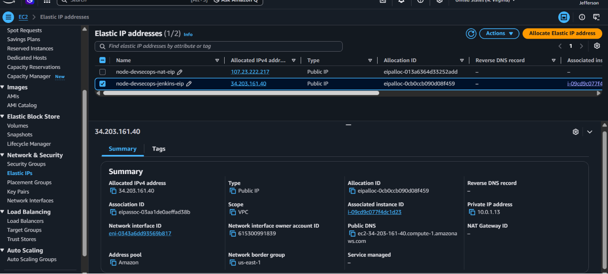

---

## Verification

After applying the Terraform configuration, verify that the Jenkins Amazon EC2 instance has been provisioned successfully and is configured according to the infrastructure specifications.

### Navigate to

```text
AWS Management Console
    └── EC2
        └── Instances
```

Locate the **`jenkins-server`** EC2 instance and review its configuration.

---

### SSH Verification

After the EC2 instance was provisioned, SSH connectivity was verified using the AWS key pair specified in the Terraform configuration.

```bash
ssh -i "jefferson-key-pair-1.pem" ubuntu@34.203.161.40
```
SSH connectivity was successfully established using the Elastic IP assigned to the Jenkins server.

Successful authentication displayed the Ubuntu login banner and shell prompt, confirming that the Jenkins server was accessible and ready for software installation.

---

### Verification Checklist

Confirm the following:

- ✅ The EC2 instance is named **`jenkins-server`**.
- ✅ The instance is in the **Running** state.
- ✅ The instance type is **`m7i-flex.large`**.
- ✅ The instance is deployed in **Public Subnet 1**.
- ✅ The **Jenkins Security Group** is attached.
- ✅ The **Jenkins IAM Instance Profile** is attached.
- ✅ An **Elastic IP** is associated with the EC2 instance.
- ✅ The assigned **public IPv4 address** is the Elastic IP.
- ✅ The Elastic IP remains unchanged after stopping and starting the instance.
- ✅ The **Ubuntu Server 26.04 LTS** Amazon Machine Image (AMI) is in use.
- ✅ The root volume size is **30 GB (`gp3`)**.
- ✅ The instance was launched using the **`jefferson-key-pair-1`** SSH key pair.
- ✅ SSH connection established successfully.
- ✅ Ubuntu 26.04 LTS login banner displayed.
- ✅ Jenkins EC2 instance accepted the configured key pair.
- ✅ Administrative access to the server was verified.


### Public IPv4 Verification

The screenshot below confirms that the Jenkins EC2 instance is using the allocated Elastic IP as its public IPv4 address.
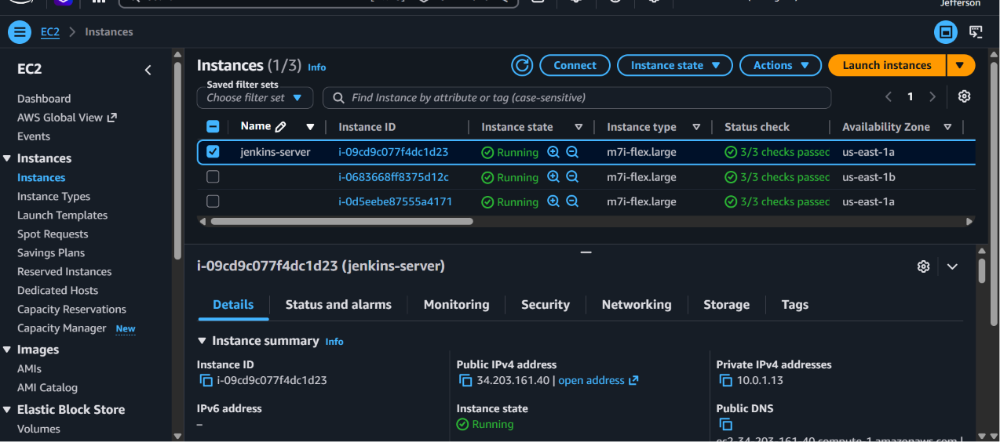

---

### Expected Outcome

Successful verification confirms that the Jenkins EC2 instance has been provisioned correctly with its IAM Instance Profile, Security Group, and Elastic IP. The server now has a permanent public endpoint, secure AWS authentication through its IAM role, and controlled network access, making it ready for the installation of Jenkins and the remaining DevSecOps tooling.

With the infrastructure in place, the Jenkins server is prepared to host the CI/CD pipeline, authenticate securely with Amazon ECR and Amazon EKS, and automate application build, security scanning, container image management, and Kubernetes deployments.

---

## Terraform Outputs

Terraform outputs expose important information about the Jenkins infrastructure after provisioning. These values simplify post-deployment verification and are referenced during subsequent phases of the project, including Jenkins installation and CI/CD pipeline configuration.

| Terraform Output | Description | Used For |
|------------------|-------------|----------|
| `jenkins_instance_id` | Displays the unique ID of the Jenkins EC2 instance. | Infrastructure verification and troubleshooting. |
| `jenkins_public_ip` | Displays the Elastic IP assigned to the Jenkins server. | Accessing the Jenkins web interface and SSH. |
| `jenkins_public_dns` | Displays the public DNS name of the Jenkins EC2 instance. | Browser access and remote administration. |
| `jenkins_instance_profile` | Displays the IAM Instance Profile attached to the EC2 instance. | Verifying secure AWS authentication. |

### Terraform Outputs

Terraform outputs expose key information required for administration and future deployment stages.

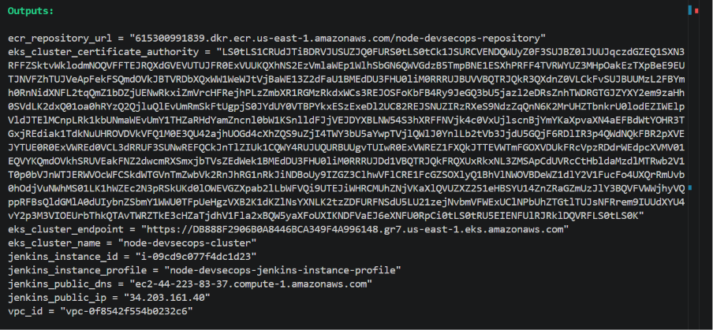

---
## Terraform Initialization

Before provisioning the Jenkins infrastructure, Terraform was initialized to download the AWS provider plugins, configure the working directory, and prepare the Terraform backend.

```bash
terraform init
```
Initialization completed successfully, confirming that Terraform was ready to validate, plan, and provision the Jenkins infrastructure.

---
## Terraform Validation

The Terraform configuration was validated before deployment to ensure the syntax was correct and that all referenced resources were properly defined.

```bash
terraform validation
```
Terraform returned a successful validation message, confirming that the configuration contained no syntax or structural errors.

### Terraform Validation Result

The screenshot below shows Terraform successfully validating the Jenkins infrastructure configuration.

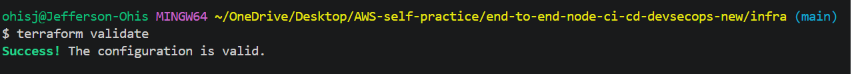

---

## Terraform Plan

A Terraform execution plan was generated to preview the infrastructure changes before applying them.

```bash
terraform plan
```

The execution plan displayed all AWS resources that would be created, allowing the infrastructure changes to be reviewed before deployment.

### Terraform Plan Preview

The execution plan confirms the AWS resources Terraform will create before deployment.

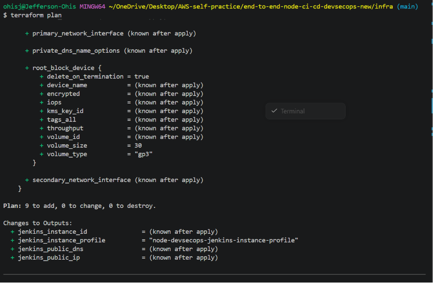

---

## Terraform Apply

After reviewing the execution plan, the infrastructure was provisioned using Terraform.

```bash
terraform apply
```

Terraform successfully created the Jenkins infrastructure, including:

- Jenkins IAM Role
- IAM Instance Profile
- EC2 Instance
- Elastic IP
- IAM Policy Attachments

### Infrastructure Provisioning

Terraform successfully provisioned the Jenkins infrastructure.

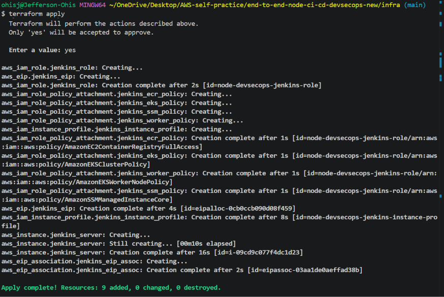

---

## Commands Used

The following Terraform commands were executed during this phase.

```bash
terraform init
terraform validate
terraform plan
terraform apply
```

Terraform outputs were reviewed using:

```bash
terraform output

terraform output jenkins_public_ip

terraform output jenkins_public_dns

terraform output jenkins_instance_id
```

SSH connectivity was verified using:

```bash
ssh -i "jefferson-key-pair-1.pem" ubuntu@34.203.161.40
```

### SSH Verification

The Jenkins server was successfully accessed using the Elastic IP and SSH key pair defined in Terraform.

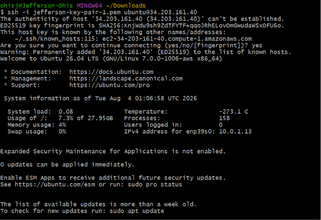
---

## Results

The Jenkins infrastructure was successfully provisioned using Terraform.

The deployment created:

- Jenkins EC2 instance
- IAM Role
- IAM Instance Profile
- Elastic IP
- Security Group association
- Root volume
- Temporary AWS credentials through IAM

Infrastructure verification confirmed that:

- Terraform completed successfully.
- The Jenkins EC2 instance entered the Running state.
- The IAM Role and Instance Profile were correctly attached.
- The Elastic IP was successfully associated with the instance.
- SSH connectivity was verified using the Elastic IP.
- Terraform outputs correctly exposed the instance ID, public IP address, and public DNS.

---

## Key Takeaway

Provisioning the Jenkins server with Terraform demonstrated how Infrastructure as Code (IaC) enables secure, consistent, and repeatable infrastructure deployments. By automating the creation of the EC2 instance, IAM role, instance profile, networking configuration, and Elastic IP, the CI/CD environment can be recreated reliably while following AWS security best practices through the use of temporary IAM credentials instead of long-term access keys.

---

## Next Step

With the Jenkins infrastructure successfully provisioned and verified, the next phase focuses on configuring the Jenkins automation server.

This includes:

- Installing Jenkins
- Installing Java
- Installing Docker
- Installing AWS CLI
- Installing kubectl
- Installing Trivy
- Installing required Jenkins plugins
- Preparing the server to execute the complete DevSecOps CI/CD pipeline
