# Phase 7 — Jenkins Installation & Configuration

## Overview

## Objectives

## Software Installed During This Phase

## Architecture

## Why Jenkins?

## Jenkins in the DevSecOps Pipeline

## Connect to the EC2 Server

## Update Ubuntu Packages

## Install Java

## Add the Jenkins Repository

## Install Jenkins

## Enable and Start Jenkins

## Install Docker

## Configure Docker Permissions

## Install AWS CLI

## Install kubectl

## Install Helm

## Install Trivy

## Verify Port 8080

## Access Jenkins from the Browser

## Unlock Jenkins

## Create the First Administrator

## Configure the Jenkins Instance

## Jenkins Dashboard

## Verification

## Commands Used

## Results

## Key Takeaway

## Next Step

---

# Overview

This phase focuses on installing and configuring **Jenkins** as the central automation server for the project's end-to-end **DevSecOps** platform. Building on the infrastructure provisioned in the previous phase, the Jenkins Amazon EC2 instance is transformed into a fully functional build server capable of orchestrating Continuous Integration and Continuous Deployment (CI/CD) workflows across the AWS environment.

To prepare the server for pipeline automation, several essential tools are installed and configured, including **Java**, **Jenkins**, **Docker**, **AWS CLI**, **kubectl**, **Helm**, and **Trivy**. Together, these components enable Jenkins to build applications, create Docker images, authenticate with AWS services, interact with Amazon Elastic Kubernetes Service (EKS), deploy workloads, and perform container security scanning.

During this phase, the Jenkins web interface is initialized, the first administrative account is created, and the server is configured for secure browser-based management. Each installation step is verified to ensure the automation environment is correctly configured and ready for production-oriented CI/CD operations.

Upon completion of this phase, the Jenkins server is fully operational and prepared to support the next stage of the project, where automated pipelines will integrate source code management, software quality analysis, security scanning, container image management, and Kubernetes deployments as part of a complete DevSecOps workflow.


---

## Objectives

The primary objectives of this phase are to prepare the Jenkins automation server for CI/CD and DevSecOps operations by installing, configuring, and validating the software components required for pipeline execution.

Upon completion of this phase, the following objectives will have been achieved:

- Securely connect to the Jenkins Amazon EC2 instance.
- Update the Ubuntu operating system with the latest package and security updates.
- Install the Java Runtime Environment (JRE) required by Jenkins.
- Configure the official Jenkins APT repository and install the latest stable Jenkins release.
- Enable, start, and verify the Jenkins service.
- Install and configure Docker Engine to support container image builds.
- Configure Docker permissions to allow Jenkins to execute Docker commands securely.
- Install and verify the AWS Command Line Interface (AWS CLI) for authenticated interaction with AWS services.
- Install and verify `kubectl` for managing Kubernetes resources on Amazon Elastic Kubernetes Service (EKS).
- Install and verify Helm for Kubernetes package management.
- Install and verify Trivy for container vulnerability scanning.
- Confirm that Jenkins is listening on its default HTTP port (**8080**) and is accessible over the network.
- Access the Jenkins web interface through a web browser.
- Complete the initial Jenkins setup and create the first administrator account.
- Verify that all required software components have been installed successfully and are ready for CI/CD pipeline execution.

By the end of this phase, the Amazon EC2 instance is transformed into a fully configured Jenkins automation server capable of building applications, creating Docker images, interacting with AWS services, deploying workloads to Amazon EKS, and supporting the security and automation requirements of the project's end-to-end DevSecOps pipeline.

---

## Software Installed During This Phase

This phase prepared the Jenkins server with the core software required to support the project's end-to-end DevSecOps pipeline. Each component plays a specific role in automating application delivery, security validation, containerization, and Kubernetes deployments.

| Software | Category | Purpose | Role in the Project |
|----------|----------|---------|---------------------|
| **OpenJDK 21** | Runtime Environment | Provides the Java Runtime Environment required to run Jenkins. | Serves as the runtime platform for the Jenkins automation server. |
| **Jenkins** | CI/CD Automation | Automates build, test, security scanning, and deployment workflows. | Acts as the central orchestration platform for the end-to-end DevSecOps pipeline. |
| **Docker Engine** | Containerization | Builds, runs, and manages Docker container images. | Enables Jenkins to package the Node.js application into portable container images before deployment. |
| **AWS CLI** | Cloud Management | Provides command-line access to AWS services. | Allows Jenkins to authenticate with AWS and interact with services such as Amazon ECR and Amazon EKS using the EC2 IAM Instance Profile. |
| **kubectl** | Kubernetes CLI | Manages Kubernetes clusters and resources. | Enables Jenkins to deploy and manage application workloads on Amazon Elastic Kubernetes Service (EKS). |
| **Helm** | Kubernetes Package Manager | Simplifies the deployment and management of Kubernetes applications using Helm Charts. | Automates application installation, configuration, and upgrades within the EKS cluster. |
| **Trivy** | Security Scanning | Scans container images and filesystems for vulnerabilities and misconfigurations. | Integrates container security scanning into the CI/CD pipeline before deployment. |

---

## Architecture

This phase completes the software configuration of the Jenkins automation server that was provisioned during **Phase 6**. The Amazon EC2 instance is transformed into a fully configured build server capable of interacting securely with AWS services and the tools required to support the project's CI/CD and DevSecOps workflows.

The Jenkins server is configured with the following components:

- **GitHub** – Source code management and pipeline trigger.
- **Docker Engine** – Builds and manages container images.
- **AWS CLI** – Provides authenticated access to AWS services.
- **Amazon Elastic Container Registry (ECR)** – Stores Docker container images.
- **Amazon Elastic Kubernetes Service (EKS)** – Hosts the Kubernetes workloads deployed by Jenkins.
- **kubectl** – Enables Jenkins to manage Kubernetes resources.
- **Helm** – Simplifies Kubernetes application deployment and release management.
- **Trivy** – Performs vulnerability scanning of container images before deployment.

The architecture for this phase is illustrated below.

```text
                    GitHub Repository
                           │
                           ▼
                Amazon EC2 (Jenkins Server)
                           │
        ┌──────────────────┼──────────────────┐
        │                  │                  │
        ▼                  ▼                  ▼
    Docker Engine       AWS CLI           Trivy
        │                  │
        │                  ▼
        │          Amazon ECR
        │
        ▼
     kubectl
        │
        ▼
      Helm
        │
        ▼
   Amazon EKS Cluster
```

The Jenkins server serves as the central automation platform, integrating source code management, containerization, AWS services, Kubernetes tooling, and security scanning into a single build environment. This configuration establishes the technical foundation required for the next phase, where an end-to-end CI/CD and DevSecOps pipeline will be implemented.

---

## Why Jenkins?

**Jenkins** is an open-source automation server that enables teams to implement **Continuous Integration (CI)**, **Continuous Delivery (CD)**, and **Continuous Deployment (CD)** by automating software build, test, security, and deployment workflows. Since its initial release in 2011, Jenkins has become one of the most widely adopted CI/CD platforms due to its flexibility, extensive plugin ecosystem, and strong community support.

In modern DevOps and DevSecOps environments, Jenkins acts as the orchestration layer that coordinates the software delivery lifecycle. Rather than executing repetitive tasks manually, Jenkins automates activities such as source code retrieval, dependency installation, application testing, container image creation, security scanning, artifact publishing, and application deployment.

### Why Jenkins Is Widely Used

Jenkins remains one of the industry's most popular automation platforms because it offers several advantages:

- **Open Source** – Free to use with an active global community and long-term community support.
- **Extensive Plugin Ecosystem** – Integrates with thousands of development, cloud, security, and monitoring tools.
- **Platform Independent** – Runs on Linux, Windows, macOS, and cloud-based virtual machines.
- **Highly Extensible** – Supports custom pipelines, shared libraries, and plugin development.
- **Cloud Native Integration** – Works seamlessly with Docker, Kubernetes, AWS, Azure, and Google Cloud.
- **Infrastructure as Code Support** – Enables pipeline automation through declarative `Jenkinsfile` definitions stored alongside application source code.
- **Enterprise Scalability** – Supports distributed build agents, parallel execution, and large-scale enterprise automation.

---

### Why Jenkins Was Selected for This Project

Although several modern CI/CD platforms are available, Jenkins was selected because it provides the flexibility and level of control required to build a complete end-to-end **AWS-based DevSecOps pipeline**.

The project integrates multiple technologies—including Docker, Amazon Elastic Container Registry (ECR), Amazon Elastic Kubernetes Service (EKS), SonarCloud, Snyk, Trivy, OWASP ZAP, Prometheus, and Grafana. Jenkins offers mature integrations with all of these tools while allowing the entire automation workflow to be defined as code using a declarative pipeline.

Unlike managed CI/CD platforms, Jenkins is self-hosted on Amazon EC2, providing full administrative control over the build environment, installed software, plugins, security configuration, and execution process. This approach also provides valuable hands-on experience with provisioning, configuring, securing, and operating a production-style automation server.

---

### Jenkins Compared with Other CI/CD Platforms

| Platform | Strengths | Why Jenkins Was Selected |
|----------|-----------|--------------------------|
| **Jenkins** | Open source, highly extensible, self-hosted, extensive plugin ecosystem, supports virtually every DevOps tool. | **Selected** because it provides complete control over the CI/CD environment and integrates seamlessly with the AWS and DevSecOps technologies used throughout this project. |
| **GitHub Actions** | Native GitHub integration, simple workflow configuration, managed runners, minimal infrastructure management. | Excellent for GitHub-centric projects, but this project focuses on building and managing a dedicated Jenkins automation server and demonstrating enterprise CI/CD administration. |
| **GitLab CI/CD** | Integrated DevOps platform with built-in CI/CD, package registry, and security features. | Well suited for GitLab-hosted projects, whereas this project is built around GitHub and a self-managed Jenkins environment. |
| **Azure DevOps** | Comprehensive enterprise DevOps platform with integrated Boards, Repos, Pipelines, and Test Plans. | Optimized for Microsoft Azure ecosystems, while this project is designed around AWS infrastructure and cloud-native services. |

---

### Jenkins in Enterprise CI/CD Workflows

Within an enterprise software delivery pipeline, Jenkins serves as the central automation engine that coordinates every stage of the application lifecycle.

A typical workflow includes:

```text
Developer
      │
      ▼
GitHub Repository
      │
      ▼
Jenkins Pipeline
      │
      ├────────► Build
      ├────────► Unit Testing
      ├────────► Static Code Analysis
      ├────────► Security Scanning
      ├────────► Docker Image Build
      ├────────► Container Registry
      ├────────► Kubernetes Deployment
      └────────► Monitoring
```

In this project, Jenkins orchestrates the complete DevSecOps workflow by integrating with GitHub for source code management, Docker for containerization, Amazon Elastic Container Registry (ECR) for image storage, Amazon Elastic Kubernetes Service (EKS) for application deployment, SonarCloud for static application security testing (SAST), Snyk for software composition analysis (SCA), Trivy for container vulnerability scanning, OWASP ZAP for dynamic application security testing (DAST), and Prometheus with Grafana for monitoring and observability.

By serving as the central automation platform, Jenkins enables consistent, repeatable, and secure software delivery while reducing manual intervention and supporting modern DevOps and DevSecOps best practices.

---

## Jenkins in the DevSecOps Pipeline

Within this project, **Jenkins** serves as the central automation engine that orchestrates the complete **CI/CD and DevSecOps** workflow. Rather than performing development tasks itself, Jenkins coordinates the execution of each stage in the software delivery lifecycle, ensuring that every change committed to the GitHub repository is automatically built, tested, validated, secured, containerized, and deployed.

The Jenkins pipeline integrates multiple DevOps, cloud, security, and Kubernetes technologies into a single automated workflow, eliminating manual intervention while improving consistency, reliability, and deployment quality.

The overall workflow is illustrated below.

```text
Developer
    │
    ▼
GitHub Repository
    │
    ▼
Jenkins Pipeline
    │
    ├──────────────► Unit Testing
    │
    ├──────────────► SonarCloud (SAST)
    │
    ├──────────────► Snyk (Software Composition Analysis)
    │
    ▼
Docker Build
    │
    ▼
Trivy Scan (Container Security)
    │
    ▼
Amazon Elastic Container Registry (ECR)
    │
    ▼
Amazon Elastic Kubernetes Service (EKS)
    │
    ▼
Node.js Monitoring Application
    │
    ├──────────────► OWASP ZAP (DAST)
    │
    ├──────────────► Prometheus
    │
    ▼
Grafana Dashboard
```

This workflow represents the complete software delivery lifecycle, beginning with source code management and progressing through automated testing, security validation, containerization, deployment, dynamic security testing, and continuous monitoring.

### Jenkins Responsibilities

Throughout the pipeline, Jenkins is responsible for automating the following activities:

| Pipeline Stage | Jenkins Responsibility |
|---------------|------------------------|
| **Source Code Management** | Retrieves the latest application source code from the GitHub repository. |
| **Unit Testing** | Executes automated unit tests to validate application functionality before the build process continues. |
| **Static Code Analysis (SAST)** | Integrates with SonarCloud to analyze source code quality, identify code smells, bugs, and security vulnerabilities. |
| **Software Composition Analysis (SCA)** | Integrates with Snyk to identify vulnerabilities within third-party libraries and application dependencies. |
| **Containerization** | Builds the application into a Docker container image using the project's Dockerfile. |
| **Container Security** | Executes Trivy scans to identify vulnerabilities within the Docker image before deployment. |
| **Container Registry** | Authenticates with Amazon Elastic Container Registry (ECR) and pushes the validated container image. |
| **Kubernetes Deployment** | Deploys the application to Amazon Elastic Kubernetes Service (EKS) using Kubernetes manifests and Helm. |
| **Dynamic Application Security Testing (DAST)** | Triggers OWASP ZAP to assess the security posture of the live application after deployment. |
| **Monitoring** | Supports integration with Prometheus and Grafana to provide continuous visibility into application health, performance, and infrastructure metrics. |

By orchestrating these activities, Jenkins provides a repeatable, automated, and secure software delivery process that aligns with modern DevOps and DevSecOps best practices. Instead of treating quality assurance, security validation, deployment, and monitoring as isolated tasks, Jenkins integrates them into a single automated pipeline, ensuring that every application change follows the same standardized delivery process from source code to production-ready deployment.

---

## Connect to the EC2 Server

Before installing and configuring Jenkins, a secure connection must be established to the Amazon EC2 instance that was provisioned during the previous phase. Administrative access is performed using **Secure Shell (SSH)** and an **AWS EC2 key pair**, ensuring that only authorized users can manage the server.

The Jenkins server is accessed using the Ubuntu default user account together with the private key (`.pem`) that was created when the EC2 instance was provisioned.

### SSH Connection Command

Replace `<Elastic-IP>` with the Elastic IP address associated with the Jenkins EC2 instance.

```bash
ssh -i "jefferson-key-pair-1.pem" ubuntu@<Elastic-IP>
```

For example:

```bash
ssh -i "jefferson-key-pair-1.pem" ubuntu@54.xxx.xxx.xxx
```

### Command Explanation

| Component | Description |
|-----------|-------------|
| `ssh` | Starts a Secure Shell (SSH) session with the remote server. |
| `-i` | Specifies the private key used for authentication. |
| `jefferson-key-pair-1.pem` | The EC2 private key created during infrastructure provisioning. |
| `ubuntu` | The default administrative user for Ubuntu Server on Amazon EC2. |
| `<Elastic-IP>` | The public Elastic IP address assigned to the Jenkins EC2 instance. |

### Verification

A successful connection displays the Ubuntu login banner and presents the server shell prompt.

Example:

```text
ubuntu@ip-10-0-1-248:~$
```

This confirms that the SSH authentication was successful and that the Jenkins server is ready for software installation and configuration.

### Screenshot

The following screenshot shows a successful SSH connection to the Jenkins Amazon EC2 instance.

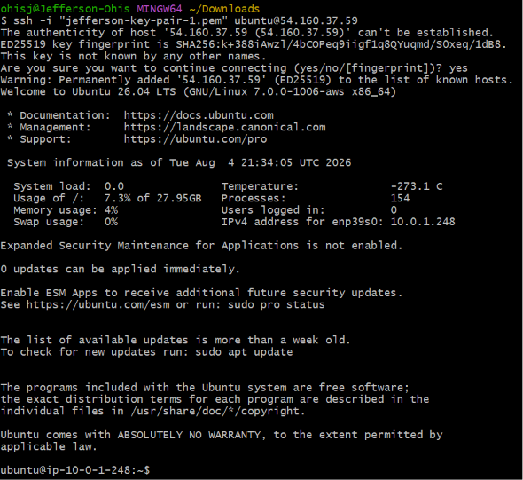

---

## Update Ubuntu Packages

Before installing Jenkins and its supporting software, the Ubuntu operating system is updated to ensure that the latest package information, security patches, and software updates are available. Performing this step helps maintain system stability, reduces the risk of installation conflicts, and ensures that all software is installed against the most recent package versions.

Updating the package index retrieves the latest metadata from the configured software repositories, while upgrading installed packages applies available updates, including security fixes and bug fixes.

### Update the Package Index

Refresh the local package index to retrieve the latest package information.

```bash
sudo apt update
```

### Upgrade Installed Packages

Upgrade all installed packages to their latest available versions.

```bash
sudo apt upgrade -y
```

### Command Explanation

| Command | Description |
|---------|-------------|
| `sudo apt update` | Downloads the latest package metadata from the configured APT repositories without installing any software updates. |
| `sudo apt upgrade -y` | Installs the latest available versions of installed packages and automatically answers **Yes** to confirmation prompts. |

### Why This Step Is Important

Updating the operating system before installing Jenkins provides several benefits:

- Ensures the latest security patches are applied.
- Reduces compatibility issues during software installation.
- Installs the latest package dependencies required by Jenkins and supporting tools.
- Improves system stability and reliability.
- Aligns with Linux administration and DevOps best practices.

### Verification

The update and upgrade processes complete successfully without package errors. If a new Linux kernel is installed during the upgrade, reboot the EC2 instance before continuing with the Jenkins installation to ensure the latest kernel is loaded.

```bash
sudo reboot
```

After reconnecting to the server, verify the active kernel version if required:

```bash
uname -r
```

The successful completion of these commands confirms that the Ubuntu server is fully updated and ready for the installation of Jenkins and the remaining DevOps tooling.

---

## Install Java

Jenkins is a **Java-based automation server**, which means it requires a Java Runtime Environment (JRE) to execute. Every Jenkins component—including the web interface, build executor, plugin framework, and pipeline engine—runs within the Java Virtual Machine (JVM). Without Java, the Jenkins service cannot start or execute CI/CD pipelines.

For this project, **OpenJDK 21** is installed because it is a Long-Term Support (LTS) release and is fully supported by the Jenkins version used throughout the implementation. Using an LTS version provides improved stability, ongoing security updates, and long-term compatibility with Jenkins plugins and future upgrades.

### Install OpenJDK 21

Install the Java Runtime Environment (JRE) required by Jenkins.

```bash
sudo apt install -y fontconfig openjdk-21-jre
```

After the installation completes, verify that Java has been installed successfully.

```bash
java -version
```

### Command Explanation

| Command | Description |
|---------|-------------|
| `sudo apt install -y fontconfig openjdk-21-jre` | Installs the OpenJDK 21 Java Runtime Environment and the required font libraries used by Jenkins. |
| `java -version` | Displays the installed Java version to verify that the installation completed successfully. |

### Why Java Is Required

Jenkins relies on Java for several core functions:

- Executes the Jenkins application within the Java Virtual Machine (JVM).
- Provides the runtime environment required for Jenkins plugins.
- Supports pipeline execution and build automation.
- Ensures compatibility with modern Jenkins releases.
- Receives long-term security and maintenance updates through the OpenJDK LTS release.

### Verification

Verify that the installed Java version matches the version supported by Jenkins.

Example output:

```text
openjdk version "21.x.x"
OpenJDK Runtime Environment
OpenJDK 64-Bit Server VM
```

This confirms that the required Java Runtime Environment has been installed successfully and that the server is ready for the Jenkins installation.

### Screenshot

The following screenshot verifies that OpenJDK 21 was installed successfully on the Jenkins server.

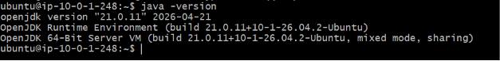

---

## Add the Jenkins Repository

Before installing Jenkins, the **official Jenkins APT repository** is added to the Ubuntu package manager. Using the official repository ensures that Jenkins is installed directly from the project's trusted package source, providing access to the latest stable releases, security updates, and ongoing maintenance.

Unlike the default Ubuntu repositories, which may contain older package versions, the official Jenkins repository is maintained by the Jenkins project and is updated whenever new stable releases become available. The repository is secured using a **GPG signing key**, allowing APT to verify the authenticity and integrity of downloaded packages before installation.

### Import the Jenkins Repository Signing Key

Download and install the official Jenkins GPG signing key used to verify package authenticity.

```bash
curl -fsSL https://pkg.jenkins.io/debian-stable/jenkins.io-2023.key | \
sudo tee /usr/share/keyrings/jenkins-keyring.asc > /dev/null
```

### Add the Jenkins APT Repository

Register the official Jenkins repository with the Ubuntu package manager.

```bash
echo deb \
[signed-by=/usr/share/keyrings/jenkins-keyring.asc] \
https://pkg.jenkins.io/debian-stable binary/ | \
sudo tee /etc/apt/sources.list.d/jenkins.list > /dev/null
```

### Refresh the Package Index

After adding the repository, refresh the local package index so that Ubuntu recognizes the newly configured Jenkins package source.

```bash
sudo apt update
```

### Command Explanation

| Command | Description |
|---------|-------------|
| `curl -fsSL ...` | Downloads the official Jenkins GPG signing key and stores it in the APT trusted keyring. |
| `echo ... \| sudo tee ...` | Creates the Jenkins repository configuration file under `/etc/apt/sources.list.d/`. |
| `sudo apt update` | Refreshes the package index and retrieves metadata from the configured repositories, including the Jenkins repository. |

### Why Use the Official Jenkins Repository?

Using the official Jenkins repository provides several advantages:

| Benefit | Description |
|----------|-------------|
| **Latest Stable Releases** | Installs the latest stable Jenkins packages maintained by the Jenkins project. |
| **Security Updates** | Receives timely security patches and maintenance updates. |
| **Package Authenticity** | Uses GPG signature verification to ensure downloaded packages are authentic and have not been modified. |
| **Long-Term Compatibility** | Provides versions officially tested and supported by the Jenkins community. |
| **Simplified Maintenance** | Future Jenkins upgrades can be managed using the standard Ubuntu APT package manager. |

### Verification

The following verification steps confirm that the Jenkins repository was configured successfully:

- The official Jenkins GPG signing key was downloaded and stored in the system keyring.
- The Jenkins repository configuration file was created successfully.
- The repository configuration contains the correct Jenkins repository URL.
- The Jenkins signing key exists in the expected system location under `/usr/share/keyrings/`.

These verification steps confirm that the Jenkins package repository has been configured correctly and is ready for package installation.

### Screenshot

The following screenshot verifies that the official Jenkins GPG signing key was imported successfully and that the Jenkins APT repository was configured correctly on the Ubuntu server.


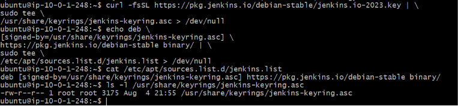

---

## Install Jenkins

With the official Jenkins repository configured, the next step is to install the **Jenkins automation server**. The Jenkins package includes the core application, system service configuration, and all dependencies required to run Jenkins as a background service on Ubuntu.

During the installation, the Jenkins package is downloaded from the official Jenkins repository, installed on the EC2 instance, and registered with **systemd**, allowing Jenkins to be managed as a Linux service. The installation also creates the default Jenkins home directory (`/var/lib/jenkins`), configuration files, log directories, and the system service definition required to start Jenkins.

### Install Jenkins

Install the latest stable Jenkins release from the official Jenkins repository.

```bash
sudo apt install jenkins -y
```

### Command Explanation

| Command | Description |
|---------|-------------|
| `sudo apt install jenkins -y` | Downloads and installs the latest stable Jenkins package along with any required dependencies. The `-y` option automatically accepts the installation prompt. |

### What Happens During Installation?

During the installation process, Ubuntu performs the following actions:

- Downloads the latest stable Jenkins package from the official Jenkins repository.
- Installs all required package dependencies.
- Creates the Jenkins system user and group.
- Creates the Jenkins home directory at `/var/lib/jenkins`.
- Installs the Jenkins configuration files.
- Registers Jenkins as a **systemd** service.
- Creates the service startup configuration so Jenkins can be managed using `systemctl`.

> **Note:** Installing Jenkins does not automatically make the web interface available. The Jenkins service must be started before it can accept browser connections on port **8080**. This is covered in the next section.

### Why Install Jenkins from the Official Repository?

Installing Jenkins from the official repository provides several benefits:

| Benefit | Description |
|----------|-------------|
| **Latest Stable Release** | Ensures the installation uses the most recent stable Jenkins version maintained by the Jenkins project. |
| **Security Updates** | Simplifies the installation of future security patches and maintenance updates using the APT package manager. |
| **Trusted Packages** | Packages are verified using the official Jenkins GPG signing key before installation. |
| **Long-Term Compatibility** | Provides reliable compatibility with Jenkins plugins and future upgrades. |

### Verification

A successful installation typically produces output indicating that:

- The Jenkins package was downloaded successfully.
- Required dependencies were installed.
- The Jenkins package was configured successfully.
- The Jenkins service was registered with **systemd**.

At this stage, Jenkins is installed on the server but has not yet been started. The next section covers enabling and starting the Jenkins service.

### Screenshot

The following screenshot shows the successful installation of the Jenkins package on the Amazon EC2 instance.


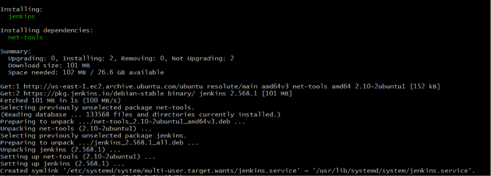

---

## Enable and Start Jenkins

After installing Jenkins, the service must be enabled and started before it can accept connections from users or execute CI/CD pipelines. On Ubuntu, Jenkins is managed by **systemd**, the default system and service manager responsible for starting, stopping, monitoring, and automatically launching services during system boot.

Enabling the Jenkins service ensures that it starts automatically whenever the EC2 instance is restarted, while starting the service launches the Jenkins application immediately without requiring a system reboot.

### Enable the Jenkins Service

Configure Jenkins to start automatically during system startup.

```bash
sudo systemctl enable jenkins
```

### Start the Jenkins Service

Start the Jenkins service.

```bash
sudo systemctl start jenkins
```

### Verify the Jenkins Service

Verify that the Jenkins service is running successfully.

```bash
sudo systemctl status jenkins
```

### Command Explanation

| Command | Description |
|---------|-------------|
| `sudo systemctl enable jenkins` | Configures Jenkins to start automatically whenever the operating system boots. |
| `sudo systemctl start jenkins` | Starts the Jenkins service immediately without requiring a reboot. |
| `sudo systemctl status jenkins` | Displays the current status of the Jenkins service, including whether it is active, running, and managed successfully by systemd. |

### Understanding systemd

Ubuntu uses **systemd** as its service manager to control background processes (services). By managing Jenkins with systemd, administrators can:

- Start and stop the Jenkins service.
- Restart Jenkins after configuration changes.
- Automatically start Jenkins when the server boots.
- Monitor the health and status of the Jenkins service.
- View service logs for troubleshooting.

Using systemd provides a reliable and standardized way to manage Jenkins throughout its lifecycle.

### Verification

A successful service startup should produce output similar to the following:

```text
● jenkins.service - Jenkins Continuous Integration Server
     Loaded: loaded (/usr/lib/systemd/system/jenkins.service; enabled; preset: enabled)
     Active: active (running)
```

Confirm the following:

- ✅ The Jenkins service is **loaded** successfully.
- ✅ The service status is **active (running)**.
- ✅ Jenkins is configured to **start automatically** during system boot.
- ✅ No service startup errors are reported.

Once the service is running, Jenkins begins listening for incoming HTTP requests on its default port (**8080**), making it ready for browser-based access in the next step.

### Screenshot

The following screenshot verifies that the Jenkins service is running successfully and is being managed by **systemd**.


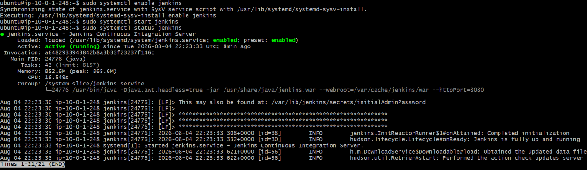

---

## Install Docker

Docker is installed on the Jenkins server to enable the creation, packaging, and distribution of containerized applications. Throughout this project, Jenkins uses Docker to build the Node.js application into a portable container image before pushing it to **Amazon Elastic Container Registry (ECR)** and deploying it to **Amazon Elastic Kubernetes Service (EKS)**.

By integrating Docker into the CI/CD pipeline, every application build is packaged into a consistent runtime environment, ensuring that the application behaves the same during development, testing, and production deployments.

### Install Docker Engine

Install the Docker Engine package from the Ubuntu repositories.

```bash
sudo apt install docker.io -y
```

### Enable the Docker Service

Configure Docker to start automatically whenever the server boots.

```bash
sudo systemctl enable docker
```

### Start the Docker Service

Start the Docker daemon.

```bash
sudo systemctl start docker
```

### Verify the Docker Service

Verify that the Docker service is running successfully.

```bash
sudo systemctl status docker
```

### Command Explanation

| Command | Description |
|---------|-------------|
| `sudo apt install docker.io -y` | Installs the Docker Engine package and its required dependencies from the Ubuntu repositories. |
| `sudo systemctl enable docker` | Configures Docker to start automatically whenever the operating system boots. |
| `sudo systemctl start docker` | Starts the Docker daemon immediately. |
| `sudo systemctl status docker` | Displays the current status of the Docker service and verifies that it is running successfully. |

### Why Docker Is Required

Docker plays a critical role in the project's DevSecOps pipeline by providing a consistent and portable application runtime.

Its primary responsibilities include:

- Building the Node.js application into a Docker container image.
- Packaging the application together with its runtime dependencies.
- Providing a consistent execution environment across development, testing, and production.
- Enabling Jenkins to automate container image creation during pipeline execution.
- Preparing container images for vulnerability scanning with **Trivy**.
- Allowing validated container images to be pushed to **Amazon Elastic Container Registry (ECR)**.
- Providing the container images that are deployed to **Amazon Elastic Kubernetes Service (EKS)**.

### Docker in the DevSecOps Workflow

Within this project, Docker is used as the containerization platform between application development and Kubernetes deployment.

```text
Node.js Application
        │
        ▼
   Docker Build
        │
        ▼
Docker Image
        │
        ▼
   Trivy Scan
        │
        ▼
Amazon Elastic Container Registry (ECR)
        │
        ▼
Amazon Elastic Kubernetes Service (EKS)
```

This workflow ensures that every application version is packaged, security scanned, stored in a container registry, and deployed using the same immutable container image.

### Verification

A successful Docker installation should satisfy the following conditions:

- ✅ Docker Engine is installed successfully.
- ✅ The Docker service is enabled to start automatically during system boot.
- ✅ The Docker daemon is running.
- ✅ No service startup errors are reported by `systemctl`.

Example status output:

```text
● docker.service - Docker Application Container Engine
     Loaded: loaded (...)
     Active: active (running)
```

This confirms that Docker has been installed successfully and is ready to build and manage container images during Jenkins pipeline execution.

### Screenshots

The following screenshots verify that Docker was installed successfully and that the Docker service is running on the Jenkins server.

#### Docker Installation


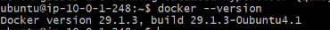


#### Docker Service Running


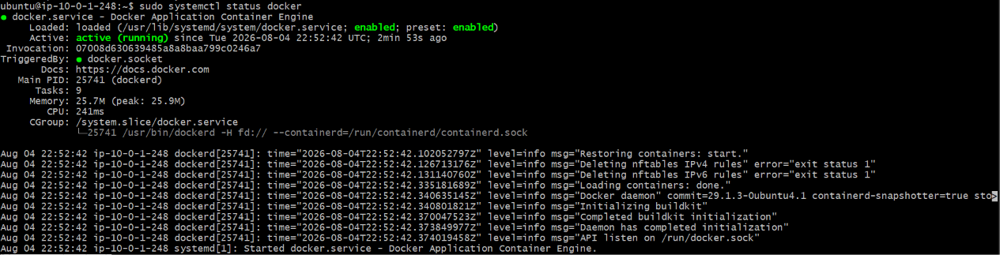

---

## Configure Docker Permissions

By default, Docker can only be managed by the **root** user or users who belong to the **docker** group. Since Jenkins executes CI/CD jobs as the dedicated **jenkins** system user, it must be granted permission to communicate with the Docker daemon. Without this configuration, Jenkins pipeline stages that build, tag, or push Docker images will fail with permission-related errors such as:

```text
permission denied while trying to connect to the Docker daemon socket
```

To allow Jenkins to execute Docker commands without requiring `sudo`, the **jenkins** user is added to the **docker** group. The **ubuntu** user is also added to the same group to simplify administrative tasks and local verification during server management.

After modifying group memberships, the Jenkins service must be restarted so that the new permissions take effect.

### Add the Jenkins User to the Docker Group

Grant the Jenkins service account permission to access the Docker daemon.

```bash
sudo usermod -aG docker jenkins
```

### Add the Ubuntu User to the Docker Group

Grant the Ubuntu administrative user permission to execute Docker commands without `sudo`.

```bash
sudo usermod -aG docker ubuntu
```

### Verify Group Membership

Verify that both users belong to the **docker** group.

```bash
groups jenkins

groups ubuntu
```

### Restart the Jenkins Service

Restart Jenkins so the updated group membership is applied.

```bash
sudo systemctl restart jenkins
```

### Command Explanation

| Command | Description |
|---------|-------------|
| `sudo usermod -aG docker jenkins` | Adds the **jenkins** system user to the Docker group without removing existing group memberships. |
| `sudo usermod -aG docker ubuntu` | Adds the **ubuntu** administrative user to the Docker group for local Docker administration. |
| `groups jenkins` | Displays the groups assigned to the Jenkins user. |
| `groups ubuntu` | Displays the groups assigned to the Ubuntu user. |
| `sudo systemctl restart jenkins` | Restarts the Jenkins service so the updated Docker group membership takes effect. |

### Why Docker Group Membership Is Required

Adding the Jenkins user to the Docker group provides several operational and security benefits:

| Benefit | Description |
|----------|-------------|
| **Docker Image Builds** | Allows Jenkins to build Docker images during pipeline execution. |
| **Container Management** | Enables Jenkins to create, start, stop, and remove Docker containers. |
| **Amazon ECR Integration** | Allows Jenkins to authenticate with Amazon Elastic Container Registry (ECR) and push container images. |
| **Pipeline Automation** | Eliminates the need to execute Docker commands using `sudo` within Jenkins pipelines. |
| **Operational Efficiency** | Simplifies Docker operations while maintaining a dedicated service account for Jenkins. |

### Verification

Verify that the configuration was applied successfully by confirming the following:

- ✅ The **jenkins** user belongs to the **docker** group.
- ✅ The **ubuntu** user belongs to the **docker** group.
- ✅ The Jenkins service restarted successfully.
- ✅ No permission-related errors are reported during the service restart.

These verification steps confirm that Jenkins has the necessary permissions to interact with the Docker daemon and execute container-related tasks during CI/CD pipeline execution.

> **Note:** If Jenkins was already running before the group membership was updated, restarting the service is required for the new permissions to take effect.

### Screenshots

The following screenshots verify that Docker permissions were configured successfully for both the **jenkins** and **ubuntu** users.

#### Jenkins Docker Group Membership


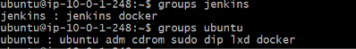


#### Jenkins Service Restart


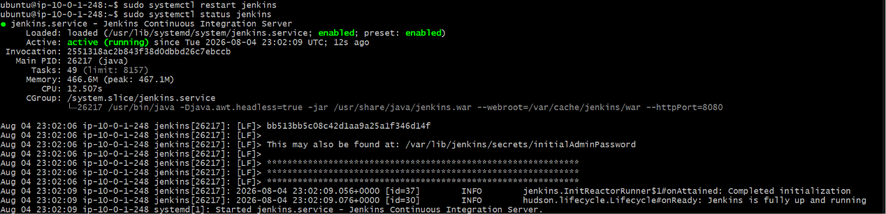

---

## Install AWS CLI

The **AWS Command Line Interface (AWS CLI)** provides Jenkins with a command-line interface for interacting with AWS services during CI/CD pipeline execution. It enables Jenkins to authenticate securely with AWS and perform operations such as logging in to **Amazon Elastic Container Registry (ECR)**, managing **Amazon Elastic Kubernetes Service (EKS)**, and interacting with other AWS resources required by the deployment workflow.

In this project, Jenkins does **not** use long-term AWS access keys. Instead, it obtains **temporary AWS credentials** through the **IAM Instance Profile** attached to the Amazon EC2 instance. This approach follows AWS security best practices by eliminating the need to store static credentials on the server while allowing Jenkins to securely access AWS services.

### Install AWS CLI

Install the AWS Command Line Interface from the Ubuntu package repository.

```bash
sudo apt install awscli -y
```

### Verify the Installation

Verify that AWS CLI has been installed successfully.

```bash
aws --version
```

### Command Explanation

| Command | Description |
|---------|-------------|
| `sudo apt install awscli -y` | Installs the AWS Command Line Interface (AWS CLI) and its required dependencies from the Ubuntu package repository. |
| `aws --version` | Displays the installed AWS CLI version to verify a successful installation. |

### Why AWS CLI Is Required

The AWS CLI enables Jenkins to automate interactions with AWS services throughout the DevSecOps pipeline.

Its primary responsibilities include:

| AWS Service | Purpose |
|-------------|---------|
| **Amazon Elastic Container Registry (ECR)** | Authenticate with ECR and push Docker container images. |
| **Amazon Elastic Kubernetes Service (EKS)** | Configure cluster access and deploy Kubernetes resources. |
| **AWS Identity and Access Management (IAM)** | Use temporary credentials provided through the EC2 IAM Instance Profile. |
| **AWS Systems Manager (SSM)** | Support secure instance management without relying solely on SSH. |

### AWS Authentication Flow

The Jenkins server authenticates with AWS using the IAM Instance Profile attached to the EC2 instance.

```text
Amazon EC2 (Jenkins Server)
            │
            ▼
IAM Instance Profile
            │
            ▼
IAM Role
            │
            ▼
Temporary AWS Credentials
            │
            ▼
AWS CLI
            │
    ┌───────┴────────┐
    ▼                ▼
Amazon ECR      Amazon EKS
```

This authentication model eliminates the need to store AWS access keys on the Jenkins server while providing secure, automatically rotated credentials managed by AWS.

### Benefits of Using AWS CLI with IAM Roles

| Benefit | Description |
|----------|-------------|
| **No Static Credentials** | Eliminates the need to store AWS access keys on the Jenkins server. |
| **Automatic Credential Rotation** | AWS automatically manages and rotates temporary credentials. |
| **Secure Authentication** | Uses IAM roles and the EC2 Instance Metadata Service (IMDS) to authenticate securely. |
| **Pipeline Automation** | Enables Jenkins to interact programmatically with AWS services during pipeline execution. |
| **AWS Best Practices** | Aligns with AWS recommendations for authentication from Amazon EC2 instances. |

### Verification

Verify that the installation completed successfully by confirming the following:

- ✅ AWS CLI is installed successfully.
- ✅ The installed version is displayed without errors.
- ✅ The Jenkins server is ready to authenticate with AWS services using its IAM Instance Profile.


### Screenshot

The following screenshot verifies that the AWS CLI was installed successfully on the Jenkins server.


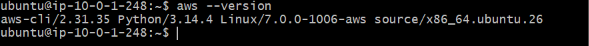

This confirms that the AWS CLI is installed successfully and that the Jenkins server is prepared to interact securely with AWS services during CI/CD pipeline execution.

---

## Install kubectl

**kubectl** is the official command-line tool for interacting with **Kubernetes** clusters. In this project, it enables Jenkins to communicate with **Amazon Elastic Kubernetes Service (EKS)** and perform deployment operations as part of the automated CI/CD pipeline.

After the application has been built, security validated, and pushed to **Amazon Elastic Container Registry (ECR)**, Jenkins uses `kubectl` to deploy Kubernetes resources, monitor rollout status, and manage application updates within the EKS cluster.

### Install kubectl

Download the latest stable release of `kubectl`.

```bash
curl -LO "https://dl.k8s.io/release/$(curl -L -s \
https://dl.k8s.io/release/stable.txt)/bin/linux/amd64/kubectl"
```

Make the binary executable.

```bash
chmod +x kubectl
```

Move the binary into the system executable path.

```bash
sudo mv kubectl /usr/local/bin/
```

### Verify the Installation

Verify that `kubectl` has been installed successfully.

```bash
kubectl version --client
```

---

### Command Explanation

| Command | Description |
|---------|-------------|
| `curl -LO ...` | Downloads the latest stable `kubectl` binary from the official Kubernetes release repository. |
| `chmod +x kubectl` | Grants executable permissions to the downloaded binary. |
| `sudo mv kubectl /usr/local/bin/` | Installs `kubectl` into the system executable path so it can be used from any directory. |
| `kubectl version --client` | Displays the installed client version to verify a successful installation. |

---

### Why kubectl Is Required

Within this project, `kubectl` enables Jenkins to automate Kubernetes deployment tasks, including:

- Deploying Kubernetes manifests to Amazon Elastic Kubernetes Service (EKS).
- Updating application deployments.
- Monitoring deployment rollouts.
- Scaling Kubernetes workloads.
- Viewing Pods, Services, Deployments, and Namespaces.
- Troubleshooting application deployments.
- Managing Kubernetes resources during CI/CD pipeline execution.

---

### kubectl in the DevSecOps Pipeline

The following workflow illustrates where `kubectl` is used within the deployment process.

```text
GitHub Repository
        │
        ▼
Jenkins Pipeline
        │
        ▼
Docker Build
        │
        ▼
Amazon Elastic Container Registry (ECR)
        │
        ▼
kubectl
        │
        ▼
Amazon Elastic Kubernetes Service (EKS)
        │
        ▼
Node.js Monitoring Application
```

Jenkins uses `kubectl` to communicate directly with the Kubernetes API server after authenticating with the Amazon EKS cluster through the AWS CLI.

---

### Benefits of kubectl

| Benefit | Description |
|----------|-------------|
| **Kubernetes Management** | Enables Jenkins to create, update, and manage Kubernetes resources. |
| **Automated Deployments** | Supports fully automated application deployments from the CI/CD pipeline. |
| **Cluster Administration** | Provides visibility into cluster resources, workloads, and deployment status. |
| **Cloud Native Integration** | Integrates seamlessly with Amazon Elastic Kubernetes Service (EKS). |
| **Industry Standard Tool** | Official Kubernetes command-line interface used across cloud-native environments. |

---

### Verification

Verify that the installation completed successfully by confirming the following:

- ✅ `kubectl` is installed successfully.
- ✅ The client version is displayed without errors.
- ✅ The binary is available from the system PATH.
- ✅ The Jenkins server is ready to communicate with Amazon EKS.


---

### Screenshot

The following screenshot verifies that `kubectl` was installed successfully on the Jenkins server.

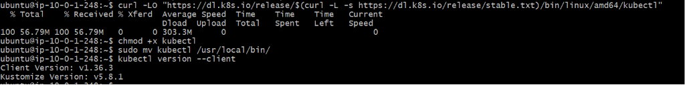

This confirms that `kubectl` has been installed successfully and that the Jenkins server is prepared to deploy and manage Kubernetes resources during CI/CD pipeline execution.

---

## Install Helm

**Helm** is the official package manager for Kubernetes. It simplifies the deployment and management of Kubernetes applications by packaging Kubernetes resources into reusable, version-controlled collections known as **Helm Charts**.

In this project, Helm is installed on the Jenkins server to support automated application deployments to **Amazon Elastic Kubernetes Service (EKS)**. Rather than applying multiple Kubernetes manifest files individually, Jenkins can use Helm to install, upgrade, roll back, and manage complex Kubernetes applications consistently across different environments.

### Install Helm

Download and execute the official Helm installation script.

```bash
curl https://raw.githubusercontent.com/helm/helm/main/scripts/get-helm-3 | bash
```

### Verify the Installation

Verify that Helm has been installed successfully.

```bash
helm version
```

---

### Command Explanation

| Command | Description |
|---------|-------------|
| `curl https://raw.githubusercontent.com/helm/helm/main/scripts/get-helm-3 \| bash` | Downloads and executes the official Helm installation script, installing the latest stable Helm release. |
| `helm version` | Displays the installed Helm client version to verify a successful installation. |

---

### Why Helm Is Required

Within this project, Helm provides an efficient and repeatable way to deploy applications to Kubernetes.

Its primary responsibilities include:

- Deploying applications to Amazon Elastic Kubernetes Service (EKS).
- Managing Kubernetes application releases.
- Performing application upgrades with minimal downtime.
- Rolling back failed deployments.
- Managing Kubernetes resources as reusable Helm Charts.
- Simplifying multi-resource Kubernetes deployments.
- Supporting automated deployments within the Jenkins CI/CD pipeline.

---

### Helm in the DevSecOps Pipeline

The following workflow illustrates where Helm is used during the deployment process.

```text
GitHub Repository
        │
        ▼
Jenkins Pipeline
        │
        ▼
Docker Build
        │
        ▼
Amazon Elastic Container Registry (ECR)
        │
        ▼
Amazon Elastic Kubernetes Service (EKS)
        │
        ▼
Helm
        │
        ▼
Kubernetes Release
        │
        ▼
Node.js Monitoring Application
```

Helm enables Jenkins to deploy and manage Kubernetes applications using declarative, version-controlled Helm Charts, providing a more scalable and maintainable deployment process than manually applying individual Kubernetes manifests.

---

### Benefits of Helm

| Benefit | Description |
|----------|-------------|
| **Simplified Deployments** | Packages multiple Kubernetes resources into a single Helm Chart. |
| **Version Control** | Tracks application releases and deployment history. |
| **Easy Upgrades** | Supports seamless application upgrades with minimal disruption. |
| **Rollback Support** | Allows previous application versions to be restored quickly if a deployment fails. |
| **Reusable Configuration** | Enables the same Helm Chart to be deployed across multiple environments using different configuration values. |
| **CI/CD Integration** | Integrates seamlessly with Jenkins for automated Kubernetes deployments. |

---

### Verification

Verify that the installation completed successfully by confirming the following:

- ✅ Helm is installed successfully.
- ✅ The installed version is displayed without errors.
- ✅ The Helm binary is available from the system PATH.
- ✅ The Jenkins server is prepared to deploy and manage Kubernetes applications using Helm.


---

### Screenshot

The following screenshot verifies that Helm was installed successfully on the Jenkins server.


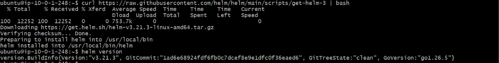

This confirms that Helm has been installed successfully and is ready to support Kubernetes application deployments during CI/CD pipeline execution.

---

## Install Trivy

**Trivy** is an open-source security scanner developed by Aqua Security for identifying vulnerabilities and misconfigurations in container images, filesystems, source code repositories, Kubernetes resources, and Infrastructure as Code (IaC).

In this project, Trivy is installed on the Jenkins server to perform **container image vulnerability scanning** as part of the automated DevSecOps pipeline. After Jenkins builds the Docker image, Trivy scans the image for known security vulnerabilities before it is pushed to **Amazon Elastic Container Registry (ECR)** and deployed to **Amazon Elastic Kubernetes Service (EKS)**.

Integrating Trivy into the CI/CD pipeline helps identify security issues early in the software delivery lifecycle, allowing vulnerabilities to be addressed before deployment to production.

### Install Trivy

Install Trivy on the Jenkins server.

> **Note:** Trivy was installed using the official installation script during the Jenkins server configuration process.

### Verify the Installation

Verify that Trivy has been installed successfully.

```bash
trivy --version
```

---

### Command Explanation

| Command | Description |
|---------|-------------|
| `trivy --version` | Displays the installed Trivy version to verify a successful installation. |

---

### Why Trivy Is Required

Trivy strengthens the project's DevSecOps pipeline by automatically scanning container images before deployment.

Its primary responsibilities include:

- Scanning Docker images for known vulnerabilities.
- Detecting operating system package vulnerabilities.
- Identifying vulnerable application dependencies.
- Detecting configuration issues and security misconfigurations.
- Preventing vulnerable container images from progressing through the deployment pipeline.
- Supporting continuous security validation during CI/CD execution.

---

### Trivy in the DevSecOps Pipeline

The following workflow illustrates where Trivy performs security scanning.

```text
GitHub Repository
        │
        ▼
Jenkins Pipeline
        │
        ▼
Docker Build
        │
        ▼
Trivy Security Scan
        │
        ▼
Amazon Elastic Container Registry (ECR)
        │
        ▼
Amazon Elastic Kubernetes Service (EKS)
```

By scanning container images immediately after they are built, Trivy helps ensure that only validated images are published to Amazon ECR and subsequently deployed to Amazon EKS.

---

### Security Coverage

Trivy provides comprehensive security scanning across multiple areas.

| Scan Type | Purpose |
|-----------|---------|
| **Container Images** | Detects known vulnerabilities in Docker images. |
| **Operating System Packages** | Identifies vulnerabilities in Linux packages included in the container image. |
| **Application Dependencies** | Detects vulnerable third-party libraries and packages. |
| **Configuration Scanning** | Identifies security misconfigurations in supported resources. |
| **Kubernetes Resources** | Scans Kubernetes configuration files for security issues. |
| **Infrastructure as Code (IaC)** | Detects misconfigurations in supported IaC templates. |

---

### Benefits of Using Trivy

| Benefit | Description |
|----------|-------------|
| **Early Vulnerability Detection** | Identifies security issues before deployment. |
| **Fast Scanning** | Performs security scans quickly with minimal impact on pipeline execution time. |
| **CI/CD Integration** | Integrates seamlessly into Jenkins pipelines. |
| **Comprehensive Coverage** | Supports scanning of container images, Kubernetes resources, filesystems, and Infrastructure as Code. |
| **Open Source** | Widely adopted open-source security scanner maintained by Aqua Security. |
| **DevSecOps Best Practice** | Enables automated security validation throughout the software delivery lifecycle. |

---

### Verification

Verify that the installation completed successfully by confirming the following:

- ✅ Trivy is installed successfully.
- ✅ The installed version is displayed without errors.
- ✅ The Trivy executable is available from the system PATH.
- ✅ The Jenkins server is ready to perform automated container image security scanning.


---

### Screenshot

The following screenshot verifies that Trivy was installed successfully on the Jenkins server.


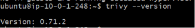

This confirms that Trivy has been installed successfully and is ready to perform container security scanning during CI/CD pipeline execution.

---

## Verify Port 8080

After starting the Jenkins service, it is important to verify that the application is actively listening on its default HTTP port (**8080**). This confirms that Jenkins has started successfully and is ready to accept incoming browser connections.

Jenkins exposes its web interface through port **8080** by default. If the service is not listening on this port, users will be unable to access the Jenkins dashboard even if the service appears to be running.

Verifying the listening port is a common troubleshooting step that confirms the Jenkins process is bound to the expected network port before testing browser connectivity.

### Verify Jenkins Is Listening on Port 8080

Run the following command to confirm that Jenkins is listening on port **8080**.

```bash
sudo ss -tulpn | grep 8080
```

---

### Command Explanation

| Command | Description |
|---------|-------------|
| `sudo ss -tulpn \| grep 8080` | Displays all listening TCP and UDP ports and filters the output to show only services listening on port **8080**. |

---

### Understanding the Output

A successful result should resemble the following:

```text
tcp   LISTEN 0      50                      *:8080             *:*    users:(("java",pid=26217,fd=9))
```

This output confirms that:

- The **Jenkins Java process** is running.
- Jenkins is actively **listening on port 8080**.
- The server is ready to accept incoming HTTP connections.
- The Jenkins web interface is available for browser access, provided that the EC2 Security Group allows inbound traffic on port **8080**.

---

### Why Verify Port 8080?

Verifying the listening port provides several operational benefits before accessing Jenkins through a web browser.

| Benefit | Description |
|----------|-------------|
| **Confirms Service Availability** | Verifies that the Jenkins process has started successfully. |
| **Validates Network Binding** | Ensures Jenkins is listening on its default HTTP port. |
| **Simplifies Troubleshooting** | Helps distinguish service startup issues from network or browser connectivity problems. |
| **Verifies Browser Readiness** | Confirms that the Jenkins web interface is ready to receive incoming requests. |

---

### Browser Accessibility

Once Jenkins is confirmed to be listening on port **8080**, the web interface can be accessed from any web browser using the Elastic IP address assigned to the Jenkins EC2 instance.

```text
http://<Jenkins-Elastic-IP>:8080
```


> **Note:** Ensure that the Jenkins EC2 Security Group includes an inbound rule allowing **TCP port 8080** from the appropriate source (for example, `0.0.0.0/0` during development or a restricted IP range in production).

---

### Verification

Verify the following before proceeding to the Jenkins web interface:

- ✅ The Jenkins service is running.
- ✅ Jenkins is listening on TCP port **8080**.
- ✅ The Java process owns the listening port.
- ✅ The EC2 Security Group allows inbound TCP traffic on port **8080**.
- ✅ The Jenkins web interface is ready to be accessed from a web browser.

---

### Screenshot

The following screenshot verifies that the Jenkins service is actively listening on port **8080**, confirming that the Jenkins web interface is ready for browser access.


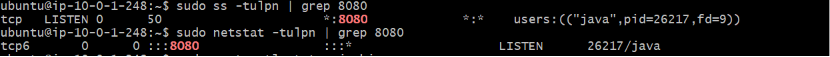

---

## Access Jenkins from the Browser

After confirming that the Jenkins service is running and listening on **port 8080**, the Jenkins web interface can be accessed from any web browser using the **Elastic IP address** assigned to the Jenkins EC2 instance.

An **Elastic IP** provides a permanent public IPv4 address for the Jenkins server, ensuring that the Jenkins web interface remains accessible even if the EC2 instance is stopped and restarted. This provides a stable endpoint for administrators, browser bookmarks, automation tools, and GitHub webhook integrations.

### Access the Jenkins Web Interface

Open a web browser and navigate to:

```text
http://<Elastic-IP>:8080
```

Replace `<Elastic-IP>` with the public Elastic IP address associated with your Jenkins EC2 instance.

---

### Browser Accessibility Requirements

Before accessing Jenkins, verify the following:

- The Jenkins service is running.
- Jenkins is listening on **TCP port 8080**.
- The EC2 Security Group allows inbound TCP traffic on port **8080**.
- The EC2 instance has an associated Elastic IP.
- The web browser can reach the Jenkins server over the Internet.

---

### What to Expect

When Jenkins is accessed for the first time, the **Unlock Jenkins** page is displayed.

This security measure prevents unauthorized users from completing the initial Jenkins configuration before verifying administrative access to the server.

The page prompts for the **Initial Administrator Password**, which is stored securely on the Jenkins server.

---

### Verification

Verify the following:

- ✅ Jenkins loads successfully in the browser.
- ✅ The URL uses the Jenkins Elastic IP and port **8080**.
- ✅ The **Unlock Jenkins** page is displayed.
- ✅ No browser or network connectivity errors are encountered.

---

### Screenshot

The following screenshot shows the Jenkins **Unlock Jenkins** page displayed after successfully accessing the Jenkins web interface.


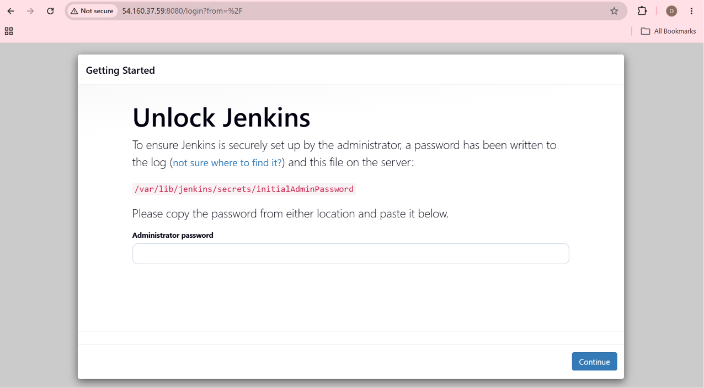

---

## Unlock Jenkins

When Jenkins is started for the first time, it remains locked until the administrator completes the initial setup process. To verify ownership of the server, Jenkins generates a unique **Initial Administrator Password** during installation.

This password is stored securely on the Jenkins server and must be entered on the **Unlock Jenkins** page before any additional configuration can be performed.

The password is generated only once during the initial installation and is unique to each Jenkins instance.

### Retrieve the Initial Administrator Password

Display the initial administrator password stored by Jenkins.

```bash
sudo cat /var/lib/jenkins/secrets/initialAdminPassword
```

---

### Command Explanation

| Command | Description |
|---------|-------------|
| `sudo cat /var/lib/jenkins/secrets/initialAdminPassword` | Displays the one-time administrator password generated automatically during the Jenkins installation process. |

---

### Understanding the Initial Administrator Password

The initial administrator password serves as a one-time authentication mechanism during the first Jenkins startup.

Its purpose is to:

- Verify administrative access to the Jenkins server.
- Prevent unauthorized users from configuring Jenkins.
- Secure the initial installation process.
- Allow the administrator to complete the first-time setup wizard.

After the setup wizard is completed and the first administrator account is created, this password is no longer required for routine logins.

---

### Initial Setup Workflow

```text
Install Jenkins
        │
        ▼
Start Jenkins Service
        │
        ▼
Open Browser
        │
        ▼
Unlock Jenkins
        │
        ▼
Enter Initial Administrator Password
        │
        ▼
Install Recommended Plugins
        │
        ▼
Create First Administrator
        │
        ▼
Jenkins Dashboard
```

---

### Verification

Verify the following:

- ✅ The password file exists.
- ✅ The command displays the initial administrator password successfully.
- ✅ The password is accepted by the Jenkins Unlock page.
- ✅ The Jenkins Setup Wizard proceeds to the next stage.

---

### Screenshot

The following screenshot shows the retrieval of the Jenkins Initial Administrator Password from the server.


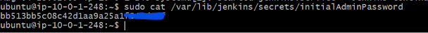

---

## Create the First Administrator

After unlocking Jenkins, the setup wizard prompts for the creation of the **first administrator account**. This account becomes the primary administrative user responsible for managing the Jenkins server, configuring system settings, installing plugins, creating credentials, and administering CI/CD pipelines.

Creating a dedicated administrator account replaces the one-time **Initial Administrator Password** used during the installation process. Once the administrator account is created, all future access to Jenkins is authenticated using the configured username and password.

### Create the Administrator Account

On the **Create First Admin User** page, provide the required account information:

- **Username**
- **Password**
- **Confirm Password**
- **Full Name**
- **Email Address**

After entering the required details, select **Save and Continue** to create the administrator account.

---

### Why Create a Dedicated Administrator?

Creating a dedicated administrator account provides a secure and permanent method for managing the Jenkins instance.

| Benefit | Description |
|----------|-------------|
| **Secure Authentication** | Replaces the temporary setup password with permanent administrator credentials. |
| **Administrative Access** | Grants full access to configure Jenkins, manage plugins, credentials, nodes, and pipelines. |
| **Improved Security** | Ensures that only authorized users can administer the Jenkins server. |
| **Identity Management** | Associates administrative actions with a named user account instead of a shared setup password. |
| **Foundation for CI/CD** | Prepares Jenkins for pipeline configuration and ongoing DevSecOps automation. |

---

### Administrator Responsibilities

The Jenkins administrator is responsible for:

- Managing Jenkins system configuration.
- Installing and updating plugins.
- Configuring credentials for external services.
- Creating and maintaining CI/CD pipelines.
- Managing users and security settings.
- Monitoring build execution and system health.
- Integrating Jenkins with GitHub, Amazon ECR, Amazon EKS, SonarCloud, Snyk, Trivy, and OWASP ZAP.

---

### Setup Workflow

```text
Unlock Jenkins
        │
        ▼
Enter Initial Administrator Password
        │
        ▼
Create First Administrator
        │
        ▼
Configure Jenkins URL
        │
        ▼
Complete Setup
        │
        ▼
Jenkins Dashboard
```

---

### Verification

Verify the following before proceeding:

- ✅ The administrator account is created successfully.
- ✅ All required user information is accepted.
- ✅ Jenkins proceeds to the instance configuration step.
- ✅ No validation or authentication errors are displayed.

Successfully completing this step confirms that Jenkins is secured with a permanent administrator account and is ready for final instance configuration.

---

### Screenshot

The following screenshot shows the **Create First Admin User** page during the initial Jenkins setup process.


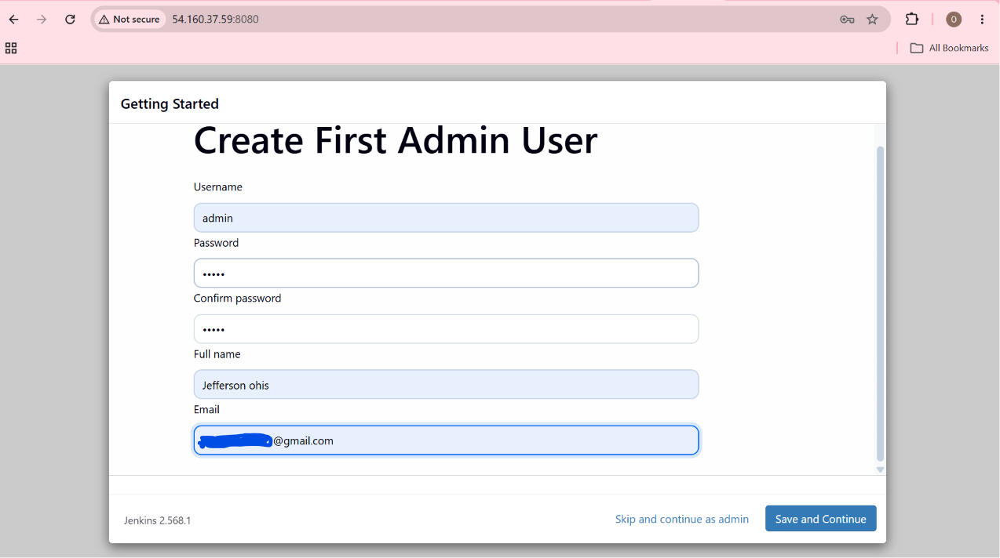

---

## Configure the Jenkins Instance

After creating the first administrator account, Jenkins prompts for the **Instance Configuration**. During this step, the **Jenkins URL** is configured to define the primary web address through which users, plugins, and external integrations access the Jenkins server.

The Jenkins URL is used throughout the platform to generate links in email notifications, build results, webhook responses, and plugin integrations. Configuring this URL correctly ensures that Jenkins can communicate reliably with users and external services.

### Configure the Jenkins URL

On the **Instance Configuration** page, specify the URL that users will use to access Jenkins.

For this project, Jenkins is accessed using the **Elastic IP address** assigned to the EC2 instance.

Example:

```text
http://<Elastic-IP>:8080/
```

After confirming the URL, select **Save and Finish** to complete the Jenkins configuration.

---

### Why Configure the Jenkins URL?

The Jenkins URL serves as the default address used throughout the Jenkins ecosystem.

| Purpose | Description |
|----------|-------------|
| **Web Access** | Defines the primary URL used to access the Jenkins dashboard. |
| **Build Notifications** | Generates links included in build notifications and emails. |
| **Plugin Integration** | Allows plugins to generate valid hyperlinks to Jenkins resources. |
| **Webhook Communication** | Provides external systems with a consistent endpoint for Jenkins callbacks. |
| **Future DNS Migration** | Can later be updated to use a custom domain name instead of the Elastic IP address. |

---

### Jenkins URL in This Project

During development, Jenkins is accessed using the EC2 Elastic IP.

```text
Developer
      │
      ▼
Web Browser
      │
      ▼
http://<Elastic-IP>:8080
      │
      ▼
Jenkins Server
```

In a production environment, the Elastic IP can be replaced with a DNS name such as:

```text
https://jenkins.example.com
```

This provides a more user-friendly and maintainable endpoint while preserving the same Jenkins functionality.

---

### Best Practices

When configuring the Jenkins URL, consider the following recommendations:

- Use a stable endpoint, such as an Elastic IP or DNS name.
- Ensure the configured URL matches the address users access in their web browser.
- Update the Jenkins URL if the server is migrated to a different hostname or domain.
- Use **HTTPS** when deploying Jenkins in production environments to encrypt browser communications.

---

### Verification

Verify the following before completing the setup:

- ✅ The Jenkins URL is configured correctly.
- ✅ The URL includes port **8080**.
- ✅ The configured URL matches the EC2 Elastic IP.
- ✅ Jenkins accepts the configuration without validation errors.
- ✅ Selecting **Save and Finish** completes the initial setup successfully.

Successfully completing this step finalizes the Jenkins installation and prepares the server for administrative access through the Jenkins dashboard.

---

### Screenshot

The following screenshot shows the Jenkins **Instance Configuration** page, where the Jenkins URL is configured before completing the initial setup.


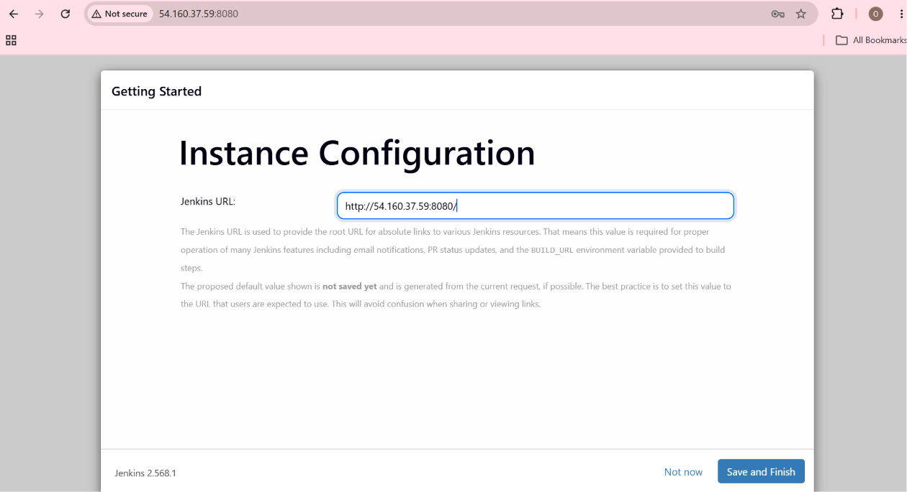

---

## Jenkins Dashboard

After completing the initial setup, Jenkins redirects the administrator to the **Jenkins Dashboard**, which serves as the central management interface for the automation server.

From this dashboard, administrators can create and manage CI/CD pipelines, monitor build execution, configure system settings, install plugins, manage credentials, administer build agents, and monitor the overall health of the Jenkins environment.

Throughout the remaining phases of this project, the Jenkins Dashboard will be used to configure the complete DevSecOps pipeline, including source code integration, automated testing, security scanning, container image management, and Kubernetes deployments.

---

### Dashboard Overview

The Jenkins Dashboard provides access to the core administrative and operational components of the Jenkins server.

```text
Jenkins Dashboard
        │
        ├── Dashboard
        ├── Build Queue
        ├── Executor Status
        ├── Manage Jenkins
        ├── Credentials
        └── Nodes
```

---

### Dashboard Components

The following components are available from the Jenkins Dashboard.

| Component | Description |
|-----------|-------------|
| **Dashboard** | The main landing page that provides an overview of Jenkins jobs, folders, pipeline activity, and recent build history. |
| **Build Queue** | Displays builds that are waiting to execute because all available executors are currently busy. |
| **Executor Status** | Shows the status of Jenkins executors, including whether they are idle or actively running build jobs. |
| **Manage Jenkins** | Provides administrative access to global system configuration, plugin management, security settings, tools, credentials, nodes, and system information. |
| **Credentials** | Stores and manages secure credentials such as GitHub Personal Access Tokens, AWS credentials (when required), Docker registry credentials, SonarCloud tokens, and other secrets used by Jenkins pipelines. |
| **Nodes** | Displays the Jenkins controller and any connected build agents that execute pipeline workloads. In this project, the Jenkins controller initially performs all build and deployment tasks. |

---

### Dashboard Responsibilities

Within this project, the Jenkins Dashboard is used to manage the complete DevSecOps automation workflow.

Key responsibilities include:

- Creating and managing Jenkins pipelines.
- Monitoring build execution.
- Managing pipeline credentials.
- Installing and updating Jenkins plugins.
- Configuring development tools.
- Viewing build logs and execution history.
- Monitoring build queue activity.
- Managing Jenkins nodes and executors.
- Configuring integrations with GitHub, Amazon ECR, Amazon EKS, SonarCloud, Snyk, Trivy, and OWASP ZAP.

---

### Jenkins in the DevSecOps Workflow

The Jenkins Dashboard serves as the operational control center for the entire DevSecOps pipeline.

```text
Developer
        │
        ▼
GitHub Repository
        │
        ▼
Jenkins Dashboard
        │
        ├── Build Pipeline
        ├── Unit Testing
        ├── SonarCloud (SAST)
        ├── Snyk (SCA)
        ├── Docker Build
        ├── Trivy Scan
        ├── Amazon ECR
        ├── Amazon EKS
        ├── OWASP ZAP (DAST)
        ├── Prometheus
        └── Grafana
```

From this dashboard, Jenkins orchestrates each stage of the software delivery lifecycle, automating build, security validation, deployment, and monitoring.

---

### Verification

Verify that the Jenkins installation has been completed successfully by confirming the following:

- ✅ The Jenkins Dashboard loads successfully.
- ✅ The administrator can sign in using the configured credentials.
- ✅ The Dashboard page is displayed without errors.
- ✅ **Build Queue** is accessible.
- ✅ **Executor Status** is visible.
- ✅ **Manage Jenkins** is available.
- ✅ **Credentials** can be accessed.
- ✅ **Nodes** displays the Jenkins controller.
- ✅ The Jenkins server is ready for pipeline configuration.

Successfully reaching the Jenkins Dashboard confirms that the Jenkins installation and initial configuration have been completed successfully.

---

### Screenshot

The following screenshot shows the Jenkins Dashboard after completing the initial setup and administrator configuration.


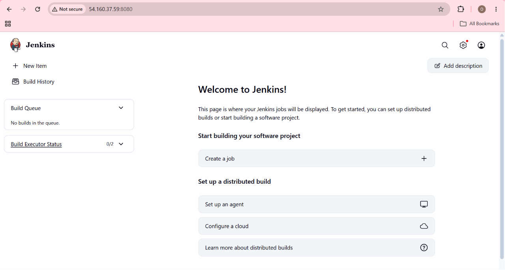

---

## Commands Used

The following commands were executed throughout the Jenkins installation and configuration process. They are grouped by installation stage for quick reference.

---

### Update Ubuntu Packages

Refresh the package index and upgrade installed packages.

```bash
sudo apt update
sudo apt upgrade -y
```

---

### Verify Java Installation

Confirm that Java is installed and available.

```bash
java -version
```

---

### Configure the Jenkins Repository

Import the official Jenkins GPG signing key.

```bash
curl -fsSL https://pkg.jenkins.io/debian-stable/jenkins.io-2023.key | \
sudo tee /usr/share/keyrings/jenkins-keyring.asc > /dev/null
```

Add the official Jenkins APT repository.

```bash
echo deb \
[signed-by=/usr/share/keyrings/jenkins-keyring.asc] \
https://pkg.jenkins.io/debian-stable binary/ | \
sudo tee /etc/apt/sources.list.d/jenkins.list > /dev/null
```

Refresh the package index.

```bash
sudo apt update
```

---

### Install Jenkins

Install the Jenkins automation server.

```bash
sudo apt install jenkins -y
```

Enable the Jenkins service.

```bash
sudo systemctl enable jenkins
```

Start the Jenkins service.

```bash
sudo systemctl start jenkins
```

Verify the Jenkins service.

```bash
sudo systemctl status jenkins
```

---

### Install Docker

Install Docker Engine.

```bash
sudo apt install docker.io -y
```

Enable the Docker service.

```bash
sudo systemctl enable docker
```

Start the Docker service.

```bash
sudo systemctl start docker
```

Verify the Docker service.

```bash
sudo systemctl status docker
```

---

### Configure Docker Permissions

Grant Docker permissions to the Jenkins user.

```bash
sudo usermod -aG docker jenkins
```

Grant Docker permissions to the Ubuntu user.

```bash
sudo usermod -aG docker ubuntu
```

Verify group membership.

```bash
groups jenkins
groups ubuntu
```

Restart Jenkins.

```bash
sudo systemctl restart jenkins
```

---

### Install AWS CLI

Install AWS CLI.

```bash
sudo apt install awscli -y
```

Verify the installation.

```bash
aws --version
```

---

### Install kubectl

Download the latest stable kubectl binary.

```bash
curl -LO "https://dl.k8s.io/release/$(curl -L -s \
https://dl.k8s.io/release/stable.txt)/bin/linux/amd64/kubectl"
```

Make the binary executable.

```bash
chmod +x kubectl
```

Move the binary to the system path.

```bash
sudo mv kubectl /usr/local/bin/
```

Verify the installation.

```bash
kubectl version --client
```

---

### Install Helm

Install Helm using the official installation script.

```bash
curl https://raw.githubusercontent.com/helm/helm/main/scripts/get-helm-3 | bash
```

Verify the installation.

```bash
helm version
```

---

### Install Trivy

Install Trivy.

```bash
sudo apt install wget apt-transport-https gnupg lsb-release -y

wget -qO - https://aquasecurity.github.io/trivy-repo/deb/public.key | \
gpg --dearmor | \
sudo tee /usr/share/keyrings/trivy.gpg > /dev/null

echo "deb [signed-by=/usr/share/keyrings/trivy.gpg] \
https://aquasecurity.github.io/trivy-repo/deb \
$(lsb_release -sc) main" | \
sudo tee /etc/apt/sources.list.d/trivy.list

sudo apt update

sudo apt install trivy -y
```

Verify the installation.

```bash
trivy --version
```

---

### Verify Jenkins Port

Verify that Jenkins is listening on port **8080**.

```bash
sudo ss -tulpn | grep 8080
```

---

### Retrieve the Initial Administrator Password

Display the Jenkins initial administrator password.

```bash
sudo cat /var/lib/jenkins/secrets/initialAdminPassword
```

---

### Installation Verification

Verify the installed software versions.

```bash
java -version

aws --version

kubectl version --client

helm version

trivy --version
```

Verify running services.

```bash
sudo systemctl status jenkins

sudo systemctl status docker
```

Verify Jenkins is listening on port **8080**.

```bash
sudo ss -tulpn | grep 8080
```

---

### Summary

This phase involved:

- Updating the Ubuntu operating system.
- Configuring the official Jenkins repository.
- Installing Jenkins and its required dependencies.
- Installing Docker Engine.
- Configuring Docker permissions for Jenkins.
- Installing AWS CLI.
- Installing `kubectl`.
- Installing Helm.
- Installing Trivy.
- Starting and verifying Jenkins and Docker services.
- Confirming that Jenkins is accessible on **TCP port 8080**.
- Retrieving the initial administrator password to complete the Jenkins setup wizard.

These commands prepared the Jenkins server for the implementation of the automated DevSecOps CI/CD pipeline in the next phase.

---

## Results

Phase 7 successfully transformed the provisioned Amazon EC2 instance into a fully configured **Jenkins automation server**, establishing the foundation for the project's end-to-end DevSecOps pipeline.

The Jenkins server was installed using the official Jenkins repository and configured to run as a **systemd** service, ensuring automatic startup whenever the EC2 instance is rebooted. Browser access to the Jenkins web interface was verified through **TCP port 8080**, and the initial setup wizard was completed by creating the first administrator account and configuring the Jenkins instance.

To prepare the server for CI/CD automation, the supporting DevOps and Kubernetes tooling required by subsequent project phases was installed and verified:

- **Docker Engine** for building and managing container images.
- **AWS CLI** for secure authentication and interaction with AWS services using the EC2 IAM Instance Profile.
- **kubectl** for deploying and managing workloads on Amazon Elastic Kubernetes Service (EKS).
- **Helm** for packaging and managing Kubernetes applications using Helm Charts.
- **Trivy** for automated container image vulnerability scanning within the CI/CD pipeline.

Docker permissions were configured for both the **jenkins** and **ubuntu** users, enabling Jenkins to execute Docker commands without requiring elevated privileges. All installed components were verified to ensure they were operating correctly and ready for pipeline execution.

The completed Jenkins environment now provides a centralized automation platform capable of orchestrating the entire software delivery lifecycle, including source code integration, automated testing, security scanning, container image management, Kubernetes deployments, and application monitoring.

### Phase Deliverables

| Deliverable | Status |
|-------------|:------:|
| Ubuntu Server Updated | ✅ |
| Java Verified | ✅ |
| Official Jenkins Repository Configured | ✅ |
| Jenkins Installed | ✅ |
| Jenkins Service Enabled and Running | ✅ |
| Docker Installed and Configured | ✅ |
| Docker Permissions Configured | ✅ |
| AWS CLI Installed | ✅ |
| kubectl Installed | ✅ |
| Helm Installed | ✅ |
| Trivy Installed | ✅ |
| Jenkins Listening on Port 8080 | ✅ |
| Jenkins Accessible via Browser | ✅ |
| Initial Administrator Account Created | ✅ |
| Jenkins Instance Configured | ✅ |
| Jenkins Dashboard Verified | ✅ |

> **Result:** The Jenkins server is fully operational and ready to serve as the central automation platform for the project's DevSecOps pipeline. The next phase will integrate Jenkins with GitHub, SonarCloud, Snyk, Docker, Amazon Elastic Container Registry (ECR), Amazon Elastic Kubernetes Service (EKS), OWASP ZAP, Prometheus, and Grafana to implement a complete automated CI/CD and DevSecOps workflow.

---

## Key Takeaway

Phase 7 established the operational foundation of the project's **end-to-end DevSecOps platform** by transforming the provisioned Amazon EC2 instance into a fully configured Jenkins automation server.

Although Jenkins is widely recognized as a Continuous Integration and Continuous Deployment (CI/CD) tool, its role in this project extends beyond build automation. Jenkins serves as the orchestration engine that coordinates software delivery, security validation, containerization, and Kubernetes deployments across the AWS infrastructure provisioned with Terraform.

Several key components were installed and configured to prepare the server for automated pipeline execution:

- **Java** provides the runtime environment required for the Jenkins application.
- **Jenkins** serves as the centralized automation server responsible for executing CI/CD and DevSecOps workflows.
- **Docker Engine** enables Jenkins to build, package, and manage container images.
- **AWS CLI** allows Jenkins to authenticate securely with AWS services using the EC2 IAM Instance Profile, eliminating the need for long-term access keys.
- **kubectl** enables Jenkins to deploy and manage workloads on Amazon Elastic Kubernetes Service (EKS).
- **Helm** provides package management for Kubernetes applications, simplifying deployment and release management.
- **Trivy** introduces automated container vulnerability scanning, allowing security validation to become an integrated part of the software delivery process.

Collectively, these tools transform Jenkins from a standalone automation server into a comprehensive DevSecOps platform capable of managing the complete application lifecycle.

---

### DevSecOps Perspective

A core objective of DevSecOps is to integrate security throughout the software delivery lifecycle rather than treating it as a final verification step. The Jenkins environment prepared in this phase provides the execution platform for implementing that approach.

In the upcoming pipeline, Jenkins will orchestrate multiple stages of quality assurance and security validation, including:

| Pipeline Stage | Technology |
|----------------|------------|
| Source Code Management | GitHub |
| Unit Testing | Jest |
| Static Application Security Testing (SAST) | SonarCloud |
| Software Composition Analysis (SCA) | Snyk |
| Container Image Build | Docker |
| Container Vulnerability Scanning | Trivy |
| Container Registry | Amazon Elastic Container Registry (ECR) |
| Kubernetes Deployment | Amazon Elastic Kubernetes Service (EKS) |
| Dynamic Application Security Testing (DAST) | OWASP ZAP |
| Monitoring | Prometheus |
| Visualization | Grafana |

By integrating these capabilities into a single automated workflow, the project demonstrates how quality, security, deployment, and monitoring can be executed consistently as part of every software release.

---

### Infrastructure as Code Perspective

An important characteristic of this project is the separation of **infrastructure provisioning** from **software configuration**.

- **Phase 5** used **Terraform** to provision AWS infrastructure, including networking, IAM resources, Amazon ECR, Amazon EKS, and supporting cloud services.
- **Phase 6** provisioned the Jenkins EC2 instance, associated security groups, IAM Instance Profile, and Elastic IP using Terraform.
- **Phase 7** completed the software configuration of that infrastructure by installing Jenkins and the supporting DevOps toolchain.

This separation reflects Infrastructure as Code (IaC) best practices, where cloud resources are defined declaratively, while application and platform software are installed in a controlled and repeatable manner. Together, these phases produce an automation environment that is reproducible, scalable, and easier to maintain.

---

### Project Readiness

With this phase complete, the Jenkins server is fully prepared to execute the project's automated DevSecOps workflow.

The environment now provides:

- ✅ A fully configured Jenkins automation server.
- ✅ Secure authentication to AWS through an IAM Instance Profile.
- ✅ Docker support for container image creation.
- ✅ Kubernetes tooling for Amazon EKS deployments.
- ✅ Security tooling for automated vulnerability scanning.
- ✅ Browser-based administrative access through the Jenkins Dashboard.
- ✅ A stable platform for implementing the CI/CD pipeline.

The project is now ready to transition from **platform preparation** to **pipeline implementation**, where Jenkins will automate source code integration, testing, security scanning, containerization, deployment, and monitoring as part of a complete end-to-end DevSecOps workflow.

---

## Next Step

With the Jenkins automation server successfully installed and configured, the next phase focuses on transforming Jenkins from a standalone automation server into the central orchestration platform for the project's end-to-end **DevSecOps CI/CD pipeline**.

This phase will prepare Jenkins to automate the complete software delivery lifecycle by integrating source code management, build automation, security scanning, containerization, deployment, and monitoring within a single workflow.

### Objectives

The next phase will include the following configuration tasks:

| Configuration Area | Purpose |
|--------------------|---------|
| **Install Jenkins Plugins** | Add the plugins required for GitHub integration, Docker, AWS, Kubernetes, SonarCloud, and pipeline automation. |
| **Global Tool Configuration** | Register the development tools used by Jenkins pipelines. |
| **Configure JDK** | Configure the Java Development Kit required by Jenkins and build tools. |
| **Configure Node.js** | Install and configure the Node.js runtime for building the application. |
| **Configure Docker** | Enable Jenkins to build and manage Docker container images. |
| **Configure SonarScanner** | Integrate SonarCloud for Static Application Security Testing (SAST). |
| **Configure AWS CLI Integration** | Enable Jenkins to authenticate securely with AWS services using the EC2 IAM Instance Profile. |
| **Configure kubectl** | Allow Jenkins to communicate with the Amazon EKS cluster. |
| **Add AWS Credentials (if required)** | Configure credentials for AWS services where IAM roles are not sufficient. |
| **Add SonarCloud Credentials** | Store the SonarCloud authentication token securely in Jenkins Credentials. |
| **Add Snyk Credentials** | Configure the Snyk API token for Software Composition Analysis (SCA). |
| **Configure GitHub Webhook Integration** | Enable automatic pipeline execution whenever code is pushed to the GitHub repository. |

---

## Target DevSecOps Workflow

Once the Jenkins configuration is complete, the automation pipeline will orchestrate the following workflow:

```text
Developer
        │
        ▼
GitHub Repository
        │
        ▼
Jenkins Pipeline
        │
        ├── Source Code Checkout
        ├── Unit Testing
        ├── SonarCloud (SAST)
        ├── Snyk (SCA)
        ├── Docker Image Build
        ├── Trivy Scan
        ├── Push Image to Amazon ECR
        ├── Deploy to Amazon EKS
        ├── OWASP ZAP (DAST)
        ├── Prometheus Monitoring
        └── Grafana Dashboards
```

This automated workflow demonstrates a modern DevSecOps implementation by embedding quality assurance, security validation, containerization, deployment, and monitoring into every software delivery cycle.

---

## Expected Outcome

At the completion of the next phase, Jenkins will be fully configured to:

- Automatically build the application from GitHub.
- Execute automated unit tests.
- Perform static and dynamic security scanning.
- Build and scan Docker container images.
- Push container images to Amazon Elastic Container Registry (ECR).
- Deploy applications to Amazon Elastic Kubernetes Service (EKS).
- Trigger automated deployments using GitHub webhooks.
- Provide continuous monitoring through Prometheus and Grafana.

> **Next Phase:** **Phase 8 – DevSecOps Pipeline Configuration**, where Jenkins will be integrated with GitHub, SonarCloud, Snyk, Docker, Amazon ECR, Amazon EKS, OWASP ZAP, Prometheus, and Grafana to implement a fully automated, secure, and production-ready CI/CD pipeline.

---