# Phase 8 — Jenkins CI/CD & DevSecOps Pipeline

This phase implements and validates the project's end-to-end Jenkins CI/CD and DevSecOps workflow.

The pipeline has progressed from source-code checkout and automated testing through SAST, SCA, container security, Amazon ECR image publishing, Amazon EKS deployment, Kubernetes rollout verification, autoscaling validation, and application monitoring with Prometheus and Grafana.

OWASP ZAP Dynamic Application Security Testing (DAST) remains the next security milestone and will be documented after implementation and validation.

---

## Table of Contents

- [Section 1 — Overview](#section-1--overview)
- [Section 2 — Objectives](#section-2--objectives)
- [Section 3 — Pipeline Architecture](#section-3--pipeline-architecture)
- [Section 4 — Required Jenkins Plugins](#section-4--required-jenkins-plugins)
- [Section 5 — Configure Global Tools](#section-5--configure-global-tools)
- [Section 6 — Configure Credentials](#section-6--configure-credentials)
- [Section 7 — Integrate SonarCloud](#section-7--integrate-sonarcloud)
- [Section 8 — Integrate Snyk](#section-8--integrate-snyk)
- [Section 9 — Jenkinsfile and Jenkins Pipeline Implementation](#section-9--jenkinsfile-and-jenkins-pipeline-implementation)
- [section 9.1 — Create the Jenkins Pipeline Job](#section-9.1--create-the-jenkins-pipeline-job)
- [Section 9.2 — Create the Jenkinsfile](#Section-9.2--create-the-jenkinsfile)
- [Section 10 — Checkout Source Code](#Section-10--checkout-source-code)
- [Section 11 — Install Dependencies](#Section-11--install-dependencies)
- [Section 12 — Unit Testing](#Section-12--unit-testing)
- [Section 13 — SonarCloud Static Application Security Testing (SAST) and Quality Gate](#Section-13--sonarcloud-static-application-security-testing-(sast)-and-quality-gate)
- [Section 13.1 — Jenkinsfile SonarCloud Analysis Stage](#Section-13.1--jenkinsfile-sonarcloud-analysis-stage)
- [Section 13.2 — SonarCloud Quality Gate Integration](#Section-13.2--sonarcloud-quality-gate-integration)
- [Section 14 — Snyk Software Composition Analysis (SCA)](#Section-14--snyk-software-composition-analysis-(sca))
- [Section 15 — Docker Image Build](#Section-15--docker-image-build)
- [Section 16 — Trivy Container Security Scanning and Quality Gate](#Section-16--trivy-container-security-scanning-and-quality-gate)
- [Section 17 — Amazon ECR Container Image Publishing](#Section-17--amazon-ecr-container-image-publishing)
- [Section 18 — Amazon EKS Deployment](#Section-18--amazon-eks-deployment)
- [Section 18.1 — Manual Amazon EKS Deployment](#Section-18.1--manual-amazon-eks-deployment)
- [Section 18.2 — Automated Amazon EKS Deployment](#Section-18.2--automated-amazon-eks-deployment)
- [Section 19 — Prometheus ServiceMonitor Discovery Verification](#Section-19--prometheus-serviceMonitor-discovery-verification)
- [Section 20 — Grafana Kubernetes Monitoring Verification](#Section-20--grafana-kubernetes-monitoring-verification)
- [section 21 — OWASP ZAP Dynamic Application Security Testing (DAST)](#section-21--owasp-zap-dynamic-application-security-testing-(dast))
- [Section 22 — Results](#Section-22--results)
- [Section 23 — Key Takeaways](#Section-23--key-takeaways)
- [Section 24 — Next Step](#Section-24--next-step)

---

## Section 1 — Overview

The objective of Phase 8 is to implement a complete Jenkins-based CI/CD and DevSecOps pipeline for the Node.js monitoring application.

The pipeline integrates automated testing, source-code security analysis, dependency security analysis, container security scanning, image promotion to Amazon ECR, deployment to Amazon EKS, Kubernetes verification, autoscaling validation, and application monitoring.

The implemented pipeline currently covers:

- Source-code checkout from GitHub
- Node.js dependency installation
- Automated unit testing with Jest and Supertest
- SonarCloud Static Application Security Testing (SAST)
- SonarCloud Quality Gate evaluation
- Snyk Software Composition Analysis (SCA)
- Docker image creation
- Production image verification
- Trivy container vulnerability scanning
- Trivy HIGH/CRITICAL security quality gating
- Application health validation
- Amazon ECR authentication
- Amazon ECR image tagging and publishing
- Amazon ECR image verification
- Manual Amazon EKS deployment validation
- Automated Amazon EKS deployment through Jenkins
- Kubernetes rollout verification
- Kubernetes Service verification
- Kubernetes Horizontal Pod Autoscaler (HPA) verification
- EKS application health verification
- Prometheus ServiceMonitor configuration and discovery
- Prometheus application and Kubernetes metrics collection
- Grafana monitoring and visualization

OWASP ZAP Dynamic Application Security Testing (DAST) is the next planned security layer and will be integrated after the current EKS deployment and monitoring implementation has been fully documented.

---

## Section 2 — Objectives

The objectives of Phase 8 are to:

- Build an automated Jenkins CI/CD pipeline for the Node.js application.
- Automate application dependency installation and unit testing.
- Integrate SonarCloud SAST and Quality Gate validation.
- Integrate Snyk SCA and dependency vulnerability analysis.
- Build and verify a production Docker image.
- Scan the container image using Trivy.
- Enforce a HIGH/CRITICAL vulnerability security gate.
- Prevent security-validated images from being promoted when the configured security policy fails.
- Authenticate with Amazon ECR and publish validated container images.
- Verify the published Amazon ECR image.
- Deploy the validated application to Amazon EKS.
- Support both manual and automated EKS deployment validation.
- Verify Kubernetes application rollout and Pod readiness.
- Verify Kubernetes Service and AWS Load Balancer availability.
- Verify Kubernetes HPA configuration and operation.
- Verify application health through the deployed EKS environment.
- Integrate Prometheus ServiceMonitor discovery.
- Collect application and Kubernetes metrics using Prometheus.
- Visualize monitoring data through Grafana.
- Establish a runtime application environment suitable for the next DAST security stage.

---

## Section 3 — Pipeline Architecture

The implemented Phase 8 pipeline follows this release flow:

```text
GitHub
   │
   ▼
Jenkins
   │
   ├── Checkout Source Code
   ├── Install Dependencies
   ├── Unit Testing
   │      └── Jest / Supertest
   ├── SonarCloud SAST
   │      └── Quality Gate
   ├── Snyk SCA
   ├── Docker Build
   ├── Production Image Verification
   ├── Trivy Container Scan
   │      └── HIGH/CRITICAL Security Gate
   │             ├── FAIL ──► Pipeline Stops
   │             └── PASS
   ├── Application Health Check
   ├── Amazon ECR Authentication
   ├── Amazon ECR Image Tagging
   ├── Amazon ECR Image Push
   ├── Amazon ECR Image Verification
   │
   ▼
Amazon EKS
   │
   ├── Kubernetes Deployment
   ├── Kubernetes Rollout Verification
   ├── Kubernetes Service Verification
   ├── HPA Verification
   └── EKS Application Health Check
          │
          ▼
Prometheus
   │
   ├── ServiceMonitor Discovery
   └── Metrics Collection
          │
          ▼
Grafana
   │
   └── Monitoring Visualization
```

### Planned Runtime Security Extension

The next Phase 8 security milestone will extend the pipeline with OWASP ZAP:

```text
Running Amazon EKS Application
             │
             ▼
        OWASP ZAP
             │
             ▼
            DAST
             │
             ├── Application Discovery
             ├── Passive Security Analysis
             ├── Active Security Testing
             └── Security Findings Evaluation
```

---

## Section 4 — Required Jenkins Plugins

### Overview

To prepare Jenkins for the project's end-to-end **Node.js CI/CD and DevSecOps pipeline**, the required plugins were installed before configuring global tools, credentials, and pipeline settings.

Jenkins provides its core automation capabilities through plugins. These plugins extend the Jenkins platform by enabling integration with GitHub, Docker, AWS, Kubernetes, Node.js, and security analysis tools. Installing only the plugins required for this project helps maintain a lightweight, secure, and maintainable Jenkins environment while providing all the functionality necessary for the automated software delivery workflow.

---

### Installed Plugins

| Plugin | Purpose |
|---------|---------|
| **GitHub Integration** | Integrates Jenkins with GitHub repositories and enables GitHub webhook support for automated pipeline execution. |
| **Docker Pipeline** | Enables Jenkins pipelines to build, run, and manage Docker containers directly from a `Jenkinsfile`. |
| **Docker Commons** | Provides shared Docker functionality required by Docker-related Jenkins plugins. |
| **SonarQube Scanner** | Integrates Jenkins with SonarCloud/SonarQube to perform Static Application Security Testing (SAST). |
| **AWS Credentials** | Securely stores and manages AWS authentication credentials used during pipeline execution. |
| **NodeJS** | Manages Node.js installations and enables Jenkins to build and test Node.js applications. |
| **SSH Agent** | Provides SSH authentication for secure access to remote systems and Git repositories during pipeline execution. |
| **Kubernetes CLI** | Adds support for the `kubectl` command, enabling Jenkins to deploy and manage Kubernetes resources. |
| **Kubernetes Credentials Provider** | Integrates Kubernetes secrets with Jenkins, allowing credentials to be securely accessed from Kubernetes environments. |

---

### Why These Plugins?

Each installed plugin supports a specific stage of the project's DevSecOps workflow.

| Pipeline Stage | Jenkins Plugin |
|----------------|----------------|
| Source Code Integration | GitHub Integration |
| Build & Test | NodeJS |
| Container Image Build | Docker Pipeline, Docker Commons |
| Static Code Analysis (SAST) | SonarQube Scanner |
| AWS Authentication | AWS Credentials |
| Kubernetes Deployment | Kubernetes CLI |
| Secure Credential Management | Kubernetes Credentials Provider |
| Remote Authentication | SSH Agent |

Together, these plugins provide the functionality required to automate source code integration, application builds, security scanning, container image management, and Kubernetes deployments.

---

### Verification

After installation, the **Installed Plugins** page was reviewed to verify that each required plugin had been installed successfully and was available for use.

The successful installation of these plugins confirms that Jenkins is prepared for the next configuration steps, including:

- Global Tool Configuration
- JDK configuration
- Node.js configuration
- Docker configuration
- SonarScanner configuration
- AWS integration
- Kubernetes integration
- Secure credential management
- GitHub webhook integration
- End-to-end CI/CD and DevSecOps pipeline implementation

### Screenshot

The following screenshots confirms that all required Jenkins plugins were installed successfully.


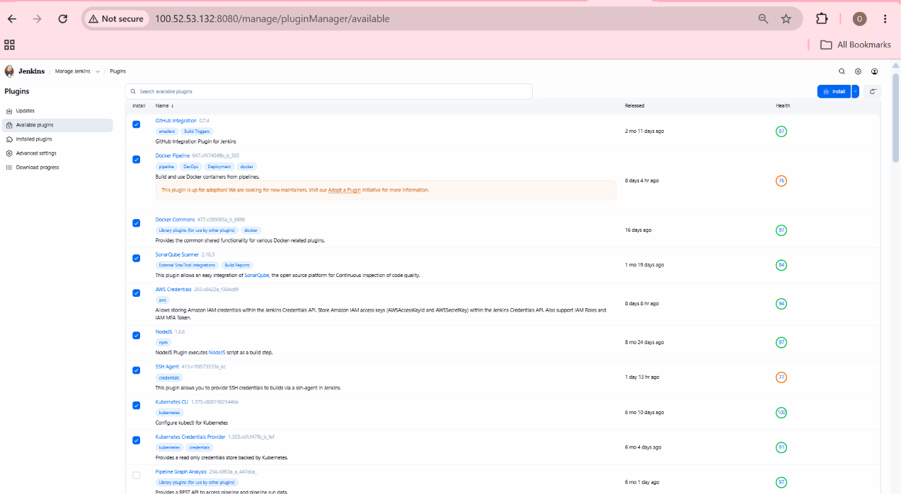

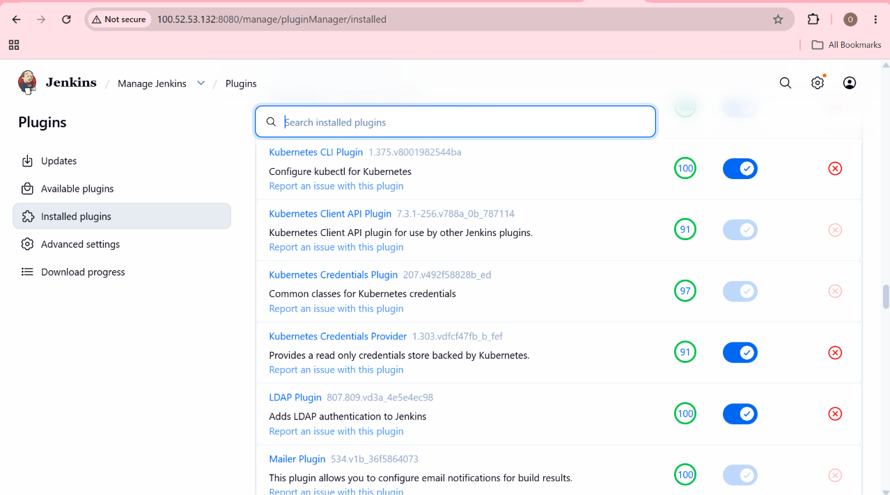

---

## Section 5 — Configure Global Tools

### Overview

After installing the required Jenkins plugins, the next step was to configure the global build tools that Jenkins will use during pipeline execution.

Jenkins **Global Tool Configuration** provides a centralized mechanism for managing development tools that are shared across all jobs and pipelines. Instead of relying on manually configured binaries or hardcoded file paths, Jenkins can automatically locate, install, and inject the required tools into the build environment whenever they are needed.

For this project, the following tools were configured:

- OpenJDK 21
- Node.js 18 LTS
- SonarScanner

These tools provide the runtime environments required for application execution, dependency management, static code analysis, and CI/CD pipeline automation.

Using Global Tool Configuration improves consistency, portability, and maintainability by ensuring that every pipeline executes using the same tool versions.

---

### Why Configure Global Tools?

A CI/CD pipeline should be reproducible regardless of where or when it runs. Rather than depending on manually installed software or absolute system paths, Jenkins manages build tools centrally and makes them available to pipelines through predefined tool names.

This approach provides several advantages:

| Benefit | Description |
|----------|-------------|
| **Centralized Tool Management** | Maintains all build tools from a single configuration page within Jenkins. |
| **Consistent Build Environment** | Ensures every pipeline uses the same tool versions across all builds. |
| **Simplified Jenkinsfiles** | Allows pipelines to reference tools by logical names instead of hardcoded system paths. |
| **Pipeline Portability** | Enables Jenkinsfiles to run consistently across different Jenkins environments. |
| **Reduced Configuration Errors** | Eliminates manual path configuration and minimizes version mismatches. |
| **Automatic Tool Provisioning** | Supports automatic installation of compatible tools when required. |

---

### Tools Configured

The following tools were configured in **Global Tool Configuration**.

| Tool | Version | Purpose |
|------|---------|---------|
| **JDK** | OpenJDK 21 | Provides the Java runtime required by Jenkins and Java-based utilities such as SonarScanner. |
| **Node.js** | Node.js 18 LTS | Executes Node.js applications, installs dependencies, and runs automated unit tests. |
| **SonarScanner** | Latest Available | Performs static code analysis and uploads quality reports to SonarCloud. |

---

### Navigation

Global Tool Configuration can be accessed from the Jenkins dashboard using the following navigation path:

```text
Dashboard
    └── Manage Jenkins
            └── Tools
```

From this page, each required development tool was configured before creating the CI/CD pipeline.

---

## JDK Configuration

### Overview

Jenkins itself runs on Java, and several components within the DevSecOps pipeline—including SonarScanner—also require a Java Runtime Environment.

Since **OpenJDK 21** was already installed during the Jenkins installation phase, Jenkins was configured to use the existing system installation rather than downloading another JDK automatically.

### Configuration

| Setting | Value |
|----------|-------|
| **Name** | `jdk21` |
| **Automatically Install** | Disabled |
| **Java Installation** | Existing OpenJDK 21 system installation |

### Why Disable Automatic Installation?

Automatic installation was intentionally disabled because the Jenkins server already contains a verified installation of OpenJDK 21.

Using the existing system installation provides several advantages:

- Avoids unnecessary downloads during pipeline execution.
- Ensures Jenkins and pipeline tools use the same Java runtime.
- Simplifies version management.
- Reduces external dependencies.
- Improves build consistency.

---

## Node.js Configuration

### Overview

The **NodeJS Plugin** was used to configure the Node.js runtime required by the project.

Node.js enables Jenkins to execute JavaScript applications, install project dependencies, and run automated unit tests using npm.

Unlike the JDK, Node.js was configured for automatic installation, allowing Jenkins to download and manage the specified version whenever it is required.

### Configuration

| Setting | Value |
|----------|-------|
| **Name** | `node18` |
| **Version** | Node.js 18 LTS |
| **Automatically Install** | Enabled |

### Why Enable Automatic Installation?

Using automatic installation provides several operational benefits:

- Ensures a consistent Node.js version across all pipelines.
- Simplifies Jenkins administration.
- Eliminates manual software maintenance.
- Enables reproducible builds across Jenkins agents.
- Keeps Node.js centrally managed by Jenkins.

---

## SonarScanner Configuration

### Overview

The **SonarQube Scanner Plugin** was configured to enable Jenkins to perform **Static Application Security Testing (SAST)** during pipeline execution.

SonarScanner analyzes the application source code for bugs, vulnerabilities, security hotspots, and code quality issues before deployment.

The analysis results are automatically uploaded to **SonarCloud**, where quality gates determine whether the pipeline should continue.

### Configuration

| Setting | Value |
|----------|-------|
| **Name** | `sonar-scanner` |
| **Automatically Install** | Enabled |
| **Version** | Latest Available |

### Why Configure SonarScanner?

Integrating SonarScanner into Jenkins provides several advantages:

- Performs automated static code analysis.
- Detects bugs and security vulnerabilities early.
- Enforces quality gate policies.
- Improves code quality before deployment.
- Integrates seamlessly with SonarCloud dashboards.

---

## Pipeline Integration

The configured tools will later be referenced directly within the project's `Jenkinsfile` using the Jenkins `tools` directive.

Example:

```groovy
tools {
    jdk 'jdk21'
    nodejs 'node18'
}
```

This allows Jenkins to automatically provision the required tool versions before executing each pipeline stage.

---

## Verification

After saving the **Global Tool Configuration**, Jenkins successfully recognized each configured tool.

Verification confirmed that:

- ✅ OpenJDK 21 was successfully registered.
- ✅ Node.js 18 LTS was configured for automatic installation.
- ✅ SonarScanner was configured successfully.
- ✅ All tool definitions were available for use within Jenkins pipelines.

The Jenkins environment is now prepared for configuring credentials and implementing the automated CI/CD and DevSecOps pipeline.

---

## Screenshots

The following screenshots document the successful configuration of Jenkins Global Tools.

### JDK21 Installation

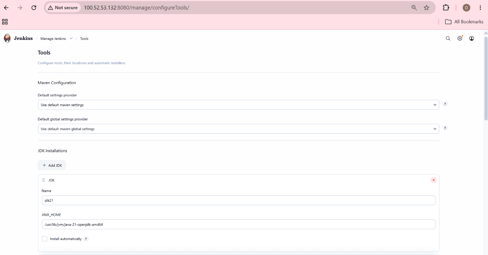

---

### Nodejs Installation

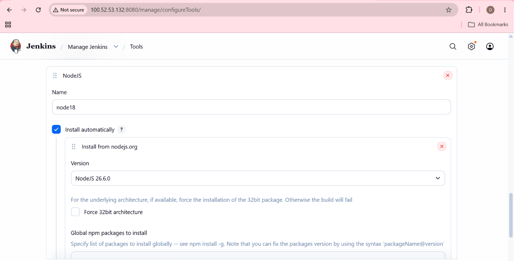


---

### SonarScanner Installation

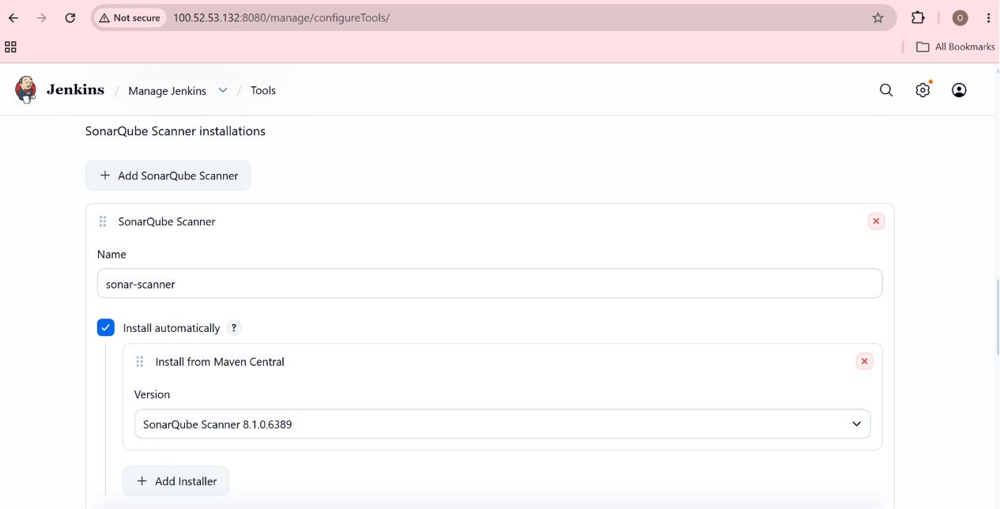

---

## Section 6 — Configure Credentials

### Overview

Modern CI/CD and DevSecOps pipelines require secure authentication when interacting with external platforms and cloud services. Rather than embedding sensitive information directly into pipeline scripts or source code, Jenkins provides a centralized **Credentials Store** for securely managing secrets.

For this project, credentials were configured before implementing the CI/CD pipeline to enable Jenkins to authenticate with Amazon Web Services (AWS), SonarCloud, and Snyk without exposing sensitive information.

Each credential is encrypted within Jenkins and can be securely referenced from the `Jenkinsfile` during pipeline execution. This approach aligns with security best practices by separating secrets from application code while providing controlled access to external services.

---

### Why Use Jenkins Credentials?

Storing secrets in the Jenkins Credentials Store provides several operational and security advantages.

| Benefit | Description |
|----------|-------------|
| **Enhanced Security** | Prevents sensitive information from being stored in source code or Git repositories. |
| **Encrypted Storage** | Jenkins encrypts credentials before storing them on the server. |
| **Centralized Management** | Credentials are managed from a single location and can be reused across multiple pipelines. |
| **Secure Pipeline Integration** | Secrets can be injected into pipeline stages only when required. |
| **Simplified Maintenance** | Updating a credential in Jenkins automatically applies to all pipelines that reference it. |
| **Supports Least Privilege** | Credentials can be scoped and managed according to organizational security policies. |

---

### Credentials Configured

The following credentials were configured within the Jenkins Global Credentials Store to provide secure authentication with external services used throughout the CI/CD and DevSecOps pipeline. Each credential is assigned a unique identifier (ID), allowing it to be referenced securely within the Jenkinsfile without exposing sensitive information.


| Credential | Type | Purpose |
|------------|------|---------|
| **AWS Credentials** | AWS Credentials | Authenticates Jenkins with Amazon Web Services for interactions with Amazon Elastic Container Registry (ECR) and Amazon Elastic Kubernetes Service (EKS). |
| **SonarCloud Token** | Secret Text | Authenticates Jenkins with SonarCloud to perform Static Application Security Testing (SAST) and publish code quality reports. |
| **Snyk API Token** | Secret Text | Authenticates Jenkins with Snyk to perform Software Composition Analysis (SCA) and dependency vulnerability scanning. |

---

### Navigation

Credentials were configured from the Jenkins dashboard using the following navigation path:

```text
Dashboard
    └── Manage Jenkins
            └── Credentials
                    └── System
                            └── Global credentials (unrestricted)
```

The **Global Credentials Store** provides a centralized location for securely managing authentication information used by Jenkins pipelines.

---

## Configured Credentials

### AWS Credentials

#### Overview

AWS Credentials enable Jenkins to securely authenticate with Amazon Web Services without embedding access keys in the pipeline.

These credentials will later be used to:

- Authenticate with Amazon Elastic Container Registry (Amazon ECR)
- Push Docker images to Amazon ECR
- Access Amazon Elastic Kubernetes Service (Amazon EKS)
- Deploy applications to Kubernetes

#### Configuration

| Setting | Value |
|----------|-------|
| **Kind** | AWS Credentials |
| **Scope** | Global |
| **ID** | `aws-credentials` |
| **Description** | AWS credentials for Amazon ECR and Amazon EKS |

---

### SonarCloud Token

#### Overview

SonarCloud requires an authentication token before Jenkins can submit source code for static code analysis.

The token enables Jenkins to publish analysis reports, enforce quality gates, and retrieve code quality metrics.

#### Configuration

| Setting | Value |
|----------|-------|
| **Kind** | Secret Text |
| **Scope** | Global |
| **ID** | `SONAR_TOKEN` |
| **Description** | SonarCloud authentication token |

---

### Snyk API Token

#### Overview

Snyk uses an API token to authenticate Jenkins before performing dependency vulnerability scanning.

During pipeline execution, Jenkins will use this credential to identify known vulnerabilities in application dependencies and open-source packages.

#### Configuration

| Setting | Value |
|----------|-------|
| **Kind** | Secret Text |
| **Scope** | Global |
| **ID** | `SNYK_TOKEN` |
| **Description** | Snyk API authentication token |

---

## Pipeline Integration

After the credentials were configured, Jenkins became capable of securely authenticating with AWS, SonarCloud, and Snyk during pipeline execution. Rather than storing secrets in source code, the Jenkinsfile references each credential by its unique Credentials ID. Jenkins injects the required secret only for the duration of the pipeline stage, ensuring sensitive information remains protected throughout the CI/CD process.

The following example demonstrates how Jenkins securely injects secret text credentials into the pipeline environment during execution.

Example:

```groovy
withCredentials([
    string(credentialsId: 'SONAR_TOKEN', variable: 'SONAR_TOKEN'),
    string(credentialsId: 'SNYK_TOKEN', variable: 'SNYK_TOKEN')
]) {
    // Pipeline stages
}
```

AWS credentials will also be referenced by their configured **Credentials ID** during authentication with Amazon Web Services.

This approach ensures that sensitive information is injected into the pipeline only when required and is never exposed in source code or build logs.

---

## Verification

After saving each credential, Jenkins successfully listed them within the **Global Credentials Store**.

Verification confirmed that:

- ✅ AWS Credentials were successfully configured.
- ✅ SonarCloud authentication token was stored securely.
- ✅ Snyk API token was stored securely.
- ✅ All credentials were available for use during pipeline execution.

With all required credentials successfully configured and verified, the Jenkins environment is fully prepared to authenticate securely with AWS, SonarCloud, and Snyk throughout the remaining stages of the CI/CD and DevSecOps pipeline.
---

## Screenshots

The following screenshots confirm the successful configuration of Jenkins credentials.

### Credentials Dashboard


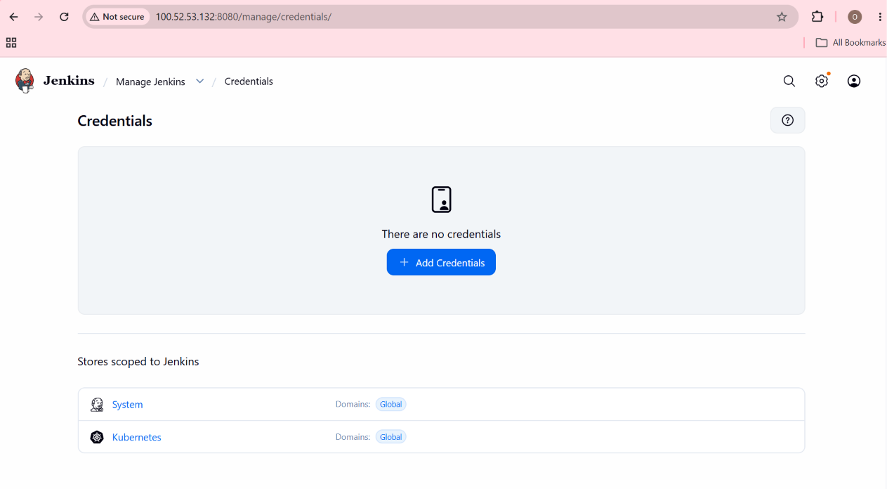

---

### AWS Credentials


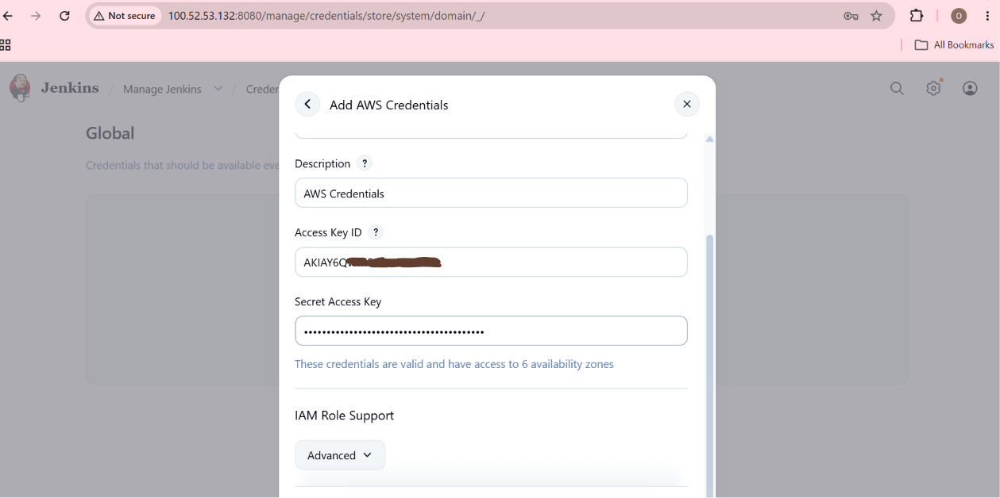


---

### SonarCloud Token


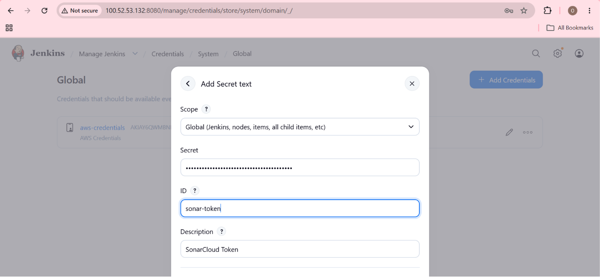

---

### Snyk API Token


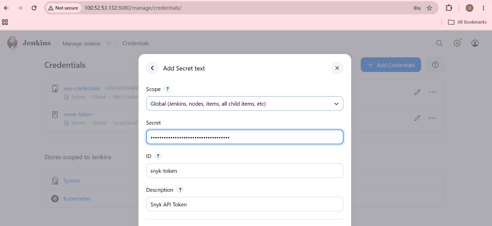

---

### Configured Credentials

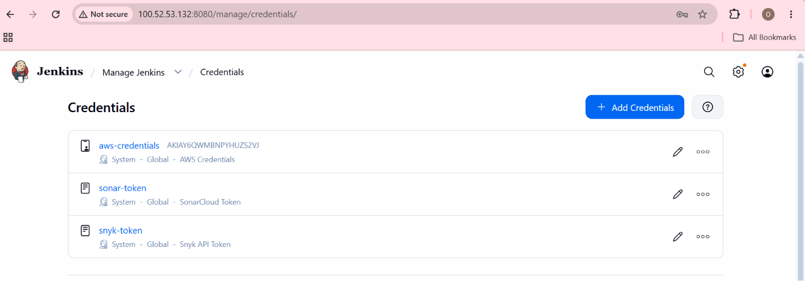

---

## Section 7 — Integrate SonarCloud

### Overview

Static Application Security Testing (SAST) plays an important role in modern DevSecOps pipelines by identifying bugs, code smells, security vulnerabilities, and maintainability issues before an application is deployed.

For this project, SonarCloud was integrated with Jenkins to provide automated static code analysis during every pipeline execution. Rather than relying on manual code reviews alone, Jenkins will automatically submit the application's source code to SonarCloud, where it is analyzed against a comprehensive set of quality and security rules.

Integrating SonarCloud early in the pipeline ensures that code quality issues are detected before containerization and deployment, reducing technical debt and improving software reliability.

---

### Why SonarCloud?

SonarCloud is a cloud-based static application security testing (SAST) platform that continuously analyzes source code for bugs, security vulnerabilities, code smells, and maintainability issues. Integrating SonarCloud into the Jenkins CI/CD pipeline ensures that every code change is automatically inspected before progressing to later stages such as containerization and deployment.

| Benefit | Description |
|----------|-------------|
| **Continuous Code Analysis** | Automatically analyzes the source code during every Jenkins pipeline execution, ensuring continuous feedback on code quality. |
| **Security Detection** | Detects common security vulnerabilities and coding weaknesses early in the development lifecycle. |
| **Code Quality Metrics** | Measures maintainability, reliability, code coverage, duplication, and technical debt to help maintain high-quality code. |
| **Quality Gates** | Enforces predefined quality standards and can stop the pipeline when critical issues or failed quality thresholds are detected. |
| **Centralized Reporting** | Provides interactive dashboards for tracking code quality, security issues, and project trends over time. |
| **CI/CD Integration** | Integrates seamlessly with Jenkins, enabling automated code analysis as part of the continuous integration workflow. |

> **Best Practice**
>
> Running SonarCloud immediately after dependency installation and unit testing allows code quality issues to be identified early, preventing vulnerable or low-quality code from progressing further through the DevSecOps pipeline.

---

### Prerequisites

Before integrating **SonarCloud** with Jenkins, the following prerequisites were completed to ensure secure authentication and successful code analysis during the CI/CD pipeline.

| Requirement | Status |
|-------------|:------:|
| SonarCloud Account Created | ✅ Completed |
| SonarCloud Organization Configured | ✅ Completed |
| SonarCloud Project Created | ✅ Completed |
| SonarCloud Authentication Token Generated | ✅ Completed |
| SonarScanner Installed in Jenkins | ✅ Completed |
| SonarQube Scanner Plugin Installed | ✅ Completed |
| `SONAR_TOKEN` Stored in Jenkins Credentials | ✅ Completed |

> **Note**
>
> These prerequisites ensure that Jenkins can securely authenticate with SonarCloud and execute automated static code analysis during every pipeline run without exposing sensitive credentials in the Jenkinsfile.

---

## Step 1 — Create a SonarCloud Project

### Overview

The first step in the SonarCloud integration process was to create a project that corresponds to the GitHub repository containing the application source code.

This project acts as the centralized destination for all static code analysis results generated during the Jenkins CI/CD pipeline. Each time the pipeline executes, Jenkins uploads the analysis results to SonarCloud, where they are processed and displayed through interactive dashboards and quality reports.

To streamline the integration, the SonarCloud project was linked directly to the GitHub repository. This connection enables SonarCloud to associate analysis results with the correct repository and provides a single location for monitoring code quality, security vulnerabilities, code smells, maintainability metrics, and Quality Gate status throughout the software development lifecycle.

### Objective

- Create a dedicated SonarCloud project for the application.
- Link the project to the GitHub repository.
- Prepare the project to receive automated analysis results from Jenkins.
- Establish the foundation for continuous code quality monitoring within the DevSecOps pipeline.

### Outcome

After completing this step:

- ✅ A SonarCloud project was successfully created.
- ✅ The project was connected to the GitHub repository.
- ✅ The project was ready to receive automated code analysis results from Jenkins.
- ✅ The foundation for continuous code quality and security analysis was established.

---

### Screenshot

Sonarcloud Project Created

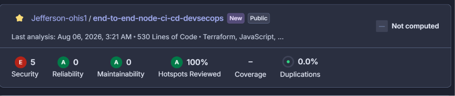

> SonarCloud project successfully created and linked to the GitHub repository.

---## Step 2 — Generate a SonarCloud Authentication Token

### Overview

To enable secure communication between Jenkins and SonarCloud, an authentication token was generated from the **SonarCloud Security** settings.

Rather than embedding credentials directly within the Jenkins pipeline, the token was securely stored in the **Jenkins Global Credentials Store** as a **Secret Text** credential. During pipeline execution, Jenkins retrieves the token securely and uses it to authenticate with SonarCloud before uploading the source code analysis results.

This approach follows DevSecOps best practices by protecting sensitive credentials while enabling automated static application security testing (SAST) within the CI/CD pipeline.

### Objective

- Generate a secure authentication token from SonarCloud.
- Store the token securely in Jenkins Credentials.
- Enable authenticated communication between Jenkins and SonarCloud.
- Eliminate the need to expose secrets within the Jenkinsfile or source code.

### Security Benefits

- Secure authentication between Jenkins and SonarCloud.
- Prevents hardcoding sensitive credentials in pipeline scripts.
- Centralizes credential management within Jenkins.
- Supports secure, automated code analysis in every pipeline execution.

### Outcome

After completing this step:

- ✅ A SonarCloud authentication token was successfully generated.
- ✅ The token was securely stored as a **Secret Text** credential in Jenkins.
- ✅ Jenkins was configured to authenticate securely with SonarCloud.
- ✅ The CI/CD pipeline was prepared to publish code analysis results automatically.

---

## Step 3 — Verify the SonarQube Scanner Plugin

### Overview

The **SonarQube Scanner** plugin is required to enable Jenkins to execute SonarCloud static code analysis as part of the CI/CD pipeline.

As the plugin was previously installed during the **Jenkins Plugin Configuration** phase (**Section 4**), no additional installation or configuration was required at this stage. Instead, this step verifies that the plugin is available and ready for use within the pipeline.

The plugin provides the integration layer between Jenkins and SonarCloud, allowing pipeline jobs to initiate code analysis and publish the results to the SonarCloud project.

> **Note**
>
> The installation procedure for the **SonarQube Scanner** plugin is documented in **Section 4 — Configure Jenkins Plugins** and is therefore not repeated here.

### Purpose

- Verify that the SonarQube Scanner plugin is installed.
- Confirm that Jenkins is capable of executing SonarCloud analysis.
- Ensure the CI/CD pipeline is prepared for automated static application security testing (SAST).

### Outcome

After completing this verification:

- ✅ The SonarQube Scanner plugin was confirmed to be installed.
- ✅ Jenkins was ready to communicate with SonarCloud.
- ✅ The pipeline was prepared to execute automated source code analysis during every build.

---

### Reference

📖 **See:** **Section 4 — Configure Jenkins Plugins** for the complete installation and configuration of the **SonarQube Scanner** plugin.

---

## Step 4 — Configure the SonarCloud Server in Jenkins

### Overview

After generating the authentication token and verifying the required Jenkins plugin, the next step was to configure the **SonarCloud server** within Jenkins.

This configuration establishes the connection between Jenkins and SonarCloud, allowing pipeline jobs to securely authenticate and publish static code analysis results during each build.

The server configuration references the **`SONAR_TOKEN`** stored in the Jenkins Credentials Store, ensuring that sensitive authentication information is never exposed in the pipeline code.

### Navigation

```text
Dashboard
└── Manage Jenkins
    └── System
        └── SonarQube Servers
```

### Configuration

Configure the SonarCloud server using the following settings:

| Setting | Value |
|---------|-------|
| **Name** | `SonarCloud` |
| **Server URL** | `https://sonarcloud.io` |
| **Server Authentication Token** | `SONAR_TOKEN` |
| **Environment Variables** | **Enabled** |

> **Note**
>
> The **Server Authentication Token** should reference the **`SONAR_TOKEN`** credential stored in the Jenkins Global Credentials Store rather than the raw token value. This follows security best practices by preventing sensitive credentials from being exposed within Jenkins configuration or pipeline scripts.

### Outcome

After completing this configuration:

- ✅ Jenkins was successfully connected to SonarCloud.
- ✅ Secure authentication was configured using the stored `SONAR_TOKEN` credential.
- ✅ SonarCloud became available for use by Jenkins pipeline jobs.
- ✅ The CI/CD pipeline was ready to publish automated static code analysis results.

---

## Step 5 — Verify the SonarScanner Installation

### Overview

The **SonarScanner** tool is responsible for performing source code analysis and sending the results to SonarCloud during pipeline execution.

The SonarScanner installation was previously configured during the **Global Tool Configuration** phase (**Section 4**). Therefore, this step simply verifies that the existing configuration is available for use by the Jenkins pipeline and does not require any additional installation.

### Navigation

```text
Dashboard
└── Manage Jenkins
    └── Tools
        └── SonarScanner
```

### Configuration

Verify that the SonarScanner installation is configured with the following settings:

| Setting | Value |
|---------|-------|
| **Name** | `SonarScanner` |
| **Install Automatically** | **Enabled** |

> **Note**
>
> The complete installation and configuration of **SonarScanner** is documented in **Section 4 — Configure Global Tools**. This section references the existing configuration and confirms that it is available for the SonarCloud integration.

### Purpose

- Verify that SonarScanner is configured in Jenkins.
- Confirm that Jenkins can invoke SonarScanner during pipeline execution.
- Ensure the pipeline is ready to perform automated static code analysis.

### Outcome

After completing this verification:

- ✅ The SonarScanner installation was confirmed to be available in Jenkins.
- ✅ Automatic installation was enabled.
- ✅ Jenkins was ready to execute SonarCloud analysis from the pipeline.
- ✅ No additional configuration was required.

---

### Reference

📖 **See:** **Section 4 — Configure Global Tools** for the complete SonarScanner installation and configuration.

---

## Step 6 — Verify the SonarCloud Integration

### Overview

The final step was to verify that Jenkins was successfully configured to communicate with SonarCloud. This verification ensures that all required components—including the server configuration, authentication credentials, and SonarScanner installation—are correctly configured before executing the CI/CD pipeline.

Successful verification confirms that Jenkins is ready to perform automated static application security testing (SAST) and publish code analysis results to SonarCloud during every pipeline execution.

### Verification Checklist

The following items were successfully verified:

| Verification Item | Status |
|-------------------|:------:|
| SonarCloud server configuration successfully saved | ✅ Verified |
| Jenkins recognized the configured SonarScanner installation | ✅ Verified |
| `SONAR_TOKEN` authentication credential available | ✅ Verified |
| Jenkins ready to submit analysis reports to SonarCloud | ✅ Verified |
| SonarCloud integration completed successfully | ✅ Verified |

### Outcome

After completing the verification:

- ✅ Jenkins successfully recognized the SonarCloud server configuration.
- ✅ Secure authentication was confirmed using the stored `SONAR_TOKEN` credential.
- ✅ SonarScanner was available for pipeline execution.
- ✅ Jenkins was fully prepared to publish static code analysis results to SonarCloud.
- ✅ The SonarCloud integration was successfully completed and ready for use within the DevSecOps pipeline.

> **Next Step**
>
> With the integration verified, the next phase is to update the **Jenkins pipeline (Jenkinsfile)** to execute a SonarCloud scan automatically during every pipeline run. This enables continuous code quality inspection and enforces **Quality Gates** before the application progresses to subsequent stages such as container image scanning and deployment.

---

## Pipeline Integration

### Overview

With the SonarCloud server successfully configured in Jenkins, it can now be referenced directly from the **Jenkinsfile** to perform automated static code analysis during every pipeline execution.

Jenkins uses the **`withSonarQubeEnv()`** pipeline step to load the configured SonarCloud server settings and authentication credentials into the pipeline environment. This allows the **SonarScanner** to communicate securely with SonarCloud without exposing sensitive information such as authentication tokens.

### Example Pipeline Configuration

The following example illustrates how the configured SonarCloud server is referenced within a Jenkins pipeline:

```groovy
withSonarQubeEnv('SonarCloud') {
    sh """
    sonar-scanner \
      -Dsonar.projectKey=YOUR_PROJECT_KEY \
      -Dsonar.organization=YOUR_ORGANIZATION \
      -Dsonar.sources=app
    """
}
```

> **Note**
>
> The values shown above are placeholders provided for illustration purposes. In the actual implementation, the project key, organization, and additional scanner properties will be configured to match this project's SonarCloud settings.

### How It Works

When the pipeline reaches the SonarCloud analysis stage:

1. Jenkins loads the **SonarCloud** server configuration defined in **Manage Jenkins → System**.
2. The stored **`SONAR_TOKEN`** credential is injected securely into the pipeline environment.
3. **SonarScanner** analyzes the application source code.
4. The analysis results are uploaded to SonarCloud.
5. SonarCloud evaluates the project against its configured **Quality Gate** and publishes the results to the project dashboard.

### Reference

> **Implementation Notice**
>
> This section introduces the Jenkins pipeline integration concept only. The complete implementation—including the production-ready `Jenkinsfile`, pipeline stages, SonarScanner configuration, and Quality Gate integration—is covered in **Section 9 — Create Jenkinsfile**.

### Outcome

After completing this section:

- ✅ Jenkins was prepared to invoke SonarCloud from the pipeline.
- ✅ The method for referencing the configured SonarCloud server was established.
- ✅ The foundation for automated static code analysis within the DevSecOps pipeline was completed.
- ✅ The detailed pipeline implementation was deferred to **Section 9 — Create Jenkinsfile**.

---

## Verification

### Integration Status

The SonarCloud integration has been successfully completed, and Jenkins is fully prepared to perform automated **Static Application Security Testing (SAST)** as part of the CI/CD pipeline.

All required components—including the SonarCloud server configuration, authentication credentials, and SonarScanner installation—have been verified and are ready for use during pipeline execution.

### Verification Summary

| Verification Item | Status |
|-------------------|:------:|
| SonarCloud project configured | ✅ Verified |
| Jenkins connected to SonarCloud | ✅ Verified |
| Authentication configured using `SONAR_TOKEN` | ✅ Verified |
| SonarScanner available in Jenkins | ✅ Verified |
| SonarCloud server configuration validated | ✅ Verified |
| Ready for pipeline integration | ✅ Verified |

### Outcome

At this stage, the environment is fully prepared to perform automated **Static Application Security Testing (SAST)** during every Jenkins pipeline execution.

Once the **Jenkinsfile** is implemented in **Section 9 — Create Jenkinsfile**, the pipeline will automatically:

- Analyze the application's source code using SonarCloud.
- Detect bugs, security vulnerabilities, and code smells.
- Measure code quality metrics such as maintainability, reliability, and technical debt.
- Evaluate the project against the configured **Quality Gate**.
- Publish detailed analysis results to the SonarCloud dashboard.
- Prevent code that fails Quality Gate requirements from progressing through the DevSecOps pipeline.

> **Section Summary**
>
> In this section, Jenkins was successfully integrated with SonarCloud by configuring secure authentication, verifying the required plugins and tools, and establishing the server connection. The environment is now ready to incorporate automated code quality and security analysis into the CI/CD workflow, laying the foundation for continuous code inspection throughout the DevSecOps pipeline.

---

## Section 8 — Integrate Snyk

### Overview

Modern applications are built using hundreds or even thousands of open-source libraries. While these dependencies accelerate software development, they can also introduce known security vulnerabilities and licensing risks into the application.

To mitigate these risks, **Snyk** is integrated into the Jenkins CI/CD pipeline to perform **Software Composition Analysis (SCA)**. Snyk continuously scans project dependencies against its extensive vulnerability database, identifying insecure packages, outdated libraries, and license compliance issues before the application reaches production.

Unlike **SonarCloud**, which focuses on analyzing the application's source code, **Snyk** focuses on securing the software supply chain by analyzing the third-party packages that the application depends on.

Together, SonarCloud and Snyk provide complementary layers of security within the DevSecOps pipeline:

- **SonarCloud (SAST)** analyzes the application's source code for bugs, code smells, security vulnerabilities, and maintainability issues.
- **Snyk (SCA)** analyzes third-party dependencies for known vulnerabilities, outdated packages, and license compliance risks.

By integrating both tools into Jenkins, every pipeline execution validates not only the quality of the application's code but also the security of its external dependencies, providing a more comprehensive security posture before deployment.

---

### Why Snyk?

Snyk enhances the DevSecOps pipeline by continuously monitoring application dependencies and helping developers identify and remediate security risks early in the software development lifecycle.

| Benefit | Description |
|----------|-------------|
| **Software Composition Analysis (SCA)** | Detects known security vulnerabilities in third-party libraries and open-source dependencies. |
| **Dependency Monitoring** | Continuously monitors dependencies for newly disclosed vulnerabilities throughout the application lifecycle. |
| **Security Recommendations** | Provides actionable remediation advice, upgrade paths, and fixed package versions. |
| **CI/CD Integration** | Integrates seamlessly with Jenkins to automate dependency security scanning during every pipeline execution. |
| **Early Detection** | Identifies vulnerable dependencies before containerization, deployment, or production release. |

> **Best Practice**
>
> Combining **SonarCloud** and **Snyk** provides comprehensive application security. SonarCloud protects the application's source code through **Static Application Security Testing (SAST)**, while Snyk protects the software supply chain through **Software Composition Analysis (SCA)**.

---

### Prerequisites

Before configuring the Jenkins integration, the following prerequisites had already been completed.

| Requirement | Status |
|-------------|:------:|
| Snyk account created | ✅ Completed |
| `SNYK_TOKEN` stored in Jenkins Credentials | ✅ Completed |
| Snyk Security plugin installed | ✅ Completed |
| Jenkins administrator access | ✅ Available |

> **Note**
>
> Since these prerequisites were completed in earlier sections, this section focuses solely on configuring and verifying the Jenkins-to-Snyk integration.

---

## Configure the Snyk Server in Jenkins

### Overview

After verifying the prerequisites, Jenkins was configured to authenticate with Snyk using the previously created **`SNYK_TOKEN`** credential stored in the Jenkins Credentials Store.

This configuration enables Jenkins to communicate securely with Snyk without exposing sensitive authentication information within the pipeline.

### Navigation

```text
Dashboard
└── Manage Jenkins
    └── System
        └── Snyk
```

### Configuration

Configure the Snyk integration using the following settings.

| Setting | Value |
|---------|-------|
| **Credential** | `SNYK_TOKEN` |
| **Organization** | *Your Snyk Organization* |
| **Plugin** | `Snyk Security` |
| **Authentication** | Secret Text Credential |

> **Security Note**
>
> Jenkins references the stored **`SNYK_TOKEN`** credential instead of the raw API token. This follows security best practices by ensuring authentication secrets remain encrypted and are never hardcoded within the Jenkins configuration or pipeline scripts.

---

## Pipeline Integration

### Overview

Once the Snyk integration has been configured, the stored credential can be referenced securely within the Jenkins pipeline using the Jenkins Credentials Binding mechanism.

The following example demonstrates how Jenkins authenticates with Snyk before executing dependency vulnerability scans.

### Example Pipeline Configuration

```groovy
withCredentials([
    string(credentialsId: 'SNYK_TOKEN', variable: 'SNYK_TOKEN')
]) {
    sh 'snyk auth $SNYK_TOKEN'
}
```

> **Implementation Notice**
>
> The example above demonstrates only the authentication process. The complete Snyk dependency scanning stages—including authentication, vulnerability scanning, report generation, and build policies—will be implemented in **Section 9 — Create Jenkinsfile**.

### How It Works

1. Jenkins securely retrieves the stored `SNYK_TOKEN` credential.
2. The token is injected into the pipeline as an environment variable.
3. Jenkins authenticates with Snyk.
4. Subsequent pipeline stages can execute Software Composition Analysis (SCA) against the application's dependencies.

---

## Verification

### Integration Status

After saving the Jenkins configuration, the integration was successfully verified.

The verification confirmed that Jenkins can authenticate securely with Snyk and is ready to perform automated dependency security scanning during pipeline execution.

### Verification Checklist

| Verification Item | Status |
|-------------------|:------:|
| Snyk Security plugin installed | ✅ Verified |
| `SNYK_TOKEN` credential recognized | ✅ Verified |
| Authentication with Snyk successful | ✅ Verified |
| Jenkins ready for pipeline execution | ✅ Verified |

### Outcome

After completing this verification:

- ✅ Jenkins successfully authenticated with Snyk.
- ✅ Secure credential management was confirmed.
- ✅ The Snyk integration was fully operational.
- ✅ Jenkins was prepared to perform automated **Software Composition Analysis (SCA)**.
- ✅ The environment was ready for the Jenkins pipeline implementation in **Section 9 — Create Jenkinsfile**.

---


### Screenshots

**Snyk Security Plugin Installed in Jenkins**

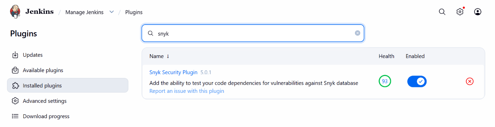


**Snyk configuration**

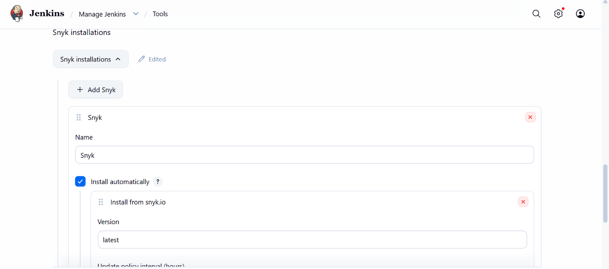


**Snyk Credential Page**

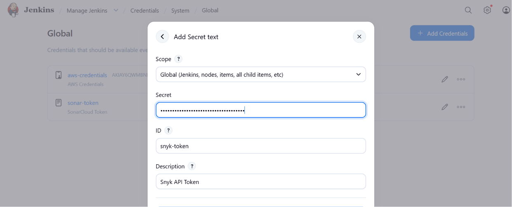


> **Section Summary**
>
> In this section, Jenkins was successfully integrated with Snyk by configuring secure authentication using the stored `SNYK_TOKEN` credential and verifying the connection. This establishes the **Software Composition Analysis (SCA)** layer of the DevSecOps pipeline. In the next section, the Jenkinsfile will be created to automate dependency vulnerability scanning alongside SonarCloud analysis, container security scanning, and deployment.

---

## Section 9 — Jenkinsfile and Jenkins Pipeline Implementation

### Section 9.1 Create the Jenkins Pipeline Job

### Overview

Before implementing the CI/CD and DevSecOps workflow, a dedicated **Jenkins Pipeline** job was created to automate the application's software delivery lifecycle.

Unlike a traditional **Freestyle Project**, a Pipeline job executes a sequence of automated stages—including application build, testing, security scanning, containerization, and deployment—that are defined within a version-controlled **`Jenkinsfile`**.

This approach follows the principles of **Pipeline as Code (PaC)**, where the entire CI/CD workflow is maintained alongside the application's source code. As a result, pipeline logic can be version-controlled, peer-reviewed, audited, and evolved using the same Git-based workflow as the application itself.

Creating the Pipeline job establishes the operational foundation required to implement, execute, and continuously evolve the automated CI/CD and DevSecOps workflow throughout the remainder of the project.

---

## Why Use a Pipeline Job?

Jenkins Pipelines provide a modern, scalable, and maintainable approach to build automation compared to traditional Freestyle jobs.

| Benefit | Description |
|----------|-------------|
| **Pipeline as Code** | Stores the complete CI/CD workflow in a version-controlled `Jenkinsfile`. |
| **Automation** | Automates application build, testing, security scanning, containerization, and deployment. |
| **Version Control** | Pipeline changes are tracked through Git commits alongside application source code. |
| **Reproducibility** | Every pipeline execution follows the same sequence of stages. |
| **Maintainability** | Pipeline logic can be updated without manually modifying Jenkins jobs. |
| **Scalability** | Easily extended to support additional build, testing, security, deployment, and monitoring stages. |
| **Collaboration** | Pipeline definitions can be reviewed and approved through standard Git workflows. |

---

## Freestyle Job vs Pipeline Job

For this project, a **Pipeline Job** was selected instead of a traditional Freestyle Project.

| Feature | Freestyle Project | Pipeline Job |
|----------|------------------|--------------|
| Build configuration | Jenkins UI | `Jenkinsfile` |
| Version controlled | ❌ | ✅ |
| Supports multiple stages | Limited | ✅ |
| Infrastructure as Code | ❌ | ✅ |
| Suitable for DevSecOps | Limited | ✅ |
| Recommended by Jenkins | No | Yes |

Because this project implements an enterprise CI/CD and DevSecOps workflow, the Pipeline Job provides significantly greater flexibility and maintainability.

---

## Create a New Pipeline Job

### Navigation

```text
Dashboard
    └── New Item
```

A new Jenkins Pipeline project was created using the following configuration.

| Setting | Value |
|----------|-------|
| **Item Name** | `nodejs-devsecops-pipeline` |
| **Item Type** | Pipeline |

After entering the project name and selecting **Pipeline**, the project was created by clicking **OK**.

---

## General Configuration

After creating the Pipeline job, the project description and GitHub repository were configured to improve project identification and traceability.

## Project Description

| Setting | Value |
|----------|-------|
| **Description** | End-to-End Node.js CI/CD & DevSecOps Pipeline |

Providing a descriptive project summary makes the Jenkins dashboard easier to understand and maintain, particularly when managing multiple pipeline jobs.

---

## GitHub Project

The **GitHub Project** option was enabled to associate the Jenkins Pipeline with the project's GitHub repository.

| Setting | Value |
|----------|-------|
| **GitHub Project** | Enabled |
| **Project URL** | `https://github.com/Jefferson-ohis1/end-to-end-node-ci-cd-devsecops` |

Linking Jenkins to GitHub provides quick navigation between both platforms and improves project traceability.

---

## Build Triggers

At this stage of the project, **automatic build triggers were intentionally left disabled**.

The following trigger options were not selected:

- GitHub hook trigger for GITScm polling
- Poll SCM
- Build periodically

---

## Why Build Triggers Were Not Enabled

The GitHub webhook trigger was intentionally deferred because the CI/CD pipeline had not yet been implemented.

At this stage:

- The `Jenkinsfile` had not yet been created.
- Pipeline stages had not yet been implemented.
- GitHub webhooks had not yet been configured.
- No executable pipeline existed for Jenkins to run.

Enabling automatic triggers before implementing the pipeline could cause Jenkins to immediately execute failed builds due to the absence of a valid `Jenkinsfile`.

Instead, the project follows an incremental implementation strategy:

```text
Create Pipeline Job
        │
        ▼
Create Jenkinsfile
        │
        ▼
Run Build Manually
        │
        ▼
Validate Pipeline
        │
        ▼
Configure GitHub Webhook
        │
        ▼
Enable Automatic Builds
```

This approach simplifies troubleshooting and ensures that automated builds are enabled only after the pipeline has been fully validated.

> **Best Practice**
>
> Always verify that a Jenkins Pipeline executes successfully using **Build Now** before enabling GitHub webhook triggers. This reduces unnecessary build failures during the initial implementation.

---

## Pipeline Configuration

Before Jenkins can execute a CI/CD pipeline, it must know where the pipeline definition is stored. Rather than maintaining the pipeline script within the Jenkins user interface, this project follows the **Pipeline as Code (PaC)** approach by storing the `Jenkinsfile` in the root of the GitHub repository.

Whenever a build is initiated, Jenkins retrieves the latest version of the `Jenkinsfile` from the configured repository and executes the pipeline exactly as defined in source control.

Rather than embedding the pipeline script directly within Jenkins, the Pipeline job was configured to retrieve its build definition from the project's GitHub repository.

This approach ensures that Jenkins always executes the latest version of the pipeline stored in source control.


### Configuration

| Setting | Value |
|----------|-------|
| **Definition** | Pipeline script from SCM |
| **SCM** | Git |
| **Repository URL** | `https://github.com/Jefferson-ohis1/end-to-end-node-ci-cd-devsecops.git` |
| **Credentials** | None (Public Repository) |
| **Branch Specifier** | `*/main` |
| **Repository Browser** | Auto |
| **Script Path** | `Jenkinsfile` |


Since this repository is publicly accessible on GitHub, no source control credentials were required for Jenkins to clone the repository.

If the repository were private, appropriate GitHub credentials or a Personal Access Token (PAT) would need to be configured within Jenkins.

> **Important**
>
> The `Jenkinsfile` must reside in the root directory of the repository. If Jenkins cannot locate the specified file, the pipeline build will fail during initialization.

---

## Why Use "Pipeline Script from SCM"?

Using **Pipeline script from SCM** provides several advantages.

| Benefit | Description |
|----------|-------------|
| **Version Controlled** | The pipeline evolves together with the application source code. |
| **Single Source of Truth** | Developers and Jenkins always use the same pipeline definition. |
| **Auditability** | Pipeline changes are tracked through Git history. |
| **Collaboration** | Pipeline updates can be reviewed using Pull Requests. |
| **Maintainability** | Eliminates manual updates inside Jenkins. |
| **Consistency** | Every build executes the latest validated pipeline. |

---

## Verification

After saving the configuration, Jenkins successfully created the Pipeline job.

Verification confirmed that:

- ✅ Pipeline job created successfully.
- ✅ GitHub repository configured correctly.
- ✅ Main branch selected.
- ✅ Jenkins configured to retrieve the `Jenkinsfile` from the repository root.
- ✅ Pipeline available from the Jenkins dashboard.

Although the Pipeline job was successfully created, the initial build was intentionally deferred because the `Jenkinsfile` had not yet been implemented.

This verifies that the Jenkins project configuration is complete while allowing the pipeline definition to be developed and validated incrementally in the following sections.

---

## Screenshots

The following screenshots document the successful creation and configuration of the Jenkins Pipeline job.

### New Pipeline Job

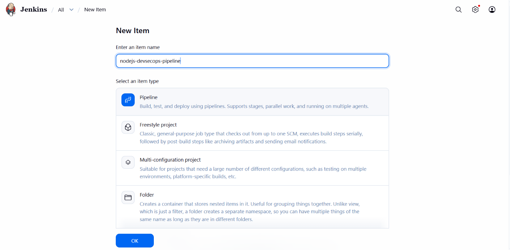

---

### General Configuration

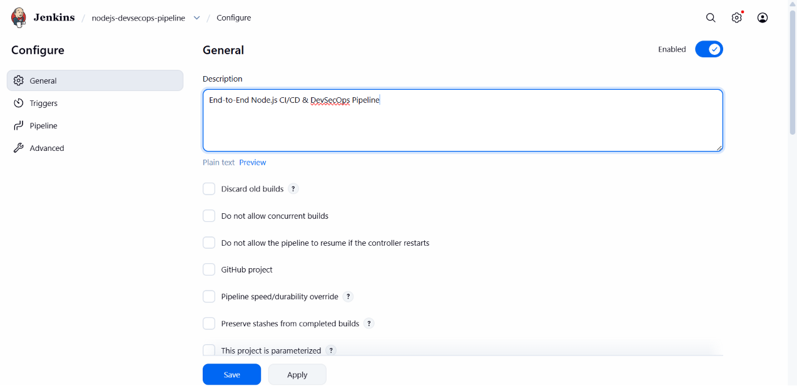

---

### GitHub Project Configuration

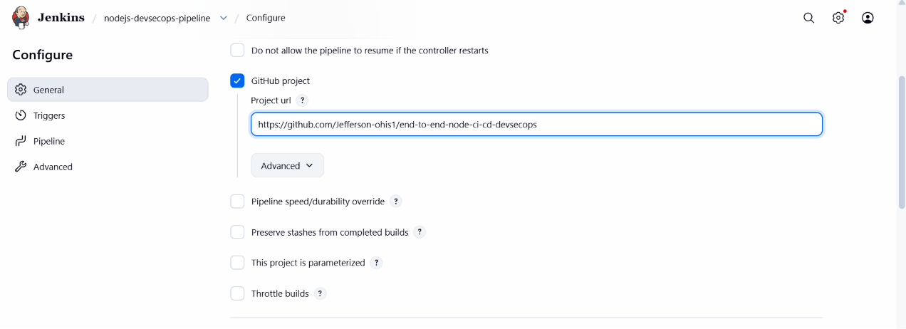


---

### Pipeline SCM Configuration


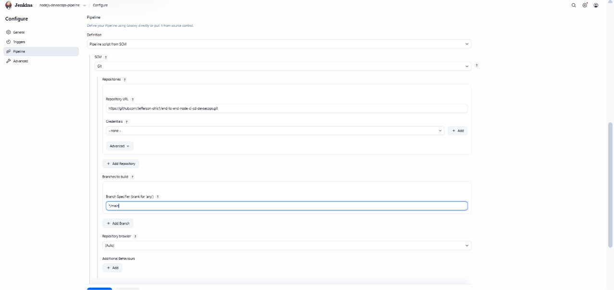

---

### Pipeline Successfully Created

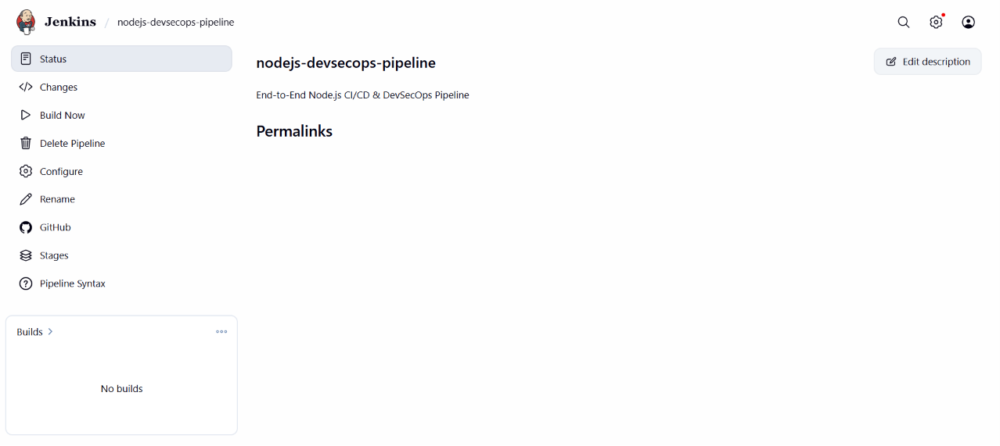

---

## Section Summary

A dedicated **Jenkins Pipeline** job was successfully created and configured to retrieve its build definition directly from the project's GitHub repository.

By adopting the **Pipeline as Code** approach, the CI/CD workflow will be maintained within a version-controlled **`Jenkinsfile`**, ensuring consistency, traceability, and long-term maintainability.

Automatic build triggers were intentionally deferred until the pipeline has been fully implemented and validated, following industry best practices for incremental CI/CD development.

The Jenkins environment is now prepared for the next stage of the project, where the `Jenkinsfile` will be created to define the complete end-to-end CI/CD and DevSecOps workflow.

---

## What's Next?

With the Jenkins Pipeline job successfully configured, the Jenkins server is now capable of retrieving pipeline definitions directly from the project's GitHub repository.

The next section focuses on creating the project's **Jenkinsfile**, where the complete CI/CD and DevSecOps workflow will be implemented. The pipeline will progressively automate source code checkout, dependency installation, unit testing, static code analysis with SonarCloud, dependency vulnerability scanning with Snyk, Docker image creation, container security scanning with Trivy, image publishing to Amazon Elastic Container Registry (ECR), deployment to Amazon Elastic Kubernetes Service (EKS), and dynamic application security testing using OWASP ZAP.

---

### 9.2 Create the Jenkinsfile

### Overview

After creating and configuring the Jenkins Pipeline job, the next step was to implement the project's **`Jenkinsfile`**, which serves as the automation blueprint for the entire CI/CD and DevSecOps workflow.

Rather than configuring build logic manually through the Jenkins user interface, the pipeline was implemented as code and stored in the root of the GitHub repository. This approach follows the **Pipeline as Code (PaC)** methodology, allowing the pipeline to be version-controlled, peer-reviewed, and maintained alongside the application's source code.

Once implemented, pipeline executions performed by Jenkins will be driven by the instructions defined within this file, ensuring a consistent and repeatable software delivery process across all environments.

---

## What is a Jenkinsfile?

A **Jenkinsfile** is a text-based configuration file written using the **Jenkins Pipeline Domain-Specific Language (DSL)**.

It defines the complete sequence of stages that Jenkins executes during a pipeline run, including application build, testing, security analysis, containerization, deployment, and post-build activities.

For this project, the Jenkinsfile orchestrates the complete end-to-end DevSecOps workflow from source code retrieval to Kubernetes deployment.

---

## Why Use a Jenkinsfile?

Implementing the pipeline as code provides numerous engineering and operational benefits.

| Benefit | Description |
|----------|-------------|
| **Pipeline as Code** | Stores the entire CI/CD workflow in version control alongside the application source code. |
| **Version Control** | Pipeline changes are tracked through Git commits and can be reviewed before deployment. |
| **Reproducibility** | Every build executes the same validated sequence of stages. |
| **Maintainability** | Pipeline logic is modified by editing source code rather than manually updating Jenkins jobs. |
| **Collaboration** | Developers can review and approve pipeline changes through Pull Requests. |
| **Scalability** | New stages and integrations can be added without recreating Jenkins jobs. |
| **Auditability** | Pipeline modifications remain traceable through Git history. |

---

## Pipeline as Code (PaC)

This project adopts the **Pipeline as Code** methodology, where the entire CI/CD workflow is maintained within the Git repository.

Instead of storing pipeline configuration inside Jenkins, the Jenkinsfile becomes part of the project's source code, providing the same benefits as Infrastructure as Code (IaC):

- Version-controlled pipeline definitions
- Simplified collaboration
- Code review through Pull Requests
- Consistent builds across environments
- Easier rollback of pipeline changes
- Improved maintainability

This approach aligns with modern DevOps and DevSecOps engineering practices.

---

## Jenkinsfile Location

The Jenkinsfile was created in the root directory of the project repository.

```text
end-to-end-node-ci-cd-devsecops/
│
├── app/
├── docs/
├── infra/
├── screenshots/
├── Jenkinsfile
└── README.md
```

The Pipeline Job was previously configured with the following script path:

```text
Script Path
└── Jenkinsfile
```

As a result, Jenkins automatically retrieves the latest version of the Jenkinsfile directly from GitHub whenever a pipeline build is initiated.

---

## Pipeline Workflow

The completed Jenkins Pipeline will automate the following workflow.

```text
GitHub Repository
        │
        ▼
Checkout Source Code
        │
        ▼
Install Dependencies
        │
        ▼
Unit Testing
        │
        ▼
SonarCloud (SAST)
        │
        ▼
Snyk (SCA)
        │
        ▼
Docker Image Build
        │
        ▼
Trivy Container Scan
        │
        ▼
Push Image to Amazon ECR
        │
        ▼
Deploy to Amazon EKS
        │
        ▼
OWASP ZAP (DAST)
        │
        ▼
Post-Build Actions
```

---

## Pipeline Stages

The Jenkinsfile will ultimately contain the following stages.

| Stage | Purpose |
|---------|---------|
| **Checkout Source Code** | Retrieves the latest application source code from GitHub. |
| **Install Dependencies** | Installs required Node.js packages using npm. |
| **Unit Testing** | Executes automated Jest test cases. |
| **SonarCloud Scan** | Performs Static Application Security Testing (SAST). |
| **Snyk Scan** | Performs Software Composition Analysis (SCA). |
| **Build Docker Image** | Creates a Docker image for the application. |
| **Trivy Scan** | Scans the Docker image for known vulnerabilities. |
| **Push to Amazon ECR** | Authenticates with Amazon ECR and uploads the container image. |
| **Deploy to Amazon EKS** | Deploys the application to the Kubernetes cluster. |
| **OWASP ZAP Scan** | Performs Dynamic Application Security Testing (DAST). |
| **Post Actions** | Archives reports, publishes results, and performs workspace cleanup. |

---

## Incremental Development Strategy

Rather than implementing the complete pipeline in a single iteration, each stage will be developed, tested, and validated independently.

The implementation strategy follows this progression:

```text
Create Jenkinsfile
        │
        ▼
Implement One Stage
        │
        ▼
Validate Build
        │
        ▼
Commit Changes
        │
        ▼
Implement Next Stage
        │
        ▼
Repeat Until Complete
```

This incremental approach offers several advantages:

- Simplifies troubleshooting
- Reduces build failures
- Enables early validation
- Improves documentation quality
- Mirrors enterprise CI/CD development practices

By validating each stage before introducing the next, pipeline issues can be isolated and resolved more efficiently.

---

## Jenkinsfile Structure

The Jenkinsfile will be implemented using the **Declarative Pipeline** syntax recommended by Jenkins.

The overall structure consists of:

```groovy
pipeline {

    agent any

    tools {
        ...
    }

    environment {
        ...
    }

    stages {

        stage(...) {
            ...
        }

    }

    post {
        ...
    }

}
```

Each section serves a specific purpose:

| Section | Purpose |
|----------|---------|
| **agent** | Defines where the pipeline executes. |
| **tools** | Specifies globally configured development tools. |
| **environment** | Defines environment variables used throughout the pipeline. |
| **stages** | Contains the build, test, security, and deployment stages. |
| **post** | Executes actions after pipeline completion regardless of build outcome. |

---

## Verification

Before implementing the first pipeline stage, the following prerequisites were verified:

- ✅ Jenkins Pipeline job created successfully.
- ✅ Jenkinsfile added to the repository root.
- ✅ Pipeline configured to retrieve the Jenkinsfile from GitHub.
- ✅ Main branch configured correctly.
- ✅ Jenkins ready to execute Pipeline as Code.

At this stage, the project is fully prepared for implementing the individual CI/CD and DevSecOps pipeline stages.

---

## Screenshot

The following screenshot document the creation of the Jenkinsfile.

### Jenkinsfile Created

The Jenkinsfile was created in the root directory of the project, following the Pipeline as Code (PaC) methodology.

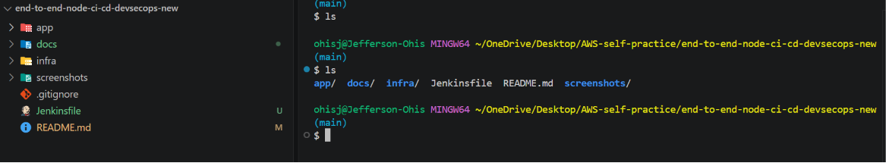


---

## Section Summary

The **Jenkinsfile** establishes the automation blueprint for the project's complete CI/CD and DevSecOps workflow.

By adopting the **Pipeline as Code (PaC)** methodology, the pipeline becomes version-controlled, reproducible, maintainable, and fully integrated with the application's source code. Every pipeline execution will now be driven by the Jenkinsfile, ensuring that all build, testing, security, containerization, and deployment activities follow a consistent and repeatable process.

The next section begins implementing the first stage of the pipeline: **Checkout Source Code**, where Jenkins retrieves the latest application code from the GitHub repository.

---

## Section 10 — Checkout Source Code

### Overview

With the Jenkins Pipeline job and Jenkinsfile successfully configured, the next step was to implement the first executable stage of the CI/CD pipeline: **Checkout Source Code**.

The checkout stage is responsible for retrieving the project's source code from the configured GitHub repository so that subsequent pipeline stages can operate on the application files.

This stage establishes the connection between the Jenkins Pipeline and the project's source control repository.

The implementation uses the Jenkins Pipeline `checkout scm` step, which retrieves the source code defined by the Pipeline job's configured Source Code Management (SCM) configuration.


---


## Objective

The primary objective of this stage is to verify that Jenkins can:

- Retrieve the Jenkinsfile from the configured GitHub repository.
- Initialize the Jenkins pipeline workspace.
- Allocate the configured Jenkins execution environment.
- Resolve the globally configured JDK and Node.js tools.
- Check out the configured `main` branch.
- Retrieve the application source code.
- Make the source code available to subsequent pipeline stages.

Successful completion of this stage confirms that the Jenkins Pipeline can communicate with the project's GitHub repository and execute the first stage of the Pipeline as Code workflow.

---

## Jenkinsfile Implementation

The Jenkinsfile was extended to include the initial **Checkout Source Code** stage.

```groovy
pipeline {

    agent any

    tools {
        jdk 'jdk21'
        nodejs 'node18'
    }

    stages {

        stage('Checkout Source Code') {
            steps {
                checkout scm
            }
        }
    }

    post {
        always {
            echo 'Pipeline execution completed.'
        }
    }
}
```

--- 

## Preventing Duplicate Source Code Checkout

During the initial pipeline execution, Jenkins performed two source-code checkout operations.

The first checkout was automatically generated by the Declarative Pipeline framework, while the second checkout was explicitly defined within the project's `Checkout Source Code` stage using:

```groovy
checkout scm
```

Although the pipeline completed successfully, performing the checkout twice was unnecessary.

To maintain a clean and efficient pipeline, the Declarative Pipeline's automatic checkout was disabled using:

```groovy
options {
    skipDefaultCheckout(true)
}
```

The updated Jenkinsfile therefore explicitly controls when the source code is retrieved.

---

## Final Jenkinsfile Configuration

After disabling the automatic Declarative Pipeline checkout, the final Jenkinsfile for Section 9.3 is:

```groovy
pipeline {

    agent any

    options {
        skipDefaultCheckout(true)
    }

    tools {
        jdk 'jdk21'
        nodejs 'node18'
    }

    stages {

        stage('Checkout Source Code') {
            steps {
                checkout scm
            }
        }
    }

    post {
        always {
            echo 'Pipeline execution completed.'
        }
    }
}
```

This configuration establishes explicit control over source-code retrieval while retaining the globally configured JDK 21 and Node.js 18.20.8 tool installations.

---

### Updated Pipeline Configuration

```groovy
pipeline {

    agent any

    options {
        skipDefaultCheckout(true)
    }

    tools {
        jdk 'jdk21'
        nodejs 'node18'
    }

    stages {

        stage('Checkout Source Code') {
            steps {
                checkout scm
            }
        }
    }

    post {
        always {
            echo 'Pipeline execution completed.'
        }
    }
}

---

### Why Disable the Default Checkout?

Jenkins Declarative Pipeline performs an automatic SCM checkout by default when an agent is allocated. Because this project explicitly defines `checkout scm` inside the `Checkout Source Code` stage, the automatic checkout would result in the repository being retrieved twice.

The `skipDefaultCheckout(true)` option disables the automatic SCM checkout, allowing the Pipeline to explicitly control when the repository is retrieved.

### Benefits of `skipDefaultCheckout(true)`

| Benefit | Description |
|---------|-------------|
| **Avoids Duplicate Checkout** | Prevents Jenkins from automatically checking out the repository before the explicit `Checkout Source Code` stage. |
| **Improves Efficiency** | Eliminates unnecessary Git operations and avoids retrieving the source code more than once. |
| **Explicit Pipeline Flow** | Makes source-code retrieval visible as a dedicated and intentional Pipeline stage. |
| **Improves Troubleshooting** | Makes checkout-related failures easier to identify because the operation is isolated within its own stage. |
| **Better Stage Visibility** | Allows the `Checkout Source Code` stage to accurately represent the actual repository checkout operation. |


---

### Pipeline Execution Flow

With the default checkout disabled, the Pipeline follows an explicit execution sequence:

```text
Pipeline Start
      │
      ▼
Jenkins Agent
      │
      ▼
Tool Initialization
      │
      ▼
Checkout Source Code
      │
      ▼
Post Actions
      │
      ▼
Pipeline SUCCESS
```

---

## Jenkinsfile Directives Explained

Each directive in the initial Jenkinsfile serves a specific purpose.

### `pipeline`

```groovy
pipeline {
...
}
```

The `pipeline` block defines the Jenkins Declarative Pipeline.

All pipeline configuration—including agents, tools, stages, environment variables, and post-build actions—is contained within this block.

---

### `agent any`

```groovy
agent any
```

The `agent` directive specifies the Jenkins execution environment where the pipeline will run.

Using:

```text
any
```

allows Jenkins to execute the pipeline on any available Jenkins agent that satisfies the pipeline requirements.

For this project, the pipeline currently executes on the configured Jenkins EC2 server.

---

### `tools`

```groovy
tools {
    jdk 'jdk21'
    nodejs 'node18'
}
```

The `tools` block references the development tools previously configured in **Section 5 — Configure Global Tools**.

| Tool | Jenkins Configuration | Version | Purpose |
|------|-----------------------|---------|---------|
| **JDK** | `jdk21` | Java 21 | Provides the Java runtime required by Jenkins and Java-based supporting tools. |
| **Node.js** | `node18` | Node.js 18.20.8 | Provides the Node.js runtime required by the application and subsequent npm-based pipeline stages.. |

Referencing the configured tool names allows Jenkins to manage the required tools without hardcoding installation paths inside the Jenkinsfile.

### Tool Resolution Verification

During pipeline execution, Jenkins successfully resolved the configured Node.js installation:

```text
https://nodejs.org/dist/v18.20.8/node-v18.20.8-linux-x64.tar.gz
```

---

# Checkout Source Code Stage

The first executable stage is:

```groovy
stage('Checkout Source Code') {
    steps {
        checkout scm
    }
}
```

### `stage`

```groovy
stage('Checkout Source Code')
```

The `stage` directive creates a logical section within the pipeline.

The name **Checkout Source Code** clearly identifies the purpose of the stage in the Jenkins Pipeline interface and build history.

---

### `steps`

```groovy
steps {
```

The `steps` block contains the commands that Jenkins executes within the stage.

For this stage, the required operation is retrieving the application's source code from GitHub.

---

### `checkout scm`

```groovy
checkout scm
```

The `checkout scm` step instructs Jenkins to retrieve source code using the SCM configuration defined for the Pipeline job.

The repository configured for this project is:

```text
https://github.com/Jefferson-ohis1/end-to-end-node-ci-cd-devsecops.git
```

The configured branch is:

```text
main
```

Because the Pipeline job already contains the repository and branch configuration, `checkout scm` allows the Jenkinsfile to reuse that configuration instead of duplicating repository details inside the pipeline definition.

This results in a cleaner and more maintainable **Pipeline as Code** implementation.

---

## Why Checkout Source Code?

Source code checkout is the first operational step in a CI/CD pipeline because every subsequent stage depends on the application source being available within the Jenkins workspace.

The checkout stage provides the following capabilities:

| Benefit | Description |
|---------|-------------|
| **Source Retrieval** | Retrieves the latest source code from the configured GitHub repository. |
| **Version Control Integration** | Connects Jenkins directly to the project's Git repository. |
| **Reproducibility** | Jenkins builds a specific Git revision associated with the pipeline execution. |
| **Automation** | Eliminates the need to manually copy application source code to the Jenkins server. |
| **Traceability** | Associates pipeline executions with specific Git commits. |

---

# Pipeline Execution Flow

After implementing the checkout stage, the initial pipeline follows this sequence:

```text
Jenkins Pipeline Job
        │
        ▼
Retrieve Jenkinsfile
        │
        ▼
Initialize Pipeline
        │
        ▼
Allocate Jenkins Agent
        │
        ▼
Load Configured Tools
        │
        ▼
Checkout Source Code
        │
        ▼
Execute Post Actions
```

At this stage, the pipeline contains only the initial checkout functionality.

Additional CI/CD and DevSecOps stages will be introduced incrementally throughout the remaining implementation.

---

# Jenkins Workspace

During pipeline execution, Jenkins creates or uses a workspace on the configured Jenkins agent.

The source code retrieved from GitHub is placed into this workspace and becomes available to subsequent pipeline stages.

The workspace will contain the project files, including:

```text
Workspace
│
├── app/
├── docs/
├── infra/
├── screenshots/
├── Jenkinsfile
├── README.md
└── ...
```

This workspace will subsequently be used for operations such as:

- Installing Node.js dependencies
- Running automated tests
- Performing SonarCloud analysis
- Running Snyk scans
- Building Docker images
- Executing Trivy vulnerability scans
- Preparing Kubernetes deployment manifests

---

# Post-Build Action

The initial Jenkinsfile includes a basic `post` block:

```groovy
post {
    always {
        echo 'Pipeline execution completed.'
    }
}
```

The `post` block defines actions that Jenkins performs after pipeline execution.

The `always` condition ensures that the message is displayed regardless of whether the pipeline succeeds or fails.

At this stage, the post action provides a simple confirmation that Jenkins reached the end of the pipeline execution.

More comprehensive post-build processing will be introduced later, including report handling and workspace cleanup.

---

## Commit the Updated Jenkinsfile

After the initial pipeline execution revealed that Jenkins was performing an automatic checkout in addition to the explicitly defined checkout stage, the Jenkinsfile was updated to disable the default checkout.

The following option was added:

```groovy
options {
    skipDefaultCheckout(true)
}

The Node.js global tool configuration was also corrected to use Node.js 18.20.8, ensuring that the Jenkins tool named node18 corresponds to the intended runtime version.


The updated Jenkinsfile was then committed and pushed to GitHub using:

First, the repository status was checked:

```bash
git status
```

The Jenkinsfile changes were then reviewed:

```bash
git diff -- Jenkinsfile
```

After verifying the changes, the Jenkinsfile was staged:

```bash
git add Jenkinsfile
```

A descriptive commit was created:

```bash
git commit -m "Optimize Jenkins checkout configuration"
```

The updated Jenkinsfile was then pushed to the main branch:

```bash
git push origin main
```

This ensures that the Jenkins Pipeline retrieves the same version of the Jenkinsfile that has been reviewed and committed to source control.

---

# Jenkins Pipeline Execution

After the updated Jenkinsfile was committed and pushed to GitHub, the Jenkins Pipeline job was executed manually.

Navigate to:

```text
Jenkins Dashboard
    └── nodejs-devsecops-pipeline
            └── Build Now
```


Jenkins retrieved the latest Jenkinsfile from the configured GitHub repository and executed the pipeline.

During execution, Jenkins:

- Retrieved the Jenkinsfile from GitHub.
- Initialized the Jenkins agent.
- Resolved JDK 21.
- Resolved Node.js 18.20.8.
- Executed the Checkout Source Code stage.
- Retrieved the project's source code from the main branch.
- Executed the post-build action.
- Completed successfully.

---

# Expected Console Output

A successful checkout should display messages indicating that Jenkins retrieved the repository and checked out the configured source code.

A simplified example is:

```text
[Pipeline] Start of Pipeline
[Pipeline] node
[Pipeline] stage
[Pipeline] { (Checkout Source Code)
[Pipeline] checkout
...
[Pipeline] }
[Pipeline] // stage
[Pipeline] echo
Pipeline execution completed.
[Pipeline] End of Pipeline
Finished: SUCCESS
```

The exact console output may vary depending on the Jenkins version, Git configuration, commit identifier, and execution environment.

The primary verification points are:

1. The **Checkout Source Code** stage completes successfully.
2. The source repository is successfully retrieved.
3. The pipeline reaches the `post` section.
4. The build finishes with:

```text
Finished: SUCCESS
```

---

# Verification

After executing the updated Jenkins Pipeline build, the following items were verified:

| Verification Item | Status |
|--------------------|:------:|
| Jenkins successfully loaded the Jenkinsfile | ✅ Verified |
| Jenkins agent initialized successfully | ✅ Verified |
| JDK 21 resolved successfully | ✅ Verified |
| Node.js 18.20.8 resolved successfully | ✅ Verified |
| Automatic default checkout disabled | ✅ Verified |
| Explicit `Checkout Source Code` stage executed | ✅ Verified |
| GitHub repository checkout completed | ✅ Verified |
| `main` branch checked out successfully | ✅ Verified |
| Automatic duplicate checkout eliminated | ✅ Verified |
| Post action executed | ✅ Verified |
| Pipeline completed successfully | ✅ Verified |

> **Verification Result**
>
> The updated Jenkins Pipeline completed successfully. Jenkins retrieved the Jenkinsfile from GitHub, initialized the configured execution environment, resolved JDK 21 and Node.js 18.20.8, performed a single explicit source-code checkout, executed the post-build action, and completed with a successful build result.

---

## Actual Build Evidence

The updated Jenkins Pipeline was executed successfully after committing and pushing the revised Jenkinsfile.

The Jenkins console confirmed:

```text
Obtained Jenkinsfile from git https://github.com/Jefferson-ohis1/end-to-end-node-ci-cd-devsecops.git

Unpacking https://nodejs.org/dist/v18.20.8/node-v18.20.8-linux-x64.tar.gz

Checking out Revision 0de80139aac19e57adae48c6f852f49d94aaa4d1

[Pipeline] { (Checkout Source Code)

git fetch --tags --force --progress ...

Checking out Revision 0de80139aac19e57adae48c6f852f49d94aaa4d1

[Pipeline] echo
Pipeline execution completed.

Finished: SUCCESS
```

The build output confirms that the updated pipeline successfully resolved Node.js 18.20.8, performed the explicit checkout stage, executed the post-build action, and completed successfully.

---

## Screenshots

The following screenshots document Jenkinsfile in GitHub Repository, the implementation and successful execution of the checkout stage.

### Jenkinsfile in GitHub Repository with checkout stage

After committing and pushing the Jenkinsfile, the file became part of the project's version-controlled source code, allowing Jenkins to retrieve the pipeline definition directly from GitHub.

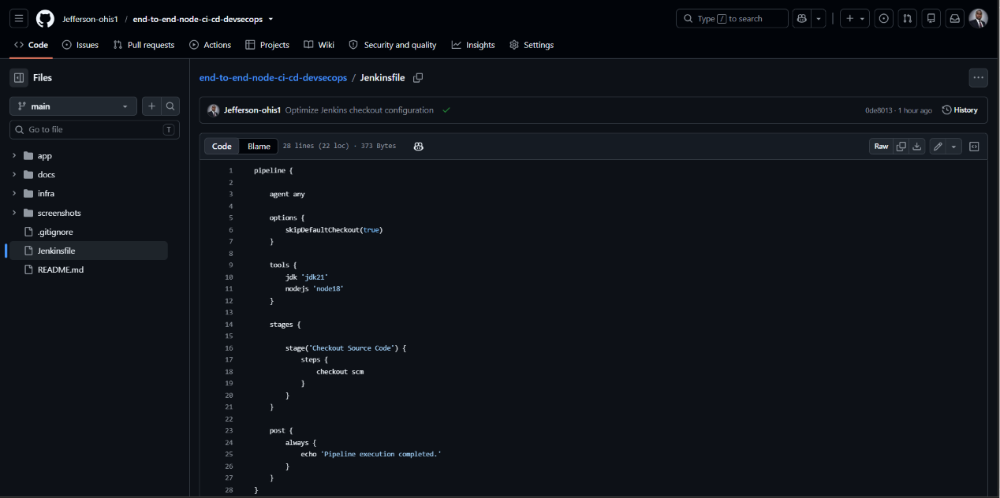

---

### Jenkins Pipeline Build

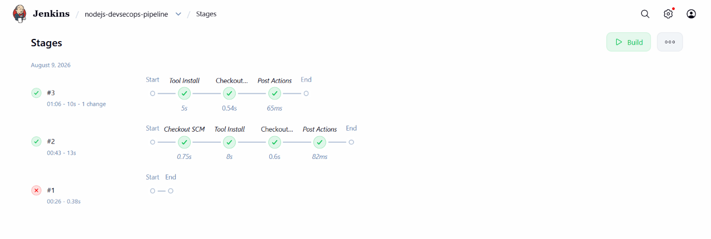

---

### Checkout Stage Successful

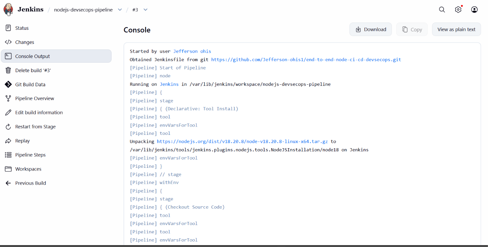

---

### Jenkins Console Output

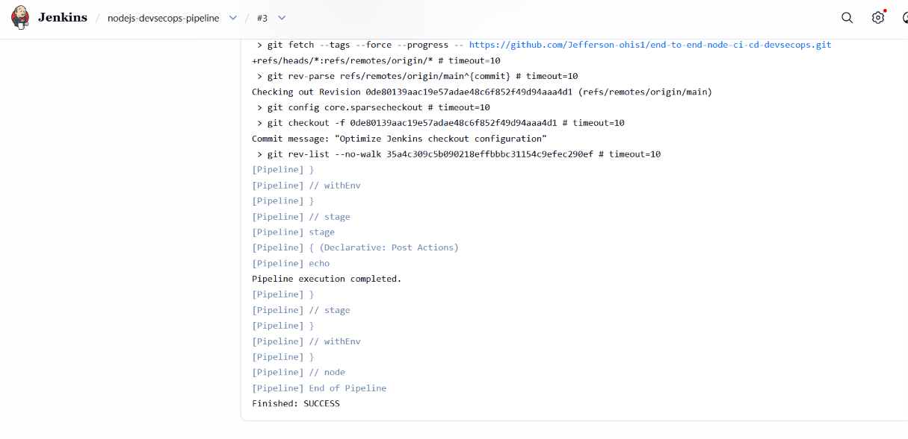

---

### Jenkins Workspace

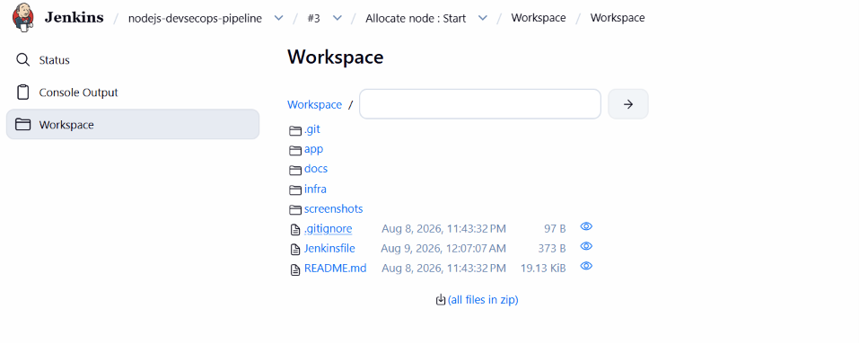

---

## Expected Outcome

After successful execution of this stage, Jenkins has established the first working connection between the Pipeline and the project's GitHub repository.

The pipeline has progressed from:

```text
Jenkins Configuration
        │
        ▼
Pipeline Job
        │
        ▼
Jenkinsfile
        │
        ▼
Checkout Source Code
        │
        ▼
Successful Pipeline Execution
```

This represents the transition from Jenkins configuration to an executable CI/CD workflow.

---

## Section Summary

The first executable stage of the Jenkins Pipeline was successfully implemented and validated.

The pipeline now:

- Retrieves the version-controlled Jenkinsfile from GitHub.
- Initializes the Jenkins execution environment.
- Resolves JDK 21 and Node.js 18.20.8.
- Explicitly checks out the project's source code from the `main` branch.
- Avoids Jenkins' automatic duplicate SCM checkout.
- Executes the post-build action.
- Completes successfully with a `SUCCESS` build result.

This milestone represents the transition from Jenkins configuration to a functioning CI/CD pipeline.

The Jenkins workspace now contains the application source code required by subsequent stages.

The next stage will implement **Section 9.4 — Install Dependencies**, where Jenkins will use npm to install the Node.js application's dependencies before executing automated unit tests.

---

## Section 11 — Install Dependencies

### Overview

After successfully implementing and validating the **Checkout Source Code** stage, the next step was to prepare the Node.js application for subsequent CI/CD operations by installing its project dependencies.

The **Install Dependencies** stage is responsible for installing the exact dependency versions defined in the application's `package-lock.json` file.

The stage operates within the application's `app/` directory and uses the Node Package Manager (`npm`) command:

```bash
npm ci
```

The `npm ci` command provides a clean and reproducible dependency installation process that is well suited for automated CI/CD environments.

This stage establishes the dependency environment required by subsequent pipeline stages, including:

- Automated unit testing
- SonarCloud analysis
- Snyk dependency scanning
- Docker image creation
- Application validation

The implementation was tested through an **actual Jenkins Pipeline execution** rather than being documented solely as an expected configuration.

---

### Objective

The primary objectives of this stage are to:

- Execute dependency installation automatically within Jenkins.
- Navigate to the Node.js application's `app/` directory.
- Install dependencies using `npm ci`.
- Use the repository's `package-lock.json` to ensure reproducible dependency installation.
- Verify that the required Node.js packages can be installed successfully.
- Prepare the Jenkins workspace for subsequent CI/CD stages.
- Confirm that the dependency installation process completes successfully within the Jenkins environment.

Successful completion of this stage confirms that Jenkins can automatically prepare the Node.js application's dependency environment.

---

### Why Install Dependencies?

The Node.js application depends on external packages defined in its `package.json` and `package-lock.json` files.

These dependencies are required before Jenkins can perform operations such as:

- Running automated tests
- Performing source-code analysis
- Performing Software Composition Analysis (SCA)
- Building the application
- Building the Docker image

Without installing the required dependencies, subsequent pipeline stages may fail because the required Node.js modules would not be available in the Jenkins workspace.

The dependency installation stage therefore establishes the application environment required by the remaining application-focused CI/CD stages.

---

### Jenkinsfile Implementation

The Jenkinsfile was extended to include the **Install Dependencies** stage immediately after the **Checkout Source Code** stage.

```groovy
stage('Install Dependencies') {
    steps {
        dir('app') {
            sh 'npm ci'
        }
    }
}
```

The relevant Pipeline structure is:

```groovy
stages {

    stage('Checkout Source Code') {
        steps {
            checkout scm
        }
    }

    stage('Install Dependencies') {
        steps {
            dir('app') {
                sh 'npm ci'
            }
        }
    }
}
```

The implementation intentionally keeps dependency installation as a separate Pipeline stage so that its execution, output, and result can be clearly identified in Jenkins.

---

### Why Use `dir('app')`?

The Node.js application is located within the repository's `app/` directory.

The Jenkins workspace has the following general structure:

```text
nodejs-devsecops-pipeline/
│
├── app/
│   ├── app.js
│   ├── app.test.js
│   ├── server.js
│   ├── Dockerfile
│   ├── package.json
│   └── package-lock.json
│
├── docs/
├── infra/
├── screenshots/
├── Jenkinsfile
└── README.md
```

The `dir('app')` step changes the current working directory for the commands executed inside the block:

```groovy
dir('app') {
    sh 'npm ci'
}
```

This ensures that `npm ci` is executed from the application's directory, where the required `package.json` and `package-lock.json` files are located.

For example, the Jenkins workspace may resolve to:

```text
/var/lib/jenkins/workspace/nodejs-devsecops-pipeline/app
```

Using `dir('app')` also avoids hardcoding the complete Jenkins workspace path inside the Jenkinsfile.

### Benefits of `dir('app')`

| Benefit | Description |
|---------|-------------|
| **Correct Application Directory** | Ensures npm operates inside the Node.js application's directory where `package.json` and `package-lock.json` are located. |
| **Cleaner Jenkinsfile** | Avoids hardcoding the complete Jenkins workspace path and keeps the Pipeline configuration concise. |
| **Pipeline Portability** | Allows the Pipeline to operate consistently across Jenkins agents with different workspace paths. |
| **Clear Pipeline Structure** | Makes it explicit that dependency installation belongs to the Node.js application. |
| **Workspace Isolation** | Limits npm operations to the application's directory without affecting unrelated files or directories in the Jenkins workspace. |

---

### Why Use `npm ci`?

The Pipeline uses:

```bash
npm ci
```

instead of:

```bash
npm install
```

`npm ci` is specifically designed for automated and reproducible environments such as CI/CD pipelines.

It installs dependencies according to the project's existing lock file, ensuring that Jenkins uses the dependency versions recorded in `package-lock.json`.

#### `npm ci` vs `npm install`

| Feature | `npm ci` | `npm install` |
|---------|:--------:|:-------------:|
| **Designed for CI environments** | ✅ | ⚠️ |
| **Uses `package-lock.json`** | ✅ | ✅ |
| **Reproducible installation** | ✅ | Less strict |
| **Automatically removes existing `node_modules`** | ✅ | ❌ |
| **Modifies the dependency lock file** | ❌ | May modify |
| **Suitable for automated builds** | ✅ | ✅ |
| **Clean installation** | ✅ | Not necessarily |

Using `npm ci` therefore provides a predictable and reproducible dependency installation process for Jenkins builds.

---

### Dependency Installation Process

The dependency installation stage follows this sequence:

```text
Checkout Source Code
        │
        ▼
Jenkins Workspace
        │
        ▼
Enter app/ Directory
        │
        ▼
Read package.json
        │
        ▼
Read package-lock.json
        │
        ▼
Execute npm ci
        │
        ▼
Install Node.js Dependencies
        │
        ▼
Audit Installed Packages
        │
        ▼
Dependency Installation Complete
```

The dependency installation occurs only after the source code has been successfully checked out.

---

### Jenkins Pipeline Execution

After adding the **Install Dependencies** stage to the Jenkinsfile, the updated Jenkinsfile was committed and pushed to the GitHub `main` branch.

The commit was created using:

```bash
git add Jenkinsfile
git commit -m "Add dependency installation stage"
```

The commit was then pushed using:

```bash
git push origin main
```

The Jenkins Pipeline was subsequently executed from the Jenkins dashboard.

Jenkins retrieved the updated Jenkinsfile from GitHub and executed the Pipeline.

### Pipeline Operations

The Pipeline successfully performed the following operations:

1. Retrieved the updated Jenkinsfile.
2. Initialized the Jenkins agent.
3. Resolved the configured JDK.
4. Resolved Node.js 18.20.8.
5. Checked out the `main` branch.
6. Entered the `app/` directory.
7. Executed `npm ci`.
8. Installed the Node.js dependencies.
9. Audited the installed packages.
10. Executed the post-build action.
11. Completed successfully.

---

### Actual Pipeline Result

The Jenkins Pipeline successfully completed the new **Install Dependencies** stage.

The relevant Jenkins execution sequence was:

```text
[Pipeline] stage
[Pipeline] { (Install Dependencies)
[Pipeline] tool
[Pipeline] envVarsForTool
[Pipeline] tool
[Pipeline] envVarsForTool
[Pipeline] withEnv
[Pipeline] {
[Pipeline] dir
Running in /var/lib/jenkins/workspace/nodejs-devsecops-pipeline/app
[Pipeline] {
[Pipeline] sh
+ npm ci
...
[Pipeline] }
[Pipeline] // dir
[Pipeline] }
[Pipeline] // withEnv
[Pipeline] }
[Pipeline] // stage
```

The stage completed without an installation failure.

The complete Jenkins build finished with:

```text
Finished: SUCCESS
```

---

### Dependency Installation Output

The Jenkins build reported the following result from `npm ci`:

```text
added 381 packages, and audited 382 packages in 3s

74 packages are looking for funding
run `npm fund` for details

2 high severity vulnerabilities
```

The dependency installation therefore completed successfully.

#### Installation Results

| Result | Value |
|--------|-------|
| **Packages added** | **381** |
| **Packages audited** | **382** |
| **Installation time** | **3 seconds** |
| **Funding notices** | **74 packages** |
| **Reported vulnerabilities** | **2 high severity** |
| **Pipeline result** | **SUCCESS** |

---

### Dependency Security Observation

The `npm ci` execution reported:

```text
2 high severity vulnerabilities
```

This is an important observation from the actual Pipeline execution.

At this stage, the Pipeline does **not** yet contain a dedicated dependency security gate.

The `npm ci` command confirms that dependencies can be installed and reports npm audit findings, but it is not being used as the project's formal Software Composition Analysis (SCA) stage.

The project will subsequently introduce **Snyk** as the dedicated dependency security scanning solution.

The DevSecOps workflow will therefore separate dependency installation from dependency security analysis:

```text
Install Dependencies
        │
        ▼
Snyk Dependency Scan
        │
        ▼
Security Evaluation
```

The two high-severity findings observed during this stage should therefore be documented as an actual security observation rather than ignored or removed from the Pipeline evidence.

#### Security Observation

> `npm ci` successfully installed the application dependencies, but npm reported **2 high-severity vulnerabilities** during the package audit. Formal dependency vulnerability analysis will be handled by the dedicated **Snyk SCA stage** later in the DevSecOps Pipeline.

---

### Jenkins Workspace Verification

After dependency installation completed, the Jenkins workspace was verified.

The application directory is located at:

```text
/var/lib/jenkins/workspace/nodejs-devsecops-pipeline/app
```

The relevant workspace structure is:

```text
app/
├── app.js
├── app.test.js
├── server.js
├── Dockerfile
├── package.json
├── package-lock.json
└── node_modules/
```

The presence of the installed dependencies confirms that the `npm ci` operation successfully prepared the application workspace for subsequent Pipeline stages.

The Jenkins workspace will subsequently be reused by stages such as:

- Unit Testing
- SonarCloud Analysis
- Snyk Scanning
- Docker Image Creation

---

## Screenshots

The following screenshots provide evidence of the implementation and successful execution of the **Install Dependencies** stage.

### Jenkinsfile — Install Dependencies Stage

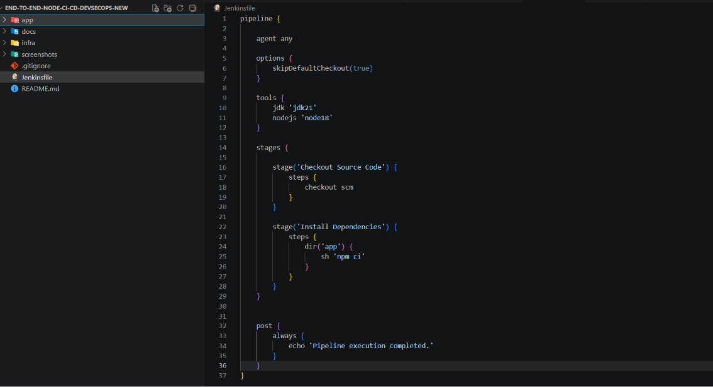

The Jenkinsfile was updated to include the new `Install Dependencies` stage using `dir('app')` and `npm ci`.

---

### Jenkins Pipeline — Install Dependencies Build

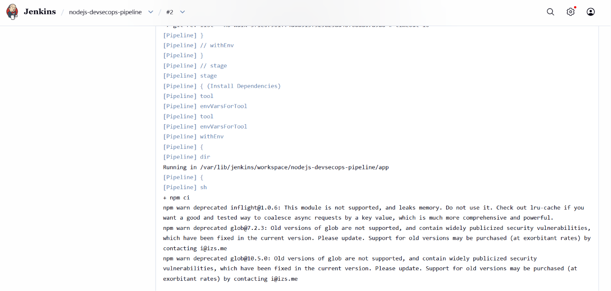

The Jenkins Pipeline was executed after the updated Jenkinsfile was committed and pushed to GitHub.

---

### Install Dependencies Stage — Successful Execution

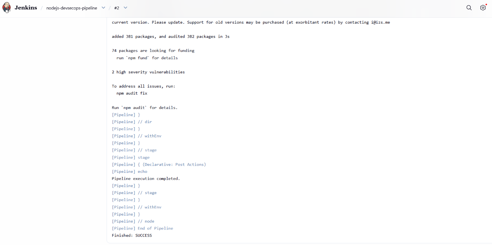

The Jenkins Pipeline successfully completed the `Install Dependencies` stage.

---

### Jenkins Workspace — Installed Dependencies

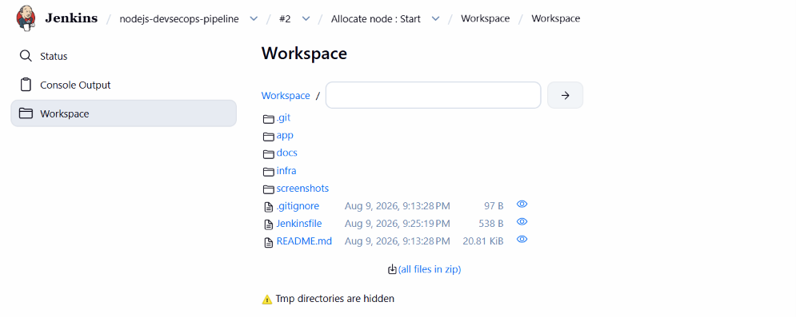

The Jenkins workspace was verified after dependency installation to confirm that the application dependencies were available within the `app/` directory.

---

## Verification

The implementation was verified through an actual Jenkins Pipeline execution.

| Verification Item | Status |
|--------------------|:------:|
| **Updated Jenkinsfile retrieved from GitHub** | ✅ Verified |
| **Jenkins agent initialized successfully** | ✅ Verified |
| **JDK 21 resolved successfully** | ✅ Verified |
| **Node.js 18.20.8 resolved successfully** | ✅ Verified |
| **`Checkout Source Code` stage completed** | ✅ Verified |
| **`Install Dependencies` stage executed** | ✅ Verified |
| **Jenkins entered the `app/` directory** | ✅ Verified |
| **`npm ci` executed successfully** | ✅ Verified |
| **381 packages installed** | ✅ Verified |
| **382 packages audited** | ✅ Verified |
| **Jenkins workspace populated with dependencies** | ✅ Verified |
| **Post-build action executed** | ✅ Verified |
| **Pipeline completed successfully** | ✅ Verified |
| **Final build status: `SUCCESS`** | ✅ Verified |

> **Verification Result**
>
> The **Install Dependencies** stage was successfully implemented and validated through an actual Jenkins Pipeline execution. Jenkins entered the application's `app/` directory, executed `npm ci`, installed **381 packages**, audited **382 packages**, and completed the Pipeline successfully with a `SUCCESS` build result.

---

## Expected Outcome

After successful completion of the **Install Dependencies** stage, the Jenkins workspace contains the Node.js application's required dependencies.

The Pipeline has now progressed from:

```text
GitHub
   │
   ▼
Jenkinsfile
   │
   ▼
Jenkins Agent
   │
   ▼
Tool Initialization
   │
   ├── JDK 21
   └── Node.js 18.20.8
   │
   ▼
Checkout Source Code
   │
   ▼
Install Dependencies
   │
   ├── Enter app/
   ├── Execute npm ci
   └── Install Node.js Dependencies
   │
   ▼
Post Actions
   │
   ▼
SUCCESS
```

The application is now prepared for the next CI/CD stage.

---

## Section Summary

The **Install Dependencies** stage was successfully implemented and validated as the second executable stage of the Jenkins CI/CD Pipeline.

The Pipeline now:

- Retrieves the Jenkinsfile from GitHub.
- Initializes the Jenkins agent.
- Resolves JDK 21.
- Resolves Node.js 18.20.8.
- Checks out the application's source code.
- Enters the application's `app/` directory.
- Executes `npm ci`.
- Installs the application's Node.js dependencies.
- Audits the installed packages.
- Makes the dependencies available within the Jenkins workspace.
- Executes the Pipeline post-build action.
- Completes successfully with a `SUCCESS` build result.

The actual Jenkins execution installed **381 packages** and audited **382 packages** in approximately **3 seconds**.

The build also reported **2 high-severity vulnerabilities**, providing an important security observation for the next DevSecOps stages. Formal dependency vulnerability analysis will be handled by the planned **Snyk Software Composition Analysis (SCA)** stage.

With dependency installation now validated, the Jenkins workspace is prepared for the next stage of the CI/CD Pipeline: **Section 9.5 — Unit Testing**

---

## Section 12 — Unit Testing

### Overview

After successfully implementing and validating the **Install Dependencies** stage, the next step was to introduce automated **Unit Testing** into the Jenkins CI/CD pipeline.

The **Unit Testing** stage validates the functionality of the Node.js monitoring application by executing the automated tests defined in the application's Jest test suite.

The stage operates within the application's `app/` directory and executes:

```bash
npm test
```

The `npm test` command invokes the test script defined in package.json, which executes the Jest test runner.

The Unit Testing stage provides an automated quality validation point before the application proceeds to subsequent CI/CD and DevSecOps stages.

The current pipeline progression is:

Checkout Source Code
        │
        ▼
Install Dependencies
        │
        ▼
Unit Testing
        │
        ▼
Post Actions
        │
        ▼
SUCCESS

The implementation was validated through an actual Jenkins Pipeline execution rather than being documented solely as an expected configuration.

---

### Objective

The primary objectives of the **Unit Testing** stage are:

| Objective | Description |
|-----------|-------------|
| **Automate Testing** | Execute the application's automated test suite as part of the Jenkins Pipeline. |
| **Validate Application Functionality** | Verify that the application's primary HTTP endpoints behave as expected. |
| **Detect Regressions** | Identify application changes that introduce functional failures. |
| **Integrate Testing into CI/CD** | Ensure tests are automatically executed during every applicable Pipeline build. |
| **Validate Before Security Scanning** | Establish functional validation before subsequent SonarCloud and Snyk stages. |
| **Provide Build Evidence** | Make test execution results visible through the Jenkins console output. |
| **Prevent Invalid Progression** | Ensure that test failures can prevent the Pipeline from progressing to later stages. |

Successful completion of this stage confirms that the application's automated test suite can execute successfully within the Jenkins environment.

---

### Why Unit Testing?

Automated testing is an important component of a CI/CD Pipeline because it provides rapid feedback about application functionality.

Without automated testing, code changes could progress through the delivery pipeline without verifying whether existing functionality remains operational.

For this project, the Node.js monitoring application exposes several HTTP endpoints that require automated validation.

The **Unit Testing** stage currently verifies the following endpoints:

| Endpoint | Expected Behavior |
|----------|-------------------|
| `GET /` | Returns HTTP status `200`. |
| `GET /health` | Returns HTTP status `200` and the expected health response. |
| `GET /metrics` | Returns Prometheus-compatible application metrics. |

These tests provide an automated validation layer between **dependency installation** and the subsequent **CI/CD and DevSecOps stages**.

The resulting Pipeline flow is:

```text
Checkout Source Code
        │
        ▼
Install Dependencies
        │
        ▼
Unit Testing
        │
        ▼
SonarCloud Analysis
        │
        ▼
Snyk Dependency Scanning
        │
        ▼
Docker Build
```

> Successful unit tests provide confidence that the application's core functionality remains operational before the code progresses to subsequent quality, security, and deployment stages.

---

### Jenkinsfile Implementation

The Jenkinsfile was extended to include the Unit Testing stage immediately after the Install Dependencies stage.

```groovy
stage('Unit Testing') {
    steps {
        dir('app') {
            sh 'npm test'
        }
    }
}


The relevant Pipeline structure is:

```groovy
stages {

    stage('Checkout Source Code') {
        steps {
            checkout scm
        }
    }

    stage('Install Dependencies') {
        steps {
            dir('app') {
                sh 'npm ci'
            }
        }
    }

    stage('Unit Testing') {
        steps {
            dir('app') {
                sh 'npm test'
            }
        }
    }
}


> The Unit Testing stage is intentionally separated from dependency installation so that Jenkins provides a clear and independently identifiable Pipeline stage for application testing.

---

### Why Use dir('app')?

The Node.js application is located within the repository's app/ directory.

The Jenkins workspace has the following general structure:

```text
nodejs-devsecops-pipeline/
│
├── app/
│   ├── app.js
│   ├── app.test.js
│   ├── server.js
│   ├── Dockerfile
│   ├── package.json
│   └── package-lock.json
│
├── docs/
├── infra/
├── screenshots/
├── Jenkinsfile
└── README.md

The Jenkinsfile uses:

``bash
dir('app') {
    sh 'npm test'
}

The dir('app') step changes the working directory for the commands executed inside the block.

During the actual Jenkins execution, the Pipeline reported:

```text
Running in /var/lib/jenkins/workspace/nodejs-devsecops-pipeline/app
```

This confirms that the Jest test suite was executed from the application's directory.

---

### Benefits of `dir('app')`

| Benefit | Description |
|---------|-------------|
| **Correct Application Directory** | Ensures `npm test` executes within the directory containing `package.json` and the application's test files. |
| **Cleaner Jenkinsfile** | Avoids hardcoding the complete Jenkins workspace path within the Pipeline configuration. |
| **Pipeline Portability** | Allows the Pipeline to operate consistently across Jenkins agents with different workspace paths. |
| **Clear Pipeline Structure** | Makes it explicit that the automated tests belong to the Node.js application. |
| **Workspace Isolation** | Limits test-related commands and operations to the application's `app/` directory. |

---

### Why Use npm test?

The Pipeline executes:

```bash
npm test
```

rather than invoking Jest directly.

The reason is that the project's package.json defines the test command:

"scripts": {
    "test": "jest"
}

Therefore, executing:

```bash
npm test
```

allows npm to invoke the project's configured Jest test runner.

This approach keeps the Jenkinsfile simple and allows the project's test command to remain defined within the application configuration.

---

### Benefits of `npm test`

| Benefit | Description |
|---------|-------------|
| Uses Project Configuration | Executes the test command defined in the application's package.json. |
| Simple Jenkinsfile | Avoids hardcoding the Jest executable path within the Jenkins Pipeline. |
| Standard npm Workflow | Uses the standard Node.js package lifecycle command for executing tests. |
| Consistent Local and CI Execution| Allows the same npm test command to be executed both locally and within Jenkins. |
| Easy Maintenance | Allows changes to the underlying test runner or test configuration to be managed through package.json without modifying the Jenkinsfile. |

---

### Unit Testing Process

The Unit Testing stage follows the dependency installation stage.


Checkout Source Code
        │
        ▼
Install Dependencies
        │
        ▼
Enter app/ Directory
        │
        ▼
Execute npm test
        │
        ▼
Invoke Jest
        │
        ▼
Discover Test Suite
        │
        ▼
Execute Application Tests
        │
        ▼
Validate Test Results
        │
        ▼
Unit Testing Complete

> The process ensures that the application dependencies are installed before the test suite is executed.

---

### Jenkins Pipeline Execution

After adding the Unit Testing stage to the Jenkinsfile, the updated Jenkinsfile was committed and pushed to the GitHub main branch.

The change was committed using:

git add Jenkinsfile
git commit -m "Add unit testing stage"
git push origin main

The resulting commit was:

c28d6ed

> Jenkins subsequently retrieved the updated Jenkinsfile from GitHub and executed the Pipeline.

The Jenkins console confirmed that the correct revision was checked out:

Checking out Revision c28d6ed16a80b7f4069b1efb53df1377ee58818f
(refs/remotes/origin/main)

Commit message: "Add unit testing stage"

---

### Pipeline Operations

| # | Pipeline Operation | Result |
|---:|--------------------|:------:|
| 1 | Retrieve Jenkinsfile from GitHub | ✅ Successful |
| 2 | Initialize Jenkins agent | ✅ Successful |
| 3 | Resolve JDK 21 | ✅ Successful |
| 4 | Resolve Node.js 18.20.8 | ✅ Successful |
| 5 | Checkout source code | ✅ Successful |
| 6 | Install dependencies with `npm ci` | ✅ Successful |
| 7 | Enter the `app/` directory | ✅ Successful |
| 8 | Execute `npm test` | ✅ Successful |
| 9 | Execute Jest test suite | ✅ Successful |
| 10 | Complete post-build action | ✅ Successful |
| 11 | Complete Jenkins Pipeline | ✅ Successful |

---

### Actual Pipeline Result

The Jenkins Pipeline successfully executed the new Unit Testing stage.

The relevant Jenkins execution sequence was:

[Pipeline] stage
[Pipeline] { (Unit Testing)
[Pipeline] tool
[Pipeline] envVarsForTool
[Pipeline] tool
[Pipeline] envVarsForTool
[Pipeline] withEnv
[Pipeline] {
[Pipeline] dir
Running in /var/lib/jenkins/workspace/nodejs-devsecops-pipeline/app
[Pipeline] {
[Pipeline] sh
+ npm test

Jenkins successfully entered the application directory and executed the configured npm test command.

The test runner then reported:

PASS ./app.test.js

The Pipeline completed with:

Finished: SUCCESS

---

### Unit Test Execution Output

The actual Jenkins console output reported the following test results:

PASS ./app.test.js
Node.js Monitoring App
✓ GET / should return HTTP 200 (15 ms)
✓ GET /health should return 200 and "ok" (3 ms)
✓ GET /metrics should return Prometheus metrics (5 ms)

Test Suites: 1 passed, 1 total
Tests:       3 passed, 3 total
Snapshots:   0 total
Time:        0.379 s
Ran all test suites.

---

## Test Execution Results

| Test Metric | Actual Result |
|-------------|---------------|
| **Test Suites** | **1 passed / 1 total** |
| **Tests** | **3 passed / 3 total** |
| **Snapshots** | **0 total** |
| **Execution Time** | **0.379 seconds** |
| **Test Runner** | **Jest** |
| **Pipeline Result** | **SUCCESS** |

---

### Test Results

The Jenkins execution validated all three currently implemented application tests.

| Test | Purpose | Result |
|------|---------|:------:|
| `GET / should return HTTP 200` | Verifies that the application's root endpoint is accessible and returns HTTP `200`. | ✅ Passed |
| `GET /health should return 200 and "ok"` | Verifies that the application's health endpoint responds successfully with the expected health status. | ✅ Passed |
| `GET /metrics should return Prometheus metrics` | Verifies that the metrics endpoint exposes the application's Prometheus metrics. | ✅ Passed |

---

### Test Suite Summary

| Category | Result |
|----------|--------|
| **Test suites executed** | **1** |
| **Test suites passed** | **1** |
| **Test suites failed** | **0** |
| **Tests executed** | **3** |
| **Tests passed** | **3** |
| **Tests failed** | **0** |
| **Snapshots** | **0** |

> **Test Result:**  
> All currently implemented automated tests passed successfully during the Jenkins Pipeline execution.

---

### Test Coverage Scope

The current **Unit Testing** stage focuses on validating the application's externally observable HTTP behavior.

| Application Component | Validation |
|-----------------------|------------|
| **Root Endpoint** | Verifies that the application returns an HTTP `200` response. |
| **Health Endpoint** | Verifies that the application returns an HTTP `200` response and the expected `"ok"` health status. |
| **Metrics Endpoint** | Verifies that the application exposes Prometheus-compatible metrics. |
| **Application Availability** | Validates application availability through automated HTTP endpoint requests. |
| **Application Monitoring Interface** | Validates the application's metrics endpoint and its monitoring interface. |

These tests establish the initial automated functional validation layer for the application.

Additional automated tests can be introduced as the application evolves and new functionality is added.

---

### Dependency Installation and Unit Testing Relationship

The Unit Testing stage depends on the successful completion of the Install Dependencies stage.

The Pipeline therefore follows this dependency chain:

Checkout Source Code
        │
        ▼
Install Dependencies
        │
        ├── npm ci
        │
        ▼
node_modules/
        │
        ▼
Unit Testing
        │
        └── npm test
                │
                ▼
              Jest
                │
                ▼
          Test Results


> This ensures that the required testing dependencies, including Jest and Supertest, are available before the test suite is executed.

---

### Unit Testing Failure Behavior

The Jenkins Pipeline uses the exit status of the npm test command to determine whether the Unit Testing stage succeeds.

A successful test execution returns a successful shell exit status, allowing the Pipeline to continue.

If the test command fails, Jenkins can mark the stage and build as failed, preventing the Pipeline from treating unsuccessful tests as a successful validation.

This creates an important CI quality gate before later stages are introduced.

npm test
   │
   ├── Tests Pass ───────► Continue Pipeline
   │
   └── Tests Fail ───────► Pipeline Failure

---

### Jenkins Workspace Verification

The Unit Testing stage was executed from:

/var/lib/jenkins/workspace/nodejs-devsecops-pipeline/app

The workspace contains the application source code, dependency configuration, test files, and installed Node.js dependencies.

The relevant application structure is:

app/
├── app.js
├── app.test.js
├── server.js
├── Dockerfile
├── package.json
├── package-lock.json
└── node_modules/

> The successful Jest execution confirms that Jenkins had access to the required application files and installed dependencies.

---

### Screenshots

The following screenshots provide evidence of the implementation and successful execution of the Unit Testing stage.

#### Jenkinsfile — Unit Testing Stage


The Jenkinsfile was updated to include the new Unit Testing stage using dir('app') and npm test.

---

#### Jenkins Pipeline — Unit Testing Build


The Jenkins Pipeline was executed after the updated Jenkinsfile was committed and pushed to GitHub.

---

#### Unit Testing Stage — Successful Execution


The Jenkins Pipeline successfully completed the Unit Testing stage.

---

#### Unit Testing — Jenkins Console Output


The Jenkins console output provides evidence that the Jest test suite executed successfully and that all three tests passed.

---

### Verification

The **Unit Testing** implementation was verified through an actual Jenkins Pipeline execution.

| Verification Item | Status |
|--------------------|:------:|
| **Updated Jenkinsfile retrieved from GitHub** | ✅ Verified |
| **Commit `c28d6ed` checked out by Jenkins** | ✅ Verified |
| **Jenkins agent initialized successfully** | ✅ Verified |
| **JDK 21 resolved successfully** | ✅ Verified |
| **Node.js 18.20.8 resolved successfully** | ✅ Verified |
| **Checkout Source Code stage completed** | ✅ Verified |
| **Install Dependencies stage completed** | ✅ Verified |
| **Jenkins entered the `app/` directory** | ✅ Verified |
| **`npm test` executed successfully** | ✅ Verified |
| **Jest test suite executed** | ✅ Verified |
| **1 test suite passed** | ✅ Verified |
| **3 tests passed** | ✅ Verified |
| **0 tests failed** | ✅ Verified |
| **Post-build action executed** | ✅ Verified |
| **Pipeline completed successfully** | ✅ Verified |
| **Final build status: `SUCCESS`** | ✅ Verified |

> **Verification Result**
>
> The **Unit Testing** stage was successfully implemented and validated through an actual Jenkins Pipeline execution. Jenkins entered the application's `app/` directory, executed `npm test`, ran the Jest test suite, and successfully passed all **3 tests** across **1 test suite**.

---

### Expected Outcome

After successful completion of the Unit Testing stage, the Jenkins Pipeline has validated the current functional behavior of the Node.js application.

The Pipeline has now progressed from:

GitHub
   │
   ▼
Jenkinsfile
   │
   ▼
Jenkins Agent
   │
   ▼
Tool Initialization
   │
   ├── JDK 21
   └── Node.js 18.20.8
   │
   ▼
Checkout Source Code
   │
   ▼
Install Dependencies
   │
   ├── Enter app/
   ├── Execute npm ci
   └── Install Node.js Dependencies
   │
   ▼
Unit Testing
   │
   ├── Enter app/
   ├── Execute npm test
   ├── Invoke Jest
   └── Validate Application Tests
   │
   ▼
Post Actions
   │
   ▼
SUCCESS


> The application has therefore passed the current automated functional validation stage.

> The next stages will introduce additional code-quality and security validation mechanisms.

---

### Section Summary

The **Unit Testing** stage was successfully implemented and validated as the third executable stage of the Jenkins CI/CD Pipeline.

The Pipeline now provides the following capabilities:

| Capability | Status |
|------------|:------:|
| **Retrieve Jenkinsfile from GitHub** | ✅ |
| **Initialize Jenkins agent** | ✅ |
| **Resolve JDK 21** | ✅ |
| **Resolve Node.js 18.20.8** | ✅ |
| **Checkout source code** | ✅ |
| **Install dependencies using `npm ci`** | ✅ |
| **Enter the application `app/` directory** | ✅ |
| **Execute automated tests using `npm test`** | ✅ |
| **Execute Jest test suite** | ✅ |
| **Validate root endpoint** | ✅ |
| **Validate health endpoint** | ✅ |
| **Validate Prometheus metrics endpoint** | ✅ |
| **Pass all 3 automated tests** | ✅ |
| **Complete Jenkins post-build action** | ✅ |
| **Complete Pipeline successfully** | ✅ |

### The actual Jenkins execution produced the following results:

| Metric | Result |
|--------|--------|
| **Test Suites** | **1 passed / 1 total** |
| **Tests** | **3 passed / 3 total** |
| **Failures** | **0** |
| **Snapshots** | **0** |
| **Execution Time** | **0.379 seconds** |
| **Final Pipeline Status** | **SUCCESS** |

> **Result:**  
> The Unit Testing stage successfully executed within Jenkins, with **1 test suite and all 3 automated tests passing**. The Pipeline completed with a final status of **`SUCCESS`**, confirming that the application's current HTTP functionality passed automated validation before progressing to subsequent CI/CD and DevSecOps stages.

> The Unit Testing stage therefore establishes an automated functional validation point within the CI/CD workflow.


The Jenkins pipeline has now progressed through:

Checkout Source Code
        │
        ▼
Install Dependencies
        │
        ▼
Unit Testing
        │
        ▼
Next: Static Code Analysis

> With source-code retrieval, dependency installation, and automated unit testing successfully implemented and validated, the pipeline is now ready for the next DevSecOps quality stage: SonarCloud Static Application Security Testing (SAST).

---

## Section 13 — SonarCloud Static Application Security Testing (SAST) and Quality Gate

### Overview

With the Jenkins CI/CD Pipeline successfully executing the **Checkout Source Code**, **Install Dependencies**, and **Unit Testing** stages, the next step was to introduce **Static Application Security Testing (SAST)** using **SonarCloud**.

SonarCloud provides automated source-code analysis to identify potential:

- Bugs
- Vulnerabilities
- Security hotspots
- Code smells
- Maintainability issues
- Other code-quality concerns

The SonarCloud integration was implemented directly within the Jenkins Pipeline so that application source code is automatically analyzed during Pipeline execution.

In addition to performing the SAST analysis, the Pipeline was configured to wait for the SonarCloud Quality Gate result before considering the SonarCloud analysis stage successful.

The SonarCloud integration therefore provides two important controls:

1. Static Application Security Testing — analyzes the application source code.
2. Quality Gate Enforcement — waits for SonarCloud to evaluate the analysis and returns the Quality Gate result to Jenkins.

The resulting Pipeline flow is:


```text
GitHub
   │
   ▼
Jenkins
   │
   ▼
Checkout Source Code
   │
   ▼
Install Dependencies
   │
   ▼
Unit Testing
   │
   ▼
SonarCloud SAST Analysis
   │
   ├── Source Code Analysis
   │
   ├── Analysis Report Upload
   │
   ├── Wait for Quality Gate
   │
   ├── QUALITY GATE STATUS: PASSED
   │
   └── SonarScanner SUCCESS
   │
   ▼
Continue Pipeline
```

The implementation was validated through an actual Jenkins Pipeline execution.

The Jenkins console confirmed that the SonarCloud Analysis stage successfully:

1. Analyzed the application source code.
2. Generated the SonarCloud analysis report.
3. Uploaded the analysis report.
4. Waited for SonarCloud to process the analysis.
5. Retrieved the Quality Gate result.
6. Received a `PASSED` Quality Gate status.
7. Completed the SonarScanner execution successfully.

The Jenkins Pipeline subsequently completed with:

```text
QUALITY GATE STATUS: PASSED
EXECUTION SUCCESS
Finished: SUCCESS
```

---

### Why SonarCloud?

Security and code quality should be evaluated early in the CI/CD lifecycle rather than waiting until the application reaches the deployment stages.

SonarCloud provides automated source-code analysis that complements the other security technologies incorporated into this DevSecOps Pipeline.

| Capability | Description |
|---|---|
| **Static Application Security Testing (SAST)** | Analyzes source code without executing the application to identify potential security and quality issues. |
| **Bug Detection** | Identifies code patterns that may lead to incorrect application behavior. |
| **Vulnerability Detection** | Detects potentially exploitable security weaknesses in the source code. |
| **Security Hotspots** | Highlights code requiring additional security review. |
| **Code Smells** | Identifies maintainability and code-quality issues. |
| **Continuous Analysis** | Allows source code to be analyzed automatically during Jenkins Pipeline execution. |
| **Quality Gate** | Evaluates analysis results against the configured quality criteria. |
| **Centralized Dashboard** | Provides a centralized view of analysis results and project quality metrics. |
| **CI/CD Integration** | Allows SonarCloud analysis and Quality Gate evaluation to operate as part of the Jenkins Pipeline. |


---

### SonarCloud Project Configuration

A SonarCloud project was created and associated with the GitHub repository:

```text
GitHub Repository:
Jefferson-ohis1/end-to-end-node-ci-cd-devsecops
```


The following SonarCloud project configuration was used by the Jenkins Pipeline:

| Configuration | Value |
|---|---|
| **SonarCloud Organization** | `jefferson-ohis1` |
| **Organization Key** | `jefferson-ohis1` |
| **Project Key** | `Jefferson-ohis1_end-to-end-node-ci-cd-devsecops` |
| **SonarCloud Server** | `https://sonarcloud.io` |
| **Jenkins SonarQube Installation** | `SonarCloud` |
| **Jenkins Scanner Installation** | `sonar-scanner` |

The Jenkins SonarCloud configuration uses a **Jenkins-managed authentication credential** rather than exposing the authentication token directly inside the `Jenkinsfile`.

This approach keeps authentication information **outside the source-code repository** and prevents sensitive credentials from being committed to GitHub.

---

###  SonarQube Scanner Configuration

The SonarQube Scanner was configured in Jenkins under:

```text
Manage Jenkins
→ Tools
→ SonarQube Scanner installations
```

The configured scanner installation is:

| Configuration | Value |
|---------------|-------|
| **Name** | `sonar-scanner` |
| **Installation Method** | Install automatically |
| **Purpose** | Provides the SonarScanner CLI required to submit source-code analysis to SonarCloud |

During the successful Pipeline execution, Jenkins installed and made the configured SonarScanner available to the Pipeline.

The Pipeline therefore does not depend on a manually installed system-wide `sonar-scanner` executable.

---

### SonarCloud Server Configuration

The SonarCloud server was configured in Jenkins under the SonarQube server settings.

The configuration uses:

| Configuration | Value |
|---------------|-------|
| **Name** | `SonarCloud` |
| **Server URL** | `https://sonarcloud.io` |
| **Authentication** | Jenkins-managed SonarCloud credential |

The `SonarCloud` configuration name is referenced by the Jenkinsfile through:

```groovy
withSonarQubeEnv('SonarCloud')
```

This allows Jenkins to inject the configured SonarCloud environment variables into the analysis stage without exposing authentication credentials in the Jenkinsfile.

---

### Section 13.1 - Jenkinsfile SonarCloud Analysis Stage

The SonarCloud analysis stage was added after the successful **Unit Testing** stage.

The implementation uses the SonarScanner installation managed by Jenkins:

```groovy
stage('SonarCloud Analysis') {
    steps {
        script {
            def scannerHome = tool 'sonar-scanner'

            dir('app') {
                withSonarQubeEnv('SonarCloud') {
                    sh """
                        ${scannerHome}/bin/sonar-scanner \
                         -Dsonar.projectKey=Jefferson-ohis1_end-to-end-node-ci-cd-devsecops \
                         -Dsonar.organization=jefferson-ohis1 \
                         -Dsonar.sources=. \
                         -Dsonar.host.url=https://sonarcloud.io \
                         -Dsonar.qualitygate.wait=true
                    """
                }
            }
        }
    }
}
```
#### Configuration Breakdown

| Configuration | Purpose |
|---|---|
| `tool 'sonar-scanner'` | Retrieves the SonarScanner installation configured in Jenkins. |
| `dir('app')` | Executes the analysis from the Node.js application's directory. |
| `withSonarQubeEnv('SonarCloud')` | Injects the configured SonarCloud environment into the Pipeline. |
| `sonar.projectKey` | Identifies the SonarCloud project receiving the analysis. |
| `sonar.organization` | Identifies the SonarCloud organization. |
| `sonar.sources=.` | Instructs SonarScanner to analyze the current application directory. |
| `sonar.host.url` | Specifies SonarCloud as the analysis server. |
| `sonar.qualitygate.wait=true` | Instructs SonarScanner to wait for the SonarCloud Quality Gate result before completing the analysis. |

---

### Why Use the Jenkins-Managed Scanner?

The initial implementation attempted to execute:

```bash
sonar-scanner
```

directly from the Jenkins shell.

This resulted in:

```text
sonar-scanner: not found
```

The issue occurred because the executable was not available on the Jenkins agent's system `PATH`.

The implementation was therefore changed to use the SonarScanner installation managed by Jenkins:

```groovy
def scannerHome = tool 'sonar-scanner'
```

The scanner is then explicitly executed using:

```groovy
${scannerHome}/bin/sonar-scanner
```

#### Benefits

| Benefit | Description |
|---------|-------------|
| **Jenkins Tool Management** | Jenkins manages the SonarScanner installation. |
| **Improved Reliability** | The Pipeline does not depend on a manually configured system `PATH`. |
| **Pipeline Portability** | The scanner can be used consistently across Jenkins agents. |
| **Centralized Configuration** | Scanner configuration is managed through Jenkins rather than individual agents. |
| **Cleaner Jenkinsfile** | The Pipeline references the configured tool instead of a hardcoded installation path. |

---

### Jenkinsfile Verification

The completed Jenkinsfile was verified locally using:

```bash
git diff --check
```

The command returned no output, confirming that Git detected no whitespace or formatting errors.

The updated Jenkinsfile was then committed and pushed to the GitHub repository before executing the Pipeline through Jenkins.

### Jenkinsfile — SonarCloud Analysis Stage

The following screenshot documents the completed Jenkinsfile and the newly implemented SonarCloud Analysis stage.


---

### Jenkins Pipeline Execution

After the Jenkinsfile was updated, committed, and pushed to GitHub, the Jenkins Pipeline was executed.

The Pipeline successfully progressed through the preceding stages:

```text
Checkout Source Code
        │
        ▼
Install Dependencies
        │
        ▼
Unit Testing
        │
        ▼
SonarCloud Analysis
        │
        ├── Source Code Analysis
        ├── Analysis Report Upload
        ├── Wait for Quality Gate
        ├── Quality Gate: PASSED
        └── SonarScanner: SUCCESS
        │
        ▼
Continue Pipeline
```

The SonarCloud Analysis stage appeared as an independent stage within the Jenkins Pipeline.

#### Jenkins Pipeline — SonarCloud Analysis Stage


> The Jenkins Pipeline successfully reached the SonarCloud Analysis stage after the unit tests completed successfully.

---

### SonarCloud Analysis Execution

During the successful Pipeline execution, Jenkins loaded the configured SonarCloud environment:

```text
Injecting SonarQube environment variables using the configuration: SonarCloud
```

Jenkins then executed the configured SonarScanner installation.

The scanner successfully connected to SonarCloud and initiated the source-code analysis.

The analysis confirmed the configured project:

```text
Project key:
Jefferson-ohis1_end-to-end-node-ci-cd-devsecops
```

and organization:

```text
Organization key:
jefferson-ohis1
```

The scanner processed the application's source code and analyzed the configured application directory.

The analysis successfully generated and uploaded the resulting report to SonarCloud.

#### Jenkins Console — Successful SonarCloud Analysis


---

### Section 13.2 - SonarCloud Quality Gate Integration

The SonarCloud Quality Gate was integrated into the existing **SonarCloud Analysis** Jenkins stage.

It is important to distinguish between the **Jenkins Pipeline stage** and the **SonarCloud Quality Gate evaluation**.

The Jenkins Pipeline contains:

```text
SonarCloud Analysis
```

Within this stage, SonarScanner performs:

Source Code Analysis
        ↓
Analysis Report Upload
        ↓
Wait for SonarCloud Processing
        ↓
Quality Gate Evaluation
        ↓
Quality Gate Result

After the analysis report was uploaded, the Jenkins Pipeline was configured to wait for SonarCloud to process the analysis and return the Quality Gate result.

This behavior is enabled through:

```text
-Dsonar.qualitygate.wait=true
```

This configuration is particularly important because the SonarScanner does not immediately receive the final Quality Gate result at the moment the analysis report is uploaded.

Instead, the scanner waits for SonarCloud to process the submitted analysis.

The Jenkins console confirmed this behavior:

```text
------------- Check Quality Gate status
Waiting for the analysis report to be processed (max 300s)
```

The Quality Gate was then evaluated by SonarCloud.

The Pipeline received the following result:

```bash
QUALITY GATE STATUS: PASSED
```

This confirms that the analysis satisfied the Quality Gate criteria configured for the SonarCloud project.

---

### Quality Gate Success Verification

The Quality Gate result was verified directly from the Jenkins console.

The relevant execution output was:

```text
Check Quality Gate status
Waiting for the analysis report to be processed (max 300s)

QUALITY GATE STATUS: PASSED
```

The SonarScanner then completed successfully:

```text
SonarScanner Engine completed successfully
EXECUTION SUCCESS
```

Finally, Jenkins reported:

```text
Finished: SUCCESS
```

This screenshot provides the final execution evidence that the SonarCloud Quality Gate was successfully evaluated and passed.


---

### How the SonarCloud Quality Gate Works

The implemented workflow can be summarized as follows:

```text
Jenkins
   │
   ▼
SonarCloud Analysis Stage
   │
   ▼
SonarScanner
   │
   ▼
Submit Analysis Report
   │
   ▼
SonarCloud
   │
   ▼
Process Analysis
   │
   ▼
Evaluate Quality Gate
   │
   ├── PASSED ──► SonarScanner SUCCESS
   │                    │
   │                    ▼
   │               Continue Pipeline
   │
   └── FAILED ──► SonarScanner FAILURE
                        │
                        ▼
                  Fail Analysis Stage


The critical configuration is:

```text
-Dsonar.qualitygate.wait=true
```

With this configuration enabled, the SonarScanner waits for SonarCloud to process the analysis and return the Quality Gate result.

The Quality Gate evaluation therefore occurs inside the SonarCloud Analysis Jenkins stage.

#### Quality Gate Behavior

| Quality Gate Result | SonarCloud Analysis Stage Behavior |
| ------------------- | ----------------------------------- |
| **PASSED**          | SonarScanner completes successfully and the Jenkins stage can complete successfully. |
| **FAILED**          | SonarScanner returns a failure and the `SonarCloud Analysis` Jenkins stage fails. |
| **Processing**      | SonarScanner waits for SonarCloud to finish processing the analysis, subject to the configured timeout. |

---

### SonarCloud Project Dashboard

After Jenkins successfully uploaded the analysis report, the SonarCloud project dashboard was accessed to verify that the analysis reached the configured project.


The dashboard provides the centralized view of the project's current analysis and quality information.

This confirms that Jenkins successfully communicated with the configured SonarCloud organization and project.

---

### SonarCloud Project Overview and Results

The SonarCloud project overview was also inspected to verify the results generated by the static analysis.


The project overview provides visibility into the findings generated by SonarCloud.

The analysis results were successfully processed and the Quality Gate returned a PASSED status.

This establishes a quality and security control point before the application proceeds to the subsequent security stages of the DevSecOps Pipeline.

---

### Overall Jenkins Pipeline Verification

The complete Jenkins Pipeline was reviewed after the SonarCloud integration was completed.


At this point in the project, the following Pipeline stages have been successfully implemented:

| Pipeline Stage              | Status |
| --------------------------- | :----: |
| **Checkout Source Code**    |    ✅   |
| **Install Dependencies**    |    ✅   |
| **Unit Testing**            |    ✅   |
| **SonarCloud Analysis**     |    ✅   |


The SonarCloud Analysis stage contains the following execution steps:

| SonarCloud Analysis Component | Status |
| ----------------------------- | :----: |
| **SAST source-code analysis** | ✅ |
| **Analysis report generation** | ✅ |
| **Analysis report upload** | ✅ |
| **Quality Gate processing** | ✅ |
| **Quality Gate result** | **✅ PASSED** |
| **SonarScanner execution** | **✅ SUCCESS** |

The Unit Testing stage successfully executed:

```text
Test Suites: 1 passed, 1 total
Tests:       3 passed, 3 total
```

> **Quality Gate Result:** `PASSED`
>
> The SonarCloud Quality Gate is evaluated **within the `SonarCloud Analysis` stage** and is therefore not represented as a separate Jenkins stage.

The SonarCloud Analysis stage subsequently:

- Connected to SonarCloud.
- Analyzed the application source code.
- Generated the analysis report.
- Uploaded the analysis report.
- Waited for SonarCloud processing.
- Evaluated the Quality Gate.
- Received a PASSED result.
- Completed successfully.

The Quality Gate was therefore successfully enforced within the SonarCloud Analysis stage.

---

### SonarCloud Quality Gate Validation Summary

The SonarCloud Quality Gate implementation was successfully validated through an actual Jenkins Pipeline execution.

#### Quality Gate Configuration

| Configuration Item | Status |
| ------------------ | :----: |
| **SonarCloud project configured** | ✅ |
| **SonarCloud organization configured** | ✅ |
| **SonarCloud authentication configured** | ✅ |
| **Jenkins SonarScanner configured** | ✅ |
| **SonarCloud server configured** | ✅ |
| **`withSonarQubeEnv('SonarCloud')` configured** | ✅ |
| **`sonar.qualitygate.wait=true` configured** | ✅ |


#### Quality Gate Execution

| Execution Item | Result |
| -------------- | ------ |
| **SonarScanner initialized** | ✅ Successful |
| **SonarCloud connection established** | ✅ Successful |
| **Source-code analysis completed** | ✅ Successful |
| **Analysis report generated** | ✅ Successful |
| **Analysis report uploaded** | ✅ Successful |
| **Quality Gate processing initiated** | ✅ Successful |
| **Quality Gate status** | **PASSED** |
| **SonarScanner execution** | **SUCCESS** |
| **SonarCloud Analysis Jenkins stage** | **SUCCESS** |
| **Overall Jenkins Pipeline** | **SUCCESS** |

#### Evidence

| Evidence | Status |
| -------- | :----: |
| **Jenkinsfile SonarCloud configuration** | ✅ |
| **Jenkins SonarCloud Analysis stage** | ✅ |
| **Jenkins console analysis execution** | ✅ |
| **SonarCloud project dashboard** | ✅ |
| **SonarCloud project overview** | ✅ |
| **SonarCloud Quality Gate result** | **✅ PASSED** |
| **Overall Jenkins Pipeline execution** | **✅ SUCCESS** |

---

### SonarCloud Integration Benefits

The integration provides several important benefits to the overall DevSecOps Pipeline:

| Benefit | Description |
|---|---|
| **Early Security Analysis** | Identifies potential security issues before the application reaches later deployment stages. |
| **Automated SAST** | Automatically analyzes source code as part of the Jenkins Pipeline. |
| **Continuous Code Quality** | Provides automated visibility into bugs, vulnerabilities, security hotspots, and code smells. |
| **Quality Gate Enforcement** | Prevents the Pipeline from blindly proceeding without receiving the SonarCloud quality decision. |
| **Jenkins Integration** | Makes SonarCloud analysis and Quality Gate evaluation part of the CI/CD workflow. |
| **Centralized Visibility** | Provides a dedicated SonarCloud dashboard for reviewing analysis results. |
| **Secure Credential Management** | Keeps SonarCloud authentication credentials outside the Jenkinsfile. |
| **Automated Quality Control** | Converts SonarCloud analysis results into an automated CI/CD decision. |
| **DevSecOps Shift-Left Security** | Moves security and quality validation earlier in the software delivery lifecycle. |

---

### Validation Summary

The SonarCloud SAST and Quality Gate integration was successfully implemented and validated through an actual Jenkins Pipeline execution.

#### Configuration

| Configuration Item | Status |
|---|:---:|
| **SonarCloud project created** | ✅ |
| **SonarCloud organization configured** | ✅ |
| **SonarCloud project key configured** | ✅ |
| **Jenkins SonarCloud server configured** | ✅ |
| **SonarCloud authentication credential configured** | ✅ |
| **Jenkins SonarScanner installation configured** | ✅ |
| **Quality Gate waiting enabled** | ✅ |

#### Jenkins Pipeline

| Pipeline Configuration | Status |
|---|:---:|
| **SonarCloud Analysis stage added** | ✅ |
| **Jenkins-managed SonarScanner used** | ✅ |
| **Application directory configured using `dir('app')`** | ✅ |
| **SonarCloud environment injected using `withSonarQubeEnv('SonarCloud')`** | ✅ |
| **SonarCloud project and organization configured** | ✅ |
| **`sonar.qualitygate.wait=true` configured** | ✅ |

#### Execution

| Execution Item                              | Status |
| ------------------------------------------- | :----: |
| **Dependencies installed successfully**     |   ✅   |
| **Unit tests passed: 3/3**                  |   ✅   |
| **SonarScanner connected to SonarCloud**    |   ✅   |
| **Source code analyzed successfully**       |   ✅   |
| **Analysis report generated**               |   ✅   |
| **Analysis report uploaded**                |   ✅   |
| **SonarCloud processing completed**         |   ✅   |
| **Quality Gate evaluated**                  |   ✅   |
| **Quality Gate passed**                     | **✅** |
| **SonarCloud dashboard verified**           |   ✅   |
| **SonarCloud project results verified**     |   ✅   |
| **Jenkins Pipeline completed successfully** | **✅** |


## Final Result

```text
SonarCloud SAST Integration:     SUCCESS
SonarCloud Analysis:             SUCCESS
Analysis Report Upload:          SUCCESS
SonarCloud Quality Gate:         PASSED
Jenkins Pipeline:                SUCCESS
```

> The project now has a functioning SonarCloud SAST integration with Quality Gate enforcement within the Jenkins CI/CD Pipeline.

---

### Current Phase 8 Pipeline Status

Following the successful SonarCloud SAST and Quality Gate integration, the current Phase 8 Pipeline status is:

| Pipeline Stage | Status |
| -------------- | :----: |
| **Jenkinsfile Configuration** | ✅ |
| **Tool Initialization** | ✅ |
| **Checkout Source Code** | ✅ |
| **Install Dependencies** | ✅ |
| **Unit Testing** | ✅ |
| **SonarCloud Analysis** | **✅** |
| **Snyk SCA** | ⏳ |
| **Docker Build** | ⏳ |
| **Trivy Container Scan** | ⏳ |
| **Amazon ECR Push** | ⏳ |
| **Amazon EKS Deployment** | ⏳ |
| **Rollout Verification** | ⏳ |
| **OWASP ZAP DAST** | ⏳ |

> **SonarCloud Quality Gate Result**
>
> The Quality Gate is not a separate Jenkins stage. It is enforced within the **SonarCloud Analysis** stage through:
>
> ```text
> -Dsonar.qualitygate.wait=true
> ```
>
> The Jenkins console confirmed:
>
> ```text
> QUALITY GATE STATUS: PASSED
> EXECUTION SUCCESS
> Finished: SUCCESS
> ```
>
> Therefore, the **SonarCloud Analysis stage successfully completed with the Quality Gate result: `PASSED`**.

> **Latest Milestone**
>
> The Jenkins Pipeline has successfully implemented and validated **SonarCloud Static Application Security Testing (SAST)** and **Quality Gate enforcement**.
>
> The application source code was analyzed successfully, the analysis report was uploaded to SonarCloud, SonarCloud processed the analysis, and the **Quality Gate returned `PASSED`**.
>
> The Jenkins Pipeline subsequently completed with:
>
> ```text
> EXECUTION SUCCESS
> Finished: SUCCESS
> ```
>
> This establishes SonarCloud as an automated **security and quality control point** within the Phase 8 DevSecOps Pipeline.

---

### Next Step

With **SonarCloud SAST and Quality Gate enforcement** successfully implemented, the next security stage is **Snyk Software Composition Analysis (SCA)**.

#### Current Pipeline Progress

```text
GitHub
   │
   ▼
Jenkins
   │
   ├── Checkout Source Code       ✅
   ├── Install Dependencies       ✅
   ├── Unit Testing               ✅
   │
   ├── SonarCloud Analysis        ✅
   │      ├── SAST Analysis
   │      ├── Report Upload
   │      └── Quality Gate PASSED
   │
   ▼
Snyk SCA                         ⏳
```

The next section will therefore be:

> **Section 14 — Snyk Software Composition Analysis (SCA)**

Snyk will extend the DevSecOps pipeline by analyzing the application's **third-party dependencies** for known security vulnerabilities and providing **Software Composition Analysis (SCA)** as part of the Jenkins CI/CD workflow.

---

### Validation Summary

The **SonarCloud SAST integration** was successfully implemented and validated through an actual Jenkins Pipeline execution.

#### Configuration

| Configuration Item | Status |
|--------------------|:------:|
| **SonarCloud project created** | ✅ |
| **SonarCloud organization configured** | ✅ |
| **SonarCloud project key configured** | ✅ |
| **Jenkins SonarCloud server configured** | ✅ |
| **SonarCloud authentication credential configured** | ✅ |
| **Jenkins SonarScanner installation configured** | ✅ |

#### Jenkins Pipeline

| Pipeline Configuration | Status |
|------------------------|:------:|
| **SonarCloud Analysis stage added** | ✅ |
| **Jenkins-managed SonarScanner used** | ✅ |
| **Application directory configured using `dir('app')`** | ✅ |
| **SonarCloud environment injected using `withSonarQubeEnv('SonarCloud')`** | ✅ |
| **SonarCloud project and organization configured** | ✅ |

#### Execution

| Execution Item | Status |
|----------------|:------:|
| **Dependencies installed successfully** | ✅ |
| **Unit tests passed: 3/3** | ✅ |
| **SonarScanner connected to SonarCloud** | ✅ |
| **Source code analyzed successfully** | ✅ |
| **Analysis report generated** | ✅ |
| **Analysis report uploaded** | ✅ |
| **SonarCloud dashboard verified** | ✅ |
| **SonarCloud project results verified** | ✅ |
| **Jenkins Pipeline completed successfully** | ✅ |

#### Final Result

```text
SonarCloud SAST Integration: SUCCESS
Jenkins Pipeline:            SUCCESS
SonarCloud Analysis:         SUCCESS
Analysis Report Upload:      SUCCESS
```

The project now has a functioning **SonarCloud SAST stage** within the Jenkins CI/CD Pipeline.

---

### Current Phase 8 Pipeline Status

Following the successful SonarCloud integration, the current Phase 8 Pipeline status is:

| Pipeline Stage | Status |
|----------------|:------:|
| **Jenkinsfile Configuration** | ✅ |
| **Tool Initialization** | ✅ |
| **Checkout Source Code** | ✅ |
| **Install Dependencies** | ✅ |
| **Unit Testing** | ✅ |
| **SonarCloud Analysis** | ✅ |
| **Quality Gate** | ✅ |
| **Snyk SCA** | ⏳ |
| **Docker Build** | ⏳ |
| **Trivy Container Scan** | ⏳ |
| **Amazon ECR Push** | ⏳ |
| **Amazon EKS Deployment** | ⏳ |
| **Rollout Verification** | ⏳ |
| **OWASP ZAP DAST** | ⏳ |

> **Latest Milestone**
>
> The Jenkins Pipeline has successfully implemented and validated **SonarCloud Static Application Security Testing (SAST)** and quality gate. The application source code was analyzed successfully, the analysis report was uploaded to SonarCloud, and the Jenkins Pipeline completed with a final status of **`SUCCESS`**.

---

## Next Step

With the **SonarCloud Analysis** stage successfully implemented, the next stage is the **Snyk Software Composition Analysis (SCA)**.

The Quality Gate has evaluated the results produced by SonarCloud and provide an automated quality and security decision that was incorporated into the Jenkins Pipeline before the application proceeds to the subsequent **Snyk SCA** stage.

---


### SonarCloud Analysis Result

The most important confirmation from the Jenkins console was:

```text
ANALYSIS SUCCESSFUL
```

The scanner also reported successful report processing and upload.

The analysis execution completed successfully, allowing the Jenkins Pipeline to continue to its subsequent actions.

The Jenkins build ultimately completed with:

```text
Finished: SUCCESS
```

#### Analysis Result Summary

| Verification Item | Result |
|--------------------|:------:|
| **SonarCloud environment loaded** | ✅ Successful |
| **SonarScanner initialized** | ✅ Successful |
| **SonarCloud connection established** | ✅ Successful |
| **Project identified correctly** | ✅ Successful |
| **Source-code analysis completed** | ✅ Successful |
| **Analysis report generated** | ✅ Successful |
| **Analysis report uploaded** | ✅ Successful |
| **Jenkins Pipeline completed** | ✅ Successful |
| **Final build status** | **`SUCCESS`** |

This confirms that the SonarCloud integration was successfully executed as part of the Jenkins CI/CD Pipeline.

---

## Section 14 — Snyk Software Composition Analysis (SCA)

### Overview

Following the successful implementation of SonarCloud Static Application Security Testing (SAST) and Quality Gate enforcement, the next security control introduced into the Jenkins CI/CD Pipeline was Snyk Software Composition Analysis (SCA).

While SonarCloud analyzes the application's source code for bugs, vulnerabilities, security hotspots, and code-quality issues, Snyk extends the security assessment by analyzing the application's third-party dependencies.

Modern applications rely heavily on external packages and open-source libraries. These dependencies can introduce security vulnerabilities even when the application's own source code is secure.

Snyk was therefore integrated into the Jenkins Pipeline to provide automated dependency security analysis.

The Snyk integration performs the following activities:

- Scans the application's third-party dependencies.
- Identifies known vulnerabilities in dependency packages.
- Applies a configured severity threshold.
- Generates a machine-readable JSON security report.
- Generates an HTML security report.
- Archives the generated security report as a Jenkins build artifact.
- Monitors the project in Snyk for newly disclosed vulnerabilities.
- Integrates dependency security analysis directly into the Jenkins CI/CD workflow.

The resulting DevSecOps Pipeline now follows:

GitHub
   │
   ▼
Jenkins
   │
   ▼
Checkout Source Code
   │
   ▼
Install Dependencies
   │
   ▼
Unit Testing
   │
   ▼
SonarCloud Analysis
   │
   ├── SAST Analysis
   ├── Analysis Report Upload
   ├── Quality Gate Processing
   └── Quality Gate: PASSED
   │
   ▼
Snyk SCA
   │
   ├── Dependency Analysis
   ├── Vulnerability Detection
   ├── JSON Report Generation
   ├── HTML Report Generation
   ├── Report Archiving
   └── Snyk Project Monitoring
   │
   ▼
Continue Pipeline

The Snyk implementation was validated through an actual Jenkins Pipeline execution.

The Jenkins console confirmed that the Snyk stage successfully executed the dependency security analysis, generated security reports, archived the results, and configured project monitoring in Snyk.

---

### Why Snyk?

Software Composition Analysis is an important component of a modern DevSecOps pipeline because application dependencies can contain publicly known security vulnerabilities.

A dependency may be introduced into an application through:

- Direct dependencies declared in package.json.
- Transitive dependencies installed by other packages.
- Open-source libraries.
- Framework packages.
- Development dependencies.
- Nested dependency trees.

Snyk provides automated visibility into these dependencies and their associated security risks.

| Capability | Description |
|------------|-------------|
| **Software Composition Analysis (SCA)** | Analyzes third-party application dependencies for known security vulnerabilities. |
| **Dependency Vulnerability Detection** | Identifies vulnerabilities associated with installed packages. |
| **Severity Thresholding** | Allows the Pipeline to focus on vulnerabilities meeting a configured severity level. |
| **JSON Reporting** | Generates machine-readable vulnerability results. |
| **HTML Reporting** | Produces a human-readable security report. |
| **Jenkins Artifact Archiving** | Preserves the generated security report as part of the Jenkins build. |
| **Project Monitoring** | Sends the dependency snapshot to Snyk for continuous monitoring. |
| **DevSecOps Integration** | Incorporates dependency security into the CI/CD lifecycle. |

---

### Snyk Jenkins Plugin Installation

The Snyk Jenkins integration was enabled through the Snyk Security Plugin.

The plugin provides Jenkins with the functionality required to integrate Snyk security scanning into the Pipeline.

The installation was verified from the Jenkins plugin management interface.

#### Snyk Security Plugin

The screenshot confirms that the Snyk Security Plugin is installed and available within Jenkins.


This plugin provides the Jenkins integration required for executing Snyk security scans from the CI/CD Pipeline.

---

### Snyk API Credential Configuration

Snyk requires authentication when Jenkins communicates with the Snyk platform.

A Jenkins-managed Snyk API Token credential was therefore configured rather than placing the token directly inside the Jenkinsfile.

The credential was configured under the Jenkins global credentials store.

The credential uses:

| Configuration | Value |
|---------------|-------|
| **Credential Type** | `Snyk API Token` |
| **Scope** | `Global` |
| **ID** | `snyk-token` |
| **Description** | `Snyk API Token` |

#### Snyk Credential Configuration

The screenshot documents the Jenkins Snyk credential configuration.


The API token itself is intentionally not displayed in the documentation or committed to the GitHub repository.

This follows the principle of keeping security-sensitive credentials outside application source code.

---

### Snyk Tool Configuration

The Snyk CLI was configured as a Jenkins-managed tool.

The Jenkins configuration provides the Snyk CLI required by the Pipeline without requiring the Pipeline to depend on a manually installed system-wide Snyk executable.

The configured Snyk installation is referenced by Jenkins during Pipeline execution.

#### Snyk Tool Configuration


The screenshot confirms that the Snyk tool installation is configured within Jenkins.

This provides centralized tool management and improves Pipeline portability across Jenkins agents.

---

### Jenkinsfile Snyk SCA Stage

The Snyk SCA stage was introduced after the successful SonarCloud Analysis and Quality Gate stages.

The purpose of this stage is to analyze the Node.js application's dependency manifest and identify known vulnerabilities within the dependency tree.

The Snyk stage operates from the application's app/ directory.

The implementation uses the Jenkins-managed Snyk installation and performs the following operations:

Snyk Dependency Test
        │
        ▼
Generate JSON Report
        │
        ▼
Generate HTML Report
        │
        ▼
Archive Report
        │
        ▼
Monitor Project in Snyk

#### Jenkinsfile — Snyk SCA Stage

The screenshot documents the implementation of the Snyk SCA stage within the Jenkinsfile.


The Snyk configuration is positioned after SonarCloud analysis and Quality Gate validation, allowing the Pipeline to perform source-code security analysis before moving into third-party dependency analysis.

---

### Snyk SCA Pipeline Stage

After the Jenkinsfile was committed and pushed to GitHub, Jenkins automatically retrieved the updated Pipeline configuration.

The Jenkins Pipeline successfully reached the newly implemented Snyk SCA stage.

The Pipeline execution flow was:

Checkout Source Code
        │
        ▼
Install Dependencies
        │
        ▼
Unit Testing
        │
        ▼
SonarCloud Analysis
        │
        └── Quality Gate: PASSED
        │
        ▼
Snyk SCA

#### Jenkins Pipeline — Snyk SCA Stage


The screenshot confirms that Snyk SCA is now integrated as an independent security stage within the Jenkins Pipeline.

This establishes Snyk as the dependency-security control point following SonarCloud SAST and Quality Gate validation.

---

### Snyk Dependency Analysis

During the successful Jenkins execution, the Snyk CLI was invoked against the application's dependency manifest.

The Jenkins console confirmed execution of the Snyk dependency test with a configured severity threshold.

The dependency analysis was performed against:

```text
package.json
```

from:

```text
/var/lib/jenkins/workspace/nodejs-devsecops-pipeline/app
```

The configured severity threshold was:

```text
high
```

This allows the Snyk stage to focus on vulnerabilities classified at the configured severity level or above.

#### Snyk Vulnerability Results


The screenshot provides evidence of the vulnerability analysis generated by Snyk.

The Snyk analysis provides visibility into security issues associated with the application's dependency tree.

This is an important distinction from SonarCloud SAST:

| **Security Control** | **Primary Focus** |
|---|---|
| **SonarCloud SAST** | Application source code |
| **Snyk SCA** | Third-party dependencies |

Together, these controls provide broader application security coverage.

---

### Snyk JSON and HTML Reporting

The Snyk Pipeline was configured to generate a JSON report from the dependency analysis.

The generated report was subsequently converted into an HTML report for easier human review.

The Jenkins execution confirmed:

```text
Generating report...
```

The generated report was stored within the Jenkins workspace and subsequently archived as a build artifact.

This provides two important forms of security reporting:

| Report | Purpose |
|--------|---------|
| **JSON Report** | Machine-readable security results suitable for automated processing. |
| **HTML Report** | Human-readable vulnerability report for security and engineering review. |

The generated report can therefore be retained as part of the Jenkins build evidence.

---

### Snyk Project Monitoring

In addition to performing the immediate dependency test, the Pipeline was configured to monitor the project within Snyk.

The Jenkins console confirmed:

```text
Monitoring /var/lib/jenkins/workspace/nodejs-devsecops-pipeline/app (app)...
```

Snyk subsequently created a monitored project snapshot.

The Jenkins execution provided a Snyk project history reference for the monitored dependency state.

This monitoring capability is important because dependency vulnerabilities can be disclosed after the original Pipeline execution.

Project monitoring therefore provides continued visibility into newly disclosed vulnerabilities affecting the application's dependencies.

The Snyk monitoring workflow can be represented as:

Jenkins
   │
   ▼
Dependency Analysis
   │
   ▼
Snyk
   │
   ▼
Create Project Snapshot
   │
   ▼
Continuous Monitoring
   │
   ▼
New Vulnerability Notifications

---

### Snyk SCA Successful Execution

The Snyk SCA stage successfully completed during the Jenkins Pipeline execution.

The Jenkins console confirmed the following sequence:

Testing project...
        │
        ▼
Generating report...
        │
        ▼
Archiving artifacts
        │
        ▼
Monitoring project...
        │
        ▼
Snyk monitoring successfully configured

The Pipeline then proceeded to the post-build actions and completed successfully.

#### Snyk SCA — Successful Execution

The screenshot provides the final execution evidence for the Snyk integration.


The Jenkins build ultimately completed with:

```text
Finished: SUCCESS
```

This confirms that the Snyk integration was successfully executed as part of the Jenkins CI/CD workflow.

---

### Snyk SCA Verification Summary

The Snyk Software Composition Analysis integration was successfully implemented and validated through an actual Jenkins Pipeline execution.

#### Configuration

| Configuration Item | Status |
|--------------------|:------:|
| **Snyk Jenkins plugin installed** | ✅ |
| **Snyk API credential configured** | ✅ |
| **Snyk credential ID configured** | ✅ |
| **Snyk CLI tool configured in Jenkins** | ✅ |
| **Snyk SCA stage added to Jenkinsfile** | ✅ |
| **Snyk dependency manifest configured** | ✅ |
| **Severity threshold configured** | ✅ |

#### Pipeline Execution

| Execution Item | Status |
|----------------|:------:|
| **Snyk CLI initialized** | ✅ |
| **Application dependency analysis executed** | ✅ |
| **`package.json` analyzed** | ✅ |
| **Snyk vulnerability analysis completed** | ✅ |
| **JSON security report generated** | ✅ |
| **HTML security report generated** | ✅ |
| **Security report archived** | ✅ |
| **Snyk project monitoring enabled** | ✅ |
| **Jenkins Pipeline completed successfully** | ✅ |

#### Evidence

| Evidence | Screenshot | Status |
|----------|------------|:------:|
| **Snyk Security Plugin** | `41-snyk-security-plugin-installed.png` | ✅ |
| **Snyk Credential Configuration** | `42-snyk-credential-configured.png` | ✅ |
| **Snyk Tool Configuration** | `43-snyk-tool-configuration.png` | ✅ |
| **Jenkinsfile Snyk SCA Stage** | `44-jenkinsfile-snyk-sca-stage.png` | ✅ |
| **Jenkins Pipeline Snyk Stage** | `45-jenkins-pipeline-snyk-sca-stage.png` | ✅ |
| **Snyk Vulnerability Results** | `46-snyk-vulnerability-results.png` | ✅ |
| **Snyk SCA Successful Execution** | `47-snyk-sca-success.png` | ✅ |

---

### SonarCloud and Snyk Security Coverage

With both SonarCloud and Snyk now integrated, the Jenkins Pipeline provides two complementary security analysis mechanisms.

                    Jenkins CI/CD Pipeline
                             │
                             ▼
                    ┌─────────────────┐
                    │   Unit Testing  │
                    └────────┬────────┘
                             │
                             ▼
                    ┌─────────────────┐
                    │   SonarCloud    │
                    │      SAST       │
                    └────────┬────────┘
                             │
                             ▼
                    ┌─────────────────┐
                    │  Quality Gate   │
                    │     PASSED      │
                    └────────┬────────┘
                             │
                             ▼
                    ┌─────────────────┐
                    │      Snyk       │
                    │      SCA        │
                    └────────┬────────┘
                             │
                             ▼
                    Dependency Security
                             │
                             ▼
                    Continue Pipeline


The security responsibilities are separated as follows:

| Security Layer | Technology | Primary Objective |
|----------------|------------|-------------------|
| **Source Code Security** | SonarCloud | Analyze application source code |
| **Code Quality** | SonarCloud | Identify bugs, code smells, and quality issues |
| **Security Decision** | SonarCloud Quality Gate | Determine whether configured quality criteria are satisfied |
| **Dependency Security** | Snyk | Analyze third-party dependencies |
| **Dependency Monitoring** | Snyk | Monitor dependencies for newly disclosed vulnerabilities |

This layered approach strengthens the overall DevSecOps security model.

---

### DevSecOps Security Workflow

The implementation now provides the following security workflow:

Developer
    │
    ▼
GitHub Repository
    │
    ▼
Jenkins CI/CD Pipeline
    │
    ├── Checkout Source Code
    │
    ├── Install Dependencies
    │
    ├── Unit Testing
    │
    ├── SonarCloud SAST
    │      │
    │      ├── Source Code Analysis
    │      ├── Report Upload
    │      └── Quality Gate: PASSED
    │
    ├── Snyk SCA
    │      │
    │      ├── Dependency Analysis
    │      ├── Vulnerability Detection
    │      ├── Report Generation
    │      ├── Report Archiving
    │      └── Continuous Monitoring
    │
    ▼
Subsequent Security and Deployment Stages


> This demonstrates the shift-left security principle by introducing automated security checks before the application reaches the containerization, registry, Kubernetes deployment, and dynamic application security testing stages.

---

### Validation Summary

The Snyk Software Composition Analysis integration was successfully implemented and validated through an actual Jenkins Pipeline execution.

#### Final Validation

| Validation Item | Status |
|-----------------|:------:|
| **Snyk Jenkins plugin installed** | ✅ |
| **Snyk API credential configured** | ✅ |
| **Snyk CLI configured** | ✅ |
| **Snyk SCA Jenkins stage implemented** | ✅ |
| **Dependency analysis executed** | ✅ |
| **`package.json` analyzed** | ✅ |
| **Vulnerability report generated** | ✅ |
| **HTML report generated** | ✅ |
| **Security report archived** | ✅ |
| **Snyk project monitoring enabled** | ✅ |
| **Snyk SCA stage completed** | ✅ |
| **Overall Jenkins Pipeline** | **✅ SUCCESS** |


#### Final Result

Snyk Jenkins Integration:    **SUCCESS**  
Snyk SCA Stage:              **SUCCESS**  
Dependency Analysis:         **SUCCESS**  
Security Report Generation:  **SUCCESS**  
Report Archiving:            **SUCCESS**  
Snyk Project Monitoring:     **SUCCESS**  
Jenkins Pipeline:            **SUCCESS**

> Snyk Software Composition Analysis has now been successfully integrated into the Jenkins CI/CD Pipeline.

> The project now has automated dependency security analysis in addition to the previously implemented SonarCloud SAST and Quality Gate controls.

---

### Current Phase 8 Pipeline Status

Following the successful implementation of Snyk SCA, the current Phase 8 DevSecOps Pipeline status is:

| Pipeline Stage | Status |
|----------------|:------:|
| **Jenkinsfile Configuration** | ✅ |
| **Tool Initialization** | ✅ |
| **Checkout Source Code** | ✅ |
| **Install Dependencies** | ✅ |
| **Unit Testing** | ✅ |
| **SonarCloud Analysis** | ✅ |
| **SonarCloud Quality Gate** | **✅ PASSED** |
| **Snyk SCA** | **✅** |
| **Docker Build** | ⏳ |
| **Trivy Container Scan** | ⏳ |
| **Amazon ECR Push** | ⏳ |
| **Amazon EKS Deployment** | ⏳ |
| **Rollout Verification** | ⏳ |
| **OWASP ZAP DAST** | ⏳ |


> **Current Security Milestone:** The Jenkins Pipeline now performs both Static Application Security Testing (SAST) through SonarCloud and Software Composition Analysis (SCA) through Snyk.

> SonarCloud successfully analyzed the application source code and returned a PASSED Quality Gate.

> Snyk successfully analyzed the application's third-party dependencies, generated security reports, archived the results, and enabled project monitoring.

The Jenkins Pipeline completed with:

```text
Finished: SUCCESS
```

> **Next Step:** With SonarCloud SAST, Quality Gate enforcement, and Snyk SCA successfully implemented, the next stage of the DevSecOps Pipeline is containerization.

> The next milestone will introduce the **Docker Image Build** stage to package the Node.js application into a deployable container image.

> The Jenkins Pipeline will build and tag the Docker image using the Jenkins build number, providing a traceable container artifact for subsequent security scanning and deployment.

> The next section will therefore be:  
> **Section 15 — Docker Image Build**

> Following the successful Docker Image Build, the next security control will be **Trivy Container Security Scanning**.

> Trivy will analyze the generated Docker image for known vulnerabilities before the image is promoted to **Amazon Elastic Container Registry (ECR)** and subsequently deployed to **Amazon Elastic Kubernetes Service (EKS)**.

The updated Pipeline progression is:

GitHub
   │
   ▼
Jenkins
   │
   ├── Checkout Source Code       ✅
   │
   ├── Install Dependencies       ✅
   │
   ├── Unit Testing               ✅
   │      └── Jest: 3 Tests Passed
   │
   ├── SonarCloud SAST            ✅
   │      └── Quality Gate: PASSED
   │
   ├── Snyk SCA                   ✅
   │      ├── Dependency Analysis
   │      ├── Vulnerability Report
   │      └── Project Monitoring
   │
   ├── Docker Build               ✅
   │      
   │
   ├── Trivy Container Scan       ⏳
   │
   ├── Amazon ECR Push            ⏳
   │
   ├── Amazon EKS Deployment      ⏳
   │
   ├── Rollout Verification       ⏳
   │
   └── OWASP ZAP DAST             ⏳

---

## Section 15 — Docker Image Build

### Overview

Following the successful implementation of SonarCloud Static Application Security Testing (SAST), SonarCloud Quality Gate enforcement, and Snyk Software Composition Analysis (SCA), the next stage of the Jenkins CI/CD Pipeline was container image creation.

The Docker Build stage packages the Node.js Monitoring Application into a container image that can subsequently be scanned for vulnerabilities, pushed to Amazon Elastic Container Registry (ECR), and deployed to Amazon Elastic Kubernetes Service (EKS).

The Docker image build therefore represents the transition from application-level security validation to container-level security validation.

The updated Pipeline progression is:

```text
GitHub
   │
   ▼
Jenkins
   │
   ▼
Checkout Source Code
   │
   ▼
Install Dependencies
   │
   ▼
Unit Testing
   │
   ▼
SonarCloud Analysis
   │
   └── Quality Gate: PASSED
   │
   ▼
Snyk SCA
   │
   ├── Dependency Analysis
   ├── Vulnerability Detection
   ├── JSON Report Generation
   ├── HTML Report Generation
   └── Project Monitoring
   │
   ▼
Docker Build
   │
   └── node-monitoring-app:${BUILD_NUMBER}
   │
   ▼
Trivy Container Security Scan
   │
   ▼
Amazon ECR
   │
   ▼
Amazon EKS
```

The Docker image build was successfully executed by Jenkins using the application's Dockerfile.

The successful Jenkins execution confirmed that the application could be packaged into a deployable container image after passing the preceding testing and security stages.

---

### Dockerfile Configuration

The Node.js Monitoring Application uses a Dockerfile located inside the app/ directory.

The Dockerfile uses the lightweight node:18-alpine base image and installs only production dependencies.

```bash
FROM node:18-alpine

WORKDIR /app

COPY package*.json ./

RUN npm ci --omit=dev

COPY . .

EXPOSE 3000

CMD ["node", "server.js"]
```

The Dockerfile performs the following operations:

| Dockerfile Instruction | Purpose |
|------------------------|---------|
| `FROM node:18-alpine` | Provides a lightweight Node.js 18 runtime image |
| `WORKDIR /app` | Sets `/app` as the working directory inside the container |
| `COPY package*.json ./` | Copies the Node.js dependency manifests into the image |
| `RUN npm ci --omit=dev` | Installs production dependencies while excluding development dependencies |
| `COPY . .` | Copies the application source code into the image |
| `EXPOSE 3000` | Documents the application's listening port |
| `CMD ["node", "server.js"]` | Starts the Node.js application when the container runs |

Using:

```bash
npm ci --omit=dev
```
ensures that development dependencies are excluded from the production container image.

This helps reduce the size of the final image and minimizes unnecessary packages in the runtime environment.

---

### Jenkinsfile Docker Build Stage

The Docker image build was integrated into the Jenkinsfile as a dedicated pipeline stage.

The stage executes from the app/ directory and builds the application image using the Jenkins build number as the image tag.

```bash
stage('Docker Build') {
    steps {
        dir('app') {
            sh 'docker build -t node-monitoring-app:${BUILD_NUMBER} .'
        }
    }
}
```

The use of ${BUILD_NUMBER} provides a unique image tag for each Jenkins build.

For example:

```text
node-monitoring-app:1
```

represents the Docker image produced by Jenkins Build #1.

This approach provides traceability between a Jenkins build and the corresponding container image.

#### Jenkinsfile — Docker Build Stage

The following screenshot provides evidence of the Docker Build stage implemented in the Jenkinsfile.


The screenshot confirms that Docker image creation is now part of the automated Jenkins CI/CD workflow.

---

### Docker Build Pipeline Stage

After the Jenkinsfile was committed and pushed to GitHub, Jenkins retrieved the updated pipeline configuration and executed the Docker Build stage.

The pipeline execution flow was:

Checkout Source Code
        │
        ▼
Install Dependencies
        │
        ▼
Unit Testing
        │
        ▼
SonarCloud Analysis
        │
        └── Quality Gate: PASSED
        │
        ▼
Snyk SCA
        │
        ▼
Docker Build

The Jenkins pipeline successfully reached the Docker Build stage after completing the preceding application testing and security stages.

#### Jenkins Pipeline — Docker Build Stage

The screenshot provides evidence that Docker Build is now an active stage in the Jenkins pipeline.


This establishes the containerization step immediately after the source-code and dependency security controls.

---

### Docker Image Build Execution

During the Jenkins execution, the following Docker command was executed:

```bash
docker build -t node-monitoring-app:1 .
```

Jenkins used the Dockerfile located in:

```text
/var/lib/jenkins/workspace/nodejs-devsecops-pipeline/app
```

The Docker daemon processed the Dockerfile instructions sequentially.

The build included the following major operations:

```text
FROM node:18-alpine
        │
        ▼
WORKDIR /app
        │
        ▼
COPY package*.json ./
        │
        ▼
npm ci --omit=dev
        │
        ▼
COPY . .
        │
        ▼
EXPOSE 3000
        │
        ▼
CMD ["node", "server.js"]
```

The Docker build completed successfully.

The Jenkins console reported:

```text
Successfully built 310036f1b7b7
Successfully tagged node-monitoring-app:1
```

#### Docker Build — Successful Execution

This screenshot provides direct evidence that the Docker image was successfully constructed and tagged.


---

### Docker Image Tagging

The Docker image generated by Jenkins was tagged using the Jenkins build number.

The resulting image was:

```text
node-monitoring-app:1
```

The image tag establishes a relationship between the Jenkins build and the generated container artifact.

The tagging strategy can be represented as:

Jenkins Build Number
        │
        ▼
BUILD_NUMBER
        │
        ▼
Docker Image Tag
        │
        ▼
node-monitoring-app:${BUILD_NUMBER}

For Jenkins Build #1:

```text
BUILD_NUMBER = 1
```

therefore:

```text
node-monitoring-app:1
```
was created.

> This approach can later be extended to the Amazon ECR workflow, where the same build-specific image tag can be used when pushing the image to the container registry.

---

### Docker Image Created on Jenkins

Following the successful Docker build, the resulting container image was available on the Jenkins host.

The image was created with the following identifier:

```text
node-monitoring-app:1
```

The successful creation of the image confirms that Jenkins has access to the Docker daemon and can create container images as part of the CI/CD pipeline.

#### Docker Image Created on Jenkins


The screenshot provides evidence that the Docker image exists on the Jenkins environment following the successful build.

---

### Docker Build Validation

The Docker Build milestone was validated through an actual Jenkins Pipeline execution.

The Jenkins console confirmed:

```text
+ docker build -t node-monitoring-app:1 .
```

The Docker daemon successfully completed all Dockerfile instructions and produced the final image:

```text
Successfully built 310036f1b7b7
Successfully tagged node-monitoring-app:1
```

The overall Jenkins Pipeline completed successfully:

```text
Finished: SUCCESS
```

The Docker Build milestone therefore satisfies the following validation criteria:

| Validation Item | Status |
|-----------------|:------:|
| Dockerfile available in `app/` | ✅ |
| Docker Build stage added to Jenkinsfile | ✅ |
| Jenkins executed Docker build | ✅ |
| `node:18-alpine` image pulled successfully | ✅ |
| Production dependencies installed | ✅ |
| Application source copied into image | ✅ |
| Docker image created | ✅ |
| Docker image tagged with Jenkins build number | ✅ |
| `node-monitoring-app:1` created | ✅ |
| Jenkins Pipeline completed successfully | **✅ SUCCESS** |

---

### Docker Build Warning

During the Docker build, the Docker daemon displayed the following notice:

```text
DEPRECATED: The legacy builder is deprecated and will be removed in a future release.
Install the buildx component to build images with BuildKit.
```

This message is a Docker build-system deprecation notice and did not cause the build to fail.

The Docker image was successfully created and tagged:

```text
Successfully built 310036f1b7b7
Successfully tagged node-monitoring-app:1
```

Therefore, the current Docker Build milestone remains successful.

The BuildKit/buildx migration can be addressed as a future pipeline enhancement if required.

---

### Docker Image Build Evidence Summary

The Docker Image Build milestone was supported by the following implementation and execution evidence:

| Evidence | Screenshot | Status |
|----------|------------|:------:|
| **Jenkinsfile Docker Build Stage** | `48-jenkinsfile-docker-build-stage.png` | ✅ |
| **Jenkins Pipeline Docker Build Stage** | `49-jenkins-pipeline-docker-build-stage.png` | ✅ |
| **Docker Build Successful Execution** | `50-docker-build-success.png` | ✅ |
| **Docker Image Created on Jenkins** | `51-docker-image-created-on-jenkins.png` | ✅ |

---

### Docker Build Security Position

The Docker Build stage represents an important transition in the DevSecOps pipeline.

Before this stage, security validation is primarily focused on the application source code and its dependencies.

The Docker Build stage packages the application and its runtime dependencies into the container artifact that will eventually be deployed.

The security workflow can therefore be represented as:

Application Source Code
        │
        ▼
SonarCloud SAST
        │
        ▼
Quality Gate
        │
        ▼
Snyk SCA
        │
        ▼
Docker Image Build
        │
        ▼
Trivy Container Scan
        │
        ▼
Amazon ECR


> This sequencing ensures that the container image can be inspected for operating-system and package-level vulnerabilities before it is promoted to the container registry.

---

### Current Phase 8 Pipeline Status

Following the successful Docker Image Build implementation, the Phase 8 DevSecOps Pipeline status is:

| Pipeline Stage | Status |
|----------------|:------:|
| **Jenkinsfile Configuration** | ✅ |
| **Tool Initialization** | ✅ |
| **Checkout Source Code** | ✅ |
| **Install Dependencies** | ✅ |
| **Unit Testing** | ✅ |
| **SonarCloud Analysis** | ✅ |
| **SonarCloud Quality Gate** | **✅ PASSED** |
| **Snyk SCA** | **✅ PASSED** |
| **Docker Build** | **✅ PASSED** |
| **Trivy Container Scan** | ⏳ |
| **Amazon ECR Push** | ⏳ |
| **Amazon EKS Deployment** | ⏳ |
| **Rollout Verification** | ⏳ |
| **OWASP ZAP DAST** | ⏳ |

The current successful pipeline progression is:

GitHub
   │
   ▼
Jenkins
   │
   ├── Checkout Source Code       ✅
   │
   ├── Install Dependencies       ✅
   │
   ├── Unit Testing               ✅
   │      └── Jest: 3 Tests Passed
   │
   ├── SonarCloud SAST            ✅
   │      └── Quality Gate: PASSED
   │
   ├── Snyk SCA                   ✅
   │      ├── Dependency Analysis
   │      ├── Vulnerability Report
   │      └── Project Monitoring
   │
   ├── Docker Build               ✅
   │      └── node-monitoring-app:1
   │
   ├── Trivy Container Scan       ⏳
   │
   ├── Amazon ECR Push            ⏳
   │
   ├── Amazon EKS Deployment      ⏳
   │
   ├── Rollout Verification       ⏳
   │
   └── OWASP ZAP DAST             ⏳


#### Docker Image Build Result

The Docker Image Build milestone was successfully implemented and validated through an actual Jenkins Pipeline execution.

The final Docker image produced by Jenkins was:

```text
node-monitoring-app:1
```

The Jenkins Pipeline completed with:

```text
Finished: SUCCESS
```

> Docker Image Build Status: SUCCESS

> The application is now packaged as a container image and is ready for the next security validation stage.

> **Next Step:** The next stage of the Phase 8 DevSecOps Pipeline is Trivy Container Security Scanning and Quality Gate.

> Trivy will scan the generated Docker image for known vulnerabilities before the image is promoted to Amazon Elastic Container Registry (ECR).

> The next section will therefore be:

> Section 16 — Trivy Container Security Scanning and Quality Gate

---

## Section 16 Trivy Container Security Scanning and Quality Gate

### Overview

Following the successful Docker Image Build stage, the next security control implemented in the Phase 8 Jenkins CI/CD and DevSecOps Pipeline was Trivy Container Security Scanning.

Trivy is used to inspect the generated Docker image for known security vulnerabilities across multiple detectable components, including:

- Alpine/Linux operating-system packages
- Node.js application dependencies
- Other detectable components within the container image

The Trivy implementation was developed in two stages: 

#### Stage 1 — Vulnerability Scanning

The initial implementation performed a vulnerability scan against the generated Docker image and exposed the security findings produced by Trivy.

#### Stage 2 — Security Quality Gate

The implementation was subsequently enhanced to enforce a security threshold using:

```text
--severity HIGH,CRITICAL
--exit-code 1
```

This transformed Trivy from a vulnerability-reporting mechanism into an automated HIGH/CRITICAL security quality gate.

The overall pipeline progression is now:

```text
GitHub
   │
   ▼
Jenkins
   │
   ├── Checkout Source Code
   │
   ├── Install Dependencies
   │
   ├── Dependency Inspection
   │
   ├── Unit Testing
   │
   ├── SonarCloud Analysis
   │      └── Quality Gate: PASSED
   │
   ├── Snyk SCA
   │
   ├── Docker Build
   │
   ├── Verify Production Image
   │      ├── Node.js Version Validation
   │      ├── npm Removal Validation
   │      └── npx Removal Validation
   │
   ├── Trivy Container Security Scan
   │      ├── Alpine OS Package Scanning
   │      ├── Node.js Application Dependency Analysis
   │      ├── HIGH Severity Check
   │      ├── CRITICAL Severity Check
   │      └── HIGH/CRITICAL Security Gate
   │             ├── Findings → Pipeline FAILS
   │             └── No Findings → Pipeline CONTINUES
   │
   ├── Application Health Check
   │
   ├── Amazon ECR
   │
   └── Amazon EKS
```

The Trivy stage therefore provides security validation after the application has been packaged into a production Docker image.

This is important because vulnerabilities may exist not only in the application source code and third-party dependencies, but also in the final container artifact and the operating-system packages included inside the image.

---

### Trivy Installation and Environment Validation

Trivy was installed on the Jenkins host and verified before integrating it into the Jenkins pipeline.

The installed Trivy version was verified using:

trivy --version

Result:

Version: 0.71.2

The Docker environment was also verified:

docker --version

Result:

Docker version 29.1.3

The Jenkins environment therefore contained the required tooling for container security scanning:

| Tool     | Version | Status |
|----------|---------|--------|
| **Trivy**  | 0.71.2  | ✅ |
| **Docker** | 29.1.3  | ✅ |
| **Node.js** | Node 24 | ✅ |

---

### Initial Trivy Container Scan Configuration

The initial Trivy implementation was added to the Jenkinsfile as a dedicated container-security stage.

The original configuration was:

```bash
stage('Trivy Container Scan') {
    steps {
        dir('app') {
            sh 'trivy image node-monitoring-app:${BUILD_NUMBER}'
        }
    }
}
```

This implementation performed a Trivy vulnerability scan against the Docker image generated by the preceding Docker Build stage.

The Docker image was therefore scanned using the same Jenkins build number that was used to tag the image.

The initial security flow was:

```text
Docker Build
      │
      ▼
node-monitoring-app:${BUILD_NUMBER}
      │
      ▼
Trivy Container Scan
      │
      ├── Alpine OS Packages
      ├── Node.js Application Dependencies
      └── Other Detectable Container Components
```

This first implementation was important because it established visibility into vulnerabilities contained within the final Docker image.

---

### Jenkinsfile — Initial Trivy Container Scan

The following screenshot provides evidence of the original Trivy container scanning stage implemented in the Jenkinsfile.

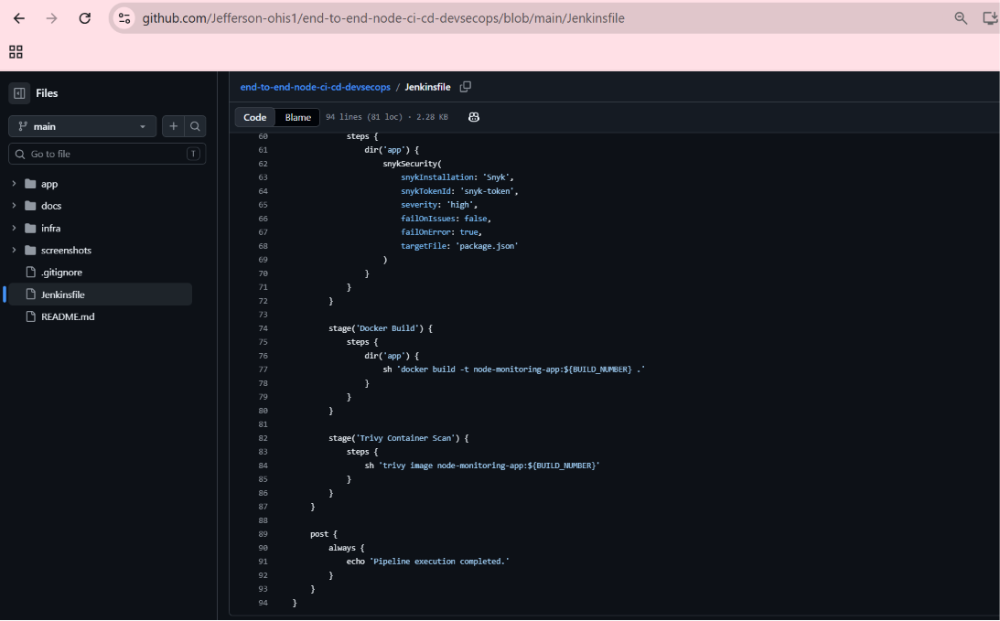

The Jenkinsfile shows the dedicated:

Trivy Container Scan stage.

The scan was executed against:

```text
node-monitoring-app:${BUILD_NUMBER}
```

This established the first container-security inspection point in the pipeline.

At this stage, Trivy was primarily being used for vulnerability discovery and reporting rather than as an enforced admission control.

---

### Jenkins Pipeline — Initial Trivy Container Scan Execution

The initial Trivy stage was executed through Jenkins.

The following screenshot provides evidence of the Jenkins pipeline execution of the original Trivy container scan stage.

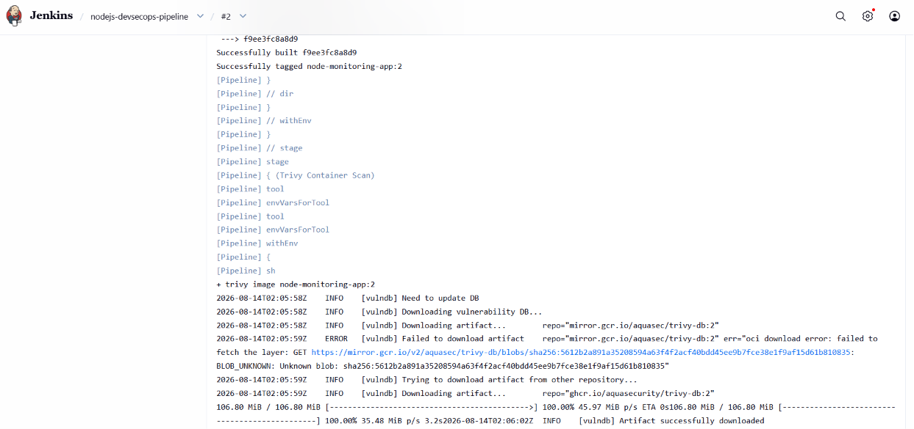

The Jenkins console shows the pipeline entering:

```text
[Pipeline] stage
[Pipeline] { (Trivy Container Scan)
```

Trivy then initialized its vulnerability database and scanned the generated Docker image.

The scan therefore established the connection between:

```text
Jenkins Build
      │
      ▼
Docker Image
      │
      ▼
Trivy Vulnerability Scanner
```

The initial scan also demonstrated that Trivy could successfully inspect the production container image and identify vulnerabilities within its underlying components.

---

### Initial Trivy Vulnerability Results

The original Trivy scan produced vulnerability findings within the generated container image.

The following screenshot provides evidence of the initial Trivy vulnerability results.

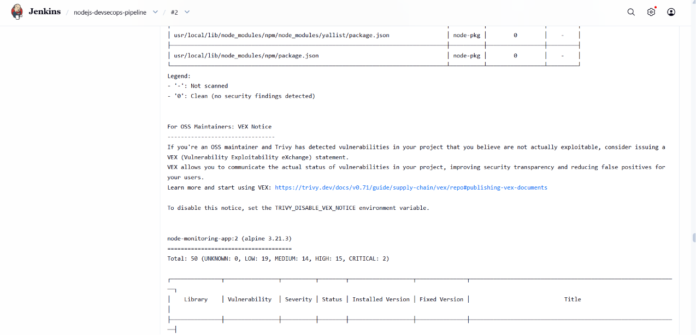


The scan reported:

```text
Target: node-monitoring-app:2
OS: Alpine 3.21.3

Total Vulnerabilities: 50

UNKNOWN:  0
LOW:      19
MEDIUM:   14
HIGH:     15
CRITICAL: 2
```

The initial scan therefore identified:

| **Severity** | **Findings** |
|--------------|--------------|
| **UNKNOWN**  | 0            |
| **LOW**      | 19           |
| **MEDIUM**   | 14           |
| **HIGH**     | **15**       |
| **CRITICAL** | **2**        |
| **Total**    | **50**       |

The most important observation was the presence of:

```text
HIGH:     15
CRITICAL: 2
```

This demonstrated why simply generating a vulnerability report was not sufficient for a DevSecOps pipeline.

A production container containing HIGH or CRITICAL vulnerabilities should not automatically progress through the delivery pipeline without an explicit security decision.

This led to the next improvement: converting Trivy into an automated security quality gate.

---

### Trivy Vulnerability Remediation and Production Image Hardening

The initial Trivy scan demonstrated that the production container image contained security vulnerabilities requiring remediation before the image could be considered suitable for further delivery.

The initial scan reported:

```text
HIGH:     15
CRITICAL: 2
```
> These findings triggered a review of the production Docker image and its runtime configuration.

Rather than assuming that the vulnerabilities were caused by a single component, the production image was subsequently hardened through several changes to the Dockerfile and Jenkins environment.

The remediation included:

```text
Node.js 24 Alpine base image
        │
        ├── Updated Node.js runtime
        │
        ├── Updated Alpine-based image
        │
        ├── Production-only dependencies
        │
        ├── npm removed from runtime image
        │
        ├── npx removed from runtime image
        │
        └── Non-root container execution
```

The Dockerfile was modified to use a multi-stage build:

```text
FROM node:24-alpine AS builder
```

and:

```text
FROM node:24-alpine AS runtime
```

Production dependencies were installed using:

```text
npm ci --omit=dev --ignore-scripts
```

The production runtime image was also hardened by removing npm and npx:

```text
RUN rm -rf /usr/local/lib/node_modules/npm \
           /usr/local/bin/npm \
           /usr/local/bin/npx
```

The container was configured to execute as the non-root node user:

```text
USER node
```

In addition, the Jenkins environment was updated to use the Node.js 24 installation:

```text
NodeJS installation:
node24

Version:
24.19.0
```

This was configured under:

```text
Manage Jenkins
    → Tools
        → NodeJS installations
```

Following these changes, the Docker image was rebuilt and the resulting production image was subjected to the Trivy HIGH/CRITICAL security gate again.

The Dockerfile and runtime configuration were remediated, the production image was rebuilt, and the resulting image subsequently passed the HIGH/CRITICAL Trivy security gate.

The remediation strategy consisted of:

```text
Initial Production Image
          │
          ▼
   Trivy Initial Scan
          │
          ├── HIGH: 15
          └── CRITICAL: 2
          │
          ▼
       Remediation
          │
          ├── Node.js 24
          ├── Updated Alpine base
          ├── Production-only dependencies
          ├── npm removed
          ├── npx removed
          └── Non-root runtime user
          │
          ▼
     Docker Image Rebuilt
          │
          ▼
      Trivy Rescan
          │
          ├── HIGH: 0
          └── CRITICAL: 0
          │
          ▼
   Trivy Security Gate
          │
          ▼
        PASSED
```

The remediation was therefore applied at the container-image construction layer, rather than attempting to suppress or ignore the Trivy findings.

> Important DevSecOps principle: Security findings should be remediated where possible rather than simply excluded from the scanner or downgraded in severity.

---

### From Vulnerability Reporting to Security Quality Gate

The initial Trivy implementation provided visibility into vulnerabilities present in the original production image. Following remediation and reconstruction of the production image, the pipeline was further enhanced with an explicit HIGH/CRITICAL security quality gate to prevent vulnerable images from progressing automatically through subsequent delivery stages.

The security objective was therefore changed from:

```text
Scan → Report Vulnerabilities
```

to:

```text
Scan → Evaluate Severity → Enforce Security Policy
```

The updated security policy was defined as:

```text
HIGH vulnerabilities
        OR
CRITICAL vulnerabilities
        │
        ▼
Security Gate FAILED
        │
        ▼
Pipeline Stops
```

Conversely:

```text
HIGH = 0
CRITICAL = 0
        │
        ▼
Security Gate PASSED
        │
        ▼
Pipeline Continues
```

This introduced automated security enforcement into the container stage.


---

### Dockerfile Security Remediation

The original production image was based on an older Node.js Alpine image and contained npm and npx in the final runtime image.

To reduce the attack surface and address the vulnerabilities identified by Trivy, the Dockerfile was redesigned using a multi-stage build.

The Dockerfile was subsequently modified to harden the production container image.

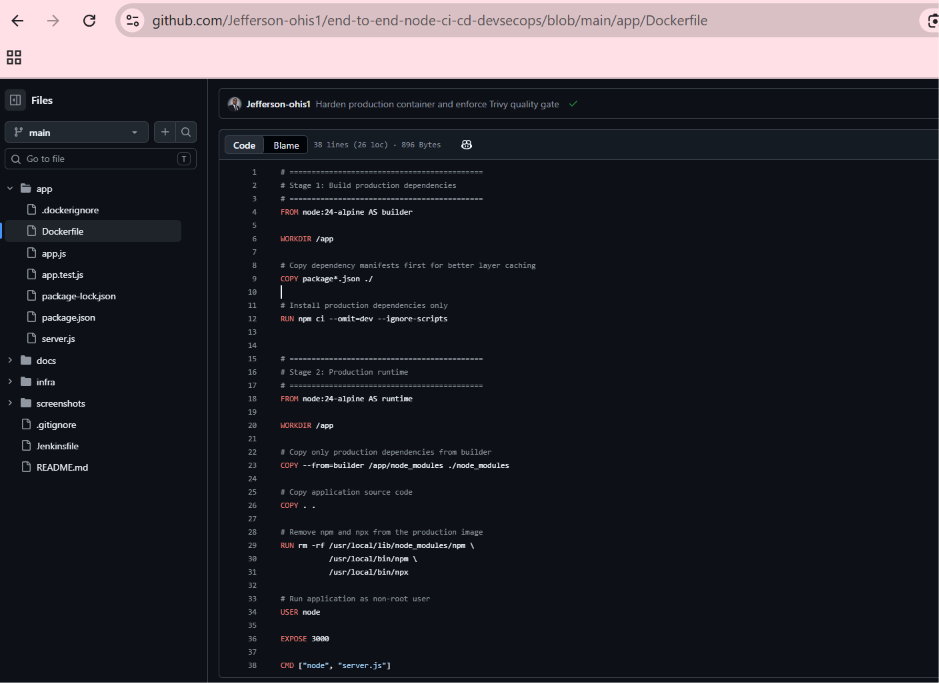

The updated Dockerfile uses Node.js 24 Alpine:

```text
# ============================================
# Stage 1: Build production dependencies
# ============================================
FROM node:24-alpine AS builder

WORKDIR /app

# Copy dependency manifests first for better layer caching
COPY package*.json ./

# Install production dependencies only
RUN npm ci --omit=dev --ignore-scripts


# ============================================
# Stage 2: Production runtime
# ============================================
FROM node:24-alpine AS runtime

WORKDIR /app

# Copy only production dependencies from builder
COPY --from=builder /app/node_modules ./node_modules

# Copy application source code
COPY . .

# Remove npm and npx from the production image
RUN rm -rf /usr/local/lib/node_modules/npm \
           /usr/local/bin/npm \
           /usr/local/bin/npx

# Run application as non-root user
USER node

EXPOSE 3000

CMD ["node", "server.js"]
```

The Dockerfile changes introduced several security improvements.

| **Dockerfile Change**              | **Security / Engineering Purpose**                                      |
|------------------------------------|-------------------------------------------------------------------------|
| **Node.js 18 → Node.js 24**        | Uses the newer Node.js runtime and corresponding updated base image     |
| **Multi-stage build**              | Separates dependency installation from the final runtime image          |
| **`npm ci --omit=dev`**             | Excludes development dependencies from the production image             |
| **`--ignore-scripts`**             | Prevents dependency lifecycle scripts from executing during installation |
| **npm removal**                     | Removes the npm package manager from the runtime image                  |
| **npx removal**                     | Removes the npx command from the runtime image                          |
| **`USER node`**                     | Runs the application as a non-root user                                  |
| **Minimal runtime contents**        | Reduces unnecessary components and attack surface                       |

The resulting architecture is:

```text
                 Docker Build
                     │
                     ▼
             ┌─────────────────┐
             │  Builder Stage  │
             │                 │
             │ node:24-alpine  │
             │                 │
             │ npm ci           │
             │ --omit=dev       │
             │ --ignore-scripts  │
             └────────┬────────┘
                      │
                      │ production
                      │ node_modules
                      ▼
             ┌─────────────────┐
             │ Runtime Stage   │
             │                 │
             │ node:24-alpine  │
             │                 │
             │ App Source      │
             │ Production Deps │
             │                 │
             │ npm → removed   │
             │ npx → removed   │
             │                 │
             │ USER node        │
             └────────┬────────┘
                      │
                      ▼
              Production Image
                      │
                      ▼
                 Trivy Scan
```

This approach reduces unnecessary components in the final runtime image and helps minimize the container's attack surface.

Following these changes, the Docker image was rebuilt and the resulting production image was subjected to the Trivy HIGH/CRITICAL security gate again.

The Dockerfile and runtime configuration were remediated, the production image was rebuilt, and the resulting image subsequently passed the HIGH/CRITICAL Trivy security gate.

---

### Jenkins Node.js Runtime Upgrade

The Dockerfile remediation was accompanied by an update to the Node.js runtime configured in Jenkins.

The Jenkins pipeline previously used the Node.js 18 tool configuration:

```text
node18
```

The Jenkins NodeJS installation was subsequently updated to:

```text
Name: node24
Version: 24.19.0
```

The configuration was updated through:

```text
Manage Jenkins
      │
      ▼
Tools
      │
      ▼
NodeJS installations
      │
      ▼
Name: node24
      │
      ▼
Version: 24.19.0
```

The Jenkinsfile was then updated from:

```bash
tools {
    jdk 'jdk21'
    nodejs 'node18'
}
```

to:

```bash
tools {
    jdk 'jdk21'
    nodejs 'node24'
}
```

This ensured that the Jenkins build environment used the same major Node.js generation as the production Docker image.

The resulting environment alignment was:

| **Environment**          | **Node.js Configuration** |
|--------------------------|---------------------------|
| **Jenkins**              | `node24` — Node.js 24.19.0 |
| **Docker Builder**       | `node:24-alpine`           |
| **Docker Runtime**       | `node:24-alpine`           |
| **Application Runtime**  | Node.js 24                 |

This reduces the possibility of building and testing the application against one major Node.js version while deploying it using another.

---

### Jenkinsfile Security Remediation and Production Image Verification

The Jenkinsfile was also updated to validate the production image before it reached the Trivy security gate.

The updated pipeline introduced a dedicated stage:

```text
Verify Production Image
```


The stage validates three important properties of the final container image:

```text
Production Image
      │
      ├── Node.js Version
      │
      ├── npm Removed
      │
      └── npx Removed
```

The relevant Jenkinsfile configuration is:

```bash
stage('Verify Production Image') {
    steps {
        sh '''
            echo "======================================"
            echo "Node.js version inside production image"
            echo "======================================"

            docker run --rm \
                ${IMAGE_NAME}:${IMAGE_TAG} \
                node --version

            echo "======================================"
            echo "Verify npm is removed"
            echo "======================================"

            docker run --rm \
                ${IMAGE_NAME}:${IMAGE_TAG} \
                sh -c "command -v npm || echo 'npm removed'"

            echo "======================================"
            echo "Verify npx is removed"
            echo "======================================"

            docker run --rm \
                ${IMAGE_NAME}:${IMAGE_TAG} \
                sh -c "command -v npx || echo 'npx removed'"
        '''
    }
}
```

This validation prevents the pipeline from assuming that the Dockerfile changes were correctly reflected in the generated image.

The validation sequence is:

```text
Docker Build
      │
      ▼
Production Image
      │
      ▼
Verify Production Image
      │
      ├── node --version
      │
      ├── npm → removed
      │
      └── npx → removed
      │
      ▼
Trivy Security Gate
```

This is an important improvement because the security controls are validated against the actual generated artifact, rather than relying only on the Dockerfile source code.

---

### Trivy HIGH/CRITICAL Security Gate Configuration

Following the Dockerfile security remediation and Node.js runtime upgrade, the production image was rebuilt and subjected to a new Trivy security scan. The Jenkinsfile was subsequently updated to enforce HIGH and CRITICAL severity thresholds

The security gate was configured to evaluate only HIGH and CRITICAL vulnerabilities:

```text
trivy image \
    --severity HIGH,CRITICAL \
    --exit-code 1 \
    ${IMAGE_NAME}:${IMAGE_TAG}
```

The purpose of this scan was to validate whether the remediated production image could satisfy the defined security admission policy.

The complete remediation and validation sequence was:

```text
Initial Image
     │
     ▼
Trivy Scan
     │
     ├── HIGH: 15
     └── CRITICAL: 2
     │
     ▼
Vulnerability Investigation
     │
     ▼
Dockerfile Remediation
     │
     ├── Node.js 24 Alpine
     ├── Multi-stage build
     ├── Production dependencies only
     ├── --ignore-scripts
     ├── npm removed
     ├── npx removed
     └── Non-root runtime
     │
     ▼
Jenkins Node.js 24 Configuration
     │
     ▼
Docker Image Rebuild
     │
     ▼
Production Image Verification
     │
     ├── Node.js version ✓
     ├── npm removed ✓
     └── npx removed ✓
     │
     ▼
Trivy HIGH/CRITICAL Scan
     │
     ▼
HIGH = 0
CRITICAL = 0
     │
     ▼
Security Gate PASSED
```


The Jenkinsfile was subsequently updated to enforce HIGH and CRITICAL severity thresholds.

The updated Trivy configuration is:

```bash
stage('Trivy Container Scan') {
    steps {
        sh '''
            echo "======================================"
            echo "Trivy HIGH/CRITICAL Container Scan"
            echo "======================================"

            trivy image \
                --severity HIGH,CRITICAL \
                --exit-code 1 \
                ${IMAGE_NAME}:${IMAGE_TAG}
        '''
    }
}
```

The two key security controls are:

```text
--severity HIGH,CRITICAL
```

and:

```text
--exit-code 1
```

#### Severity Filtering

```text
--severity HIGH,CRITICAL
```

This instructs Trivy to evaluate HIGH and CRITICAL vulnerabilities for the security gate.

LOW and MEDIUM findings may still exist and can remain visible in other scans, but they do not trigger this particular admission threshold.

#### Exit-Code Enforcement

```text
--exit-code 1
```

This instructs Trivy to return exit code 1 when vulnerabilities matching the selected severity levels are detected.

Jenkins interprets a non-zero exit code from the sh step as a failed pipeline step.

Therefore:

```text
HIGH/CRITICAL Vulnerabilities Found
              │
              ▼
       Trivy Exit Code 1
              │
              ▼
        Jenkins sh Step
              │
              ▼
         Pipeline FAILS
```

Conversely:

```text
No HIGH/CRITICAL Vulnerabilities
              │
              ▼
       Trivy Exit Code 0
              │
              ▼
        Jenkins sh Step
              │
              ▼
       Pipeline CONTINUES
```

This is what transforms Trivy from a passive vulnerability-reporting tool into an automated security quality gate.

---

### Jenkinsfile — Trivy Security Quality Gate

The following screenshot provides evidence of the updated Trivy security-gate implementation in the Jenkinsfile.

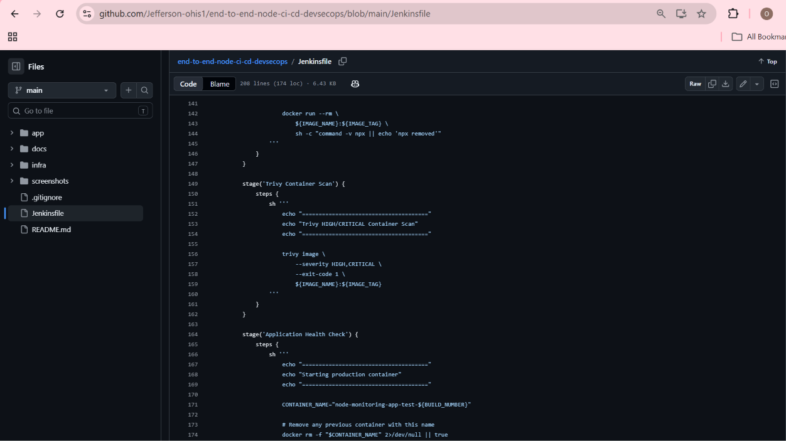


The screenshot confirms that the Trivy stage was enhanced to include:

```text
--severity HIGH,CRITICAL
```

and:

```text
--exit-code 1
```

The resulting security-control logic is:

```text
Docker Image
     │
     ▼
Trivy Container Scan
     │
     ├── Vulnerability Detection
     ├── HIGH/CRITICAL Filtering
     └── Exit-Code Enforcement
     │
     ▼
Security Gate Decision
     │
     ├── Findings → FAIL
     └── No Findings → CONTINUE
```

This configuration ensures that container security is actively enforced before the application is allowed to continue to subsequent pipeline stages.

---

### Jenkins Pipeline — Trivy Quality Gate Execution

After updating the Jenkinsfile, the pipeline was executed again.

The following screenshot provides evidence of the Jenkins pipeline executing the updated Trivy quality-gate stage.

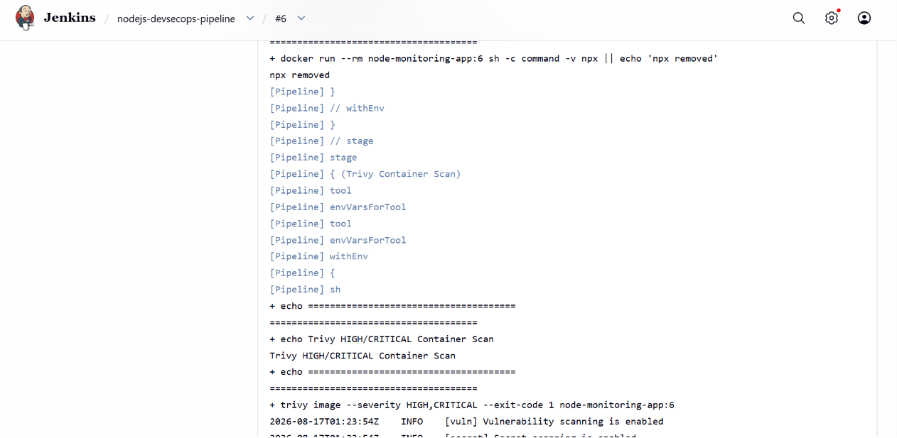


The Jenkins console shows:

```text
[Pipeline] stage
[Pipeline] { (Trivy Container Scan)
```

The security-gate command executed was:

```text
trivy image \
    --severity HIGH,CRITICAL \
    --exit-code 1 \
    node-monitoring-app:6
```

The image scanned during this execution was therefore:

```text
node-monitoring-app:6
```

This provides traceability between the Jenkins build number, generated Docker image, and Trivy security scan.

The execution demonstrates that the pipeline was no longer merely running an unrestricted vulnerability report; it was now enforcing a defined HIGH/CRITICAL security threshold.

---

### Trivy Security Gate Result

The successful security-gate implementation was subsequently validated through Jenkins.

The following screenshot provides evidence of the Trivy security-gate result.

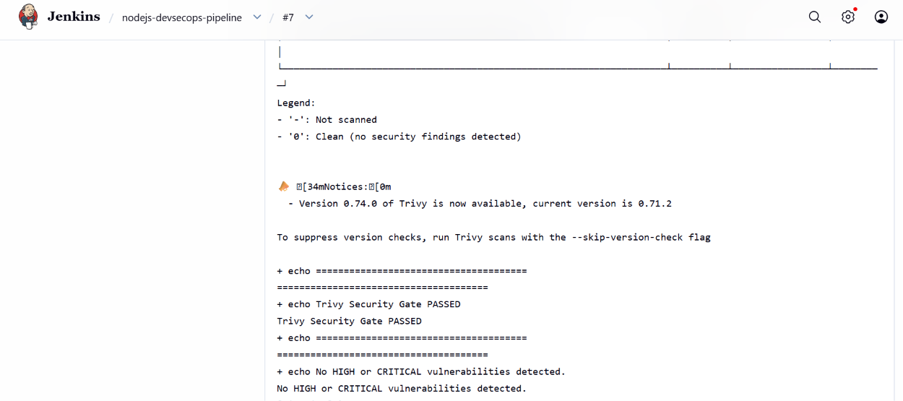


The Jenkins console reports:

```text
Trivy Security Gate PASSED
```

and:

```text
No HIGH or CRITICAL vulnerabilities detected.
```

Therefore, the configured security policy evaluated successfully:

```text
HIGH = 0
CRITICAL = 0
```

The resulting security decision was:

```text
HIGH/CRITICAL Vulnerabilities
              │
              ▼
               0
              │
              ▼
     Trivy Security Gate
              │
              ▼
            PASSED
```

The key security result can therefore be summarized as:

| **Security Gate**           | **Result**     |
|-----------------------------|----------------|
| **HIGH vulnerabilities**    | **0**          |
| **CRITICAL vulnerabilities** | **0**          |
| **Trivy exit status**        | **0**          |
| **Security gate**            | **✅ PASSED**  |

This represents the successful clean-image path through the newly enforced Trivy security gate.

---

### Trivy Quality Gate — Detailed Interpretation

The updated implementation should be distinguished from the original Trivy configuration.

#### Previous Configuration

The original scan used:

```text
trivy image node-monitoring-app:${BUILD_NUMBER}
```

Its purpose was primarily vulnerability discovery and reporting.

The initial scan demonstrated that the image could contain significant security findings, including:

```text
HIGH:     15
CRITICAL: 2
```

However, the original configuration did not explicitly enforce a HIGH/CRITICAL admission threshold.


#### Current Configuration

The updated implementation uses:

```text
trivy image \
    --severity HIGH,CRITICAL \
    --exit-code 1 \
    node-monitoring-app:${BUILD_NUMBER}
```

This introduces automated enforcement.

| **Configuration**                 | **Previous** | **Current** |
|-----------------------------------|--------------|-------------|
| **Container scan**                | ✅           | ✅          |
| **Vulnerability detection**       | ✅           | ✅          |
| **HIGH filtering**                | ❌           | ✅          |
| **CRITICAL filtering**            | ❌           | ✅          |
| **Exit-code enforcement**         | ❌           | ✅          |
| **Automatic pipeline failure**    | ❌           | ✅          |
| **Security quality gate**         | ❌           | **✅**      |


The progression is therefore:

```text
Initial Implementation
         │
         ▼
Vulnerability Visibility
         │
         ▼
Security Findings Identified
         │
         ▼
Security Policy Defined
         │
         ▼
HIGH/CRITICAL Filtering
         │
         ▼
Exit-Code Enforcement
         │
         ▼
Automated Security Quality Gate
```

---

### Trivy Quality Gate and Jenkins Pipeline Continuation

Because the validated container image contained no HIGH or CRITICAL vulnerabilities according to the configured gate, Trivy returned a successful exit status.

The following screenshot provides evidence that the pipeline proceeded beyond the Trivy security gate.

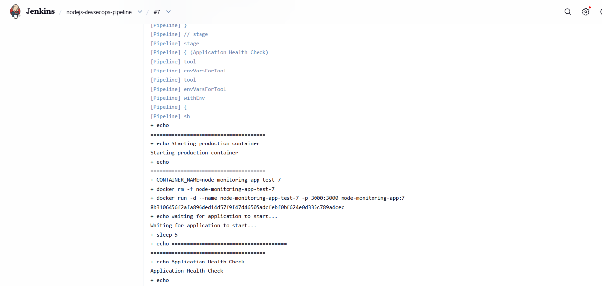


The Jenkins console subsequently entered:

```text
[Pipeline] stage
[Pipeline] { (Application Health Check)
```

This is important evidence because it demonstrates that the Trivy stage did not simply report a successful scan; the successful security decision actually allowed Jenkins to proceed to the next pipeline control.

The flow was therefore:

```text
Trivy Container Scan
         │
         ├── HIGH = 0
         ├── CRITICAL = 0
         │
         ▼
Security Gate PASSED
         │
         ▼
Application Health Check
```

> This confirms the intended behavior of the quality gate.

---

### Application Health Check After Trivy Gate

After successfully passing the Trivy security gate, Jenkins proceeded to the application health-check stage.

The production container was started using:

docker run -d \
    --name "$CONTAINER_NAME" \
    -p 3000:3000 \
    node-monitoring-app:${BUILD_NUMBER}


The application health endpoint was then tested:

```text
curl --fail http://localhost:3000/health
```

The expected application response was:

```text
ok
```

The pipeline therefore performed two consecutive validations:

```text
Docker Image
      │
      ▼
Trivy Security Gate
      │
      ├── HIGH = 0
      └── CRITICAL = 0
      │
      ▼
Security Gate PASSED
      │
      ▼
Application Health Check
      │
      ▼
Application Available
```

This demonstrates that the container passed both a security validation and an application runtime validation before progressing further through the pipeline.

---

### Final Jenkins Pipeline Result

The successful Trivy security-gate execution was followed by successful completion of the Jenkins pipeline.

The following screenshot provides final evidence of the successful Jenkins pipeline execution.

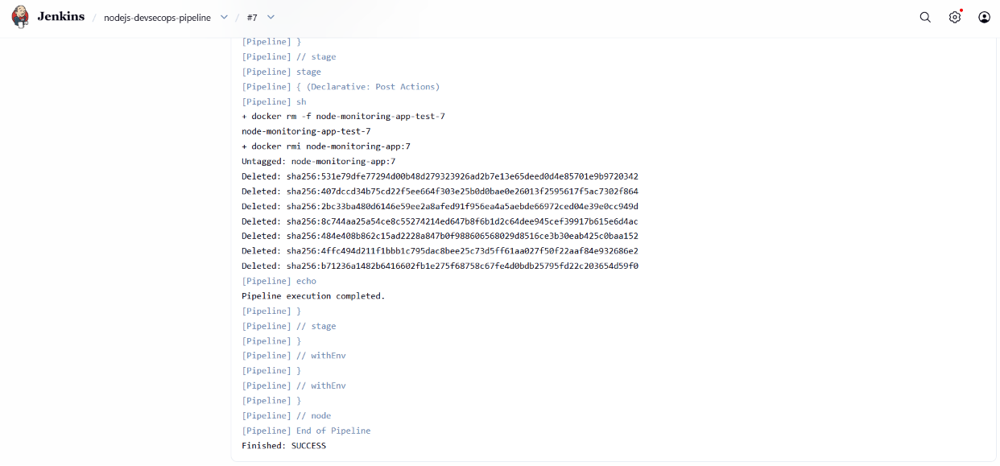


The Jenkins console concluded with:

```text
Pipeline execution completed.
```

and:

```text
Finished: SUCCESS
```

The complete validated flow was:

```text
Docker Build
      │
      ▼
Docker Image
      │
      ▼
Trivy Container Scan
      │
      ├── Alpine OS Package Scan
      ├── Node.js Application Dependency Analysis
      ├── HIGH Severity Check
      └── CRITICAL Severity Check
      │
      ▼
HIGH = 0
CRITICAL = 0
      │
      ▼
Trivy Exit Code = 0
      │
      ▼
Security Gate PASSED
      │
      ▼
Application Health Check
      │
      ▼
Pipeline Execution Completed
      │
      ▼
Finished: SUCCESS
```

This provides end-to-end evidence that the Trivy quality gate successfully integrated security enforcement into the Jenkins pipeline.

---

### Trivy Quality Gate Behavior

The current Trivy implementation provides two possible pipeline outcomes.

#### Scenario 1 — Security Gate Passes

If no HIGH or CRITICAL vulnerabilities are detected:

```text
Trivy Scan
      │
      ▼
HIGH = 0
CRITICAL = 0
      │
      ▼
Exit Code = 0
      │
      ▼
Security Gate PASSED
      │
      ▼
Pipeline Continues
```

This is the successful path demonstrated by the Jenkins validation screenshots.

#### Scenario 2 — Security Gate Fails

If one or more HIGH or CRITICAL vulnerabilities are detected:

```text
Trivy Scan
      │
      ▼
HIGH > 0
OR
CRITICAL > 0
      │
      ▼
Exit Code = 1
      │
      ▼
Jenkins sh Step Fails
      │
      ▼
Trivy Security Gate FAILED
      │
      ▼
Pipeline Stops
```

This behavior is enforced by:

```text
--severity HIGH,CRITICAL
```

and:

```text
--exit-code 1
```

Therefore, the Trivy stage now functions as an actual automated security quality gate rather than merely generating a vulnerability report.

---

### Why the Trivy Quality Gate Is Important

The Trivy quality gate prevents a container image containing HIGH or CRITICAL vulnerabilities from automatically progressing through the CI/CD pipeline.

The security architecture can therefore be represented as:

```text
Application Source Code
         │
         ▼
SonarCloud SAST
         │
         ▼
SAST Quality Gate
         │
         ▼
Snyk SCA
         │
         ▼
Docker Image Build
         │
         ▼
Trivy Container Security Gate
         │
         ├── HIGH/CRITICAL → BLOCK
         │
         └── CLEAN → CONTINUE
         │
         ▼
Application Health Check
         │
         ▼
Amazon ECR
         │
         ▼
Amazon EKS
```

This provides defense-in-depth across multiple layers of the software supply chain.

| **Security Control**            | **Primary Focus**                  | **Enforcement**                  |
|---------------------------------|-------------------------------------|-----------------------------------|
| **SonarCloud SAST**             | Application source code             | Quality Gate                      |
| **Snyk SCA**                    | Third-party dependencies            | Vulnerability Analysis            |
| **Trivy Container Scan**        | Final container image               | **HIGH/CRITICAL Security Gate**   |
| **Application Health Check**    | Runtime application availability    | Health Validation                 |

Each tool therefore addresses a different part of the application delivery lifecycle.

---


### Trivy Quality Gate Validation

The Trivy quality gate was validated through actual Jenkins Pipeline execution.

| **Validation Item**                                  | **Status**       |
|------------------------------------------------------|-------------------|
| **Trivy installed on Jenkins host**                  | ✅                |
| **Docker available on Jenkins host**                 | ✅                |
| **Docker image generated**                           | ✅                |
| **Initial Trivy container scan implemented**         | ✅                |
| **Initial vulnerability results captured**           | ✅                |
| **HIGH severity findings identified during initial scan** | **15**        |
| **CRITICAL severity findings identified during initial scan** | **2**    |
| **Trivy quality-gate stage configured**              | ✅                |
| **HIGH severity filtering enabled**                  | ✅                |
| **CRITICAL severity filtering enabled**              | ✅                |
| **`--exit-code 1` configured**                       | ✅                |
| **Alpine OS layer scanned**                          | ✅                |
| **Node.js application dependencies analyzed**        | ✅                |
| **Validated HIGH vulnerabilities**                   | **0**             |
| **Validated CRITICAL vulnerabilities**               | **0**             |
| **Trivy security gate passed**                       | **✅**            |
| **Pipeline continued after Trivy**                  | **✅**            |
| **Application health check executed**                | **✅**            |
| **Jenkins Pipeline result**                          | **✅ SUCCESS**    |
| **Dockerfile Node.js runtime upgraded**              | **Node.js 24** |
| **Multi-stage Docker build implemented**             | ✅             |
| **Production dependencies only**                    | ✅             |
| **`--ignore-scripts` enabled**                       | ✅             |
| **npm removed from production image**               | ✅             |
| **npx removed from production image**                | ✅             |
| **Production image runs as non-root user**           | ✅             |
| **Jenkins NodeJS tool updated to `node24`**          | **24.19.0**    |
| **Production image rebuilt after remediation**       | ✅             |

The screenshots therefore document the complete evolution from vulnerability visibility to automated security enforcement.

---

### Complete Trivy Evidence Chain

The eight screenshots provide a continuous evidence chain for the Trivy implementation.

| **Screenshot** | **Evidence Provided** |
|----------------|------------------------|
| **52-jenkinsfile-trivy-container-scan-stage.png** | Initial Trivy container-scan stage in the Jenkinsfile |
| **53-jenkins-pipeline-trivy-container-scan-stage.png** | Initial Trivy scan execution in Jenkins |
| **54-trivy-container-vulnerability-results.png** | Initial vulnerability findings: 15 HIGH and 2 CRITICAL |
| **55-jenkinsfile-trivy-quality-gate.png** | Updated Trivy HIGH/CRITICAL quality-gate configuration |
| **56-jenkins-pipeline-trivy-quality-gate-stage.png** | Jenkins execution of the enforced Trivy quality gate |
| **57-trivy-quality-gate-results.png** | Security gate passed with no HIGH/CRITICAL vulnerabilities detected |
| **58-jenkins-trivy-gate-passed.png** | Pipeline continuation into Application Health Check |
| **59-jenkins-trivy-quality-gate-success.png** | Final successful Jenkins pipeline execution |
| **60-hardened-production-dockerfile.png** | hardened-production-dockerfile |

The evidence chain can therefore be summarized as:

```text
52 Initial Trivy Configuration
         │
         ▼
53 Initial Trivy Execution
         │
         ▼
54 Vulnerability Findings
         │
         ├── 15 HIGH
         └── 2 CRITICAL
         │
         ▼
60 Hardened Production Dockerfile
         │
         ├── Updated Node.js Runtime
         ├── Multi-Stage Build
         ├── Production Dependencies Only
         ├── npm Removed
         ├── npx Removed
         ├── Non-Root User
         └── Minimal Runtime Image
         │
         ▼
Security Policy Improvement
         │
         ▼
55 Trivy Quality Gate Configuration
         │
         ▼
56 Quality Gate Execution
         │
         ▼
57 Gate PASSED
         │
         ▼
58 Application Health Check
         │
         ▼
59 Pipeline SUCCESS
```

---

### Trivy Container Security Position

The addition of Trivy with HIGH/CRITICAL exit-code enforcement significantly strengthens the Phase 8 DevSecOps pipeline.

The security progression is now:

```text
Source Code
      │
      ▼
SonarCloud SAST
      │
      ▼
SAST Quality Gate
      │
      ▼
Third-Party Dependencies
      │
      ▼
Snyk SCA
      │
      ▼
Docker Image
      │
      ▼
Trivy Container Security Gate
      │
      ├── HIGH/CRITICAL → BLOCK
      │
      └── CLEAN → CONTINUE
      │
      ▼
Application Health Check
      │
      ▼
Amazon ECR
      │
      ▼
Amazon EKS
```

The resulting DevSecOps security model is:

```text
┌─────────────────────────────────────────────┐
│          APPLICATION SOURCE CODE            │
│                                             │
│             SonarCloud SAST                 │
│                                             │
│              Quality Gate                   │
└──────────────────────┬──────────────────────┘
                       │
                       ▼
┌─────────────────────────────────────────────┐
│         THIRD-PARTY DEPENDENCIES            │
│                                             │
│                Snyk SCA                     │
└──────────────────────┬──────────────────────┘
                       │
                       ▼
┌─────────────────────────────────────────────┐
│              CONTAINER IMAGE                │
│                                             │
│       Trivy HIGH/CRITICAL Security Gate     │
└──────────────────────┬──────────────────────┘
                       │
                       ▼
┌─────────────────────────────────────────────┐
│           APPLICATION VALIDATION            │
│                                             │
│           Container Health Check            │
└──────────────────────┬──────────────────────┘
                       │
                       ▼
┌─────────────────────────────────────────────┐
│             CONTAINER REGISTRY              │
│                                             │
│                 Amazon ECR                  │
└─────────────────────────────────────────────┘

This represents a progression from:

```text
Source-Code Security
         │
         ▼
Dependency Security
         │
         ▼
Container Security
         │
         ▼
Runtime Validation
         │
         ▼
Container Registry
```

The pipeline therefore implements multiple security controls rather than relying on a single scanning mechanism.

---

### Trivy Container Security Gate Result

The Trivy Container Security Gate was successfully implemented and validated through Jenkins.

The implementation evolved from an initial vulnerability scan that identified:

```text
HIGH:     15
CRITICAL: 2
```

to an enforced security policy using:

```text
trivy image \
    --severity HIGH,CRITICAL \
    --exit-code 1 \
    node-monitoring-app:${BUILD_NUMBER}
```

The validated clean-image result was:

| **Severity** | **Result** |
|--------------|------------|
| **HIGH**     | **0**       |
| **CRITICAL** | **0**       |

Therefore:

```text
Trivy Security Gate: PASSED
```

The successful security decision allowed Jenkins to continue to the Application Health Check stage.

The application subsequently returned:

```text
ok
```

and the Jenkins pipeline completed with:

```text
Finished: SUCCESS
```

The final security-gate result can therefore be summarized as:

> Trivy Container Security Gate: ✅ PASSED

> HIGH vulnerabilities: 0

> CRITICAL vulnerabilities: 0

> The configured Trivy gate now blocks the pipeline when HIGH or CRITICAL vulnerabilities are detected.

> The initial vulnerability scan demonstrated why an enforced security threshold was necessary, while the subsequent quality-gate execution demonstrated the clean-image path through which the container was allowed to continue.


---

### Updated Phase 8 Pipeline Status

Following the implementation of the Trivy HIGH/CRITICAL security gate, the current Phase 8 pipeline progression is:

```text
GitHub
   │
   ▼
Jenkins
   │
   ├── Checkout Source Code              ✅
   │
   ├── Install Dependencies              ✅
   │
   ├── Dependency Inspection             ✅
   │
   ├── Unit Testing                      ✅
   │      └── Jest: 3 Tests Passed
   │
   ├── SonarCloud SAST                   ✅
   │      └── Quality Gate: PASSED
   │
   ├── Snyk SCA                          ✅
   │      ├── Dependency Analysis
   │      ├── Vulnerability Detection
   │      └── Project Monitoring
   │
   ├── Docker Build                      ✅
   │      └── node-monitoring-app:${BUILD_NUMBER}
   │
   ├── Verify Production Image           ✅
   │      ├── Node.js Version
   │      ├── npm Removed
   │      └── npx Removed
   │
   ├── Trivy Container Security Scan     ✅
   │      ├── Alpine OS Package Scanning
   │      ├── Node.js Application Dependency Analysis
   │      ├── HIGH Severity Check
   │      ├── CRITICAL Severity Check
   │      └── HIGH/CRITICAL Security Gate
   │             ├── Findings → Pipeline FAILS
   │             └── No Findings → Pipeline CONTINUES
   │
   ├── Application Health Check           ✅
   │      └── /health → ok
   │
   ├── Amazon ECR Push                    ⏳
   │
   ├── Amazon EKS Deployment              ⏳
   │
   ├── Rollout Verification               ⏳
   │
   └── OWASP ZAP DAST                     ⏳
```

### Next Pipeline Stage

The Trivy Container Security Gate has now been successfully implemented and validated.

The current security progression is:

```text
GitHub
   │
   ▼
Jenkins
   │
   ├── Unit Testing                     ✅
   │
   ├── SonarCloud SAST                  ✅
   │      └── Quality Gate: PASSED
   │
   ├── Snyk SCA                         ✅
   │
   ├── Docker Build                     ✅
   │
   ├── Trivy Container Security Scan    ✅
   │      ├── Alpine OS Package Scanning
   │      ├── Node.js Application Dependency Analysis
   │      ├── HIGH Severity Check
   │      ├── CRITICAL Severity Check
   │      └── HIGH/CRITICAL Security Gate
   │             ├── Findings → Pipeline FAILS
   │             └── No Findings → Pipeline CONTINUES
   │
   ├── Application Health Check          ✅
   │
   └── Amazon ECR                       ⏳
```

> Next Step: The next stage of the Phase 8 DevSecOps Pipeline is Section 17 — Amazon ECR Container Image Publishing.

The Docker image that has successfully passed the application, dependency, SAST, container-security, and health-validation stages can now be authenticated against Amazon ECR, tagged with the appropriate ECR repository URI, and pushed to the container registry.

---

## Section 17 — Amazon ECR Container Image Publishing

After successfully completing the Docker build, production-image verification, Trivy HIGH/CRITICAL security gate, and application health check, the next stage of the CI/CD pipeline pushes the validated Docker image to Amazon Elastic Container Registry (Amazon ECR).

The ECR integration ensures that only a successfully tested and security-validated container image is promoted to the AWS container registry.

### ECR Deployment Flow

```text
Docker Build
      │
      ▼
Verify Production Image
      │
      ▼
Trivy HIGH/CRITICAL Security Gate
      │
      ▼
Application Health Check
      │
      ▼
Amazon ECR Container Image Push
      │
      ├── Authenticate Docker to ECR
      ├── Tag Docker Image
      └── Push Docker Image
      │
      ▼
Verify ECR Image
      │
      └── AWS CLI describe-images
      │
      ▼
Jenkins Pipeline SUCCESS
```

---

### Amazon ECR Configuration

The Jenkins pipeline uses the following ECR configuration:

| Configuration | Value |
|---|---|
| **AWS Region** | `us-east-1` |
| **ECR Registry** | `615300991839.dkr.ecr.us-east-1.amazonaws.com` |
| **ECR Repository** | `node-devsecops-repository` |
| **Local Image** | `node-monitoring-app:${BUILD_NUMBER}` |
| **ECR Image** | `615300991839.dkr.ecr.us-east-1.amazonaws.com/node-devsecops-repository:${BUILD_NUMBER}` |
| **Image Tag** | Jenkins `BUILD_NUMBER` |
| **ECR Scan on Push** | Enabled |
| **Encryption** | AES-256 |

The Jenkinsfile defines the ECR configuration as environment variables:

```text
environment {
    IMAGE_NAME     = 'node-monitoring-app'
    IMAGE_TAG      = "${BUILD_NUMBER}"

    AWS_REGION     = 'us-east-1'
    ECR_REGISTRY   = '615300991839.dkr.ecr.us-east-1.amazonaws.com'
    ECR_REPOSITORY = 'node-devsecops-repository'
    ECR_IMAGE      = "${ECR_REGISTRY}/${ECR_REPOSITORY}:${IMAGE_TAG}"
}
```

Using ${BUILD_NUMBER} as the image tag provides a unique version for each successful Jenkins build.

```text
For example:

Jenkins Build #3
        │
        ▼
Image Tag: 3
        │
        ▼
615300991839.dkr.ecr.us-east-1.amazonaws.com/
node-devsecops-repository:3
```

---

### Amazon ECR Container Image Push Stage

The following Jenkins stage authenticates Docker with Amazon ECR, tags the locally validated image, and pushes the image to the ECR repository.

```text
stage('Amazon ECR Container Image Push') {
    steps {
        sh '''
            echo "======================================"
            echo "Amazon ECR Container Image Push"
            echo "======================================"

            echo "AWS Region:"
            echo "${AWS_REGION}"

            echo "ECR Repository:"
            echo "${ECR_REPOSITORY}"

            echo "ECR Image:"
            echo "${ECR_IMAGE}"

            echo "======================================"
            echo "Authenticating Docker to Amazon ECR"
            echo "======================================"

            aws ecr get-login-password \
                --region "${AWS_REGION}" | \
            docker login \
                --username AWS \
                --password-stdin \
                "${ECR_REGISTRY}"

            echo "Docker authentication to Amazon ECR succeeded."

            echo "======================================"
            echo "Tagging Docker Image"
            echo "======================================"

            docker tag \
                "${IMAGE_NAME}:${IMAGE_TAG}" \
                "${ECR_IMAGE}"

            echo "Docker image tagged successfully."

            echo "======================================"
            echo "Pushing Docker Image to Amazon ECR"
            echo "======================================"

            docker push "${ECR_IMAGE}"

            echo "======================================"
            echo "Amazon ECR Container Image Push PASSED"
            echo "======================================"

            echo "Image successfully pushed:"
            echo "${ECR_IMAGE}"
        '''
    }
}
```

---

### Authenticate Docker with Amazon ECR

The pipeline obtains a temporary Amazon ECR authentication token using the AWS CLI:

```bash
aws ecr get-login-password \
    --region "${AWS_REGION}"
```

The authentication token is securely passed to Docker through standard input:

```bash
docker login \
    --username AWS \
    --password-stdin \
    "${ECR_REGISTRY}"
```

This avoids placing the authentication token directly in the Jenkinsfile or exposing it as a command-line argument.

The Jenkins console confirmed:

Login Succeeded
Docker authentication to Amazon ECR succeeded.


#### Screenshot — Jenkins ECR authentication:

##### Jenkins Amazon ECR Container Image Push stage.

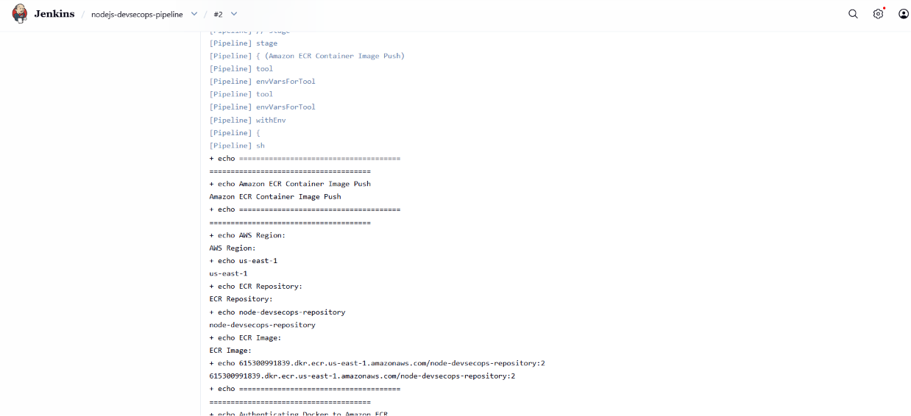


##### Docker successfully authenticated with Amazon ECR.

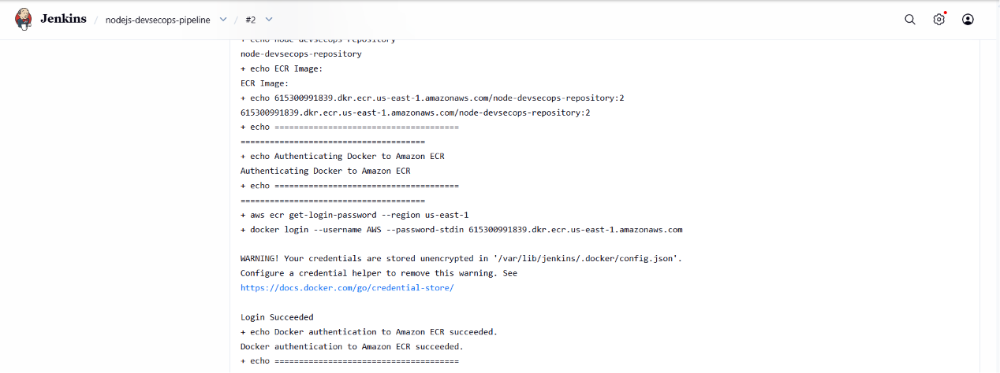


> Note: Docker displays a warning that credentials are stored in /var/lib/jenkins/.docker/config.json. This is a Docker credential-storage warning and does not indicate that the ECR authentication failed. For production environments, a Docker credential helper or another appropriate credential-management mechanism should be considered.

---

### Tag Docker Image for Amazon ECR

Before pushing the image, the locally built Docker image is tagged with the full ECR repository URI:

```bash
docker tag \
    "${IMAGE_NAME}:${IMAGE_TAG}" \
    "${ECR_IMAGE}"
```

For Jenkins Build #3, the resulting image was:

```text
615300991839.dkr.ecr.us-east-1.amazonaws.com/node-devsecops-repository:3
```

This associates the local Docker image with the target Amazon ECR repository and build-specific image tag.

The Jenkins console confirmed:

```text
Docker image tagged successfully.
```

----

### Push Docker Image to Amazon ECR

The tagged image is pushed to Amazon ECR using:

```bash
docker push "${ECR_IMAGE}"
```

During the push, Docker uploads the image layers to the ECR repository.

The Jenkins console confirmed:

```text
The push refers to repository
[615300991839.dkr.ecr.us-east-1.amazonaws.com/node-devsecops-repository]

4f4b81eb9b05: Pushed
955b2b5256ac: Pushed

3: digest: 
sha256:8ad0a4288bfdb674ae3882cc5c9eb360116cee7e695a0894af822b015a95e174
```

The resulting image was:

```text
615300991839.dkr.ecr.us-east-1.amazonaws.com/node-devsecops-repository:3
```

The image digest provides an immutable content identifier for the pushed container image.

#### Screenshot — Docker image successfully pushed to Amazon ECR repository:

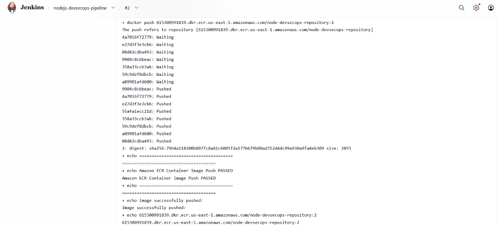

---

### Verify Image in Amazon ECR

After the push succeeds, the pipeline performs an explicit verification step.

This ensures that Jenkins does not simply assume the docker push operation succeeded; instead, it queries Amazon ECR and confirms that the expected image tag actually exists in the repository.

The Jenkinsfile contains:

```text
stage('Verify ECR Image') {
    steps {
        sh '''
            echo "======================================"
            echo "Verify Amazon ECR Image"
            echo "======================================"

            echo "Checking ECR repository for image tag:"
            echo "${IMAGE_TAG}"

            aws ecr describe-images \
                --repository-name "${ECR_REPOSITORY}" \
                --image-ids imageTag="${IMAGE_TAG}" \
                --region "${AWS_REGION}"

            echo "======================================"
            echo "Amazon ECR Image Verification PASSED"
            echo "======================================"

            echo "Verified image:"
            echo "${ECR_IMAGE}"
        '''
    }
}
```

The AWS CLI command used for verification is:

```bash
aws ecr describe-images \
    --repository-name "${ECR_REPOSITORY}" \
    --image-ids imageTag="${IMAGE_TAG}" \
    --region "${AWS_REGION}"
```

For Jenkins Build #3, Amazon ECR returned:

```text
repositoryName: node-devsecops-repository
imageTags:
  - "3"
imageDigest: sha256:8ad0a4288bfdb674ae3882cc5c9eb360116cee7e695a0894af822b015a95e174
imageSizeInBytes: 60220586
imagePushedAt: 2026-08-19T23:30:43.116000+00:00
```

> This confirms that the image tagged 3 exists in the expected ECR repository.

#### Screenshot — ECR repository containing the pushed image:

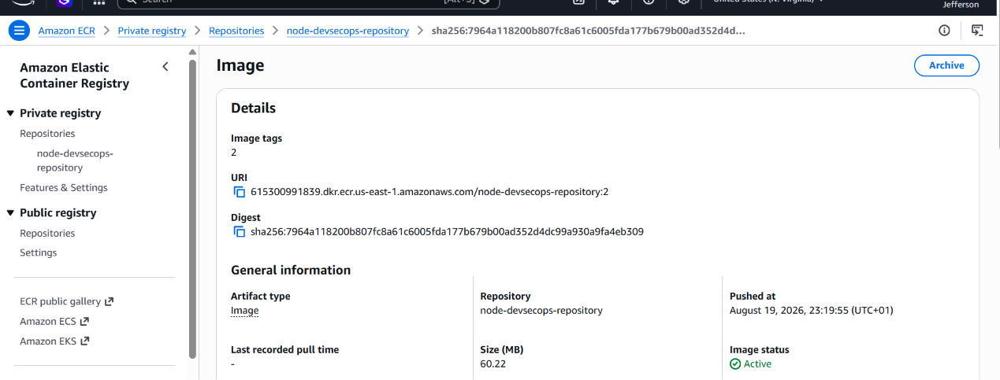

> Amazon ECR repository showing the successfully pushed container image.

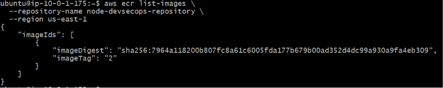

> AWS CLI verification confirming that the expected image tag exists in Amazon ECR.

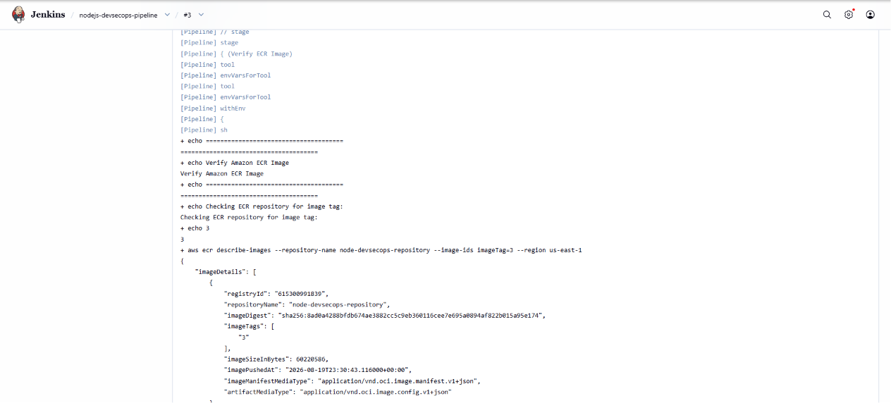

> Jenkins successfully verifying the image in Amazon ECR.

---

### ECR Verification Result

The Jenkins console reported:

```text
Amazon ECR Image Verification PASSED

and:

Verified image:
615300991839.dkr.ecr.us-east-1.amazonaws.com/node-devsecops-repository:3
```

This provides an additional validation point between the image push and subsequent deployment stages.

The complete promotion chain is therefore:

```text
Source Code
      ↓
Unit Tests
      ↓
SonarCloud SAST
      ↓
Snyk SCA
      ↓
Docker Build
      ↓
Production Image Verification
      ↓
Trivy HIGH/CRITICAL Gate
      ↓
Application Health Check
      ↓
Amazon ECR Push
      ↓
Amazon ECR Image Verification
      ↓
Deployment
```

---

### Final Jenkins Pipeline Result

Following successful ECR image verification, Jenkins executed the post-build cleanup actions:

```text
docker rm -f node-monitoring-app-test-3
docker rmi node-monitoring-app:3
```

The local test container and local application image were removed from the Jenkins agent after the pipeline completed.

The final Jenkins result was:

```text
Pipeline execution completed.
Finished: SUCCESS
```

#### Screenshot — Final Jenkins pipeline success:

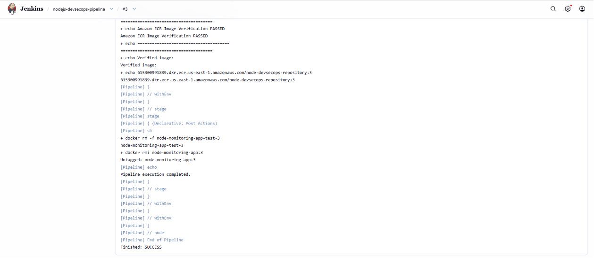

> Complete Jenkins pipeline successfully completed after Amazon ECR image verification.

---

### Security and Quality Controls

The Amazon ECR push occurs after the application's major pre-deployment quality and security controls have passed.

| Stage | Control | Result |
|---|---|---|
| Unit Testing | Jest/Supertest | ✅ Passed |
| SAST | SonarCloud | ✅ Quality Gate Passed |
| SCA | Snyk | ✅ Completed |
| Container Build | Docker | ✅ Passed |
| Production Image Verification | Node/npm/npx checks | ✅ Passed |
| Container Security | Trivy HIGH/CRITICAL Gate | ✅ Passed |
| Application Validation | `/health` endpoint | ✅ Passed |
| Container Registry | Amazon ECR Push | ✅ Passed |
| Registry Verification | AWS CLI `describe-images` | ✅ Passed |
| Pipeline | Jenkins | ✅ SUCCESS |

> This sequencing prevents an untested or HIGH/CRITICAL-vulnerable container image from being promoted to Amazon ECR.

---

### Implementation Outcome

The Amazon ECR integration successfully established an automated container image promotion workflow from Jenkins to AWS.

For Jenkins Build #3:

```text
Local Docker Image
node-monitoring-app:3
        │
        ▼
Trivy Security Gate PASSED
        │
        ▼
Application Health Check PASSED
        │
        ▼
Amazon ECR
node-devsecops-repository:3
        │
        ▼
ECR Verification PASSED
        │
        ▼
Jenkins Pipeline SUCCESS
```

> The container image is now available in Amazon ECR and has been successfully verified using the AWS CLI.

#### Key Takeaways
- Jenkins authenticates to Amazon ECR using the AWS CLI.
- Docker authentication is performed without hard-coding AWS credentials in the Jenkinsfile.
- Each Jenkins build receives a unique image tag through ${BUILD_NUMBER}.
- The image is pushed only after the Trivy security gate and application health check succeed.
- Amazon ECR is explicitly queried after the push to verify that the expected image tag exists.
- The returned image digest provides an immutable identifier for the pushed image.
- The successful ECR verification provides a reliable hand-off point for the subsequent Kubernetes/EKS deployment stage.
- Jenkins Build #3 completed with Finished: SUCCESS.

The Amazon ECR Container Image Push and ECR Image Verification stages are therefore successfully implemented and validated.

---

### Updated Phase 8 Pipeline Status

Following the successful implementation of the Amazon ECR Container Image Push and ECR Image Verification stages, the current Phase 8 pipeline progression is:

```text
GitHub

   │

   ▼

Jenkins

   │

   ├── Checkout Source Code              ✅
   │
   ├── Install Dependencies              ✅
   │
   ├── Dependency Inspection             ✅
   │
   ├── Unit Testing                      ✅
   │      └── Jest: 3 Tests Passed
   │
   ├── SonarCloud SAST                   ✅
   │      └── Quality Gate: PASSED
   │
   ├── Snyk SCA                          ✅
   │      ├── Dependency Analysis
   │      ├── Vulnerability Detection
   │      └── Project Monitoring
   │
   ├── Docker Build                      ✅
   │      └── node-monitoring-app:${BUILD_NUMBER}
   │
   ├── Verify Production Image           ✅
   │      ├── Node.js Version
   │      ├── npm Removed
   │      └── npx Removed
   │
   ├── Trivy Container Security Scan     ✅
   │      ├── Alpine OS Package Scanning
   │      ├── Node.js Application Dependency Analysis
   │      ├── HIGH Severity Check
   │      ├── CRITICAL Severity Check
   │      └── HIGH/CRITICAL Security Gate
   │             ├── Findings → Pipeline FAILS
   │             └── No Findings → Pipeline CONTINUES
   │
   ├── Application Health Check           ✅
   │      └── /health → ok
   │
   ├── Amazon ECR Container Image Push    ✅
   │      ├── Authenticate Docker to ECR
   │      ├── Tag Docker Image
   │      └── Push Docker Image
   │
   ├── Amazon ECR Image Verification      ✅
   │      └── AWS CLI describe-images
   │
   ├── Amazon EKS Deployment              ⏳
   │
   ├── Rollout Verification               ⏳
   │
   └── OWASP ZAP DAST                     ⏳
```

> The Amazon ECR integration has now been successfully implemented and validated.

For Jenkins Build #3, the container image:

```text
node-monitoring-app:3
```

was successfully promoted to:

```text
615300991839.dkr.ecr.us-east-1.amazonaws.com/node-devsecops-repository:3
```

> The image was subsequently verified in Amazon ECR using AWS CLI describe-images.

The ECR promotion process therefore completed successfully:

```text
Docker Build
      ↓
Production Image Verification
      ↓
Trivy HIGH/CRITICAL Security Gate
      ↓
Application Health Check
      ↓
Amazon ECR Push
      ↓
Amazon ECR Image Verification
      ↓
Jenkins Pipeline SUCCESS
```

---

### Next Pipeline Stage

The Amazon ECR Container Image Push and ECR Image Verification stages have now been successfully implemented and validated.

The validated container image is securely stored in Amazon ECR and has successfully passed the required security, health, and registry verification controls.

The next stage of the Phase 8 DevSecOps Pipeline is:

```text
Amazon ECR
      │
      ▼
Amazon EKS Deployment
      │
      ▼
Kubernetes Rollout Verification
      │
      ▼
OWASP ZAP DAST
```

> Next Step: The next stage of the Phase 8 DevSecOps Pipeline is ## Section 18 — Amazon EKS Deployment.

> The validated container image is now securely stored in Amazon ECR and has been successfully verified using the AWS CLI. It has therefore passed the required security, health, and registry verification controls and is ready for deployment to Amazon EKS.

---


## Section 18 — Amazon EKS Deployment

After successfully building, scanning, publishing, and verifying the Docker image in Amazon ECR, the next stage of the project was to deploy the verified container image to Amazon Elastic Kubernetes Service (Amazon EKS).

This stage was implemented incrementally.

The **initial implementation was performed manually using Kubernetes (`kubectl`)** to validate the EKS cluster, Kubernetes manifests, ECR image integration, application deployment, LoadBalancer configuration, and external application accessibility.

The manual implementation establishes a known-good deployment baseline before introducing Jenkins-based automation.

### EKS Deployment Architecture

```text
Amazon ECR
    │
    │ Verified Docker Image
    ▼
Amazon EKS Cluster
    │
    ├── Worker Node 1
    │       └── node-monitoring-app Pod
    │
    └── Worker Node 2
            └── node-monitoring-app Pod
                    │
                    ▼
             Kubernetes Service
              Type: LoadBalancer
                    │
                    ▼
             AWS Load Balancer
                    │
          ┌─────────┼─────────┐
          ▼         ▼         ▼
       /health      /       /metrics
```

---

### Section 18.1 Manual Amazon EKS Deployment

The Amazon EKS cluster was provisioned using Terraform and successfully validated before deploying the application.

#### EKS Cluster

The cluster used for the deployment is:

| Configuration | Value |
| ------------- | ----- |
| **Cluster Name** | `node-devsecops-cluster` |
| **AWS Region** | `us-east-1` |
| **Kubernetes Version** | `v1.33.13` |
| **Worker Nodes** | 2 |
| **Node Operating System** | Amazon Linux 2023 |
| **Container Runtime** | `containerd` |

The EKS cluster was verified using:

```text
kubectl get nodes
```

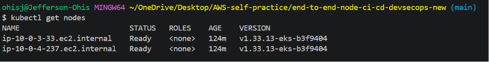

Both worker nodes reported a Ready status.

#### EKS Worker Node Verification

The worker nodes were further inspected using:

```text
kubectl get nodes -o wide
```

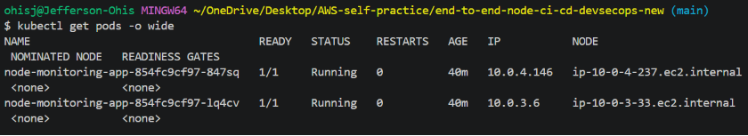

The cluster successfully reported two worker nodes:

```text
ip-10-0-3-33.ec2.internal
ip-10-0-4-237.ec2.internal
```

Both nodes were in the Ready state and were running Kubernetes version v1.33.13.

---

### Deploy Kubernetes Application

The application Kubernetes resources were manually deployed using the existing Kubernetes manifests:

```bash
kubectl apply -f k8s/deployment.yaml
```

Result:

```text
deployment.apps/node-monitoring-app created
```

The Kubernetes Service was then created:

```bash
kubectl apply -f k8s/service.yaml
```

Result:

```text
service/node-monitoring-app created
```

The deployment created two application replicas.

kubectl get pods -o wide

```text
NAME                                   READY   STATUS    RESTARTS   AGE
node-monitoring-app-854fc9cf97-847sq   1/1     Running   0          ...
node-monitoring-app-854fc9cf97-lq4cv   1/1     Running   0          ...
```

---

### Kubernetes Deployment Verification

The deployment was verified using:

```bash
kubectl get deployment
```

Result:

```text
NAME                  READY   UP-TO-DATE   AVAILABLE
node-monitoring-app   2/2     2            2
```

This confirmed that both application replicas were successfully created and available.

The pods were distributed across the two EKS worker nodes, providing basic workload distribution across the cluster.

---

### ECR Image Integration

The Kubernetes deployment used the Docker image previously published and verified by the Jenkins pipeline in Amazon ECR:

```text
615300991839.dkr.ecr.us-east-1.amazonaws.com/node-devsecops-repository:1
```

The deployed pods were verified to use this image.


The image digest reported by Kubernetes was:

```text
sha256:0f7fe0428a799084d62e055227b9910a4129bf84d9b57737c86127aa8562fa5c
```

This is the same image digest produced during the Amazon ECR push and subsequently verified by the Jenkins Verify ECR Image stage.

This provides an important deployment traceability link:

```text
Jenkins
   │
   ▼
Docker Image
   │
   ▼
Amazon ECR
   │
   ├── Tag: 1
   └── Digest: sha256:0f7fe042...
   │
   ▼
Amazon EKS
   │
   └── Running Container
         └── Same Image Digest
```

---

### Kubernetes LoadBalancer Service

The application was exposed through a Kubernetes Service configured with:

```text
Type: LoadBalancer
```

The Service was verified using:

```bash
kubectl get service node-monitoring-app
```

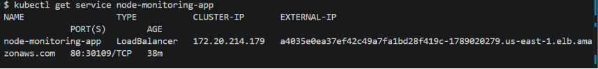

The Service successfully received an AWS Load Balancer endpoint.

The Service routes external traffic on port 80 to the Node.js application running on port 3000.

---

### Manual Application Verification

After the application pods and LoadBalancer Service were successfully deployed, the application was externally verified through the AWS Load Balancer endpoint.

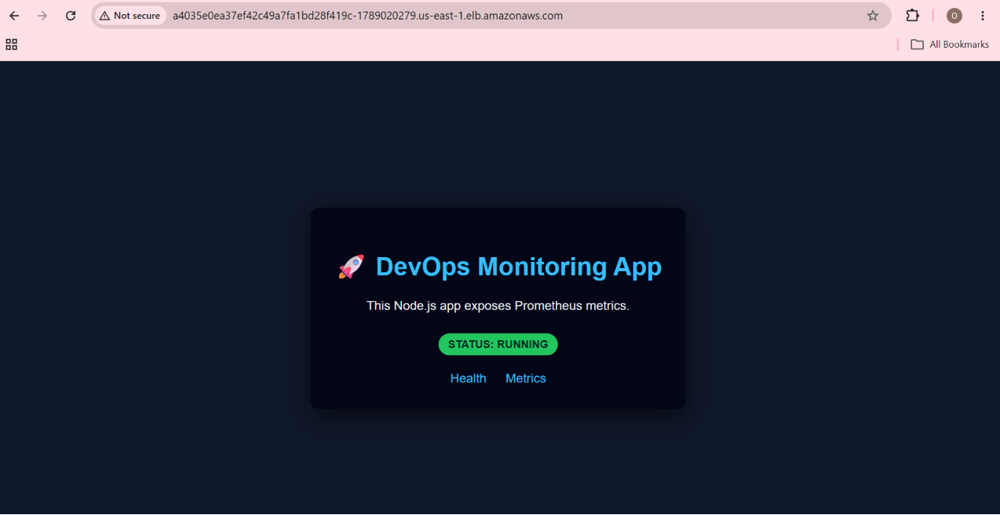

The application LoadBalancer endpoint was:

http://a4035e0ea37ef42c49a7fa1bd28f419c-1789020279.us-east-1.elb.amazonaws.com

---

### Kubernetes Application Health Verification

The application health endpoint was verified using:

```bash
curl http://a4035e0ea37ef42c49a7fa1bd28f419c-1789020279.us-east-1.elb.amazonaws.com/health
```

Result:

```text
ok
```

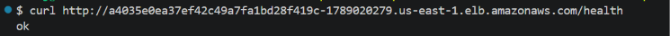

This confirmed that traffic successfully traveled through the AWS Load Balancer to the Kubernetes Service and ultimately reached the Node.js application's /health endpoint.

A browser-based verification was also performed:

http://a4035e0ea37ef42c49a7fa1bd28f419c-1789020279.us-east-1.elb.amazonaws.com/health

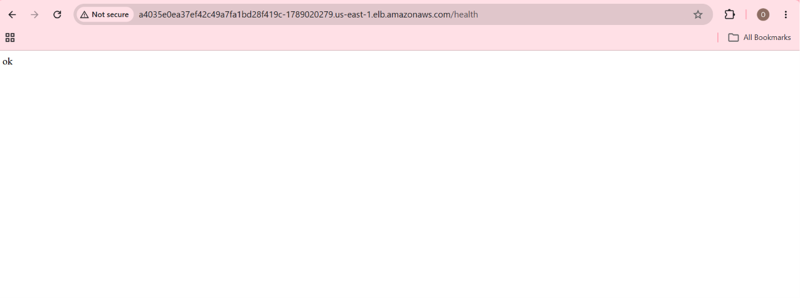

---

### Application LoadBalancer Verification

The application's root endpoint was accessed through the AWS Load Balancer:

```bash
curl http://a4035e0ea37ef42c49a7fa1bd28f419c-1789020279.us-east-1.elb.amazonaws.com/
```

The Node.js DevOps Monitoring application successfully returned its application interface.

The application displayed:

```text
🚀 DevOps Monitoring App


This Node.js app exposes Prometheus metrics.


STATUS: RUNNING
```

---

### Prometheus Metrics Verification

The application's Prometheus metrics endpoint was performed using a browser-based verification:

```text
http://a4035e0ea37ef42c49a7fa1bd28f419c-1789020279.us-east-1.elb.amazonaws.com/metrics
```

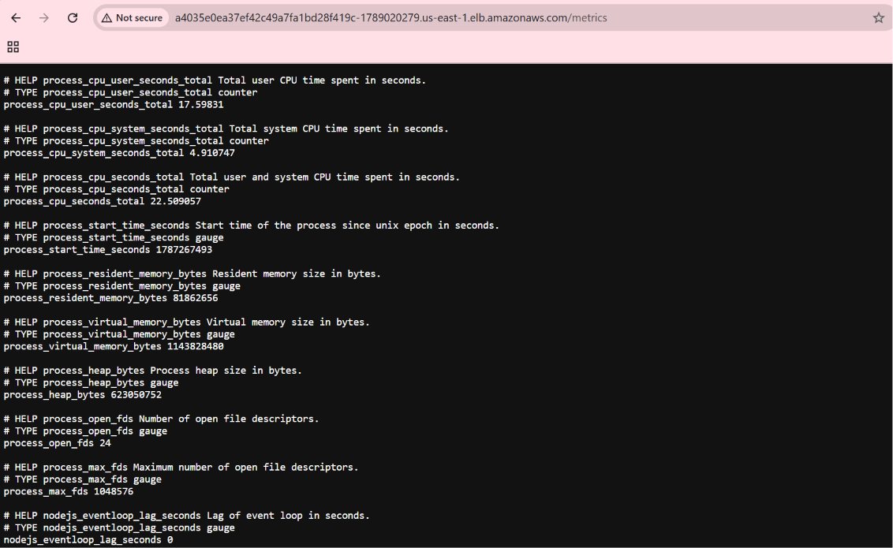

The endpoint successfully returned Prometheus-compatible Node.js and HTTP metrics.

This confirms that the application's monitoring endpoint remained functional after deployment to Amazon EKS.

---

### EKS Deployment Verification Summary

The manual implementation successfully validated the complete application deployment path:

| Verification | Result |
| ------------ | ------ |
| Amazon EKS Cluster | ✅ |
| EKS Worker Nodes | ✅ 2 Nodes Ready |
| Kubernetes Deployment | ✅ |
| Application Replicas | ✅ 2/2 Running |
| Amazon ECR Image Pull | ✅ |
| ECR Image Digest Verification | ✅ |
| Kubernetes LoadBalancer | ✅ |
| AWS Load Balancer | ✅ |
| Application `/health` Endpoint | ✅ |
| Application Root Endpoint `/` | ✅ |
| Prometheus `/metrics` Endpoint | ✅ |

#### Manual Deployment Result

```text
Amazon ECR
     │
     ▼
Verified Docker Image
     │
     ▼
Amazon EKS
     │
     ├── Pod 1 ──► Running
     │
     └── Pod 2 ──► Running
             │
             ▼
      Kubernetes Service
       LoadBalancer
             │
             ▼
       AWS Load Balancer
             │
       ┌─────┼─────┐
       ▼     ▼     ▼
    /health   /   /metrics
       │     │      │
       ▼     ▼      ▼
      OK   App UI  Metrics
```

Manual Amazon EKS Deployment: SUCCESS ✅

The successful manual deployment establishes a known-good baseline for the next stage of the project.

---

### Section 18.2 — Automated Amazon EKS Deployment

After successfully validating the manual Amazon EKS deployment, the next objective was to automate the Kubernetes deployment process through Jenkins.

The automated implementation was designed to eliminate the need for manually executing Kubernetes deployment commands and to integrate Amazon EKS deployment directly into the existing Jenkins CI/CD pipeline.

The implementation was completed incrementally by:

1. Provisioning the required Kubernetes manifests.
2. Configuring the application Deployment manifest to consume the verified Amazon ECR image.
3. Configuring the Kubernetes LoadBalancer Service.
4. Configuring the Horizontal Pod Autoscaler (HPA).
5. Configuring the Prometheus ServiceMonitor.
6. Updating the Jenkinsfile with automated Amazon EKS deployment stages.
7. Committing and pushing the changes to GitHub.
8. Executing a Jenkins Build Now.
9. Verifying the Kubernetes deployment, HPA, ServiceMonitor, Service, and application health.
10. Verifying Prometheus discovery and Grafana monitoring after deployment.

The resulting workflow is:

```text
GitHub
   │
   ▼
Jenkins
   │
   ├── Checkout Source Code
   │
   ├── Install Dependencies
   │
   ├── Dependency Inspection
   │
   ├── Unit Testing
   │
   ├── SonarCloud SAST
   │
   ├── Snyk SCA
   │
   ├── Docker Build
   │
   ├── Production Image Verification
   │
   ├── Trivy Security Gate
   │
   ├── Application Health Check
   │
   ├── Amazon ECR Image Push
   │
   ├── Verify ECR Image
   │
   ├── Configure Amazon EKS Access
   │
   ├── Amazon EKS Deployment
   │      │
   │      ├── deployment.yaml
   │      ├── service.yaml
   │      ├── service-monitor.yaml
   │      └── hpa.yaml
   │
   ├── Kubernetes Rollout Verification
   │
   ├── Kubernetes HPA Verification
   │
   ├── HPA Metrics Verification
   │
   ├── Prometheus ServiceMonitor Verification
   │
   ├── Kubernetes Service Verification
   │
   └── EKS Application Health Check
   │
   ▼
Amazon EKS
   │
   ├── Node 1
   │    └── node-monitoring-app
   │
   └── Node 2
        └── node-monitoring-app
             │
             ├── Service
             │    └── AWS Load Balancer
             │
             ├── HPA
             │
             └── ServiceMonitor
                    │
                    ▼
                Prometheus
                    │
                    ▼
                 Grafana
```

---

### Kubernetes Manifest Provisioning

The automated EKS deployment required four Kubernetes manifests:

```text
k8s/
├── deployment.yaml
├── service.yaml
├── service-monitor.yaml
└── hpa.yaml
```

Each manifest has a specific responsibility within the Kubernetes deployment architecture.

| Manifest | Purpose |
|---|---|
| `deployment.yaml` | Defines the application Deployment, replicas, container configuration, and ECR image |
| `service.yaml` | Exposes the application through a Kubernetes LoadBalancer Service |
| `service-monitor.yaml` | Configures Prometheus monitoring for the application |
| `hpa.yaml` | Configures automatic horizontal pod scaling based on resource utilization |

This separation follows the Kubernetes resource model and allows each component to be independently managed while still being deployed as part of the Jenkins pipeline.

---

### Kubernetes Deployment Manifest

The deployment.yaml manifest defines the Kubernetes Deployment for the Node.js monitoring application.

The deployment is responsible for maintaining the desired number of application replicas and running the container image retrieved from Amazon ECR.

The image reference is intentionally represented by an IMAGE_PLACEHOLDER value in the source manifest.

During the Jenkins pipeline, the placeholder is replaced dynamically with the ECR image generated for the current Jenkins build:

```text
615300991839.dkr.ecr.us-east-1.amazonaws.com/node-devsecops-repository:${BUILD_NUMBER}
```

The Jenkins pipeline performs this replacement using:

```bash
sed -i "s|IMAGE_PLACEHOLDER|${ECR_IMAGE}|g" \
    k8s/deployment.yaml
```

This creates a direct relationship between the Jenkins build number and the container image deployed to Amazon EKS.

The deployment process therefore follows:

```text
Jenkins Build
      │
      ▼
BUILD_NUMBER
      │
      ▼
Amazon ECR Image Tag
      │
      ▼
ECR Image
      │
      ▼
IMAGE_PLACEHOLDER replacement
      │
      ▼
Kubernetes Deployment
```

This approach provides deployment traceability between the CI/CD pipeline, Amazon ECR, and the Kubernetes workload.

---

### Kubernetes Service Manifest

The service.yaml manifest defines the Kubernetes Service used to expose the application.

The Service is configured as:

```text
Type: LoadBalancer
```

The Service provides stable network access to the application pods and allows Amazon EKS to provision an AWS Load Balancer.

The resulting traffic flow is:

```text
Internet
   │
   ▼
AWS Load Balancer
   │
   ▼
Kubernetes LoadBalancer Service
   │
   ▼
node-monitoring-app Pods
   │
   ▼
Node.js Application
```

The Service was subsequently verified automatically by Jenkins using:

```bash
kubectl get service node-monitoring-app
```

---

### Horizontal Pod Autoscaler Manifest

The hpa.yaml manifest was introduced to provide automatic scaling capability for the application workload.

The Horizontal Pod Autoscaler monitors the application workload and allows Kubernetes to adjust the number of application replicas according to the configured resource utilization thresholds.

The Jenkins pipeline verifies the HPA using:

```bash
kubectl get hpa node-monitoring-app
```

and:

```bash
kubectl describe hpa node-monitoring-app
```

The pipeline also performs HPA metrics verification using:

```bash
kubectl top pods
```

followed by:

```bash
kubectl get hpa node-monitoring-app
```

and:

```bash
kubectl describe hpa node-monitoring-app
```

This provides both configuration-level and runtime-level verification of the autoscaling configuration.

#### Jenkins verification evidence

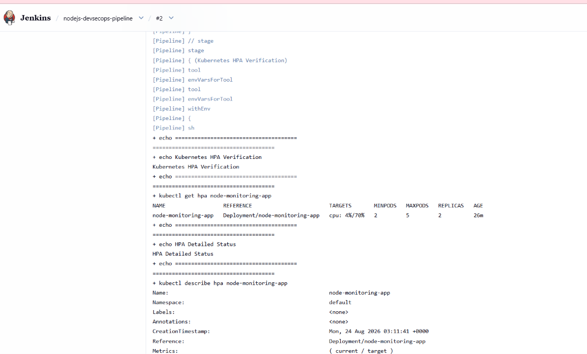


---

### Prometheus ServiceMonitor Manifest

The service-monitor.yaml manifest was introduced to integrate the application with the Prometheus monitoring stack running inside the EKS cluster.

The ServiceMonitor identifies the Kubernetes Service associated with the Node.js application and configures Prometheus to scrape the application's /metrics endpoint.

The resulting monitoring architecture is:

```text
node-monitoring-app
        │
        ▼
Kubernetes Service
        │
        ▼
ServiceMonitor
        │
        ▼
Prometheus
        │
        ▼
Application Metrics
        │
        ▼
Grafana
```

The Jenkins pipeline verifies the ServiceMonitor using:

```bash
kubectl get servicemonitor node-monitoring-app
```

and:

```bash
kubectl describe servicemonitor node-monitoring-app
```

#### Jenkins verification evidence

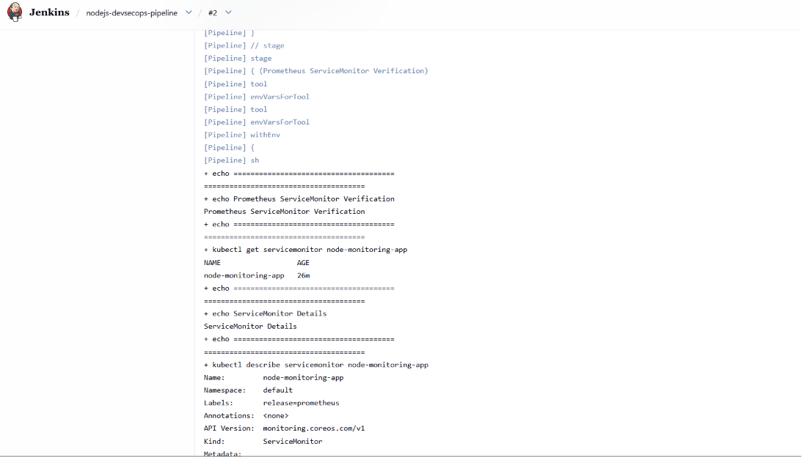


> This verifies that the Kubernetes ServiceMonitor resource was successfully created and configured.

---

### Jenkinsfile Integration

After provisioning the Kubernetes manifests, the Jenkinsfile was updated to automate the Amazon EKS deployment process.

The first EKS-specific stage configures Jenkins access to the EKS cluster:

```text
stage('Configure Amazon EKS Access') {
    steps {
        sh '''
            aws eks update-kubeconfig \
                --region "${AWS_REGION}" \
                --name node-devsecops-cluster

            kubectl get nodes

            echo "Amazon EKS access verification PASSED"
        '''
    }
}
```

This stage ensures that the Jenkins execution environment has an active Kubernetes configuration before attempting the deployment.


#### Jenkins EKS Access Verification

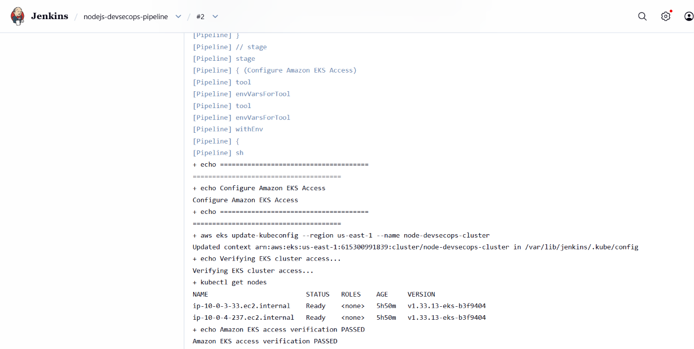

---

### Automated Kubernetes Manifest Deployment

The Amazon EKS Deployment stage was then added to the Jenkins pipeline.

The stage dynamically identifies the ECR image associated with the current Jenkins build and deploys the Kubernetes resources.

The deployment sequence is:

```bash
echo "Deploying image:"
echo "${ECR_IMAGE}"

sed -i "s|IMAGE_PLACEHOLDER|${ECR_IMAGE}|g" \
    k8s/deployment.yaml

kubectl apply -f k8s/deployment.yaml

kubectl apply -f k8s/service.yaml

kubectl apply -f k8s/service-monitor.yaml

kubectl apply -f k8s/hpa.yaml
```

The Jenkins pipeline subsequently verifies the resources:

```text
kubectl get deployment node-monitoring-app 
kubectl get service node-monitoring-app 
kubectl get servicemonitor node-monitoring-app 
kubectl get hpa node-monitoring-app
```

This transformed the deployment process from a manual sequence of kubectl commands into an automated CI/CD deployment stage.

#### Jenkins Automated EKS Deployment

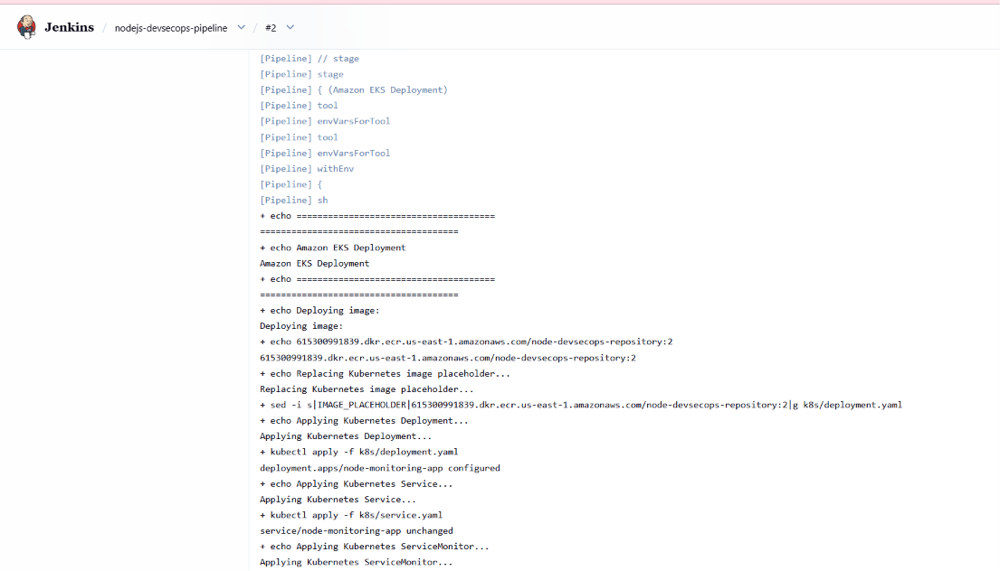


---


### Kubernetes Rollout Verification

After applying the Kubernetes manifests, Jenkins verifies that the Deployment successfully rolls out.

The pipeline executes:

```bash
kubectl rollout status \
    deployment/node-monitoring-app \
    --timeout=180s
```

The Deployment and Pod status are then inspected:

```text
kubectl get deployment node-monitoring-app
kubectl get pods -o wide
```

The rollout verification ensures that the application replicas become available successfully before the pipeline proceeds.

#### Jenkins Kubernetes Rollout Verification Passed

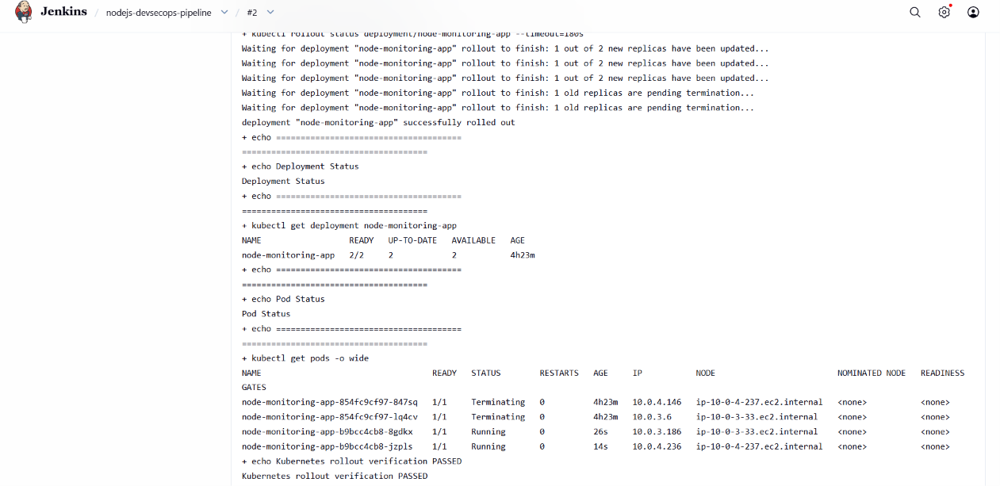


---


### Automated HPA Verification

Jenkins then verifies the Horizontal Pod Autoscaler configuration.

The pipeline executes:

```bash
kubectl get hpa node-monitoring-app
```

followed by:

```bash
kubectl describe hpa node-monitoring-app
```

The HPA metrics are also inspected using:

```bash
kubectl top pods
```

This confirms that the HPA resource is present and that Kubernetes metrics are available for the workload.

#### Jenkins HPA Verification


---

### Automated Prometheus ServiceMonitor Verification

The Jenkins pipeline verifies the ServiceMonitor created during the deployment stage.

The verification commands are:

```bash
kubectl get servicemonitor node-monitoring-app
```

and:

```bash
kubectl describe servicemonitor node-monitoring-app
```

This confirms that the monitoring configuration has been successfully deployed alongside the application.

#### Jenkins Prometheus Servicemonitor Verification


---

### Kubernetes Service Verification

The Kubernetes Service is verified after deployment using:

```bash
kubectl get service node-monitoring-app
```

This confirms that the application Service exists and that the LoadBalancer configuration has been successfully applied.

#### Jenkins Kubernetes Service Verification Passed

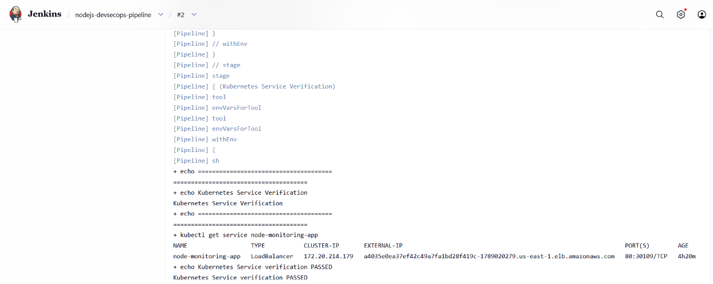

---

### Automated EKS Application Health Check

The final application validation stage verifies that the deployed application is reachable through the AWS Load Balancer.

Jenkins first retrieves the LoadBalancer hostname:

```bash
LOAD_BALANCER_HOST=$(kubectl get service node-monitoring-app \
    -o jsonpath='{.status.loadBalancer.ingress[0].hostname}')
```

The pipeline then repeatedly tests:

```text
/health
```

until the endpoint becomes available.

The health check is performed using:

```bash
curl --fail --silent --show-error \
    --connect-timeout 10 \
    "http://${LOAD_BALANCER_HOST}/health"
```

If the endpoint responds successfully, Jenkins reports:

EKS application health check PASSED.

This provides an end-to-end validation of the automated deployment:

```text
Jenkins
   │
   ▼
Amazon ECR
   │
   ▼
Amazon EKS
   │
   ▼
Kubernetes Deployment
   │
   ▼
Kubernetes Service
   │
   ▼
AWS Load Balancer
   │
   ▼
Node.js Application
   │
   ▼
/health
   │
   ▼
PASSED
```

#### Jenkins EKS Application Health Check Passed

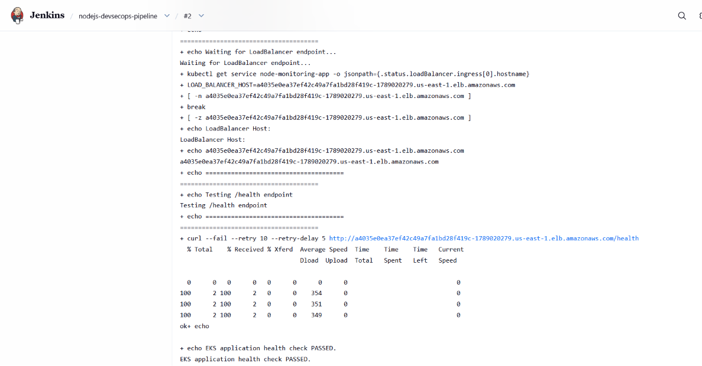


---


### Jenkins Pipeline Execution Result

After the Kubernetes manifests and Jenkinsfile changes were committed and pushed to GitHub, a new Jenkins Build Now execution was performed.

The pipeline successfully completed the automated EKS deployment stages, including:

| Pipeline Control | Result |
|---|---|
| EKS Access Configuration | ✅ PASSED |
| Amazon EKS Deployment | ✅ PASSED |
| Kubernetes Rollout Verification | ✅ PASSED |
| HPA Verification | ✅ PASSED |
| HPA Metrics Verification | ✅ PASSED |
| Prometheus ServiceMonitor Verification | ✅ PASSED |
| Kubernetes Service Verification | ✅ PASSED |
| EKS Application Health Check | ✅ PASSED |
| Jenkins Pipeline | ✅ SUCCESS |

The successful pipeline execution demonstrates that the application can now progress from the validated Amazon ECR image to a running Kubernetes workload through Jenkins automation.

#### Jenkins EKS Deployment Pipeline Success

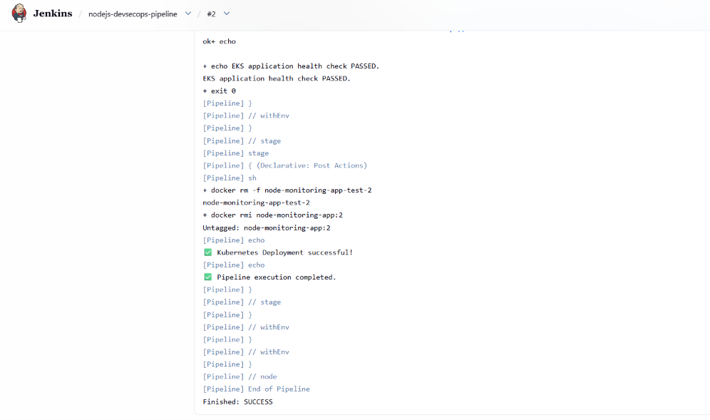


---


## Section 19 — Prometheus ServiceMonitor Discovery Verification

The Jenkins console verifies that the Kubernetes ServiceMonitor resource was successfully created.

However, resource creation alone does not prove that Prometheus has successfully discovered and scraped the application.

Therefore, Prometheus was separately accessed through the Prometheus UI to verify the actual target discovery.

The Prometheus target discovery showed:

```text
serviceMonitor/default/node-monitoring-app/0

2 / 2 up
```

The application endpoints were reported as:

```text
http://10.0.3.148:3000/metrics 
http://10.0.4.162:3000/metrics
```

Both targets reported:

```text
up
```

with the following job label:

```text
job="node-monitoring-app"
```

This provides direct evidence that Prometheus successfully discovered both application pods through the ServiceMonitor and is actively scraping their /metrics endpoints.

The resulting monitoring flow is:

```text
node-monitoring-app Pod 1 ──► /metrics ──► Prometheus ──► UP
node-monitoring-app Pod 2 ──► /metrics ──► Prometheus ──► UP
```

#### Prometheus Servicemonitor Discovery

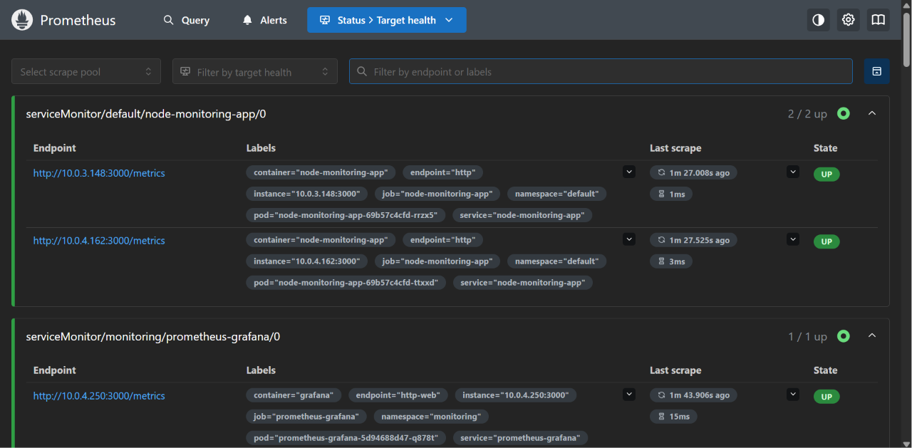

> This verification is separate from the Jenkins ServiceMonitor verification and confirms the complete monitoring path from Kubernetes ServiceMonitor configuration to active Prometheus scraping.

---

## Section 20 — Grafana Kubernetes Monitoring Verification

After confirming that Prometheus successfully discovered and scraped the application targets, Grafana was accessed to verify the monitoring integration.

Grafana was successfully connected to the Prometheus data source and provided access to Prometheus metrics through the Explore interface.

The monitoring architecture is therefore:

```text
Node.js Application
        │
        │ /metrics
        ▼
Kubernetes Service
        │
        ▼
ServiceMonitor
        │
        ▼
Prometheus
        │
        ▼
Grafana
```

The Grafana verification provides visual evidence that the Kubernetes monitoring stack is operational and that Prometheus is available as a metrics data source.


#### Grafana Kubernetes/Prometheus monitoring verification

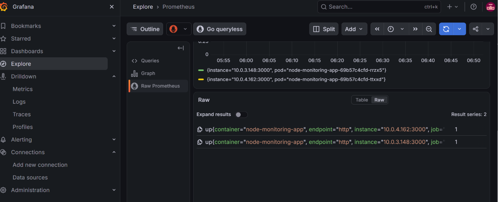


---


### EKS Application Health Endpoint Verification

In addition to the automated Jenkins health check, the deployed application was independently verified through its AWS Load Balancer endpoint.

The application /health endpoint was accessed through the browser:

```text
http://<AWS-LOAD-BALANCER>/health
```

The endpoint returned the expected healthy response:

```text
ok
```

This provides independent browser-based evidence that the application deployed through Jenkins is externally reachable and healthy.


#### Browser-based /health verification

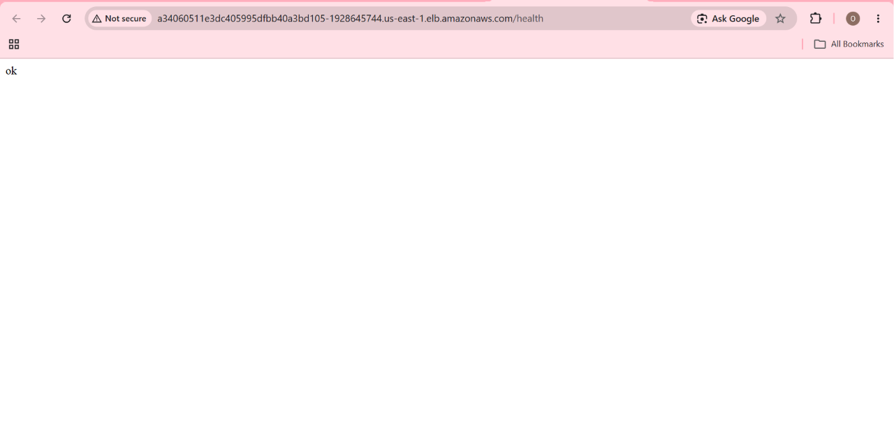

---


### EKS Application External Accessibility Verification

The application root endpoint was also accessed through the AWS Load Balancer.

The deployed Node.js application successfully displayed its application interface:

```text
🚀 DevOps Monitoring App
```

This Node.js app exposes Prometheus metrics.

```text
STATUS: RUNNING
```

This confirms that the automated Jenkins deployment resulted in a functional application that is externally accessible through the Kubernetes LoadBalancer and AWS networking layer.

The complete request path is:

```text
Internet
   │
   ▼
AWS Load Balancer
   │
   ▼
Kubernetes Service
   │
   ▼
node-monitoring-app Pods
   │
   ▼
Node.js Application
   │
   ▼
Application Interface
```

#### Externally accessible EKS application

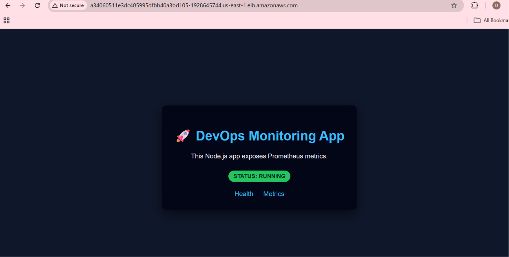

---


### Automated Amazon EKS Deployment Verification Summary

The automated implementation successfully established a complete Jenkins-to-EKS deployment workflow.

| Verification | Result |
|---|---|
| Jenkins EKS Access | ✅ |
| Amazon EKS Deployment | ✅ |
| Kubernetes Deployment | ✅ |
| Application Rollout | ✅ |
| Application Replicas | ✅ |
| Kubernetes HPA | ✅ |
| HPA Metrics | ✅ |
| Prometheus ServiceMonitor | ✅ |
| Prometheus Target Discovery | ✅ 2/2 UP |
| Kubernetes LoadBalancer Service | ✅ |
| AWS Load Balancer | ✅ |
| Automated `/health` Check | ✅ |
| Browser `/health` Verification | ✅ |
| Application Root Endpoint | ✅ |
| Grafana Prometheus Integration | ✅ |
| Jenkins Pipeline | ✅ SUCCESS |


#### Automated Deployment Result

```text
GitHub
   │
   ▼
Jenkins
   │
   ├── Unit Testing                   ✅
   ├── SonarCloud SAST                ✅
   ├── Snyk SCA                       ✅
   ├── Docker Build                   ✅
   ├── Trivy Security Gate            ✅
   ├── Application Health Check       ✅
   ├── Amazon ECR Push                ✅
   ├── ECR Image Verification         ✅
   │
   ├── Configure EKS Access           ✅
   ├── EKS Deployment                 ✅
   │      │
   │      ├── Deployment              ✅
   │      ├── Service                 ✅
   │      ├── ServiceMonitor          ✅
   │      └── HPA                     ✅
   │
   ├── Rollout Verification           ✅
   ├── HPA Verification               ✅
   ├── HPA Metrics Verification       ✅
   ├── ServiceMonitor Verification    ✅
   ├── Service Verification           ✅
   └── EKS Health Check               ✅
           │
           ▼
       Amazon EKS
           │
           ├── Application Pods       ✅
           ├── LoadBalancer           ✅
           └── Monitoring             ✅
                  │
                  ├── Prometheus      ✅
                  └── Grafana         ✅
```


#### Automated Amazon EKS Deployment: SUCCESS ✅

The successful implementation establishes a fully automated deployment path from source control through Jenkins, Amazon ECR, Amazon EKS, Kubernetes workload verification, application health validation, and Kubernetes monitoring.

The manual Amazon EKS deployment therefore served as the known-good baseline, while the automated implementation now provides repeatable CI/CD-driven Kubernetes deployment.

---


### Automated Amazon EKS Deployment Conclusion

The automated Amazon EKS deployment stage has been successfully implemented and verified.

The Jenkins pipeline can now automatically:

- Authenticate against the Amazon EKS cluster.
- Dynamically identify the ECR image generated by the current build.
- Update the Kubernetes Deployment with the correct ECR image.
- Deploy the Kubernetes Deployment.
- Deploy the LoadBalancer Service.
- Deploy the Horizontal Pod Autoscaler.
- Deploy the Prometheus ServiceMonitor.
- Verify the Kubernetes rollout.
- Verify HPA configuration and metrics.
- Verify the Prometheus ServiceMonitor.
- Verify the Kubernetes Service.
- Obtain the AWS Load Balancer endpoint.
- Test the deployed application's /health endpoint.
- Fail the pipeline if the EKS application does not become healthy.

This represents the successful completion of the Automated Amazon EKS Deployment stage of the Phase 8 DevSecOps pipeline.

---

### Next Step —  OWASP ZAP Dynamic Application Security Testing (DAST)

With automated Amazon EKS deployment now successfully implemented and verified, the next stage of the CI/CD pipeline is Dynamic Application Security Testing (DAST) using OWASP ZAP.

The next stage will integrate OWASP ZAP with the deployed application to perform runtime security testing against the externally accessible application endpoint.

The planned workflow is:

```text
Jenkins
   │
   ▼
Automated Amazon EKS Deployment
   │
   ▼
EKS Application
   │
   ▼
AWS Load Balancer
   │
   ▼
OWASP ZAP DAST
   │
   ├── Spider / Discover Application
   │
   ├── Passive Security Analysis
   │
   ├── Active Security Testing
   │
   └── Security Findings
          │
          ├── PASS ──► Continue Pipeline
          │
          └── FAIL ──► Stop Pipeline
```

The OWASP ZAP DAST stage remains the next planned CI/CD pipeline enhancement: OWASP ZAP DAST — ⏳

---

## Section 21 — OWASP ZAP Dynamic Application Security Testing (DAST)

### Objective

The objective of this stage is to perform Dynamic Application Security Testing (DAST) against the deployed Node.js monitoring application running on Amazon EKS.

OWASP ZAP Baseline DAST is executed against the externally accessible Kubernetes LoadBalancer endpoint after the application has been successfully deployed and verified.

The DAST stage provides runtime security testing by analyzing the running application for common web application security weaknesses and security-header configuration issues.

The pipeline follows this sequence:

```text
Amazon EKS Deployment
        │
        ▼
Kubernetes Rollout Verification
        │
        ▼
EKS Application Health Check
        │
        ▼
Retrieve LoadBalancer Endpoint
        │
        ▼
OWASP ZAP Baseline DAST
        │
        ├── PASS
        ├── WARN
        └── FAIL
        │
        ▼
Jenkins Pipeline Result
```

---


### ZAP Baseline Scan Execution

After the Amazon EKS application was successfully deployed and the external LoadBalancer health check returned a successful response, the Jenkins pipeline obtained the Kubernetes LoadBalancer hostname and used it as the target for the OWASP ZAP Baseline scan.

The target URL was:

```text
http://af74b7ec451784386a346cbb16462b25-1203477721.us-east-1.elb.amazonaws.com
```

The pipeline executed the OWASP ZAP Baseline scan using the zaproxy/zap-stable Docker image.

The scan generated both HTML and JSON reports:

```text
zap-report.html
zap-report.json
```

The scan successfully accessed multiple application endpoints, including:

```text
/
 /health
 /metrics
 /robots.txt
 /sitemap.xml
```

The ZAP scan completed successfully and evaluated the deployed application dynamically.

#### OWASP ZAP DAST SCAN

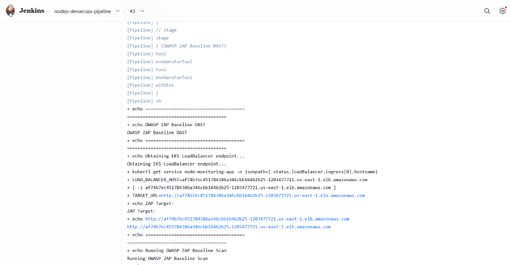

> OWASP ZAP Baseline DAST execution against the Amazon EKS LoadBalancer endpoint.

---

### ZAP Security Results

The completed ZAP Baseline scan reported 63 passed security checks, 4 warning-level findings, and 0 failing findings.

The final ZAP summary was:

```text
FAIL-NEW:    0
FAIL-INPROG: 0
WARN-NEW:    4
WARN-INPROG: 0
INFO:        0
IGNORE:      0
PASS:        63
```

The scan therefore completed without identifying any findings classified as FAIL-NEW.

The four warning categories reported by ZAP were:

1. Storable and Cacheable Content [10049]
2. CSP: Failure to Define Directive with No Fallback [10055]
3. Timestamp Disclosure - Unix [10096]
4. Cross-Origin-Embedder-Policy Header Missing or Invalid [90004]

These findings are treated as security hardening observations at the current stage of the project and require review to determine whether application or HTTP security-header changes are appropriate.

#### OWASP ZAP SECURITY RESULTS

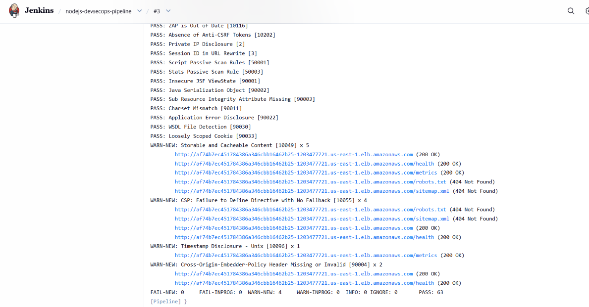

> OWASP ZAP security results showing 63 passed checks, 4 warnings, and 0 failing findings.

---

### Jenkins Pipeline Result

Although the OWASP ZAP scan completed successfully, the Jenkins pipeline did not finish successfully.

The ZAP Baseline scan returned:

```text
exit code 2
```

The Jenkins pipeline therefore interpreted the ZAP result as a failed stage and terminated with:

```text
ERROR: script returned exit code 2
Finished: FAILURE
```

The important distinction is that the ZAP scan execution itself was successful, but the current Jenkins pipeline behavior treats the non-zero ZAP exit code as a pipeline failure.

The final pipeline output showed:

```text
FAIL-NEW: 0
FAIL-INPROG: 0
WARN-NEW: 4
WARN-INPROG: 0
INFO: 0
IGNORE: 0
PASS: 63

ERROR: script returned exit code 2
Finished: FAILURE
```

Therefore, this build should not be described as an OWASP ZAP security-gate pass.

#### OWASP ZAP PIPELINE RESULT

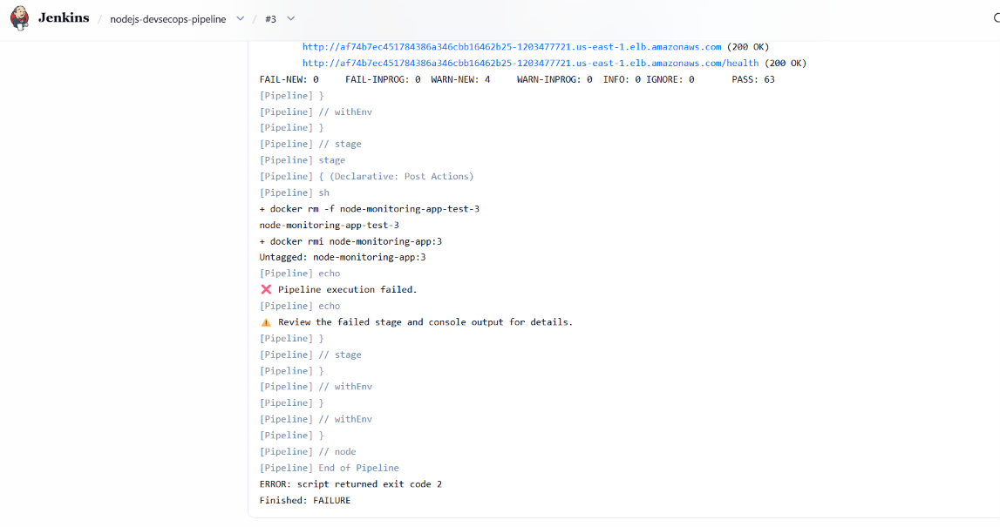

> Jenkins console output showing the ZAP result, exit code 2, and final pipeline FAILURE.

---

### DAST Findings Summary

| Result | Count | Interpretation |
|---|---:|---|
| **PASS** | **63** | Security checks passed |
| **WARN-NEW** | **4** | Low-risk/security hardening observations |
| **FAIL-NEW** | **0** | No failing security findings |
| **FAIL-INPROG** | **0** | No in-progress failures |
| **INFO** | **0** | No informational findings |

The ZAP results demonstrate that the deployed application passed the majority of the baseline security checks, with no findings classified as FAIL-NEW.

The four warnings identify areas that may require additional security hardening. These will be reviewed before finalizing the DAST quality-gate behavior.

---

### Security Gate Interpretation

The current OWASP ZAP implementation successfully performs dynamic security testing against the live application deployed on Amazon EKS.

However, the current pipeline behavior is:

```text
OWASP ZAP Baseline DAST
        │
        ▼
63 PASS / 4 WARN / 0 FAIL
        │
        ▼
ZAP Exit Code 2
        │
        ▼
Jenkins Stage Failure
        │
        ▼
Pipeline FAILURE
```

Therefore, the current result is not a ZAP security-gate pass.

The accurate interpretation is:

> The OWASP ZAP Baseline DAST scan executed successfully and identified four warning-level findings with zero failing findings. The Jenkins stage returned exit code 2 because the baseline scan detected warnings, causing the overall pipeline to finish with FAILURE.

This behavior is being intentionally documented before modifying the pipeline quality gate. The next step is to review the four ZAP warnings and determine which findings require application or security-header remediation and which should remain as accepted warnings.

The desired final pipeline behavior is to ensure that genuine security failures cause the pipeline to stop while appropriately reviewed warning-level findings do not unnecessarily prevent a successful production delivery.

```text
OWASP ZAP Baseline DAST
        │
        ├── FAIL findings ─────► Pipeline FAILURE
        │
        └── Reviewed WARNINGS ─► Continue Pipeline
                                      │
                                      ▼
                                Pipeline SUCCESS
```

This establishes OWASP ZAP as a genuine runtime security control within the project's DevSecOps pipeline rather than simply treating the presence of any non-zero ZAP exit code as an undifferentiated failure.

---

## OWASP ZAP DAST Controlled Security Quality Gate

The OWASP ZAP Baseline DAST stage was updated to implement a controlled security quality gate.

The pipeline now captures the ZAP exit code and applies explicit decision logic:

```text
OWASP ZAP Baseline DAST
          │
          ▼
    ZAP Scan Results
          │
     ┌────┴────┐
     │         │
    FAIL      WARN
  findings   findings
     │         │
     ▼         ▼
Pipeline    Reviewed
FAILURE     & Accepted
               │
               ▼
      Continue Pipeline
               │
               ▼
       Pipeline SUCCESS
```

### Controlled ZAP Quality-Gate Logic

The updated Jenkins pipeline distinguishes between fail-level findings, warning-level findings, and successful scans.

| ZAP Result | Pipeline Behavior |
|---|---|
| **Exit Code `0`** | Scan completed with no warnings or failures; pipeline continues |
| **Exit Code `2`** | Warnings detected; warnings are reviewed and accepted; pipeline continues |
| **Any other exit code** | Fail findings or scan error; pipeline fails |


This prevents warning-level findings from unnecessarily blocking the delivery pipeline while ensuring that fail-level findings continue to enforce the security gate.

### ZAP Scan Result

The verified ZAP scan analyzed 6 application URLs and produced:

| Result | Count |
|---|---:|
| **PASS** | **65** |
| **WARN-NEW** | **2** |
| **FAIL-NEW** | **0** |
| **FAIL-INPROG** | **0** |
| **WARN-INPROG** | **0** |
| **INFO** | **0** |


The two warning-level findings were:

```text
Non-Storable Content [10049]

Timestamp Disclosure - Unix [10096]
```

Most importantly, no new fail-level findings were detected:

```
FAIL-NEW: 0
FAIL-INPROG: 0
WARN-NEW: 2
WARN-INPROG: 0
PASS: 65
```

The ZAP process returned exit code 2, which the Jenkins pipeline correctly classified as a warning condition rather than a pipeline failure.


### ZAP WARN-NEW Findings Assessment

The two warning-level findings were reviewed to determine whether they represented actionable application vulnerabilities or intentional application behavior.

```text
10049 — Non-Storable Content
```

The application intentionally applies:

```text
Cache-Control: no-store
```

to its application and monitoring endpoints. This is an intentional security control that prevents response content from being stored by caches.

The warning was therefore assessed as an accepted warning, rather than a vulnerability requiring remediation.

```text
10096 — Timestamp Disclosure - Unix
```

The timestamp disclosure finding was traced to the standard Prometheus metric:

```text
process_start_time_seconds

exposed through the application's /metrics endpoint.
```

This metric provides process start-time information for application observability and monitoring. It is an intentional part of the application's Prometheus instrumentation and does not expose sensitive application data.

The warning was therefore assessed as an accepted warning, rather than a vulnerability requiring remediation.

Based on this assessment, both WARN-NEW findings are accepted under the current DAST quality-gate policy.

The controlled gate continues to enforce the more important distinction:

```text
ZAP Exit Code 0 → Continue
ZAP Exit Code 2 → Review & Accept Warnings → Continue
Other Exit Code → Pipeline Failure
```

#### Controlled ZAP Quality Gate

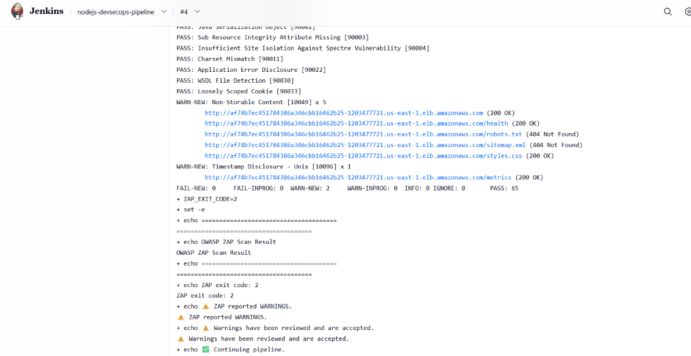


The Jenkins console output demonstrates that:

- ZAP returned exit code 2
- Two warning-level findings were detected
- Zero fail-level findings were detected
- The warnings were reviewed and accepted
- The pipeline continued execution


#### Successful Pipeline Completion

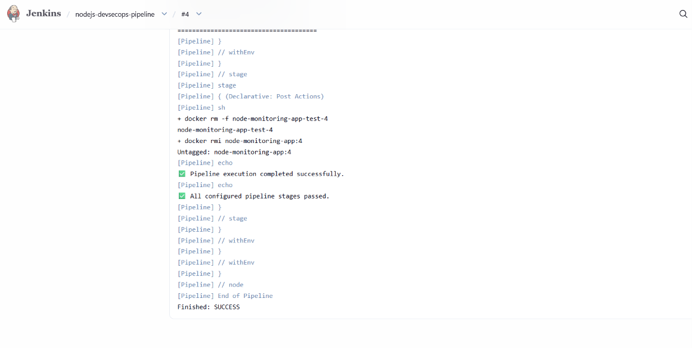


The pipeline completed successfully after the ZAP stage:

```text
✅ Pipeline execution completed successfully.

✅ All configured pipeline stages passed.

Finished: SUCCESS
```

### Security Gate Outcome

The controlled DAST implementation provides the following behavior:

```text
ZAP Scan
   │
   ├── FAIL findings detected
   │        │
   │        └──► Pipeline FAILURE
   │
   ├── WARN findings detected
   │        │
   │        ├──► Review warnings
   │        ├──► Accept reviewed warnings
   │        └──► Continue Pipeline
   │
   └── No findings
            │
            └──► Continue Pipeline
```

Validation Status: ✅ Controlled OWASP ZAP DAST quality gate implemented and successfully verified.

> Note: The two warning-level findings (WARN-NEW: 2) have not been represented as vulnerabilities that were remediated. They were reviewed and accepted under the current DAST quality-gate policy. Further remediation can be performed in a subsequent security-hardening iteration without changing the controlled gate behavior.


---

## Section 22 — Results

The Jenkins CI/CD and DevSecOps pipeline has been implemented and validated as an end-to-end automated software delivery pipeline for the Node.js monitoring application.

The completed implementation integrates source-code validation, application testing, static analysis, dependency security, container security, container image publishing, Kubernetes deployment, runtime verification, monitoring, and dynamic application security testing.

### CI/CD and DevSecOps Implementation Results

The following capabilities were successfully implemented:

| Pipeline Capability | Tool / Technology | Result |
|---|---|---|
| **Source Code Management** | GitHub | ✅ Implemented |
| **CI/CD Automation** | Jenkins | ✅ Implemented |
| **Runtime Management** | Node.js | ✅ Implemented |
| **Unit Testing** | Jest / Supertest | ✅ Passed |
| **Static Application Security Testing (SAST)** | SonarCloud | ✅ Quality Gate Passed |
| **Software Composition Analysis (SCA)** | Snyk | ✅ Integrated |
| **Containerization** | Docker | ✅ Implemented |
| **Container Security Scanning** | Trivy | ✅ Security Gate Implemented |
| **Container Image Registry** | Amazon ECR | ✅ Image Published and Verified |
| **Kubernetes Platform** | Amazon EKS | ✅ Implemented |
| **Kubernetes Deployment** | Kubernetes Manifests | ✅ Automated |
| **Application Health Verification** | Kubernetes / HTTP | ✅ Verified |
| **Kubernetes LoadBalancer** | AWS LoadBalancer | ✅ Verified |
| **Runtime Monitoring** | Prometheus | ✅ Implemented |
| **Monitoring Visualization** | Grafana | ✅ Implemented |
| **Dynamic Application Security Testing (DAST)** | OWASP ZAP | ✅ Implemented |
| **DAST Quality-Gate Control** | Jenkins | ✅ Implemented |


---


### Security Control Results

The pipeline now applies security controls at multiple stages of the software delivery lifecycle.

```text
Source Code
     │
     ▼
SonarCloud SAST
     │
     ▼
Snyk SCA
     │
     ▼
Docker Build
     │
     ▼
Trivy Container Security
     │
     ▼
Security Quality Gate
     │
     ▼
Amazon ECR
     │
     ▼
Amazon EKS
     │
     ▼
Application Health Verification
     │
     ▼
OWASP ZAP DAST
```

The implementation demonstrates that security checks are integrated into the delivery workflow rather than being performed only as separate manual activities.

---

### Container Security Result

Trivy was integrated as a container security quality gate.

The pipeline was configured to distinguish acceptable scan results from HIGH and CRITICAL vulnerability findings. The Docker image was subsequently validated after the required Node.js runtime and image-security remediation work.

The Trivy security gate therefore acts as a blocking control before the container image is promoted to Amazon ECR.

---

### Amazon ECR Result

The pipeline successfully authenticated with Amazon ECR, tagged the generated Docker image, pushed the image to the ECR repository, and verified the published image.

```text
Docker Image
     │
     ▼
Amazon ECR Authentication
     │
     ▼
Image Tagging
     │
     ▼
ECR Image Push
     │
     ▼
ECR Image Verification
     │
     ▼
Deployment
```

This establishes Amazon ECR as the container image registry within the Jenkins delivery workflow.

---

### Amazon EKS Deployment Result

The Jenkins pipeline successfully automated deployment of the containerized Node.js application to Amazon EKS.

The deployment process included:

- Kubernetes manifest provisioning
- Application Deployment
- Kubernetes Service
- Horizontal Pod Autoscaler
- Prometheus ServiceMonitor
- Kubernetes rollout verification
- Service verification
- Application health verification
- LoadBalancer endpoint retrieval

The deployed application was successfully exposed through an AWS LoadBalancer and verified through its application endpoints.

---

### Monitoring Result

Prometheus instrumentation was integrated into the Node.js application through the /metrics endpoint.

The application exposes runtime and Node.js process metrics for monitoring, including:

```text
process_cpu_seconds_total
process_start_time_seconds
process_resident_memory_bytes
nodejs_eventloop_lag_seconds
nodejs_heap_size_used_bytes
http_requests_total
```

Prometheus monitoring was subsequently integrated into the Kubernetes environment through a ServiceMonitor configuration, while Grafana provides visualization of the collected metrics.

---

### OWASP ZAP DAST Result

OWASP ZAP Baseline DAST was successfully integrated into the Jenkins pipeline and executed against the externally accessible Amazon EKS LoadBalancer endpoint.

The controlled DAST implementation distinguishes between:

```text
Exit Code 0 → No warnings/failures → Continue

Exit Code 2 → Reviewed warnings → Continue

Other Exit Code → Scan failure / blocking condition → Pipeline FAILURE
```

The verified scan produced:

| Result | Count |
|---|---:|
| PASS | 65 |
| WARN-NEW | 2 |
| FAIL-NEW | 0 |
| FAIL-INPROG | 0 |
| WARN-INPROG | 0 |
| INFO | 0 |

The two warning-level findings were reviewed:

```text
10049 — Non-Storable Content
10096 — Timestamp Disclosure - Unix
```

Finding 10049 was associated with the application's intentional Cache-Control: no-store behavior.

Finding 10096 was associated with the standard Prometheus process_start_time_seconds metric exposed through /metrics.

Both findings were assessed as acceptable warnings under the current DAST policy. They were not classified as remediated vulnerabilities.

Most importantly, the scan produced:

```text
FAIL-NEW: 0
```

and the controlled Jenkins quality gate allowed the pipeline to continue.

---

### Overall Pipeline Result

The completed Jenkins pipeline demonstrates an end-to-end delivery workflow:

```text
GitHub
   │
   ▼
Jenkins
   │
   ├── Checkout
   ├── Install Dependencies
   ├── Unit Testing
   ├── SonarCloud SAST
   ├── Snyk SCA
   ├── Docker Build
   ├── Trivy Security Gate
   ├── Amazon ECR Push
   ├── ECR Verification
   ├── Amazon EKS Deployment
   ├── Rollout Verification
   ├── Service Verification
   ├── Application Health Check
   ├── Prometheus Monitoring
   ├── Grafana Integration
   └── OWASP ZAP DAST
            │
            ▼
     Running EKS Application
```

The Jenkins implementation therefore establishes a functional end-to-end CI/CD and DevSecOps pipeline capable of taking application source code from GitHub through security validation, container publishing, Kubernetes deployment, runtime verification, monitoring, and DAST.

Validation Status: ✅ Phase 8 Jenkins CI/CD and DevSecOps pipeline implemented and successfully validated.

---

## Section 23 — Key Takeaways

The implementation of the Jenkins CI/CD and DevSecOps pipeline demonstrates how security, automation, containerization, cloud infrastructure, Kubernetes deployment, and observability can be integrated into a single software delivery lifecycle.

---

### Security Is Integrated Into the Delivery Lifecycle

Security was incorporated throughout the pipeline rather than being treated as a final-stage activity.

```text
Code
 │
 ├── SAST ─────────► SonarCloud
 │
 ├── SCA ──────────► Snyk
 │
 ├── Container ────► Trivy
 │
 └── Runtime ──────► OWASP ZAP
 ```

 This provides multiple security control points before and after deployment.

 ---

 ### Security Quality Gates Can Be Context-Aware

The project demonstrates that security tooling should distinguish between findings that require blocking the delivery process and findings that require review.

SonarCloud and Trivy provide blocking quality-gate behavior for their configured security conditions, while the OWASP ZAP implementation distinguishes warning-level results from fail-level results.

This creates a more practical DevSecOps model where security controls remain enforceable without unnecessarily blocking delivery because of reviewed observations.

---

### Containers Require Independent Security Validation

Building a Docker image successfully does not mean that the image is secure.

The project therefore introduced Trivy scanning before the image was published to Amazon ECR.

This establishes the following principle:

```text
Build Image
     │
     ▼
Security Scan
     │
     ├── Security Gate FAIL ──► Stop
     │
     └── Security Gate PASS ──► Continue
```

---

### Deployment Verification Is as Important as Deployment

The pipeline does not stop after executing a Kubernetes deployment.

It verifies:

- Deployment rollout
- Pod availability
- Kubernetes Service
- LoadBalancer endpoint
- Application health
- Application endpoints
- Prometheus metrics

This provides evidence that the application is not merely deployed but operational.

---

### Observability Complements Security and Delivery

Prometheus and Grafana extend the pipeline beyond deployment by providing runtime visibility into the application.

The /metrics endpoint exposes application and Node.js runtime metrics, while Prometheus and Grafana provide the foundation for monitoring the deployed workload.

This establishes the relationship:

```text
CI/CD
  │
  ▼
Deployment
  │
  ▼
Runtime Application
  │
  ├── Prometheus
  │
  └── Grafana
```

---

### Jenkins Provides the Automation Control Plane

Jenkins coordinates the major stages of the software delivery lifecycle.

Instead of executing each security, build, registry, and deployment operation manually, Jenkins provides a repeatable automated workflow.

The resulting pipeline can be represented as:

```text
Source
  │
  ▼
Build
  │
  ▼
Test
  │
  ▼
Secure
  │
  ▼
Package
  │
  ▼
Publish
  │
  ▼
Deploy
  │
  ▼
Verify
  │
  ▼
Monitor
```

---

### Phase 8 Establishes the Jenkins-Based DevSecOps Foundation

The completed implementation provides the core Jenkins-based DevSecOps foundation for the project.

The next stage is therefore not to add another Jenkins security scanner, but to strengthen the repository-level governance and security controls surrounding the pipeline.

Phase 8 Outcome: ✅ Jenkins-based end-to-end CI/CD and DevSecOps workflow implemented, integrated, and validated.

---

## Section 24 — Next Step

The next phase is Phase 9 — DevSecOps Governance and Security Hardening.

Phase 9 will extend the security model beyond the Jenkins pipeline by introducing repository-level controls and automated validation before changes reach the main delivery pipeline.

---

### DevSecOps Governance and Security Hardening

Documentation:

```text
09-devsecops-governance-and-security-hardening.md
```

Primary Scope:

```text
Pull Request validation
Secrets detection
GitHub Webhook integration
```

The intended workflow is:

```text
Developer
    │
    ▼
GitHub Repository
    │
    ▼
Pull Request
    │
    ├── PR Validation
    │
    └── Secrets Detection
             │
        ┌────┴────┐
        │         │
       FAIL      PASS
        │         │
        ▼         ▼
   Block Merge  Allow Merge
                    │
                    ▼
             GitHub Webhook
                    │
                    ▼
                 Jenkins
                    │
                    ▼
              CI/CD Pipeline
```

The purpose of Phase 9 is to establish security controls before code enters the Jenkins delivery workflow.

---

### Future Phase Roadmap

The remaining project phases are:

| Phase | Documentation | Scope |
|---|---|---|
| **Phase 9** | `09-devsecops-governance-and-security-hardening.md` | PR validation, secrets detection, GitHub Webhook |
| **Phase 10** | `10-github-actions-ci-cd.md` | GitHub Actions CI/CD implementation |
| **Phase 11** | `11-complete-devsecops-platform.md` | Final integration, validation, architecture, and project conclusion |

---

### Phase 10 — GitHub Actions CI/CD

Phase 10 will introduce GitHub Actions as an alternative CI/CD implementation.

The objective is not to replace Jenkins immediately, but to demonstrate the ability to implement the same DevSecOps lifecycle using GitHub-native automation.

The planned workflow will include:

```text
GitHub Actions
     │
     ├── Test
     ├── Security
     ├── Build
     ├── Scan
     ├── ECR
     └── EKS
```

---

### Phase 11 — Complete DevSecOps Platform

Phase 11 will be the final integration and validation phase, rather than another technology implementation phase.

It will consolidate the complete project into a final architecture and demonstrate the complete DevSecOps lifecycle.

The final documentation will cover:

- 11.1  Complete Architecture
- 11.2  Complete DevSecOps Lifecycle
- 11.3  Jenkins CI/CD Implementation
- 11.4  GitHub Actions Implementation
- 11.5  Pull Request Security Controls
- 11.6  Secrets Detection
- 11.7  GitHub Webhook Automation
- 11.8  Amazon ECR Image Promotion
- 11.9  Amazon EKS Deployment
- 11.10 OWASP ZAP Runtime Security
- 11.11 Prometheus Monitoring
- 11.12 Grafana Visualization
- 11.13 End-to-End Validation
- 11.14 Security Control Summary
- 11.15 Final Project Outcome

The final architecture will bring together the controls implemented throughout the project:

```text
Developer
    │
    ▼
GitHub Repository
    │
    ┌────────┴────────┐
    │                 │
Pull Request      Push / Merge
    │                 │
    ▼                 ▼
PR Validation     GitHub Webhook
    │                 │
    ▼                 ▼
Secrets Detection  Jenkins
    │                 │
    │                 ▼
    │           CI/CD Pipeline
    │                 │
    │                 ├── Unit Tests
    │                 ├── SonarCloud SAST
    │                 ├── Snyk SCA
    │                 ├── Docker Build
    │                 ├── Trivy Scan
    │                 ├── Security Gate
    │                 ├── ECR Push
    │                 ├── ECR Verification
    │                 ├── EKS Deployment
    │                 ├── Rollout Verification
    │                 ├── Service Verification
    │                 ├── Application Health
    │                 └── OWASP ZAP
    │                        │
    │                        ▼
    │                Running EKS Application
    │                        │
    │                   ┌──────┴──────┐
    │                   ▼             ▼
    │              Prometheus       Grafana
    │               Monitoring    Visualization
    │
    ┌──────────────────────────────────────────┐
    │                                          │
    │              GitHub Actions              │
    │                   │                      │
    │                   ▼                      │
    │          Alternative CI/CD               │
    │                   │                      │
    │                   ├── Test               │
    │                   ├── Security           │
    │                   ├── Build              │
    │                   ├── Scan               │
    │                   ├── ECR                │
    │                   └── EKS                │
    │                                          │
    └──────────────────────────────────────────┘
```

---
 
### Phase 8 → Phase 9 Transition

Phase 8 has now established the core automated Jenkins delivery pipeline.

The project can therefore progress from:

```text
Application CI/CD Automation
            │
            ▼
Pipeline Security Controls
            │
            ▼
Container Security
            │
            ▼
Cloud Deployment
            │
            ▼
Runtime Security & Monitoring
```

to: 

```text
Repository Governance
            │
            ▼
Pull Request Security
            │
            ▼
Secrets Detection
            │
            ▼
Webhook Automation
            │
            ▼
Alternative GitHub Actions CI/CD
            │
            ▼
Complete DevSecOps Platform
```

Next Phase: Phase 9 — DevSecOps Governance and Security Hardening

Next Documentation File: 09-devsecops-governance-and-security-hardening.md

Phase 8 Status: ✅ Complete

---