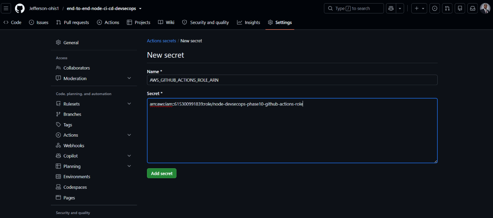
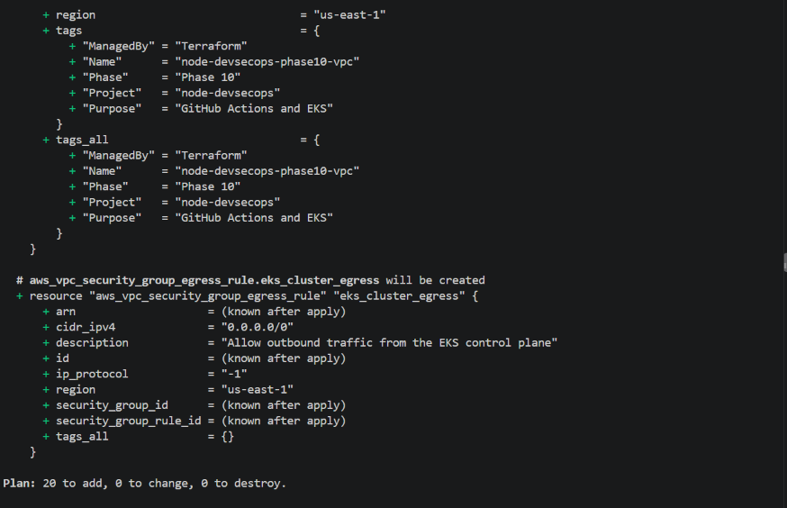
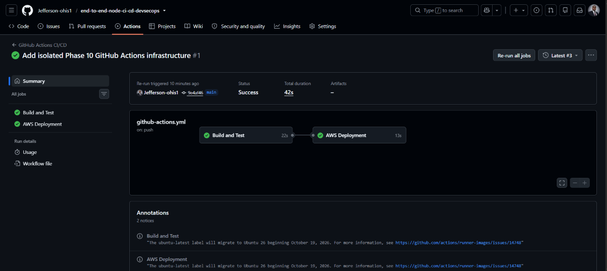
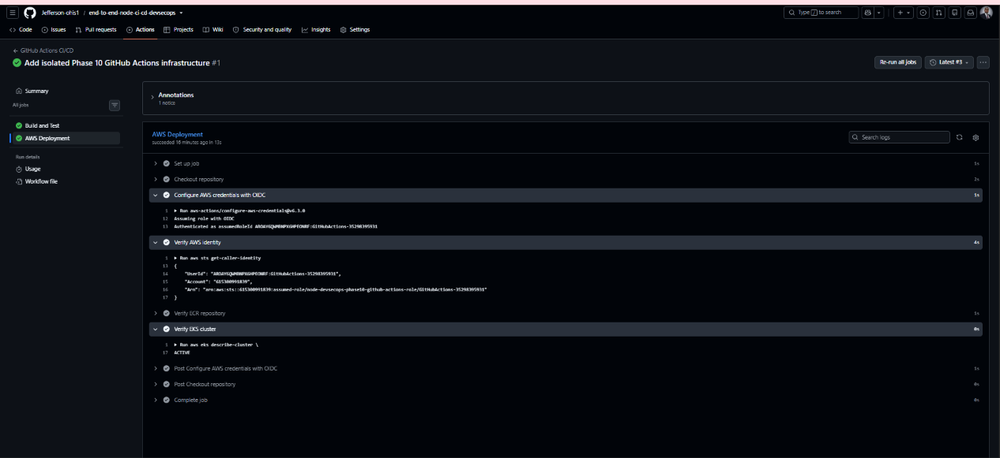

# Phase 10 — GitHub Actions CI/CD with AWS OIDC

## Overview

Phase 10 introduces **GitHub Actions CI/CD** into the Node.js DevSecOps project and establishes a secure authentication path from GitHub Actions to AWS using **OpenID Connect (OIDC)**.

The primary objective of this phase was to establish and verify the GitHub Actions → AWS trust relationship before extending the workflow to perform application deployment.

The Phase 10 implementation was deliberately isolated from the previous AWS infrastructure in order to avoid recreating the Jenkins server, NAT infrastructure, worker resources, and other components that had already been destroyed after Phase 9.

The initial Phase 10 workflow therefore focused on:

* GitHub Actions CI execution
* Docker image build verification
* GitHub Actions OIDC authentication
* AWS identity verification
* Amazon ECR repository verification
* Amazon EKS cluster verification
* Secure IAM trust configuration
* Evidence capture
* Cost-conscious infrastructure teardown

The ECR image push and EKS application deployment stages were intentionally deferred until the OIDC and AWS-access foundation had been successfully verified.

---

# 1. Phase 10 Objectives

The objectives of Phase 10 were to:

1. Introduce GitHub Actions as an additional CI/CD platform.
2. Build and test the Node.js application in GitHub Actions.
3. Build the application Docker image in GitHub Actions.
4. Configure GitHub Actions OIDC authentication with AWS.
5. Avoid storing long-lived AWS access keys in GitHub.
6. Configure a dedicated IAM role for GitHub Actions.
7. Restrict the IAM trust relationship to the intended GitHub repository and branch.
8. Configure Amazon ECR for the application image.
9. Provision an isolated Amazon EKS control plane for deployment verification.
10. Configure GitHub Actions access to the EKS cluster.
11. Verify that GitHub Actions could authenticate successfully to AWS.
12. Verify access to the intended ECR repository.
13. Verify the intended EKS cluster.
14. Capture implementation and verification evidence.
15. Destroy the temporary AWS infrastructure after verification to control costs.

---

# 2. Architecture

The Phase 10 architecture separates CI execution, AWS authentication, AWS resource access, and Kubernetes authorization.

```text
                         GitHub Repository
                                │
                                │ push to main
                                ▼
                    ┌──────────────────────┐
                    │    GitHub Actions    │
                    │                      │
                    │  Checkout            │
                    │  Node.js setup       │
                    │  npm ci              │
                    │  Jest tests          │
                    │  Docker build        │
                    └──────────┬───────────┘
                               │
                               │ GitHub OIDC token
                               ▼
                    ┌──────────────────────┐
                    │ GitHub OIDC Provider │
                    │ token.actions...     │
                    └──────────┬───────────┘
                               │
                               │ AssumeRoleWithWebIdentity
                               ▼
              ┌────────────────────────────────┐
              │ GitHub Actions IAM Role        │
              │                                │
              │ ECR permissions                │
              │ EKS DescribeCluster            │
              └───────────────┬────────────────┘
                              │
                  ┌───────────┴───────────┐
                  │                       │
                  ▼                       ▼
        ┌──────────────────┐    ┌────────────────────────┐
        │ Amazon ECR       │    │ Amazon EKS             │
        │                  │    │                        │
        │ Repository       │    │ Cluster                │
        │                  │    │                        │
        └──────────────────┘    │ EKS Access Entry       │
                                │          ↓              │
                                │ AmazonEKSEditPolicy     │
                                │ namespace: default      │
                                └────────────────────────┘
```

The architecture intentionally separates:

* **AWS authentication** — GitHub OIDC + IAM role
* **AWS API authorization** — IAM permissions
* **Kubernetes authorization** — EKS access entry + EKS access policy

This separation is important because successfully assuming the IAM role does not, by itself, grant Kubernetes permissions.

---

## Phase 10 workflow flow

```text
Git push
   │
   ▼
GitHub Actions
   │
   ├── Checkout repository
   │
   ├── Set up Node.js 24
   │
   ├── npm ci
   │
   ├── Jest tests
   │
   └── Docker image build
            │
            ▼
       AWS OIDC
            │
            ▼
     Assume IAM Role
            │
            ├── Verify AWS identity
            │
            ├── Verify ECR repository
            │
            └── Verify EKS cluster
```

> **Phase 10 foundation:** The workflow successfully verified CI execution, Docker image creation, AWS OIDC authentication, ECR access, and EKS access.
>
> **Deferred extension:** ECR image publishing and EKS application deployment will be added after the documented foundation is re-provisioned.

---

# 3. Isolated Phase 10 Terraform Infrastructure

The Phase 10 AWS infrastructure was intentionally placed in a separate Terraform directory:

```text
infra-phase10/
├── .terraform.lock.hcl
├── ecr.tf
├── eks.tf
├── github-actions.tf
├── iam.tf
├── provider.tf
├── security-groups.tf
├── terraform.tfvars
├── variables.tf
└── vpc.tf
```

This isolation prevented Phase 10 from depending on or recreating the previous Jenkins-based AWS environment.

## Terraform components

| Terraform file       | Purpose                                                                                                          |
| -------------------- | ---------------------------------------------------------------------------------------------------------------- |
| `provider.tf`        | AWS provider and Terraform version configuration                                                                 |
| `variables.tf`       | Reusable Phase 10 infrastructure variables                                                                       |
| `terraform.tfvars`   | Project, region, CIDR, and Availability Zone values                                                              |
| `vpc.tf`             | VPC, public subnets, Internet Gateway, route table, and routes                                                   |
| `security-groups.tf` | EKS cluster security group                                                                                       |
| `iam.tf`             | EKS cluster IAM role and associated IAM configuration                                                            |
| `github-actions.tf`  | GitHub OIDC provider, GitHub Actions IAM role, ECR permissions, EKS API permission, and EKS access configuration |
| `ecr.tf`             | Amazon ECR repository                                                                                            |
| `eks.tf`             | Amazon EKS control plane                                                                                         |

---

# 4. AWS Region and Naming

The Phase 10 infrastructure used:

| Configuration           | Value                                        |
| ----------------------- | -------------------------------------------- |
| AWS Region              | `us-east-1`                                  |
| Project                 | `node-devsecops`                             |
| ECR Repository          | `node-devsecops-phase10-repository`          |
| EKS Cluster             | `node-devsecops-phase10-cluster`             |
| GitHub Actions IAM Role | `node-devsecops-phase10-github-actions-role` |
| VPC CIDR                | `10.0.0.0/16`                                |
| Availability Zones      | `us-east-1a`, `us-east-1b`                   |

The VPC contained two public subnets and an Internet Gateway.

No NAT Gateway or private subnet infrastructure was created for the initial Phase 10 verification environment.

This was intentional because the initial objective was to validate GitHub Actions AWS authentication and AWS resource access without recreating unnecessary infrastructure.

---

# 5. Amazon ECR

Phase 10 provisioned the ECR repository:

```text
node-devsecops-phase10-repository
```

The repository was configured with:

* Mutable image tags
* Scan-on-push enabled
* AES256 encryption

The ECR repository URI was:

```text
615300991839.dkr.ecr.us-east-1.amazonaws.com/node-devsecops-phase10-repository
```

The initial Phase 10 workflow verified that the repository existed and that GitHub Actions could access it through the assumed IAM role.

No application image was pushed during this initial verification stage.

The IAM role was nevertheless configured with the ECR permissions required for the planned publishing stage, including:

```text
ecr:GetAuthorizationToken
ecr:BatchCheckLayerAvailability
ecr:BatchGetImage
ecr:CompleteLayerUpload
ecr:DescribeImages
ecr:DescribeRepositories
ecr:InitiateLayerUpload
ecr:ListImages
ecr:PutImage
ecr:UploadLayerPart
```

`ecr:GetAuthorizationToken` is granted against `*`, while the repository-specific ECR actions are scoped to the Phase 10 ECR repository.

The ECR push stage is reserved for the next CI/CD extension.

---

# 6. Amazon EKS

Phase 10 provisioned an isolated EKS control plane:

```text
node-devsecops-phase10-cluster
```

Configuration included:

* Kubernetes version `1.33`
* Public API endpoint enabled
* Private API endpoint disabled
* Two Availability Zones
* Two public subnets
* Dedicated EKS security group
* Dedicated EKS cluster IAM role
* GitHub Actions EKS access entry
* `AmazonEKSEditPolicy` association
* Namespace scope limited to `default`

The initial workflow verified the EKS cluster status.

The successful workflow returned:

```text
ACTIVE
```

No application deployment was performed during the initial Phase 10 foundation verification.

---

# 7. GitHub Actions Workflow

The workflow is located at:

```text
.github/workflows/github-actions.yml
```

The workflow is named:

```text
GitHub Actions CI/CD
```

It contains two jobs:

```text
build-and-test
aws-deployment
```

---

## 7.1 Build and Test

The `build-and-test` job performs:

1. Repository checkout
2. Node.js 24 setup
3. npm dependency installation
4. Jest test execution
5. Docker image build
6. Docker image verification

The Docker image is tagged using the GitHub commit SHA:

```text
node-monitoring-app:${GITHUB_SHA}
```

Using the commit SHA provides a direct relationship between:

```text
Git commit
    ↓
GitHub Actions run
    ↓
Docker image
```

This image-tagging approach will become useful when the image is subsequently pushed to ECR and deployed to EKS.

---

## 7.2 AWS Deployment

The `aws-deployment` job depends on the successful completion of `build-and-test`.

Its initial purpose was AWS authentication and resource verification.

The job performs:

1. Repository checkout
2. AWS OIDC authentication
3. AWS identity verification
4. ECR repository verification
5. EKS cluster verification

The job was named `AWS Deployment` because it represents the AWS side of the CI/CD workflow, although the initial implementation did not yet perform an application deployment.

---

# 8. GitHub Actions AWS Authentication with OIDC

The workflow does not use long-lived AWS access keys.

Instead, GitHub Actions obtains an OIDC identity token and uses it to assume the dedicated AWS IAM role.

The workflow uses:

```yaml
- name: Configure AWS credentials with OIDC
  uses: aws-actions/configure-aws-credentials@v6.3.0
  with:
    role-to-assume: ${{ secrets.AWS_GITHUB_ACTIONS_ROLE_ARN }}
    aws-region: ${{ env.AWS_REGION }}
    role-session-name: GitHubActions-${{ github.run_id }}
```

The role is supplied through the GitHub repository secret:

```text
AWS_GITHUB_ACTIONS_ROLE_ARN
```

The role ARN was:

```text
arn:aws:iam::615300991839:role/node-devsecops-phase10-github-actions-role
```

The authentication flow is:

```text
GitHub Actions
      │
      │ OIDC token
      ▼
GitHub OIDC Provider
      │
      │ Trust policy evaluation
      ▼
AWS IAM Role
      │
      ▼
Temporary AWS credentials
      │
      ├── AWS STS
      ├── Amazon ECR
      └── Amazon EKS
```

---

# 9. GitHub Repository Secret

During the verified Phase 10 implementation, the repository contained the following GitHub Actions secret:

```text
AWS_GITHUB_ACTIONS_ROLE_ARN
```

Its purpose is to provide the workflow with the ARN of the AWS IAM role that GitHub Actions is permitted to assume.

The secret contains the IAM role ARN rather than an AWS access key and secret key.

This keeps long-lived AWS credentials out of the GitHub repository and workflow file.

## GitHub repository secret configuration




> The screenshot demonstrates the repository secret configuration. Secret values are not exposed in the documentation.

---

# 10. GitHub OIDC Provider

The AWS account was configured with the GitHub Actions OIDC provider:

```text
token.actions.githubusercontent.com
```

The provider allows AWS IAM to validate identity tokens issued by GitHub Actions.

The OIDC provider was created specifically to support federated authentication from GitHub Actions.

This removes the need to store long-lived AWS IAM access keys in GitHub Actions.

The provider was configured with:

```text
Audience:
sts.amazonaws.com
```

The IAM trust relationship also validates this audience claim.

---

# 11. Immutable GitHub OIDC Subject Configuration

GitHub's OIDC subject configuration was verified before the final IAM trust policy was applied.

The repository identifiers were:

```text
GitHub owner:
Jefferson-ohis1

GitHub owner ID:
280539875

Repository:
end-to-end-node-ci-cd-devsecops

Repository ID:
1316644659
```

The GitHub OIDC customization configuration returned:

```text
use_default: true
use_immutable_subject: true
```

with the subject claim prefix:

```text
repo:Jefferson-ohis1@280539875/end-to-end-node-ci-cd-devsecops@1316644659
```

For the `main` branch, the expected immutable subject was:

```text
repo:Jefferson-ohis1@280539875/end-to-end-node-ci-cd-devsecops@1316644659:ref:refs/heads/main
```

This configuration binds the AWS trust relationship to the GitHub owner ID, repository ID, repository, and intended branch rather than relying only on mutable repository naming.

---

# 12. IAM Trust Relationship

The GitHub Actions role is:

```text
node-devsecops-phase10-github-actions-role
```

Its trust relationship allows the GitHub Actions OIDC provider to assume the role only when the OIDC claims satisfy the configured conditions.

The trust relationship validates both:

* the OIDC audience; and
* the immutable repository/branch subject.

The relevant Terraform configuration is:

```hcl
Condition = {
  StringEquals = {
    "token.actions.githubusercontent.com:aud" = "sts.amazonaws.com"
  }

  StringLike = {
    "token.actions.githubusercontent.com:sub" = "repo:${local.github_owner}@${local.github_owner_id}/${local.github_repository}@${local.github_repository_id}:ref:refs/heads/${local.github_branch}"
  }
}
```

With the Phase 10 values, the subject resolves to:

```text
repo:Jefferson-ohis1@280539875/end-to-end-node-ci-cd-devsecops@1316644659:ref:refs/heads/main
```

The deployed IAM trust relationship was independently verified with AWS CLI:

```bash
aws iam get-role \
  --role-name node-devsecops-phase10-github-actions-role \
  --query 'Role.AssumeRolePolicyDocument.Statement[0].Condition.StringLike."token.actions.githubusercontent.com:sub"' \
  --output text
```

The returned value matched the intended immutable `main` branch subject.

The resulting trust boundary is therefore limited to the intended GitHub repository and branch.

---

# 13. GitHub Actions IAM Permissions

The GitHub Actions IAM role contains two inline IAM policies:

```text
github_actions_ecr
github_actions_eks
```

These policies serve different purposes.

---

## 13.1 Amazon ECR permissions

The ECR policy provides the permissions required for the current ECR verification and the planned image-publishing workflow.

Repository-specific permissions include:

```text
ecr:BatchCheckLayerAvailability
ecr:BatchGetImage
ecr:CompleteLayerUpload
ecr:DescribeImages
ecr:DescribeRepositories
ecr:InitiateLayerUpload
ecr:ListImages
ecr:PutImage
ecr:UploadLayerPart
```

The ECR authentication token permission is:

```text
ecr:GetAuthorizationToken
```

and is granted against:

```text
*
```

The repository-specific permissions are scoped to:

```text
aws_ecr_repository.node_app_repository.arn
```

This means the role was prepared for the future ECR push stage without granting repository-wide access to unrelated ECR repositories.

---

## 13.2 Amazon EKS API permission

The IAM policy named:

```text
node-devsecops-phase10-github-actions-eks
```

grants:

```text
eks:DescribeCluster
```

against the Phase 10 EKS cluster ARN.

This permission was sufficient for the initial workflow's AWS CLI cluster verification:

```bash
aws eks describe-cluster
```

It is important to distinguish this IAM permission from Kubernetes API authorization.

---

## 13.3 Kubernetes authorization through EKS Access Entry

GitHub Actions was also configured as an EKS access entry:

```text
aws_eks_access_entry.github_actions
```

The principal is the GitHub Actions IAM role:

```text
arn:aws:iam::615300991839:role/node-devsecops-phase10-github-actions-role
```

The access entry was associated with:

```text
arn:aws:eks::aws:cluster-access-policy/AmazonEKSEditPolicy
```

The policy association was restricted to the:

```text
default
```

namespace.

The resulting authorization model during the verified Phase 10 deployment was:

```text
GitHub Actions
      │
      ▼
AWS OIDC
      │
      ▼
IAM Role
      │
      ├── IAM: eks:DescribeCluster
      │
      └── EKS Access Entry
                │
                ▼
       AmazonEKSEditPolicy
                │
                ▼
          default namespace
```

This separation will become important when EKS deployment is added to the workflow.

---

# 14. Terraform Validation

Before deployment, the isolated Terraform configuration was initialized and validated.

The Phase 10 infrastructure was managed from:

```text
infra-phase10/
```

Terraform initialization installed the AWS provider successfully.

The infrastructure was then planned and applied.

The initial Phase 10 deployment completed with:

```text
Apply complete! Resources: 20 added, 0 changed, 0 destroyed.
```

A subsequent Terraform plan confirmed that the configuration and deployed infrastructure were synchronized before the environment was eventually destroyed.

---

# 15. Terraform Evidence

Terraform planning was used to establish the expected Phase 10 infrastructure before deployment.

The captured evidence is retained under:

```text
screenshots/10-github-actions-ci-cd/
```

## Phase 10 Terraform infrastructure plan




The screenshot provides evidence of the infrastructure planning stage for the isolated Phase 10 environment.

---

# 16. GitHub Actions Successful Run

The GitHub Actions workflow was executed successfully against commit:

```text
9e4af46
```

The successful run demonstrated:

* GitHub Actions workflow execution
* Repository checkout
* Node.js environment setup
* Dependency installation
* Jest test execution
* Docker image build
* AWS OIDC authentication
* AWS IAM role assumption
* AWS identity verification
* ECR repository verification
* EKS cluster verification

The overall workflow completed successfully.

## Successful GitHub Actions CI/CD run



---

# 17. AWS Deployment Job

The second workflow job was:

```text
AWS Deployment
```

During the initial Phase 10 implementation, this job performed AWS authentication and infrastructure verification rather than application deployment.

The successful job included:

```text
Configure AWS credentials with OIDC
Verify AWS identity
Verify ECR repository
Verify EKS cluster
```

## Successful AWS Deployment job



---

# 18. AWS OIDC Authentication Verification

The workflow successfully assumed:

```text
node-devsecops-phase10-github-actions-role
```

The GitHub Actions authentication log showed:

```text
Assuming role with OIDC
Authenticated as assumedRoleId ...
```

The workflow then executed:

```bash
aws sts get-caller-identity
```

The resulting identity was an assumed-role session rather than a long-lived IAM user.

The verified AWS account was:

```text
615300991839
```

The assumed-role ARN followed the form:

```text
arn:aws:sts::615300991839:assumed-role/node-devsecops-phase10-github-actions-role/GitHubActions-<run-id>
```

The successful authentication demonstrates that GitHub Actions exchanged its OIDC identity for temporary AWS credentials.

---

# 19. ECR Verification

The workflow executed:

```bash
aws ecr describe-repositories \
  --repository-names "${ECR_REPOSITORY}"
```

The repository was successfully located:

```text
node-devsecops-phase10-repository
```

The repository configuration included:

```text
Image tag mutability: MUTABLE
Scan on push: true
Encryption: AES256
```

The repository existed and was accessible using the temporary credentials obtained through GitHub OIDC.

No container image was pushed during the initial verification phase.

The ECR permissions required for image publishing were nevertheless provisioned in preparation for the next workflow extension.

---

# 20. EKS Verification

The workflow executed:

```bash
aws eks describe-cluster \
  --name "${EKS_CLUSTER_NAME}" \
  --region "${AWS_REGION}" \
  --query 'cluster.status' \
  --output text
```

The returned cluster status was:

```text
ACTIVE
```

This confirmed that the GitHub Actions IAM role could successfully access the intended Phase 10 EKS cluster through the AWS API.

The initial verification did **not** deploy Kubernetes resources.

EKS application deployment will be added in the next extension after the Phase 10 infrastructure is re-provisioned.

## EKS cluster verification from GitHub Actions

The successful AWS deployment job screenshot contains the EKS verification step:


---

# 21. Evidence Index

All Phase 10 screenshots are stored under:

```text
screenshots/10-github-actions-ci-cd/
```

| Evidence                           | Screenshot                               |
| ---------------------------------- | ---------------------------------------- |
| Terraform infrastructure plan      | `01-github-actions-terraform-plan.png`   |
| GitHub repository secret           | `02-github-repository-secret-config.png` |
| Successful GitHub Actions workflow | `03-github-actions-success.png`          |
| Successful AWS Deployment job      | `04-aws-deployment-successful-job.png`   |

The evidence directory is intentionally kept separate from the documentation so screenshots can be referenced from the Markdown document without placing image files directly inside the `docs/` directory.

---

# 22. Security Considerations

Phase 10 incorporates several security-focused design decisions.

## 22.1 No long-lived AWS credentials in GitHub Actions

The workflow uses GitHub OIDC rather than storing:

```text
AWS_ACCESS_KEY_ID
AWS_SECRET_ACCESS_KEY
```

as long-lived repository credentials.

Instead, GitHub Actions obtains temporary AWS credentials by assuming the dedicated IAM role.

---

## 22.2 Dedicated IAM role

GitHub Actions uses a dedicated role:

```text
node-devsecops-phase10-github-actions-role
```

The role is separate from the EKS cluster service role.

This keeps the GitHub Actions trust relationship and permissions separate from the EKS control-plane IAM role.

---

## 22.3 Restricted OIDC trust

The IAM trust policy validates:

```text
Audience:
sts.amazonaws.com
```

and the immutable GitHub subject:

```text
repo:Jefferson-ohis1@280539875/end-to-end-node-ci-cd-devsecops@1316644659:ref:refs/heads/main
```

The role is therefore not configured for arbitrary GitHub repositories or arbitrary branches.

---

## 22.4 Immutable repository identity

The OIDC subject uses GitHub owner and repository IDs in addition to the repository identity.

This creates a stronger repository-specific trust condition than relying only on mutable repository naming.

---

## 22.5 Separation of AWS and Kubernetes authorization

Phase 10 separates:

```text
AWS IAM authorization
```

from:

```text
Kubernetes authorization
```

The IAM role has:

```text
eks:DescribeCluster
```

for AWS API-level cluster verification.

Kubernetes authorization is separately configured through:

```text
EKS Access Entry
        ↓
AmazonEKSEditPolicy
        ↓
default namespace
```

This distinction provides a clear foundation for the future EKS deployment stage.

---

## 22.6 ECR repository scoping

The ECR repository-specific actions are scoped to the Phase 10 repository rather than all ECR repositories.

Only:

```text
ecr:GetAuthorizationToken
```

uses the wildcard resource required for ECR authentication.

The remaining ECR repository operations reference the Phase 10 repository ARN.

---

## 22.7 Least-purpose infrastructure

The Phase 10 environment intentionally avoided unnecessary resources.

No Jenkins EC2 instance, NAT Gateway, private subnet architecture, or EKS worker-node infrastructure was recreated for the initial OIDC verification.

The initial infrastructure was limited to the components required to demonstrate:

```text
GitHub Actions
      ↓
OIDC
      ↓
IAM
      ↓
ECR / EKS
```

---

# 23. Cost-Conscious Teardown

After all required evidence had been captured and the GitHub Actions → AWS integration had been successfully verified, the temporary Phase 10 AWS environment was destroyed.

The teardown was first planned with:

```bash
terraform -chdir=infra-phase10 plan -destroy
```

The destroy plan reported:

```text
Plan: 0 to add, 0 to change, 20 to destroy.
```

The destroy plan was reviewed before the destructive operation was approved.

The infrastructure was then destroyed with:

```bash
terraform -chdir=infra-phase10 apply -destroy
```

Terraform completed with:

```text
Apply complete! Resources: 0 added, 0 changed, 20 destroyed.
```

The 20 destroyed resources covered the isolated Phase 10 environment, including:

* EKS cluster
* ECR repository
* GitHub Actions IAM role
* GitHub OIDC provider
* EKS access entry
* EKS access policy association
* EKS cluster IAM role
* EKS security group
* VPC
* Two public subnets
* Internet Gateway
* Route table
* Route associations
* Internet route
* Required IAM policies and attachments

This teardown was intentional and forms part of the Phase 10 lifecycle.

The AWS infrastructure was not left running after evidence collection.

---

# 24. Phase 10 Result

Phase 10 successfully established and verified the foundation for GitHub Actions CI/CD with AWS.

The completed verification flow was:

```text
GitHub push
      ↓
GitHub Actions
      ↓
Checkout
      ↓
Node.js setup
      ↓
npm ci
      ↓
Jest tests
      ↓
Docker image build
      ↓
GitHub OIDC token
      ↓
AWS IAM role assumption
      ↓
AWS identity verification
      ↓
ECR repository verification
      ↓
EKS cluster verification
```

The security model was:

```text
GitHub Actions
      │
      ▼
GitHub OIDC
      │
      ▼
AWS IAM trust policy
      │
      ▼
Dedicated GitHub Actions IAM role
      │
      ├── ECR repository permissions
      │
      ├── eks:DescribeCluster
      │
      └── EKS access entry
                │
                ▼
       AmazonEKSEditPolicy
                │
                ▼
          default namespace
```

The most important security result is that GitHub Actions successfully authenticated to AWS using **OIDC and temporary credentials**, without requiring long-lived AWS access keys.

The Phase 10 AWS environment was subsequently destroyed after successful verification.

---

# 25. Next Phase 10 Extension

The next implementation step will extend the verified foundation into a complete GitHub Actions deployment pipeline.

The planned flow is:

```text
Build
   ↓
Test
   ↓
Docker Build
   ↓
AWS OIDC Authentication
   ↓
ECR Login
   ↓
Docker Tag
   ↓
ECR Push
   ↓
EKS Authentication
   ↓
Deploy to EKS
   ↓
Rollout Verification
   ↓
Application Verification
```

The Git commit SHA will provide image traceability:

```text
Git commit
    ↓
GitHub Actions run
    ↓
Docker image
    ↓
ECR image tag
    ↓
EKS deployment
```

For example:

```text
${GITHUB_SHA}
```

will identify the Docker image associated with the source commit that triggered the workflow.

The future deployment stage will build on the already verified:

* GitHub OIDC provider
* immutable GitHub subject
* IAM trust relationship
* GitHub Actions IAM role
* ECR repository
* EKS cluster
* EKS access entry
* Kubernetes authorization configuration

rather than duplicating the foundation work.

---

# 26. Phase 10 Completion Summary

| Area                            | Status                |
| ------------------------------- | --------------------- |
| GitHub Actions workflow         | ✅ Verified            |
| Node.js CI                      | ✅ Verified            |
| Jest tests                      | ✅ Verified            |
| Docker image build              | ✅ Verified            |
| GitHub OIDC provider            | ✅ Verified            |
| Immutable OIDC subject          | ✅ Verified            |
| IAM trust relationship          | ✅ Verified            |
| GitHub repository secret        | ✅ Configured          |
| AWS role assumption             | ✅ Verified            |
| AWS identity                    | ✅ Verified            |
| ECR repository access           | ✅ Verified            |
| ECR push permissions configured | ✅ Ready for extension |
| EKS cluster access              | ✅ Verified            |
| EKS access entry                | ✅ Configured          |
| EKS Kubernetes authorization    | ✅ Configured          |
| Application deployment          | ⏳ Next extension      |
| ECR image push                  | ⏳ Next extension      |
| Rollout verification            | ⏳ Next extension      |
| Application verification        | ⏳ Next extension      |
| Evidence screenshots            | ✅ Captured            |
| AWS teardown                    | ✅ Completed           |

---

## Phase 10 Takeaway

This phase establishes a secure GitHub Actions-to-AWS authentication foundation using **OIDC federation instead of long-lived AWS credentials**.

The implementation demonstrates that GitHub Actions can:

* authenticate to AWS through OIDC;
* satisfy a narrowly scoped immutable repository/branch trust relationship;
* assume a dedicated IAM role;
* obtain temporary AWS credentials;
* access the intended ECR repository;
* verify the intended EKS cluster;
* and establish a separate EKS access-entry authorization path for future Kubernetes deployment.

The temporary AWS infrastructure was destroyed after verification to avoid unnecessary ongoing costs.

The next extension will convert this verified foundation into an end-to-end GitHub Actions deployment pipeline by adding:

```text
ECR image publishing
        ↓
EKS authentication
        ↓
Kubernetes deployment
        ↓
Rollout verification
        ↓
Application verification
```

This will complete the transition from **CI + AWS access verification** to an actual **GitHub Actions CI/CD deployment workflow**.

---