# Phase 10 — GitHub Actions CI/CD with AWS OIDC, ECR, EKS and Kubernetes Deployment

## Overview

Phase 10 extends the Node.js DevSecOps project by introducing **GitHub Actions CI/CD** as an additional CI/CD platform alongside the previously implemented Jenkins pipeline.

The phase establishes a secure GitHub Actions → AWS authentication model using **GitHub OpenID Connect (OIDC)** and extends that foundation into an end-to-end container deployment workflow using:

* GitHub Actions
* GitHub OIDC
* AWS IAM
* Amazon ECR
* Amazon EKS
* Kubernetes
* Docker
* Kubernetes LoadBalancer
* Horizontal Pod Autoscaling
* Metrics Server
* Helm
* Terraform

The implementation was deliberately isolated from the AWS infrastructure used during earlier phases.

The Phase 10 AWS infrastructure was managed from:

```text
infra-phase10/
```

This prevented the GitHub Actions implementation from recreating the Jenkins EC2 server, previous networking architecture, or other Phase 9 infrastructure.

The Kubernetes platform dependency represented by Metrics Server is managed separately from the application CI/CD workflow through:

```text
infra-phase10-platform/
```

This separation is intentional.

GitHub Actions is responsible for **application CI/CD**.

The platform Terraform layer is responsible for **cluster-level Kubernetes platform infrastructure**.

The resulting architecture is:

```text
                    PHASE 10
                       │
          ┌────────────┴────────────┐
          │                         │
          ▼                         ▼
  Application CI/CD          Cluster Platform
          │                         │
  GitHub Actions              EKS cluster
          │                         │
  GitHub OIDC → IAM          infra-phase10-platform
          │                         │
  ECR → EKS                  Helm → Metrics Server
          │                         │
  default namespace          Metrics API
          │                         │
  Deployment                 HPA dependency
  Service
  HPA
```

---

# 1. Phase 10 Objectives

The objectives of Phase 10 were to:

1. Introduce GitHub Actions as an additional CI/CD platform.
2. Build and test the Node.js application in GitHub Actions.
3. Build the application Docker image.
4. Authenticate GitHub Actions to AWS using OIDC.
5. Avoid long-lived AWS access keys in GitHub Actions.
6. Create a dedicated GitHub Actions IAM role.
7. Restrict the IAM trust relationship to the intended GitHub repository and `main` branch.
8. Configure Amazon ECR for application image storage.
9. Provision an isolated Amazon EKS environment.
10. Configure GitHub Actions Kubernetes authorization through an EKS Access Entry.
11. Push commit-SHA-tagged Docker images to ECR.
12. Authenticate GitHub Actions to EKS.
13. Deploy the application to EKS.
14. Expose the application through a Kubernetes LoadBalancer.
15. Verify Kubernetes rollout and pod health.
16. Verify the deployed application externally.
17. Create and verify the Kubernetes HPA resource.
18. Manage Metrics Server separately as Kubernetes platform infrastructure.
19. Verify the Kubernetes Metrics API independently from the application deployment workflow.
20. Establish the platform dependency required for CPU-based HPA metrics.
21. Capture implementation and verification evidence.
22. Destroy the temporary AWS environment after verification to control costs.

---

# 2. Phase 10 Architecture

Phase 10 uses two related but deliberately separated layers:

```text
┌─────────────────────────────────────────────────────────────┐
│                    Application CI/CD                        │
│                                                             │
│ GitHub Repository                                           │
│        ↓                                                    │
│ GitHub Actions                                              │
│        ↓                                                    │
│ GitHub OIDC                                                 │
│        ↓                                                    │
│ AWS IAM Role                                                │
│        ↓                                                    │
│ ECR                                                         │
│        ↓                                                    │
│ EKS application namespace                                   │
│        ↓                                                    │
│ Deployment + Service + HPA                                  │
└─────────────────────────────────────────────────────────────┘

                         │
                         │ depends on
                         ▼

┌─────────────────────────────────────────────────────────────┐
│                    Cluster Platform                         │
│                                                             │
│ Existing EKS cluster                                        │
│        ↓                                                    │
│ infra-phase10-platform/                                     │
│        ↓                                                    │
│ Terraform + Helm                                            │
│        ↓                                                    │
│ Metrics Server                                               │
│        ↓                                                    │
│ Kubernetes Metrics API                                      │
│        ↓                                                    │
│ HPA metrics dependency                                      │
└─────────────────────────────────────────────────────────────┘
```

The application CI/CD workflow does **not** install Metrics Server.

Metrics Server is a cluster-level platform component and is therefore managed separately.

The GitHub Actions role remains deliberately scoped to application deployment in the `default` namespace.

---

# 3. Authorization Model

Phase 10 separates authentication and authorization into distinct layers.

```text
GitHub Actions
      │
      │ OIDC token
      ▼
GitHub OIDC Provider
      │
      │ AssumeRoleWithWebIdentity
      ▼
AWS IAM Role
      │
      ├───────────────► Amazon ECR
      │
      └───────────────► EKS DescribeCluster
                              │
                              ▼
                       EKS Access Entry
                              │
                              ▼
                     AmazonEKSEditPolicy
                              │
                              ▼
                      default namespace
```

The Kubernetes authorization scope is intentionally limited.

The GitHub Actions role is not intended to administer the entire Kubernetes cluster.

It is intended to deploy application resources such as:

```text
Deployment
Service
HorizontalPodAutoscaler
```

within:

```text
default
```

---

# 4. Cluster-Platform Separation

Metrics Server requires cluster-level Kubernetes functionality and is therefore treated as platform infrastructure rather than application deployment logic.

The platform architecture is:

```text
infra-phase10/
    │
    ├── VPC
    ├── EKS
    ├── ECR
    ├── IAM
    └── GitHub OIDC
          │
          ▼
    Existing EKS cluster
          │
          ▼
infra-phase10-platform/
          │
          ├── Terraform AWS data sources
          ├── Terraform Helm provider
          └── Metrics Server Helm release
```

> This separation avoids granting the application deployment role broad cluster-administrator permissions merely to install a platform component.

---

# 5. Phase 10 CI/CD Flow

The GitHub Actions application pipeline follows this sequence:

```text
Git push to main
        ↓
Checkout repository
        ↓
Set up Node.js 24
        ↓
npm ci
        ↓
Jest tests
        ↓
Docker build
        ↓
Verify Docker image
        ↓
AWS OIDC authentication
        ↓
Verify AWS identity
        ↓
Verify ECR repository
        ↓
Verify EKS cluster
        ↓
Build deployment image
        ↓
ECR login
        ↓
Tag image with GITHUB_SHA
        ↓
Push image to ECR
        ↓
Configure kubectl for EKS
        ↓
Verify application deployment permissions
        ↓
Render Kubernetes deployment
        ↓
Deploy application
        ↓
Deploy LoadBalancer service
        ↓
Deploy HPA
        ↓
Wait for rollout
        ↓
Verify deployment/pods/service/HPA
        ↓
Verify application health
```

There is deliberately **no Metrics Server installation step** in this flow.

Metrics Server is managed independently through the cluster-platform layer.

---

# 6. Repository Structure

The relevant Phase 10 files are:

```text
.github/
└── workflows/
    └── github-actions.yml

infra-phase10/
├── .terraform.lock.hcl
├── ecr.tf
├── eks.tf
├── github-actions.tf
├── iam.tf
├── provider.tf
├── security-groups.tf
├── terraform.tfvars
├── variables.tf
└── vpc.tf

infra-phase10-platform/
├── .terraform.lock.hcl
├── metrics-server.tf
├── provider.tf
└── variables.tf

k8s/
├── deployment.yaml
├── service.yaml
├── hpa.yaml
└── service-monitor.yaml

screenshots/
└── 10-github-actions-ci-cd/
    ├── 01-github-actions-terraform-plan.png
    ├── 02-github-repository-secret-config.png
    ├── 03-github-actions-success.png
    ├── 04-aws-deployment-successful-job.png
    ├── 05-github-actions-ecr-eks-success.png
    ├── 06-ecr-sha-tagged-image.png
    ├── 07-eks-deployment-and-pods.png
    ├── 08-eks-loadbalancer-service.png
    ├── 09-application-health.png
    ├── 10-application-health-browser-render.png
    ├── 11-hpa-created-metrics-unavailable.png
    ├── 12-metrics-server-and-api-success.png
    └── 13-metrics-server-pod-metrics.png

docs/
└── 10-github-actions-ci-cd.md
```

---

# 7. AWS Configuration

Phase 10 used:

| Configuration           | Value                                        |
| ----------------------- | -------------------------------------------- |
| AWS Region              | `us-east-1`                                  |
| Project                 | `node-devsecops`                             |
| ECR Repository          | `node-devsecops-phase10-repository`          |
| EKS Cluster             | `node-devsecops-phase10-cluster`             |
| VPC CIDR                | `10.0.0.0/16`                                |
| Availability Zones      | `us-east-1a`, `us-east-1b`                   |
| GitHub Actions IAM Role | `node-devsecops-phase10-github-actions-role` |
| EKS Kubernetes Version  | `1.33`                                       |

The ECR repository URI was:

```text
615300991839.dkr.ecr.us-east-1.amazonaws.com/node-devsecops-phase10-repository
```

---

# 8. Terraform Infrastructure

The Phase 10 AWS infrastructure was intentionally isolated under:

```text
infra-phase10/
```

Terraform was used to provision:

* VPC
* Public subnets
* Internet Gateway
* Routing
* EKS cluster
* EKS managed node group
* EKS security group
* EKS IAM roles
* GitHub OIDC provider
* GitHub Actions IAM role
* GitHub Actions ECR permissions
* GitHub Actions EKS API permissions
* EKS Access Entry
* EKS Access Policy Association
* ECR repository

The infrastructure was provisioned temporarily for CI/CD verification and subsequently destroyed after evidence collection.

---

# 9. EKS Configuration

The Phase 10 EKS cluster was:

```text
node-devsecops-phase10-cluster
```

Configuration included:

* Kubernetes `1.33`
* Public API endpoint
* Two Availability Zones
* Two public subnets
* Managed node group
* `t3.small` worker nodes
* Desired nodes: `2`
* Minimum nodes: `1`
* Maximum nodes: `2`
* EKS API authentication
* EKS Access Entry authorization

The worker nodes were verified during the infrastructure/application verification phase using an authorized cluster identity separate from the GitHub Actions application deployment identity.

The GitHub Actions role was intentionally not granted cluster-scoped permission to list nodes because node inspection is not required for the application deployment workflow.

Importantly, **worker-node listing was not a required permission for the GitHub Actions application role**.

---

# 10. GitHub Actions Workflow

The workflow is located at:

```text
.github/workflows/github-actions.yml
```

The workflow is named:

```text
GitHub Actions CI/CD
```

It contains two jobs:

```text
build-and-test
aws-deployment
```

The second job depends on the successful completion of the first:

```text
build-and-test
       ↓
aws-deployment
```

This prevents AWS deployment activity from occurring when the CI stage fails.

---

# 11. Build and Test Job

The `build-and-test` job performs:

1. Repository checkout
2. Node.js 24 setup
3. Dependency installation
4. Jest tests
5. Docker image build
6. Docker image verification

The Docker image is initially tagged:

```text
node-monitoring-app:${GITHUB_SHA}
```

The commit SHA provides traceability between:

```text
Git commit
    ↓
GitHub Actions run
    ↓
Docker image
    ↓
ECR image
    ↓
EKS deployment
```

---

# 12. AWS OIDC Authentication

GitHub Actions does not use long-lived AWS access keys.

Instead, the workflow uses:

```yaml
- name: Configure AWS credentials with OIDC
  uses: aws-actions/configure-aws-credentials@v6.3.0
  with:
    role-to-assume: ${{ secrets.AWS_GITHUB_ACTIONS_ROLE_ARN }}
    aws-region: ${{ env.AWS_REGION }}
    role-session-name: GitHubActions-${{ github.run_id }}
```

The repository secret is:

```text
AWS_GITHUB_ACTIONS_ROLE_ARN
```

The IAM role is:

```text
arn:aws:iam::615300991839:role/node-devsecops-phase10-github-actions-role
```

The authentication flow is:

```text
GitHub Actions
      ↓
GitHub OIDC token
      ↓
AWS OIDC Provider
      ↓
IAM trust policy
      ↓
GitHub Actions IAM role
      ↓
Temporary AWS credentials
```

This avoids storing long-lived AWS access keys in GitHub.

---

# 13. GitHub OIDC Provider

The AWS OIDC provider is:

```text
token.actions.githubusercontent.com
```

The provider uses:

```text
Audience:
sts.amazonaws.com
```

The IAM trust relationship validates the OIDC audience and the intended repository/branch subject.

---

# 14. Immutable GitHub Repository Identity

The Phase 10 trust relationship used immutable GitHub identifiers.

Repository owner:

```text
Jefferson-ohis1
```

Repository:

```text
end-to-end-node-ci-cd-devsecops
```

The immutable subject prefix was:

```text
repo:Jefferson-ohis1@280539875/end-to-end-node-ci-cd-devsecops@1316644659
```

For the `main` branch, the subject was:

```text
repo:Jefferson-ohis1@280539875/end-to-end-node-ci-cd-devsecops@1316644659:ref:refs/heads/main
```

This restricts the IAM trust relationship to the intended repository and branch.

---

# 15. IAM Permissions

The GitHub Actions role contains permissions required by the application CI/CD workflow.

## ECR permissions

Repository-specific ECR permissions include:

```text
ecr:BatchCheckLayerAvailability
ecr:BatchGetImage
ecr:CompleteLayerUpload
ecr:DescribeImages
ecr:DescribeRepositories
ecr:InitiateLayerUpload
ecr:ListImages
ecr:PutImage
ecr:UploadLayerPart
```

The ECR authentication token permission is:

```text
ecr:GetAuthorizationToken
```

The repository-specific operations are restricted to the Phase 10 ECR repository.

## EKS API permissions

The IAM role also has:

```text
eks:DescribeCluster
```

against the Phase 10 EKS cluster.

This permits AWS API-level cluster discovery.

Kubernetes authorization is handled separately through the EKS Access Entry.

---

# 16. EKS Access Entry

GitHub Actions was configured as an EKS access entry.

The principal is:

```text
arn:aws:iam::615300991839:role/node-devsecops-phase10-github-actions-role
```

The access policy association uses:

```text
AmazonEKSEditPolicy
```

with namespace scope:

```text
default
```

The authorization chain is:

```text
GitHub Actions
      ↓
AWS OIDC
      ↓
IAM role
      ↓
EKS Access Entry
      ↓
AmazonEKSEditPolicy
      ↓
default namespace
```

This authorization model is deliberately scoped to application deployment rather than cluster administration.

---

# 17. GitHub Repository Secret Evidence

The GitHub repository contains:

```text
AWS_GITHUB_ACTIONS_ROLE_ARN
```

The secret contains the IAM role ARN rather than an AWS access key.

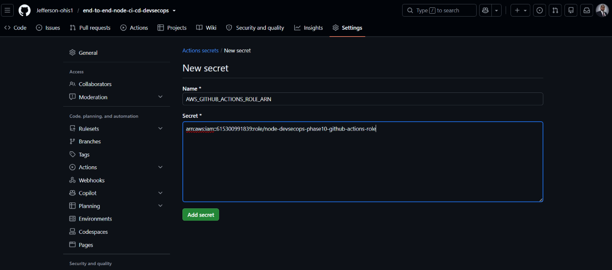

The screenshot demonstrates the configured repository secret without exposing the secret value.

---

# 18. Initial GitHub Actions Verification

The initial GitHub Actions foundation successfully verified:

* GitHub Actions workflow execution
* Repository checkout
* Node.js environment setup
* Dependency installation
* Jest tests execution
* Docker image build
* AWS OIDC authentication
* AWS IAM role assumption
* AWS identity verification
* ECR repository access
* EKS API access

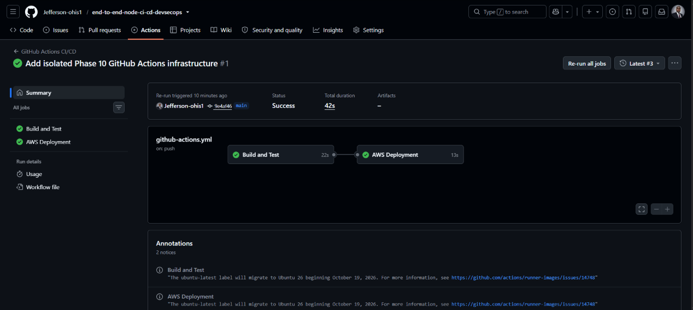

The historical successful workflow evidence demonstrates the initial Phase 10 OIDC and AWS integration.

---

# 19. AWS Deployment Job

The AWS deployment job subsequently evolved from simple AWS resource verification into the application deployment workflow.

The completed job performs:

```text
AWS OIDC authentication
        ↓
AWS identity verification
        ↓
ECR verification
        ↓
EKS cluster verification
        ↓
Docker build
        ↓
ECR login
        ↓
ECR image push
        ↓
EKS kubeconfig
        ↓
Kubernetes authorization checks
        ↓
Kubernetes deployment
        ↓
Service deployment
        ↓
HPA deployment
        ↓
Rollout verification
        ↓
Application verification
```

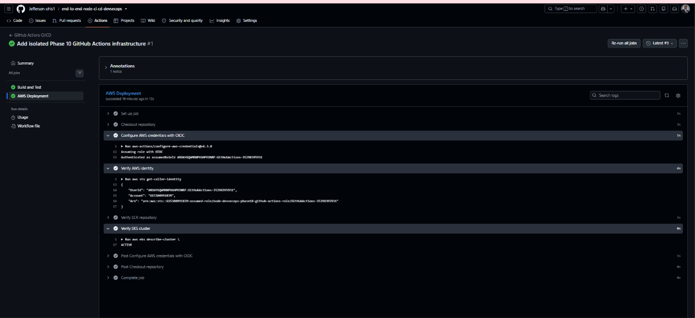

---

# 20. Successful End-to-End GitHub Actions Run

The completed ECR/EKS application deployment was successfully executed from GitHub Actions.

The verified workflow run used commit:

```text
c97535309874695d6a8de6cb2b5c4d32bff55648
```

Short SHA:

```text
c975353
```

The workflow completed successfully for the application deployment path.

The successful deployment evidence is captured in:

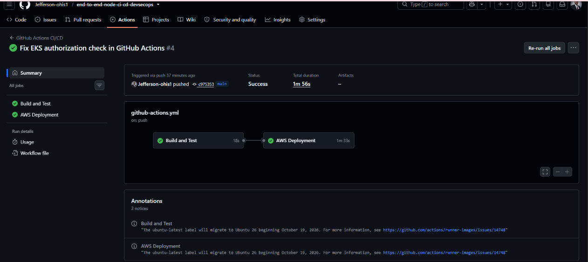

This evidence demonstrates the transition from the Phase 10 OIDC foundation into actual container image publishing and Kubernetes application deployment.

---

# 21. ECR Image Push

The workflow authenticated to Amazon ECR and pushed the Docker image using the GitHub commit SHA as the image tag.

The image was pushed to:

```text
615300991839.dkr.ecr.us-east-1.amazonaws.com/node-devsecops-phase10-repository
```

The image tag was:

```text
c97535309874695d6a8de6cb2b5c4d32bff55648
```

The verified image digest was:

```text
sha256:4a3f65caaea7e2b9012e162368684e6d254a30f93061f928fe76d1544ba02941
```

The ECR evidence was captured in:

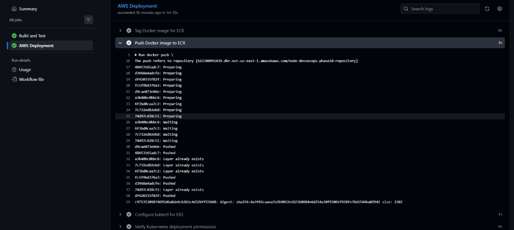

The repository was configured with:

```text
Scan on push: true
Encryption: AES256
Image tag mutability: MUTABLE
```

---

# 22. ECR Image Traceability

The completed image traceability model is:

```text
Git commit
     ↓
GitHub Actions run
     ↓
Docker image
     ↓
ECR image tag
     ↓
EKS Deployment
```

Using:

```text
${GITHUB_SHA}
```

as the image tag associates the deployed container with the source commit that triggered the workflow.

This provides a direct deployment reference rather than relying only on a generic tag such as:

```text
latest
```

---

# 23. EKS Authentication and Kubernetes Authorization

GitHub Actions configures `kubectl` using:

```bash
aws eks update-kubeconfig \
  --region "${AWS_REGION}" \
  --name "${EKS_CLUSTER_NAME}"
```

The workflow then verifies the Kubernetes permissions required for application deployment.

The relevant checks are:

```text
create deployments -n default
create services -n default
create horizontalpodautoscalers -n default
```

The checks returned:

```text
yes
```

This verifies the application deployment authorization boundary.

## Cluster-scoped node permissions

The GitHub Actions role was also explicitly tested against the cluster-scoped node resource:

```bash
kubectl auth can-i list nodes
```

The result was:

```text
no
```

This result is expected under the intended authorization model.

Kubernetes `nodes` are cluster-scoped resources, while the GitHub Actions EKS access policy is intentionally restricted to:

```text
default
```

Therefore:

```text
GitHub Actions role
        ↓
default namespace
        ↓
application resources
```

does not imply:

```text
GitHub Actions role
        ↓
cluster-wide resources
        ↓
nodes
```

Node listing is not required for the application CI/CD workflow.

The workflow therefore does **not** perform:

```bash
kubectl get nodes
```

as an application deployment requirement.

This avoids broadening the GitHub Actions role simply to obtain cluster-wide read access that the deployment workflow does not need.

---

# 24. Kubernetes Deployment

The application was deployed using the rendered image:

```text
615300991839.dkr.ecr.us-east-1.amazonaws.com/node-devsecops-phase10-repository:c97535309874695d6a8de6cb2b5c4d32bff55648
```

The workflow rendered the Kubernetes deployment manifest by replacing:

```text
IMAGE_PLACEHOLDER
```

with the ECR image reference.

The deployment was then applied with:

```bash
kubectl apply -f /tmp/deployment-rendered.yaml
kubectl apply -f k8s/service.yaml
kubectl apply -f k8s/hpa.yaml
```

---

# 25. Deployment Rollout Verification

The workflow waited for the deployment to become ready using:

```bash
kubectl rollout status \
  deployment/node-monitoring-app \
  --timeout=180s
```

The rollout completed successfully.

The deployment reached:

```text
2/2 available
```

The pods were verified as:

```text
Running
```

with zero restarts during the verification.

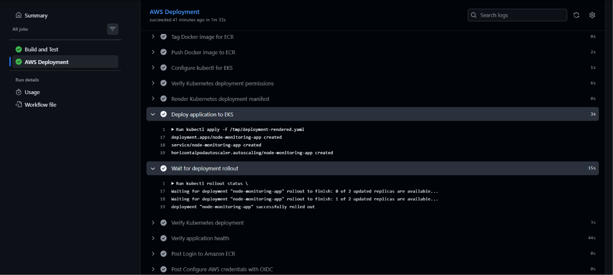

---

# 26. Kubernetes LoadBalancer Service

The application was exposed using:

```yaml
type: LoadBalancer
```

The service was:

```text
node-monitoring-app
```

The AWS LoadBalancer was provisioned successfully and exposed the application externally.

The verified service evidence is:

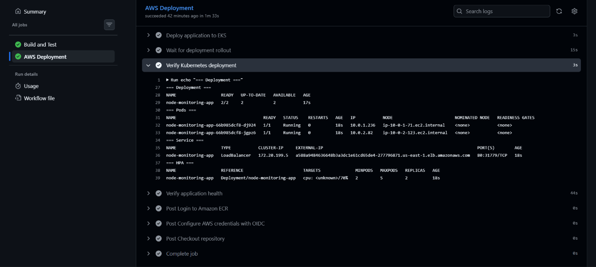

The LoadBalancer endpoint was used for external application verification.

---

# 27. Application Health Verification

The GitHub Actions workflow included an application health verification loop.

It waited for the LoadBalancer endpoint to become available and then requested:

```text
/health
```

The endpoint returned:

```text
ok
```

The workflow therefore reported:

```text
Application health check passed.
```

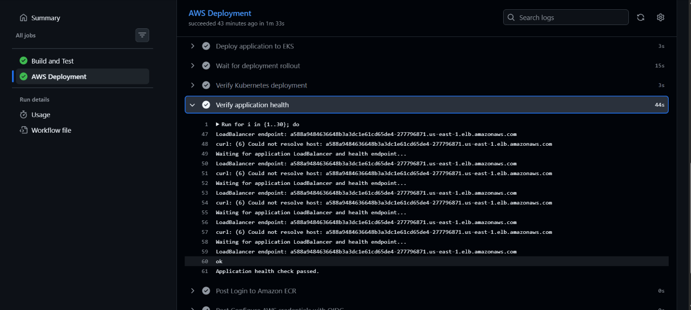

The verified request path was:

```text
Internet
   ↓
AWS LoadBalancer
   ↓
Kubernetes Service
   ↓
Pod
   ↓
Node.js application
   ↓
/health
```

---

# 28. Browser Application Verification

The application was also verified through the externally accessible LoadBalancer endpoint in a browser.

The application rendered successfully and displayed:

```text
🚀 DevOps Monitoring App
```

The application also exposed links to:

```text
/health
/metrics
```

The browser verification evidence is:

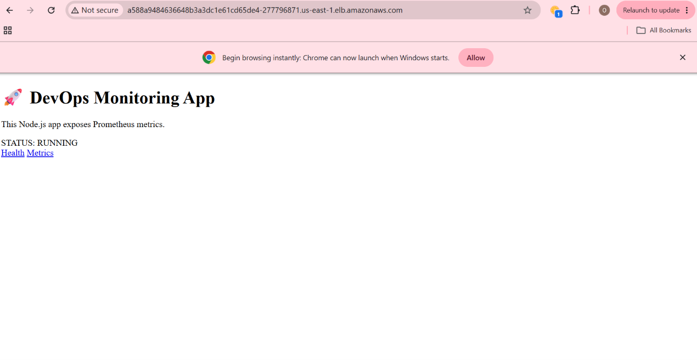

This provides a second verification layer beyond the command-line health check.

---

# 29. Kubernetes HPA

The Kubernetes deployment includes:

```text
k8s/hpa.yaml
```

The HPA configuration specifies:

```text
Minimum replicas: 2
Maximum replicas: 5
CPU target: 70%
```

The HPA was successfully created.

The initial verification showed:

```text
cpu: <unknown>/70%
```

The HPA object therefore existed successfully, but CPU utilization was not available through the Kubernetes Metrics API at that point.

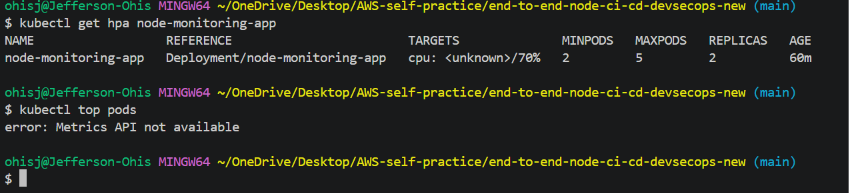

---

# 30. HPA Verification Boundary

The HPA result verified:

```text
HPA resource created
        ↓
Deployment referenced
        ↓
CPU target configured
        ↓
minReplicas = 2
        ↓
maxReplicas = 5
```

At the time of screenshot 11, the following was not yet available:

```text
Metrics Server
        ↓
Metrics API
        ↓
CPU utilization
        ↓
HPA metric evaluation
```

The Kubernetes commands:

```bash
kubectl top pods
kubectl top nodes
```

reported:

```text
error: Metrics API not available
```

Therefore screenshot 11 is historical evidence of the HPA resource existing **before the metrics platform dependency was available**.

It should not be interpreted as proof of functional CPU-based autoscaling.

---

# 31. Cluster Platform Layer — Metrics Server

Metrics Server is managed separately from the GitHub Actions application workflow.

The platform Terraform root is:

```text
infra-phase10-platform/
```

Its purpose is to manage Kubernetes platform infrastructure associated with the existing Phase 10 EKS cluster.

The platform layer contains:

```text
infra-phase10-platform/
├── provider.tf
├── variables.tf
├── metrics-server.tf
└── .terraform.lock.hcl
```

The platform layer uses:

```text
Terraform
   ↓
AWS EKS data sources
   ↓
Helm provider
   ↓
Metrics Server Helm chart
```

The EKS cluster must exist before this platform layer can be applied.

> **Implementation status:** Screenshots 12 and 13 document Metrics Server verification from the earlier live EKS environment, where Metrics Server was installed and verified independently. The current `infra-phase10-platform/` Terraform configuration is the reproducible codification of that platform responsibility. It has been formatted, initialized, and validated locally, but it has not yet been applied to a live EKS cluster because the Phase 10 AWS infrastructure has subsequently been destroyed.

---

# 32. Platform Terraform Providers

The platform Terraform configuration requires:

```hcl
terraform {
  required_version = ">= 1.6.0"

  required_providers {
    aws = {
      source  = "hashicorp/aws"
      version = "~> 6.0"
    }

    helm = {
      source  = "hashicorp/helm"
      version = "~> 3.0"
    }
  }
}
```

The validated provider selections for the current platform configuration were:

```text
hashicorp/aws v6.66.0
hashicorp/helm v3.3.0
```

The configuration was successfully initialized and validated with:

```bash
terraform -chdir=infra-phase10-platform init
terraform -chdir=infra-phase10-platform validate
```

Terraform validation returned:

```text
Success! The configuration is valid.
```

---

# 33. Platform Terraform Variables

The platform layer defines:

```text
AWS Region:
us-east-1
```

Existing EKS cluster:

```text
node-devsecops-phase10-cluster
```

Pinned Metrics Server Helm chart version:

```text
3.13.0
```

The relevant variables are:

```hcl
variable "aws_region" {
  description = "AWS region containing the Phase 10 EKS cluster."
  type        = string
  default     = "us-east-1"
}

variable "eks_cluster_name" {
  description = "Name of the existing Phase 10 EKS cluster."
  type        = string
  default     = "node-devsecops-phase10-cluster"
}

variable "metrics_server_chart_version" {
  description = "Pinned Metrics Server Helm chart version."
  type        = string
  default     = "3.13.0"
}
```

Pinning the chart version provides reproducibility instead of implicitly deploying whatever chart version happens to be current.

---

# 34. Metrics Server Helm Release

The platform layer manages Metrics Server using the Helm provider.

The Helm release is configured with:

```text
Release:
metrics-server

Repository:
https://kubernetes-sigs.github.io/metrics-server/

Chart:
metrics-server

Namespace:
kube-system

Chart version:
3.13.0
```

The configuration also specifies:

```text
replicas = 2
apiService.create = true
podDisruptionBudget.enabled = true
```

The intended platform flow is:

```text
EKS cluster
     ↓
Terraform platform root
     ↓
Helm provider
     ↓
Metrics Server
     ↓
Metrics API
```

Metrics Server installation is therefore no longer part of:

```text
.github/workflows/github-actions.yml
```

---

# 35. Why Metrics Server Is Outside GitHub Actions

Metrics Server is a cluster-level component rather than an application-specific deployment artifact.

Installing it from the application pipeline would require the application CI/CD identity to perform cluster-level platform administration.

That would create an unnecessary authorization requirement.

The chosen design instead separates:

```text
Application lifecycle
```

from:

```text
Cluster platform lifecycle
```

The application pipeline needs to deploy:

```text
Deployment
Service
HPA
```

The platform layer manages:

```text
Metrics Server
Metrics API
```

This allows the GitHub Actions IAM/EKS authorization boundary to remain limited to the application namespace.

---

# 36. Metrics Server and Metrics API Verification

The Metrics Server platform verification was subsequently completed independently of the GitHub Actions application deployment workflow.

The evidence is:

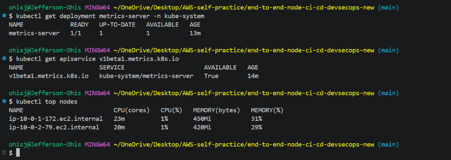

This evidence demonstrates the successful Metrics Server/API state captured after the initial HPA verification boundary.

The corresponding pod-level metrics evidence is:

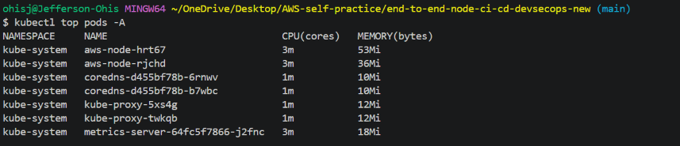

Together, screenshots 12 and 13 establish that the Kubernetes metrics platform was subsequently available.

They should be interpreted as **platform verification evidence**, not evidence that GitHub Actions installed Metrics Server.

---

# 37. Metrics Architecture

The Metrics Server dependency is:

```text
Kubernetes Nodes
      ↓
Metrics Server
      ↓
Metrics API
      ↓
HPA Controller
      ↓
CPU utilization
      ↓
Replica decision
```

This is separate from the application deployment path:

```text
GitHub Actions
      ↓
EKS authorization
      ↓
Deployment
      ↓
Service
      ↓
HPA
```

The HPA depends on the Metrics API for resource utilization data.

Therefore the logical dependency is:

```text
                    EKS
                     │
          ┌──────────┴──────────┐
          │                     │
          ▼                     ▼
 Application resources      Platform metrics
          │                     │
          ├── Deployment        └── Metrics Server
          ├── Service                 ↓
          └── HPA                 Metrics API
                                     │
                                     └── HPA metrics
```

---

# 38. Functional HPA Verification Boundary

The presence of Metrics Server and available metrics does not by itself prove that HPA scaling has occurred.

Functional HPA verification requires observing actual replica changes.

The intended verification flow is:

```text
Baseline
   ↓
2 replicas
   ↓
Generate controlled CPU load
   ↓
CPU utilization exceeds target
   ↓
HPA increases replicas
   ↓
Verify additional pods
   ↓
Stop load
   ↓
Observe stabilization period
   ↓
HPA reduces replicas
   ↓
Return to baseline
```

Therefore:

```text
HPA resource created
```

and:

```text
Metrics API available
```

are separate verification milestones from:

```text
HPA scale-up observed
```

and:

```text
HPA scale-down observed
```

The latter will only be marked complete after the actual scaling behavior has been observed and captured.

---

# 39. Security Model

Phase 10 uses multiple security boundaries.

## GitHub authentication

GitHub Actions authenticates using OIDC rather than long-lived AWS keys.

## AWS authorization

The GitHub Actions role provides the AWS permissions required by the application workflow.

## Kubernetes authorization

EKS Access Entry provides Kubernetes authorization independently from AWS IAM API permissions.

## EKS namespace scope

The GitHub Actions Kubernetes access policy is scoped to:

```text
default
```

rather than the entire cluster.

## ECR scope

Repository-specific ECR operations are restricted to the Phase 10 ECR repository.

## Platform administration

Metrics Server is managed separately through the platform Terraform/Helm layer rather than by the application deployment identity.

The resulting security model is:

```text
GitHub Actions
      ↓
OIDC
      ↓
IAM Trust Policy
      ↓
Dedicated IAM Role
      │
      ├──────────────► ECR
      │
      └──────────────► EKS API
                           │
                           ▼
                    EKS Access Entry
                           │
                           ▼
                  AmazonEKSEditPolicy
                           │
                           ▼
                    default namespace


Separate platform lifecycle
           │
           ▼
infra-phase10-platform
           │
           ▼
       Helm
           │
           ▼
    Metrics Server
```

---

# 40. Why OIDC Was Used

Using GitHub OIDC avoids the need to create and store long-lived AWS access keys in GitHub.

Instead:

```text
GitHub Actions
      ↓
OIDC token
      ↓
AWS validates token
      ↓
IAM trust policy
      ↓
Temporary credentials
```

The credentials are issued for the workflow session rather than being stored permanently in the repository.

The trust policy further restricts the role to the intended repository and `main` branch.

---

# 41. Why Cluster-Scoped Node Access Was Not Added

During troubleshooting, the actual GitHub Actions OIDC-assumed role was tested.

The identity was:

```text
arn:aws:sts::615300991839:assumed-role/node-devsecops-phase10-github-actions-role/GitHubActions-35809314216
```

The Kubernetes identity was associated with:

```text
system:authenticated
```

The cluster-scoped permission test:

```bash
kubectl auth can-i list nodes
```

returned:

```text
no
```

This result was retained as an authorization boundary rather than treated as a reason to broaden the role.

The application deployment workflow does not require:

```text
list nodes
```

because its required Kubernetes resources are namespace-scoped application resources.

The relevant permissions are:

```text
create deployments -n default
create services -n default
create horizontalpodautoscalers -n default
```

which were verified as:

```text
yes
```

The final authorization model therefore deliberately avoids granting the application CI/CD identity unnecessary cluster-wide permissions.

---

# 42. Application CI/CD vs Platform Responsibilities

The final responsibility boundary is:

| Responsibility                    | Application CI/CD | Platform Layer |
| --------------------------------- | ----------------: | -------------: |
| Git checkout                      |                 ✅ |                |
| Node.js setup                     |                 ✅ |                |
| npm install                       |                 ✅ |                |
| Jest tests                        |                 ✅ |                |
| Docker build                      |                 ✅ |                |
| ECR login/push                    |                 ✅ |                |
| EKS authentication                |                 ✅ |                |
| Application Deployment            |                 ✅ |                |
| Application Service               |                 ✅ |                |
| Application HPA                   |                 ✅ |                |
| Metrics Server                    |                   |              ✅ |
| Metrics API                       |                   |              ✅ |
| Cluster-level platform components |                   |              ✅ |
| EKS infrastructure                |                   |              ✅ |
| VPC/networking                    |                   |              ✅ |
| IAM/OIDC infrastructure           |                   |              ✅ |

This separation is the central architectural improvement to the final Phase 10 design.

---

# 43. Cost-Conscious Infrastructure Lifecycle

Phase 10 infrastructure was temporary.

The environment was provisioned specifically for:

```text
Implementation
      ↓
Verification
      ↓
Evidence capture
      ↓
Teardown
```

After the ECR/EKS deployment verification was completed, the AWS infrastructure was destroyed.

The final Terraform state for the AWS infrastructure root was verified to be empty:

```bash
terraform -chdir=infra-phase10 state list
```

The command returned no resources.

The VPC was also verified to no longer exist through AWS.

The temporary AWS environment was therefore removed after the implementation and verification activities.

The separate `infra-phase10-platform/` directory remains a **reproducible configuration layer** for Metrics Server when the Phase 10 EKS environment is recreated. It does not imply that the destroyed EKS cluster currently exists.

---

# 44. Phase 10 Teardown Lessons

The Phase 10 teardown exposed several AWS dependency relationships.

The initial destroy encountered:

```text
ECR RepositoryNotEmptyException
```

because the ECR repository still contained deployment images.

The repository images were removed before the repository was deleted.

The VPC teardown also encountered dependencies from the Kubernetes LoadBalancer.

The LoadBalancer was identified from its AWS-managed ENIs and deleted.

An orphaned Kubernetes ELB security group also remained after the LoadBalancer deletion and was removed before the VPC could be deleted.

The final teardown sequence was:

```text
ECR
  ↓
deleted

LoadBalancer
  ↓
deleted

ELB ENIs
  ↓
deleted

ELB security group
  ↓
deleted

Subnets
  ↓
deleted

Internet Gateway
  ↓
deleted

VPC
  ↓
deleted
```

This demonstrates why AWS infrastructure teardown should be verified rather than assuming that deleting the primary Kubernetes resources immediately removes every dependent AWS resource.

---

# 45. Evidence Index

All Phase 10 evidence is stored under:

```text
screenshots/10-github-actions-ci-cd/
```

| Evidence                               | Screenshot                                 |
| -------------------------------------- | ------------------------------------------ |
| Terraform Phase 10 plan                | `01-github-actions-terraform-plan.png`     |
| GitHub repository secret               | `02-github-repository-secret-config.png`   |
| Initial GitHub Actions success         | `03-github-actions-success.png`            |
| Initial AWS Deployment job             | `04-aws-deployment-successful-job.png`     |
| ECR + EKS successful deployment        | `05-github-actions-ecr-eks-success.png`    |
| ECR SHA-tagged image                   | `06-ecr-sha-tagged-image.png`              |
| EKS deployment and pods                | `07-eks-deployment-and-pods.png`           |
| EKS LoadBalancer service               | `08-eks-loadbalancer-service.png`          |
| Application `/health` verification     | `09-application-health.png`                |
| Browser application verification       | `10-application-health-browser-render.png` |
| HPA creation / Metrics API unavailable | `11-hpa-created-metrics-unavailable.png`   |
| Metrics Server and Metrics API success | `12-metrics-server-and-api-success.png`    |
| Metrics Server pod metrics             | `13-metrics-server-pod-metrics.png`        |

---

# 46. Phase 10 Verification Matrix

| Area                                 | Status                               |
| ------------------------------------ | ------------------------------------ |
| GitHub Actions workflow              | ✅ Verified                           |
| Node.js CI                           | ✅ Verified                           |
| npm dependency installation          | ✅ Verified                           |
| Jest tests                           | ✅ Verified                           |
| Docker image build                   | ✅ Verified                           |
| GitHub OIDC provider                 | ✅ Verified                           |
| Immutable OIDC subject               | ✅ Verified                           |
| IAM trust relationship               | ✅ Verified                           |
| GitHub repository secret             | ✅ Configured                         |
| AWS role assumption                  | ✅ Verified                           |
| AWS identity                         | ✅ Verified                           |
| ECR repository access                | ✅ Verified                           |
| ECR authentication                   | ✅ Verified                           |
| ECR image push                       | ✅ Verified                           |
| Commit SHA image tagging             | ✅ Verified                           |
| EKS API cluster discovery            | ✅ Verified                           |
| EKS Access Entry                     | ✅ Verified                           |
| Namespace application authorization  | ✅ Verified                           |
| Cluster-scoped node listing          | Not granted / not required           |
| EKS application deployment           | ✅ Verified                           |
| Deployment rollout                   | ✅ Verified                           |
| Pods running                         | ✅ Verified                           |
| LoadBalancer service                 | ✅ Verified                           |
| `/health` endpoint                   | ✅ Verified                           |
| Browser application rendering        | ✅ Verified                           |
| HPA resource creation                | ✅ Verified                           |
| Metrics Server platform verification | ✅ Evidenced                          |
| Metrics API availability             | ✅ Evidenced                          |
| Pod metrics                          | ✅ Evidenced                          |
| Functional HPA scale-up              | ⏳ Requires observed scaling evidence |
| Functional HPA scale-down            | ⏳ Requires observed scaling evidence |
| AWS teardown                         | ✅ Verified                           |

---

# 47. Phase 10 Evidence Interpretation

The evidence should be interpreted chronologically.

## Application deployment evidence

Screenshots 01–10 document the progression from Terraform planning and GitHub Actions configuration through:

```text
CI
 ↓
OIDC
 ↓
AWS
 ↓
ECR
 ↓
EKS
 ↓
Kubernetes
 ↓
LoadBalancer
 ↓
Application
```

## HPA boundary evidence

Screenshot 11 documents:

```text
HPA created
+
Metrics unavailable
```

It therefore establishes the initial HPA state without overstating autoscaling functionality.

## Platform verification evidence

Screenshots 12 and 13 document the subsequent Metrics Server and Metrics API state:

```text
Metrics Server
      ↓
Metrics API
      ↓
Pod/node metrics
```

These screenshots belong to the cluster-platform verification layer.

They do not imply that the GitHub Actions application role installed Metrics Server.

---

# 48. Phase 10 Completion Boundary

The completed application deployment work established:

```text
GitHub
   ↓
GitHub Actions
   ↓
OIDC
   ↓
AWS IAM
   ↓
ECR
   ↓
EKS
   ↓
Kubernetes
   ↓
LoadBalancer
   ↓
Node.js application
```

The cluster platform extension established:

```text
EKS
   ↓
Metrics Server
   ↓
Metrics API
   ↓
Resource metrics
```

The HPA resource exists and can depend on the Metrics API.

However, functional autoscaling should remain a separate completion criterion until actual scale-up and scale-down behavior is observed and captured.

This distinction prevents the documentation from treating:

```text
HPA object exists
```

as equivalent to:

```text
HPA has demonstrably scaled the application.
```

---

# 49. Final Target Architecture

The final Phase 10 architecture separates application delivery from cluster platform management.

```text
                         GitHub Repository
                                │
                                │ push to main
                                ▼
                    ┌─────────────────────────┐
                    │     GitHub Actions      │
                    │                         │
                    │ Checkout                │
                    │ Node.js 24              │
                    │ npm ci                  │
                    │ Jest                    │
                    │ Docker build            │
                    └───────────┬─────────────┘
                                │
                                ▼
                         GitHub OIDC
                                │
                                ▼
                        AWS IAM Role
                         │          │
                         │          │
                         ▼          ▼
                       ECR         EKS
                        │           │
                        │           ▼
                        │    EKS Access Entry
                        │           │
                        │           ▼
                        │    AmazonEKSEditPolicy
                        │           │
                        │           ▼
                        │      default namespace
                        │           │
                        │      ┌────┴─────┐
                        │      │          │
                        │      ▼          ▼
                        │ Deployment   Service
                        │                 │
                        │                 ▼
                        │                HPA
                        │                 │
                        │                 │
                        └─────────────────┘

                              EKS Cluster
                                  │
                                  │ separate platform lifecycle
                                  ▼
                       infra-phase10-platform/
                                  │
                                  ▼
                                Helm
                                  │
                                  ▼
                          Metrics Server
                                  │
                                  ▼
                           Metrics API
                                  │
                                  ▼
                         HPA resource metrics
```

The important security boundary is:

```text
GitHub Actions
      │
      └── application deployment
               │
               └── default namespace

Platform layer
      │
      └── cluster platform
               │
               └── Metrics Server
```

---

# 50. Phase 10 Takeaway

Phase 10 demonstrates the transition from the previously established Jenkins-based DevSecOps pipeline to a GitHub Actions-based CI/CD implementation.

The implementation demonstrates that GitHub Actions can:

* execute Node.js CI;
* run Jest tests;
* build the Docker image;
* authenticate to AWS through OIDC;
* assume a dedicated IAM role;
* use temporary AWS credentials;
* authenticate to Amazon ECR;
* push a commit-SHA-tagged image;
* authenticate to Amazon EKS;
* use EKS Access Entry authorization;
* deploy Kubernetes application resources;
* wait for deployment rollout;
* expose the application through a LoadBalancer;
* verify the application externally; and
* create and verify an HPA resource.

The platform architecture separately demonstrates how Metrics Server can be managed as cluster infrastructure rather than being installed by the application CI/CD identity.

This results in a cleaner responsibility boundary:

```text
Application CI/CD
        +
Cluster Platform
```

rather than requiring the GitHub Actions deployment identity to administer cluster-level platform components.

The temporary AWS environment was destroyed after verification to prevent unnecessary ongoing AWS costs.

---

# 51. Final Phase 10 Objective

The final Phase 10 objective is:

```text
Secure GitHub Actions CI/CD
          +
AWS OIDC federation
          +
ECR image publishing
          +
EKS application deployment
          +
Kubernetes service exposure
          +
HPA resource
          +
Separate Metrics Server platform management
          +
Metrics API verification
          +
Reproducible cluster-platform configuration
```

Functional HPA scale-up and scale-down remain an explicit verification boundary and will only be marked complete after actual scaling behavior has been observed and captured.

The resulting Phase 10 architecture demonstrates a complete, security-conscious separation between:

```text
Source-code delivery
        ↓
Application CI/CD
        ↓
Container publishing
        ↓
Kubernetes application deployment
```

and:

```text
Cluster infrastructure
        ↓
Platform components
        ↓
Metrics API
        ↓
Autoscaling dependency
```

This establishes a reproducible GitHub Actions CI/CD architecture while avoiding unnecessary cluster-wide permissions for the application deployment identity.
