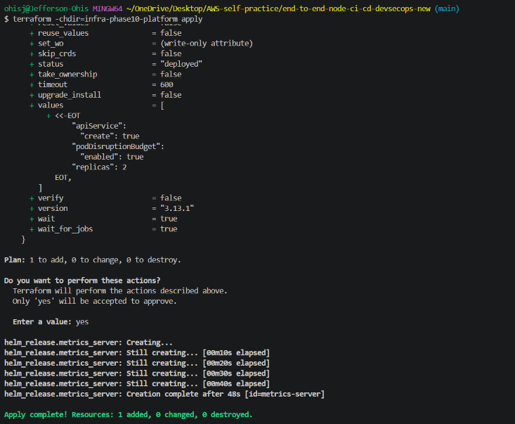
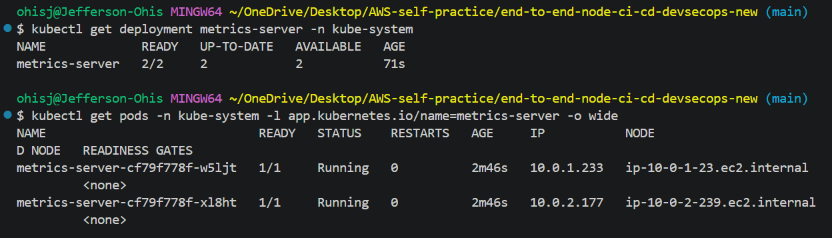
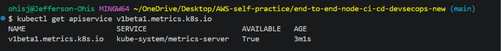
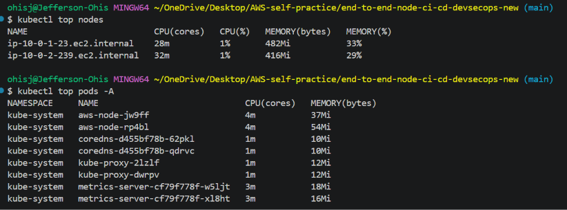

# Phase 11 — Complete DevSecOps Platform

## Overview

Phase 11 extends the DevSecOps platform by introducing a dedicated Kubernetes platform layer for the existing Amazon EKS environment.

The platform layer is intentionally separated from the application deployment workflow. Terraform manages Kubernetes platform components independently, while GitHub Actions remains responsible for the application CI/CD workflow.

This phase establishes and verifies Metrics Server as the Kubernetes resource-metrics provider required for Horizontal Pod Autoscaling (HPA) and related workload observability.

### Phase 11 objectives

* Verify the recreated EKS infrastructure.
* Verify GitHub Actions AWS IAM/OIDC authorization.
* Create a dedicated Terraform platform layer.
* Provision Metrics Server through the Terraform Helm provider.
* Pin the Metrics Server Helm chart version for reproducibility.
* Verify the Kubernetes Metrics API.
* Verify live node and pod resource metrics.
* Capture reproducible evidence before proceeding to application deployment.

---

## 1. Phase 11 Architecture

```text
GitHub Actions
      │
      │ AWS OIDC
      ▼
IAM / EKS Access Entry
      │
      ▼
Amazon EKS
node-devsecops-phase10-cluster
      │
      ├── Worker Node 1
      │
      ├── Worker Node 2
      │
      └── kube-system
            │
            └── Metrics Server
                 ├── Replica 1
                 └── Replica 2
                       │
                       ▼
              Kubernetes Metrics API
                       │
                ┌──────┴──────┐
                ▼             ▼
          kubectl top     HPA metrics
```

The platform resources are maintained separately under:

```text
infra-phase10-platform/
├── metrics-server.tf
├── provider.tf
└── variables.tf
```

---

## 2. Existing EKS Foundation Verification

Before provisioning the platform layer, the recreated EKS environment was verified.

### EKS cluster

```text
Cluster: node-devsecops-phase10-cluster
Region: us-east-1
Status: ACTIVE
Kubernetes: v1.33.13
```

### Worker nodes

The cluster contained two worker nodes, both reporting:

```text
STATUS: Ready
```

The nodes were running Amazon Linux 2023 and Kubernetes `v1.33.13-eks-f4fc4f1`.

### ECR

The Phase 10 ECR repository was also verified:

```text
node-devsecops-phase10-repository
```

This confirmed that the AWS foundation required for the subsequent application deployment workflow was available.

---

## 3. GitHub Actions Authorization Verification

The GitHub Actions AWS authorization chain was verified before platform provisioning.

### IAM role

```text
arn:aws:iam::615300991839:role/node-devsecops-phase10-github-actions-role
```

The role exists and is available for GitHub Actions authentication.

### GitHub OIDC provider

```text
token.actions.githubusercontent.com
```

The configured client ID/audience was:

```text
sts.amazonaws.com
```

### EKS access entry

The GitHub Actions IAM role was verified as an EKS access entry with:

```text
Type: STANDARD
```

This establishes the intended authorization path:

```text
GitHub Actions
      │
      ▼
GitHub OIDC
      │
      ▼
AWS STS
      │
      ▼
GitHub Actions IAM Role
      │
      ▼
EKS Access Entry
      │
      ▼
EKS Cluster
```

---

## 4. Metrics Server Baseline

Before Terraform provisioning, Metrics Server was intentionally absent from the recreated cluster.

The following checks established the baseline:

```text
kubectl get deployment metrics-server -n kube-system
```

Result:

```text
Error from server (NotFound): deployments.apps "metrics-server" not found
```

The Metrics Server pod check returned:

```text
No resources found in kube-system namespace.
```

The Metrics API was also unavailable:

```text
kubectl top nodes

error: Metrics API not available
```

This confirmed that the platform layer had not yet been provisioned.

---

## 5. Terraform Platform Layer

The dedicated platform layer uses Terraform and the Helm provider.

### `provider.tf`

The Helm provider connects to the existing EKS cluster using the cluster endpoint, certificate authority, and EKS authentication token obtained through Terraform data sources.

The platform layer does not recreate the EKS cluster.

Instead, it targets the existing:

```text
node-devsecops-phase10-cluster
```

### `variables.tf`

The platform configuration defines:

```text
AWS Region:
us-east-1

EKS Cluster:
node-devsecops-phase10-cluster

Metrics Server Helm Chart:
3.13.1
```

The Metrics Server Helm chart version is explicitly pinned for reproducibility.

### `metrics-server.tf`

Terraform manages:

```text
helm_release.metrics_server
```

with the official Metrics Server Helm repository.

The release configuration includes:

```text
Chart: metrics-server
Chart version: 3.13.1
Namespace: kube-system
Replicas: 2
APIService: enabled
PodDisruptionBudget: enabled
Wait: enabled
Timeout: 600 seconds
```

The Terraform configuration pins the Metrics Server Helm chart to **version `3.13.1`**. This chart release packages **Metrics Server `v0.8.1`**.

Terraform's plan and state therefore verify the Helm chart version (`3.13.1`), while the Metrics Server application version is the version packaged by that chart (`v0.8.1`).

---

## 6. Terraform Validation and Planning

Before provisioning, Terraform formatting and configuration validation were completed successfully.

```text
terraform -chdir=infra-phase10-platform fmt -check
```

Result:

```text
Passed
```

Terraform validation:

```text
terraform -chdir=infra-phase10-platform validate
```

Result:

```text
Success! The configuration is valid.
```

The Terraform plan reported:

```text
Plan: 1 to add, 0 to change, 0 to destroy.
```

The planned resource was:

```text
helm_release.metrics_server
```

with chart version:

```text
3.13.1
```

No existing infrastructure was scheduled for modification or destruction.

---

## 7. Terraform Apply

The platform layer was provisioned successfully with:

```text
terraform -chdir=infra-phase10-platform apply
```

Terraform reported:

```text
Apply complete! Resources: 1 added, 0 changed, 0 destroyed.
```

The created resource was:

```text
helm_release.metrics_server
```

### Evidence



---

## 8. Metrics Server Deployment Verification

After Terraform provisioning, the Metrics Server deployment was verified:

```text
kubectl get deployment metrics-server -n kube-system
```

Result:

```text
NAME             READY   UP-TO-DATE   AVAILABLE
metrics-server   2/2     2            2
```

Both Metrics Server replicas were running.

The pods were distributed across the two EKS worker nodes:

```text
metrics-server-cf79f778f-w5lj
Node: ip-10-0-1-23.ec2.internal

metrics-server-cf79f778f-xl8ht
Node: ip-10-0-2-239.ec2.internal
```

Both pods reported:

```text
READY: 1/1
STATUS: Running
RESTARTS: 0
```

### Evidence



---

## 9. Kubernetes Metrics API Verification

The Metrics APIService was verified with:

```text
kubectl get apiservice v1beta1.metrics.k8s.io
```

Result:

```text
NAME                     SERVICE                      AVAILABLE
v1beta1.metrics.k8s.io   kube-system/metrics-server   True
```

The `AVAILABLE` status of `True` confirms that the Kubernetes API aggregation layer can successfully reach Metrics Server.

### Evidence



---

## 10. Live Node Metrics Verification

The node metrics API was verified using:

```text
kubectl top nodes
```

The command successfully returned live CPU and memory measurements for both worker nodes.

Example captured values:

```text
ip-10-0-1-23.ec2.internal
CPU: 28m
CPU: 1%
Memory: 482Mi
Memory: 33%

ip-10-0-2-239.ec2.internal
CPU: 32m
CPU: 1%
Memory: 416Mi
Memory: 29%
```

This confirms that Metrics Server is successfully collecting and exposing node resource metrics.

### Evidence



---

## 11. Live Pod Metrics Verification

Pod-level metrics were also verified with:

```text
kubectl top pods -A
```

The command successfully returned resource measurements for Kubernetes system workloads, including both Metrics Server replicas.

Example:

```text
kube-system   metrics-server-cf79f778f-w5lj   3m   18Mi
kube-system   metrics-server-cf79f778f-xl8ht   3m   16Mi
```

This confirms that the Metrics API is providing resource measurements at both node and pod levels.

---

## 12. Phase 11 Verification Summary

| Component                   | Verification                           | Result |
| --------------------------- | -------------------------------------- | ------ |
| EKS cluster                 | `describe-cluster`                     | PASS   |
| Worker nodes                | `kubectl get nodes`                    | PASS   |
| ECR repository              | `aws ecr describe-repositories`        | PASS   |
| IAM role                    | `aws iam get-role`                     | PASS   |
| GitHub OIDC provider        | `aws iam get-open-id-connect-provider` | PASS   |
| EKS access entry            | `aws eks describe-access-entry`        | PASS   |
| Terraform formatting        | `terraform fmt -check`                 | PASS   |
| Terraform validation        | `terraform validate`                   | PASS   |
| Terraform plan              | `1 to add, 0 to change, 0 to destroy`  | PASS   |
| Metrics Server Helm release | Terraform apply                        | PASS   |
| Metrics Server replicas     | `2/2 Ready`                            | PASS   |
| Metrics APIService          | `AVAILABLE=True`                       | PASS   |
| Node metrics                | `kubectl top nodes`                    | PASS   |
| Pod metrics                 | `kubectl top pods -A`                  | PASS   |

---

## 13. Platform Layer Outcome

The Phase 11 platform layer successfully establishes a reproducible Kubernetes metrics foundation using Terraform.

The resulting platform provides:

```text
Terraform
   │
   ▼
Helm Metrics Server chart 3.13.1
   │
   ▼
Metrics Server v0.8.1
   │
   ▼
metrics.k8s.io API
   │
   ├── Node metrics ✓
   └── Pod metrics  ✓
```

The implementation is separate from the application deployment workflow, allowing the platform dependency to be provisioned and verified independently.

This avoids relying on a manual Metrics Server installation and makes the platform configuration reproducible through infrastructure as code.

---

## 14. Next Phase

With the EKS foundation, GitHub Actions authorization, and Kubernetes Metrics API now verified, the next stage is the application deployment workflow.

The GitHub Actions workflow will be responsible for the application delivery path:

```text
GitHub Actions
      │
      ├── Node.js setup
      ├── npm ci
      ├── Jest
      ├── Docker build
      ├── AWS OIDC authentication
      ├── ECR authentication
      ├── Docker image push
      ├── EKS authentication
      ├── Kubernetes deployment
      ├── Service
      ├── HPA
      ├── rollout verification
      └── application health verification
```

Metrics Server will remain a separately managed platform dependency.

The GitHub Actions deployment should therefore consume the already-provisioned EKS platform rather than installing Metrics Server as part of the application workflow.

---

## 15. Evidence Files

Phase 11 evidence is stored under:

```text
screenshots/11-complete-devsecops-platform/
```

Captured evidence:

```text
01-terraform-apply-success.png
02-metrics-server-deployment-pods.png
03-metrics-api.png
04-live-metrics.png
```
