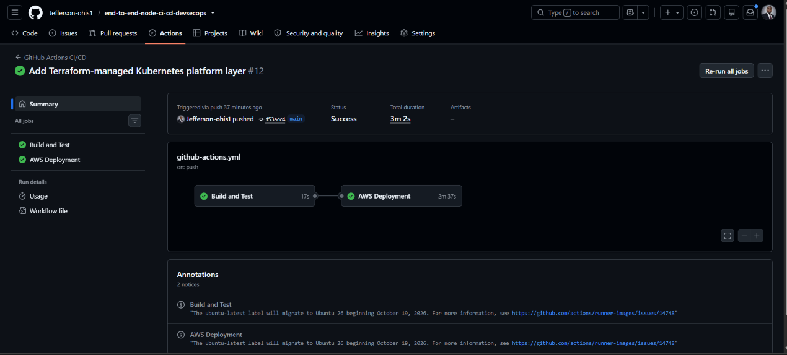
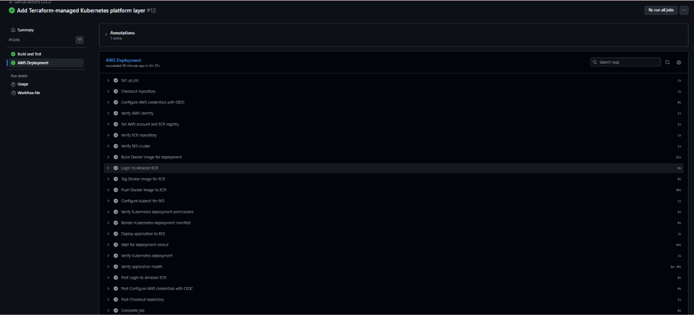
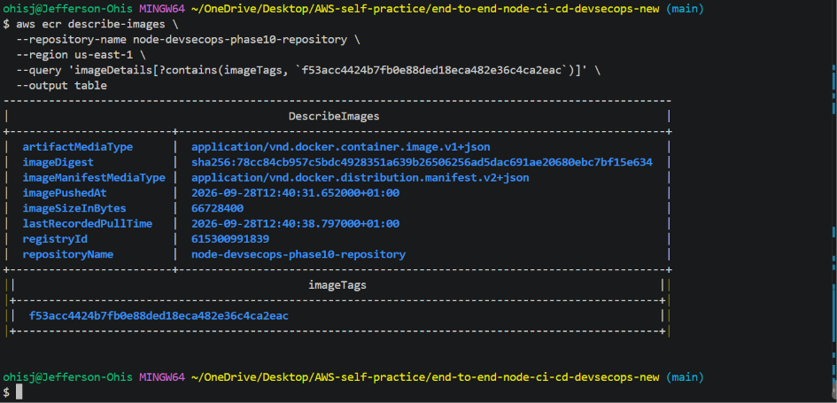
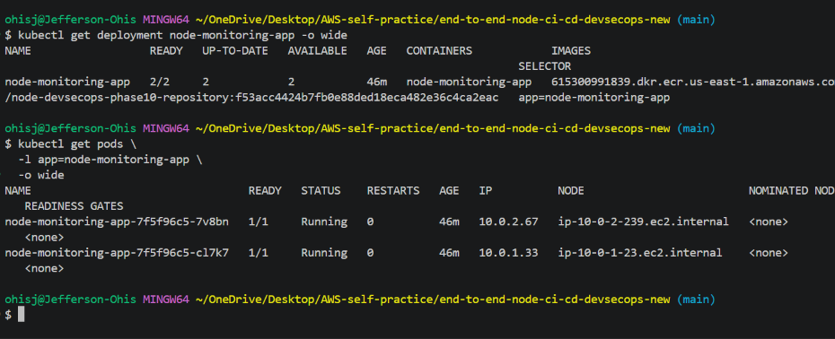
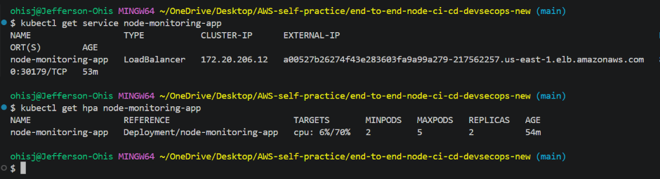
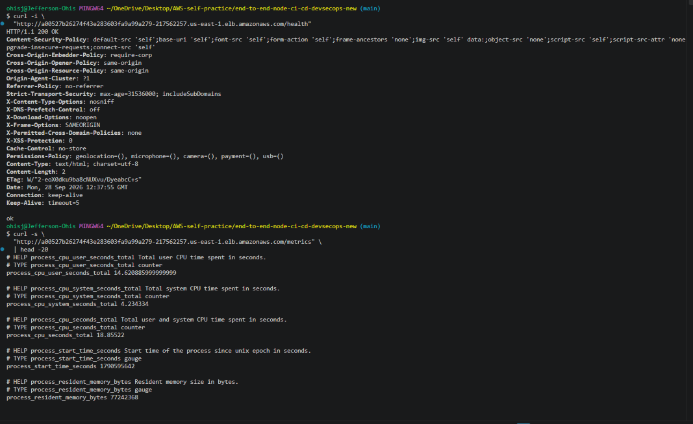
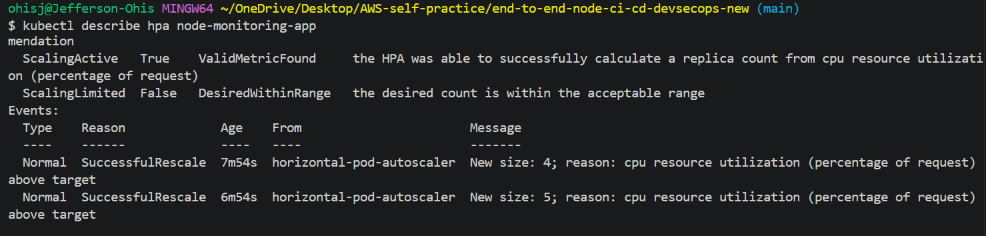
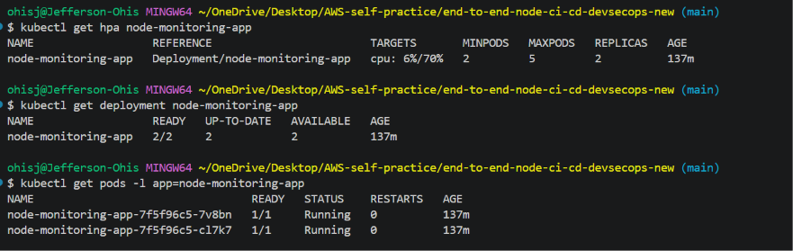

# Phase 11 — Complete DevSecOps Platform

## Overview

Phase 11 is the final integration, runtime-validation, and infrastructure-lifecycle phase of the Node.js CI/CD and DevSecOps project.

The phase brings together the previously implemented application, Jenkins CI/CD, DevSecOps security controls, repository governance, GitHub Actions CI/CD, Amazon ECR, Amazon EKS, Kubernetes, Terraform, Helm, Metrics Server, and Horizontal Pod Autoscaling.

A key architectural decision in Phase 11 is the separation of:

* **Application CI/CD responsibilities**
* **Cluster-platform responsibilities**

GitHub Actions is responsible for application delivery, while Terraform and Helm manage the Kubernetes platform dependency required for resource metrics.

The Phase 11 environment was intentionally temporary. It was:

1. Recreated from Infrastructure as Code.
2. Validated.
3. Used for live application deployment and runtime testing.
4. Used for functional HPA testing.
5. Documented with screenshots.
6. Destroyed after validation.
7. Independently verified as removed.

Therefore, this document describes a **verified Phase 11 architecture and runtime experiment**, not an AWS environment that remains continuously deployed.

The final Phase 11 lifecycle was:

```text
Infrastructure Recreation
        │
        ▼
Platform Configuration
        │
        ▼
Metrics Server
        │
        ▼
Metrics API
        │
        ▼
GitHub Actions Application Delivery
        │
        ▼
Amazon ECR
        │
        ▼
Amazon EKS
        │
        ▼
Kubernetes Application
        │
        ▼
Application Health
        │
        ▼
Application Metrics
        │
        ▼
Functional HPA Test
        │
        ├── Scale Up: 2 → 4 → 5
        │
        └── Scale Down: 5 → 2
        │
        ▼
Evidence Capture
        │
        ▼
Terraform Destroy
        │
        ▼
Independent AWS Resource Verification
```

---

# 1. Phase 11 Objectives

The objectives of Phase 11 were to:

* Recreate the isolated Phase 10 AWS foundation.
* Verify infrastructure reproducibility.
* Verify the recreated Amazon EKS environment.
* Verify GitHub Actions AWS OIDC authorization.
* Establish a dedicated Terraform-managed Kubernetes platform layer.
* Manage Metrics Server through the Terraform Helm provider.
* Pin the Metrics Server Helm chart version.
* Verify the Kubernetes Metrics API.
* Verify live node and pod metrics.
* Deploy the application through GitHub Actions.
* Publish the application image to Amazon ECR.
* Deploy the application to Amazon EKS.
* Verify Kubernetes rollout and runtime health.
* Verify the application `/health` endpoint.
* Verify the application `/metrics` endpoint.
* Validate Horizontal Pod Autoscaling with controlled CPU load.
* Capture functional scale-up and scale-down evidence.
* Validate the complete infrastructure lifecycle.
* Destroy the temporary AWS environment.
* Independently verify that the Phase 11 AWS resources were removed.
* Document the final architecture and engineering outcome.

---

# 2. Phase 11 Architecture

Phase 11 uses two clearly separated infrastructure responsibilities.

## 2.1 Application CI/CD

```text
Developer
    │
    ▼
GitHub Repository
    │
    ▼
GitHub Actions
    │
    ├── Checkout
    ├── Node.js 24
    ├── npm ci
    ├── Jest
    ├── Docker Build
    └── Docker Verification
            │
            ▼
       GitHub OIDC
            │
            ▼
        AWS IAM Role
            │
       ┌────┴────┐
       ▼         ▼
      ECR       EKS
       │         │
       │         ▼
       │    Kubernetes
       │    Application
       │         │
       │    ┌────┼────┐
       │    ▼    ▼    ▼
       │ Deployment Service HPA
       │
       └── Container Image
```

## 2.2 Cluster Platform

```text
Amazon EKS
     │
     ▼
infra-phase10-platform/
     │
     ▼
Terraform
     │
     ▼
Helm Provider
     │
     ▼
Metrics Server
     │
     ▼
Metrics API
     │
     ▼
HPA Resource Metrics
```

This separation is intentional.

GitHub Actions does **not** install Metrics Server as part of application deployment.

Instead:

```text
Cluster Platform
      │
      └── Terraform + Helm
              │
              └── Metrics Server

Application CI/CD
      │
      └── GitHub Actions
              │
              ├── ECR
              └── EKS Application
```

This separates application deployment permissions from cluster-platform administration and avoids requiring the GitHub Actions workflow to manage cluster-level platform components.

---

# 3. Phase 11 AWS Foundation

The Phase 10 AWS foundation was recreated from:

```text
infra-phase10/
```

The recreated environment included:

```text
AWS VPC
   │
   ├── Networking
   ├── Security Groups
   ├── IAM
   ├── GitHub OIDC
   ├── ECR
   └── EKS
```

The recreated EKS cluster was:

```text
Cluster:
node-devsecops-phase10-cluster

Region:
us-east-1

Kubernetes:
v1.33.13

Status:
ACTIVE
```

Two worker nodes were verified as:

```text
STATUS:
Ready
```

The Phase 10 ECR repository was:

```text
node-devsecops-phase10-repository
```

The AWS foundation was subsequently destroyed after the Phase 11 runtime evidence was captured.

---

# 4. GitHub Actions Authorization

The GitHub Actions AWS authentication path was verified before application deployment.

```text
GitHub Actions
      │
      ▼
GitHub OIDC
      │
      ▼
AWS STS
      │
      ▼
Dedicated IAM Role
      │
      ▼
EKS Access Entry
      │
      ▼
Amazon EKS
```

The configured OIDC audience was:

```text
sts.amazonaws.com
```

The EKS access entry for the GitHub Actions role was verified as:

```text
Type:
STANDARD
```

The Kubernetes authorization model was scoped to the application deployment requirements in the `default` namespace.

The workflow verified permissions for:

```text
Deployments
Services
HorizontalPodAutoscalers
```

This avoided making the application CI/CD workflow dependent on broad cluster-administrator permissions.

---

# 5. Metrics Server Baseline

After the EKS cluster was recreated, Metrics Server was intentionally absent.

The baseline checks established:

```text
Metrics Server deployment:
Not found

Metrics Server pods:
Not found

kubectl top nodes:
Metrics API unavailable
```

This established a clean starting point for the Terraform-managed platform layer.

The purpose of this baseline was important: it demonstrated that Metrics Server was subsequently provisioned by the dedicated platform layer rather than being an existing dependency that happened to be present on the cluster.

---

# 6. Terraform-Managed Kubernetes Platform

The dedicated cluster-platform Terraform root is:

```text
infra-phase10-platform/
```

Its responsibility is to manage cluster-level platform components without recreating the EKS cluster itself.

The platform layer contains:

```text
infra-phase10-platform/
├── .terraform.lock.hcl
├── metrics-server.tf
├── provider.tf
└── variables.tf
```

The Helm provider connects to the existing EKS cluster through Terraform data sources.

The platform flow is:

```text
Existing EKS Cluster
        │
        ▼
Terraform Platform Root
        │
        ▼
Helm Provider
        │
        ▼
Metrics Server
        │
        ▼
Metrics API
```

---

# 7. Metrics Server Versioning

The Metrics Server Helm chart version was pinned to:

```text
3.13.1
```

The chart packages:

```text
Metrics Server v0.8.1
```

The distinction is:

```text
Helm Chart Version
        │
        ▼
3.13.1

Packaged Application Version
        │
        ▼
Metrics Server v0.8.1
```

Pinning the chart version improves reproducibility and prevents an unplanned chart-version change during a future Terraform apply.

---

# 8. Metrics Server Terraform Configuration

Terraform manages:

```text
helm_release.metrics_server
```

The release configuration uses:

```text
Chart:
metrics-server

Namespace:
kube-system

Chart version:
3.13.1

Replicas:
2

APIService:
Enabled

PodDisruptionBudget:
Enabled

Wait:
Enabled

Timeout:
600 seconds
```

The Metrics Server deployment is therefore treated as **platform infrastructure** rather than as part of the application deployment pipeline.

The intended platform dependency is:

```text
Terraform
   │
   ▼
Helm
   │
   ▼
Metrics Server
   │
   ▼
Metrics API
   │
   ▼
HPA
```

---

# 9. Terraform Validation

Before applying the platform layer, Terraform formatting and validation were performed.

## Formatting

```bash
terraform -chdir=infra-phase10-platform fmt -check
```

Result:

```text
Passed
```

## Validation

```bash
terraform -chdir=infra-phase10-platform validate
```

Result:

```text
Success! The configuration is valid.
```

## Plan

The platform plan reported:

```text
Plan: 1 to add, 0 to change, 0 to destroy.
```

The planned resource was:

```text
helm_release.metrics_server
```

This confirmed that the platform layer would add the intended Metrics Server release without modifying or destroying the existing EKS foundation.

---

# 10. Terraform Apply

The platform layer was successfully applied.

```text
Apply complete! Resources: 1 added, 0 changed, 0 destroyed.
```

The resource created was:

```text
helm_release.metrics_server
```

### Evidence


---

# 11. Metrics Server Deployment Verification

After Terraform applied the Helm release, the Metrics Server deployment was verified.

The deployment reported:

```text
READY:
2/2

UP-TO-DATE:
2

AVAILABLE:
2
```

Both replicas were running successfully.

The Metrics Server pods were distributed across the EKS worker nodes.

Both pods reported:

```text
READY:
1/1

STATUS:
Running

RESTARTS:
0
```

### Evidence


---

# 12. Kubernetes Metrics API Verification

The Metrics APIService was verified with:

```bash
kubectl get apiservice v1beta1.metrics.k8s.io
```

The APIService reported:

```text
AVAILABLE:
True
```

The resulting architecture was:

```text
Metrics Server
      │
      ▼
metrics.k8s.io API
      │
      ▼
Kubernetes Metrics API
```

This confirmed that the Kubernetes API aggregation layer could communicate successfully with Metrics Server.

### Evidence


---

# 13. Live Node and Pod Metrics

Node metrics were verified with:

```bash
kubectl top nodes
```

The command returned live CPU and memory measurements for the worker nodes.

Pod-level metrics were verified with:

```bash
kubectl top pods -A
```

The successful responses established that the Metrics API was providing resource measurements at both node and pod levels.

This was a critical prerequisite for the functional HPA experiment because the HPA depends on Kubernetes resource metrics.

### Evidence


---

# 14. GitHub Actions Application Delivery

After the Kubernetes platform was verified, the application delivery workflow was executed through GitHub Actions.

The workflow contains two jobs:

```text
Build and Test
       │
       ▼
AWS Deployment
```

## 14.1 Build and Test

The first job performs:

```text
Checkout
   │
   ▼
Node.js 24
   │
   ▼
npm ci
   │
   ▼
Jest
   │
   ▼
Docker Build
   │
   ▼
Docker Image Verification
```

The build-and-test job must succeed before the AWS deployment job begins.

## 14.2 AWS Deployment

The deployment job performs:

```text
AWS OIDC Authentication
        │
        ▼
AWS Identity Verification
        │
        ▼
ECR Verification
        │
        ▼
Docker Build
        │
        ▼
ECR Login
        │
        ▼
Image Tagging
        │
        ▼
ECR Push
        │
        ▼
EKS Authentication
        │
        ▼
Kubernetes Authorization
        │
        ▼
Deployment
        │
        ▼
Service
        │
        ▼
HPA
        │
        ▼
Rollout Verification
        │
        ▼
Application Health
```

The application workflow does not install Metrics Server.

That responsibility remains with:

```text
infra-phase10-platform/
```

### Evidence





---

# 15. ECR Image Traceability

The application image was tagged using the Git commit SHA.

The verified Phase 11 deployment used commit:

```text
f53acc4424b7fb0e88ded18eca482e36c4ca2eac
```

The image was published to the Phase 10 ECR repository:

```text
node-devsecops-phase10-repository
```

This establishes the relationship:

```text
Git Commit
     │
     ▼
Docker Image Tag
     │
     ▼
Amazon ECR
     │
     ▼
Amazon EKS Deployment
```

The deployed Kubernetes application image matched the verified Git commit.

### Evidence



---

# 16. Kubernetes Application Deployment

The application was deployed to Amazon EKS using the image stored in Amazon ECR.

The Kubernetes Deployment was:

```text
node-monitoring-app
```

The initial deployment successfully reached:

```text
2/2 Ready
```

The application pods were running successfully with zero restarts during baseline verification.

### Evidence



---

# 17. Kubernetes Service and HPA

The application was exposed through a Kubernetes `LoadBalancer` Service.

The application also used a Horizontal Pod Autoscaler.

The HPA configuration was:

```text
Minimum replicas:
2

Maximum replicas:
5

CPU target:
70%
```

The application container defined a CPU request of:

```text
100m
```

Therefore, the HPA evaluated CPU utilization relative to the configured CPU request.

The initial HPA state was:

```text
Minimum:
2

Maximum:
5

Current replicas:
2
```

### Evidence



---

# 18. Application Health and Metrics

The deployed application exposed:

```text
/health
/metrics
```

The `/health` endpoint returned:

```text
HTTP 200
ok
```

The `/metrics` endpoint returned Prometheus-compatible application metrics.

This verified that the application was not merely running at the Kubernetes level but was also responding successfully through its application endpoints.

The runtime chain was therefore:

```text
LoadBalancer Service
        │
        ▼
Application Pod
        │
        ├── /health
        │
        └── /metrics
```

### Evidence



---

# 19. Functional HPA Scale-Up Test

Creating an HPA resource is not the same as demonstrating functional autoscaling.

Phase 11 therefore included a controlled CPU-load experiment.

## 19.1 Baseline

The application initially ran with:

```text
2 replicas
```

The HPA configuration was:

```text
minReplicas:
2

maxReplicas:
5

CPU target:
70%
```

Metrics Server was already verified and supplying live pod metrics.

Therefore, the HPA had the metrics dependency required to make CPU-based scaling decisions.

## 19.2 CPU Workload Generation

The CPU workload was generated directly inside both application pods.

The historical pod names used during the test were:

```text
node-monitoring-app-7f5f96c5-7v8bn
node-monitoring-app-7f5f96c5-cl7k7
```

The first workload command was:

```bash
kubectl exec node-monitoring-app-7f5f96c5-7v8bn -- \
  node -e "const end=Date.now()+90000; while(Date.now()<end){}"
```

The second workload command was:

```bash
kubectl exec node-monitoring-app-7f5f96c5-cl7k7 -- \
  node -e "const end=Date.now()+90000; while(Date.now()<end){}"
```

Each command executes a CPU-intensive JavaScript loop for approximately **90 seconds** inside the application container.

### Why the workload was applied to both pods

The initial deployment contained two application replicas.

Applying the CPU workload to both pods increased CPU pressure across the existing application workload rather than relying on a single pod to generate the entire load.

This created a controlled experiment against the same CPU resource request used by the HPA.

The test relationship was:

```text
Application Pods
      │
      ▼
CPU Workload
      │
      ▼
Metrics Server
      │
      ▼
metrics.k8s.io
      │
      ▼
HPA Controller
      │
      ▼
Replica Adjustment
```

## 19.3 Observed Scale-Up

As CPU utilization increased above the configured 70% target, the HPA increased the replica count.

The observed progression was:

```text
2 replicas
    │
    ▼
CPU workload
    │
    ▼
CPU utilization rises above target
    │
    ▼
4 replicas
    │
    ▼
continued CPU pressure
    │
    ▼
5 replicas
```

The HPA events recorded:

```text
New size: 4
reason: cpu resource utilization above target

New size: 5
reason: cpu resource utilization above target
```

This provides direct runtime evidence that the HPA responded to CPU pressure supplied through the Metrics API.

### Evidence



---

# 20. Functional HPA Scale-Down Test

The workload commands were deliberately time-bounded to approximately 90 seconds.

There was therefore **no separate scale-down workload command**.

Once the commands completed:

```text
CPU workload ends
        │
        ▼
CPU pressure decreases
        │
        ▼
Metrics Server reports lower utilization
        │
        ▼
HPA reconciliation
        │
        ▼
Replica count decreases
```

The observed scale-down progression was:

```text
5 replicas
    │
    ▼
90-second CPU workload completes
    │
    ▼
CPU utilization decreases
    │
    ▼
HPA reconciliation
    │
    ▼
2 replicas
```

The final state was:

```text
HPA:
2 replicas

Deployment:
2/2 Ready

Running application pods:
2

Restarts:
0
```

The complete functional autoscaling experiment was therefore:

```text
2 → 4 → 5 → 2
```

This demonstrated both directions of HPA behavior:

* **Scale-up** when CPU utilization exceeded the configured target.
* **Scale-down** after the controlled workload ended and CPU utilization decreased.

### Evidence



---

# 21. HPA Experiment: Technical Interpretation

The HPA experiment demonstrated the relationship between the Kubernetes application, Metrics Server, and the HPA controller.

The complete dependency chain was:

```text
Application
    │
    ▼
CPU Usage
    │
    ▼
Metrics Server
    │
    ▼
metrics.k8s.io API
    │
    ▼
HPA Controller
    │
    ├── CPU > 70%
    │       │
    │       ▼
    │    Scale Up
    │
    └── CPU decreases
            │
            ▼
         Scale Down
```

The experiment therefore validated more than the existence of an HPA object.

It demonstrated that:

```text
Metrics Server
       +
Metrics API
       +
HPA
       +
Application CPU Load
```

worked together as an operational autoscaling system.

---

# 22. Phase 11 Verification Summary

| Component                   | Verification                          | Result |
| --------------------------- | ------------------------------------- | :----: |
| EKS cluster                 | `describe-cluster`                    |  PASS  |
| Worker nodes                | `kubectl get nodes`                   |  PASS  |
| GitHub OIDC                 | AWS IAM verification                  |  PASS  |
| GitHub Actions IAM role     | AWS IAM verification                  |  PASS  |
| EKS access entry            | AWS EKS verification                  |  PASS  |
| Terraform formatting        | `terraform fmt -check`                |  PASS  |
| Terraform validation        | `terraform validate`                  |  PASS  |
| Platform plan               | `1 to add, 0 to change, 0 to destroy` |  PASS  |
| Metrics Server Helm release | Terraform apply                       |  PASS  |
| Metrics Server replicas     | `2/2 Ready`                           |  PASS  |
| Metrics APIService          | `AVAILABLE=True`                      |  PASS  |
| Node metrics                | `kubectl top nodes`                   |  PASS  |
| Pod metrics                 | `kubectl top pods -A`                 |  PASS  |
| GitHub Actions build/test   | Workflow run                          |  PASS  |
| AWS OIDC authentication     | Workflow                              |  PASS  |
| ECR image push              | Workflow                              |  PASS  |
| EKS application deployment  | Workflow                              |  PASS  |
| Kubernetes rollout          | `rollout status`                      |  PASS  |
| Application health          | `/health`                             |  PASS  |
| Application metrics         | `/metrics`                            |  PASS  |
| HPA resource                | Kubernetes                            |  PASS  |
| HPA scale-up                | `2 → 4 → 5`                           |  PASS  |
| HPA scale-down              | `5 → 2`                               |  PASS  |
| Infrastructure teardown     | Terraform                             |  PASS  |
| AWS resource verification   | AWS CLI                               |  PASS  |

---

# 23. Final Phase 11 Verified Architecture

The architecture below represents the final Phase 11 architecture that was successfully implemented and verified live **before the AWS environment was intentionally torn down**.

It documents the verified project architecture and runtime flow, not infrastructure that remains continuously deployed.

```text
                         Developer
                             │
                             ▼
                      GitHub Repository
                             │
                ┌────────────┴────────────┐
                │                         │
                ▼                         ▼
          Pull Request              Push / Main
                │                         │
                ▼                         ▼
        Jenkins PR Validation       CI/CD Platforms
                │                         │
        ┌───────┼────────┐        ┌───────┴────────┐
        │       │        │        │                │
        ▼       ▼        ▼        ▼                ▼
    Gitleaks  Jest   SonarCloud Jenkins     GitHub Actions
                        │                         │
                        ▼                         ▼
                      Snyk                       OIDC
                                                  │
                                                  ▼
                                               AWS IAM
                                                  │
                                      ┌───────────┴───────────┐
                                      │                       │
                                      ▼                       ▼
                                     ECR                     EKS
                                      │                       │
                                      │                       ▼
                                      │                 Kubernetes
                                      │                       │
                                      │              ┌────────┼────────┐
                                      │              │        │        │
                                      │              ▼        ▼        ▼
                                      │         Deployment Service   HPA
                                      │              │                 │
                                      │              ▼                 │
                                      │         Application            │
                                      │              │                 │
                                      │         ┌────┴────┐             │
                                      │         ▼         ▼             │
                                      │      /health   /metrics         │
                                      │                                  │
                                      └──────────────────────────────────┘

Cluster Platform:

Existing EKS
     │
     ▼
Terraform
     │
     ▼
Helm
     │
     ▼
Metrics Server
     │
     ▼
Metrics API
     │
     ▼
HPA
```

The architecture demonstrates a deliberate separation between:

```text
Application Delivery
    │
    ├── Jenkins
    └── GitHub Actions

Cluster Platform
    │
    └── Terraform + Helm
            │
            └── Metrics Server
```

The Jenkins and GitHub Actions implementations are therefore documented as **two CI/CD implementations within the broader project**, while the Phase 11 runtime application deployment was performed through GitHub Actions.

---

# 24. Jenkins and GitHub Actions Roles

The project demonstrates two CI/CD implementations.

| Area                       | Jenkins                          | GitHub Actions                    |
| -------------------------- | -------------------------------- | --------------------------------- |
| Pipeline definition        | `Jenkinsfile`                    | Workflow YAML                     |
| Repository integration     | GitHub integration / Multibranch | Native GitHub integration         |
| Pull Request validation    | Jenkins Multibranch              | Not part of Phase 11 workflow     |
| Application testing        | Jest                             | Jest                              |
| Container build            | Docker                           | Docker                            |
| Container registry         | Amazon ECR                       | Amazon ECR                        |
| Kubernetes deployment      | Amazon EKS                       | Amazon EKS                        |
| AWS authentication         | Jenkins/AWS credential model     | GitHub OIDC                       |
| Runtime verification       | Kubernetes / application checks  | Kubernetes / application checks   |
| Infrastructure requirement | Jenkins server                   | GitHub-hosted runner              |
| Platform management        | Jenkins implementation           | Separate Terraform platform layer |

The comparison is descriptive rather than a declaration that one CI/CD platform is universally superior.

The two implementations demonstrate transferable DevOps concepts using different execution models.

Importantly, the final GitHub Actions Phase 11 workflow did **not** install Metrics Server or assume responsibility for cluster-platform administration.

---

# 25. DevSecOps Security Model

The project contains security controls across multiple stages of the software delivery lifecycle.

The comprehensive security implementation was established primarily through the Jenkins-based DevSecOps pipeline and governance phases.

The security layers include:

```text
Source Code
    │
    ├── Gitleaks
    ├── SonarCloud
    └── Jest
    │
    ▼
Dependencies
    │
    └── Snyk
    │
    ▼
Container Image
    │
    └── Trivy
    │
    ▼
Runtime Application
    │
    └── OWASP ZAP
    │
    ▼
AWS / Kubernetes
    │
    ├── IAM
    ├── GitHub OIDC
    ├── EKS Access Entry
    └── Namespace-scoped authorization
    │
    ▼
Repository Governance
    │
    ├── Pull Request validation
    ├── Branch protection
    └── Required CI status checks
```

These controls should not be interpreted as meaning that every security tool ran inside the final GitHub Actions Phase 11 workflow.

Instead, the project demonstrates:

* A comprehensive Jenkins-based DevSecOps implementation.
* A separate GitHub Actions CI/CD implementation.
* Reusable security principles across both delivery approaches.
* A deliberate separation between application delivery and cluster-platform administration.

---

# 26. Infrastructure Lifecycle

The complete Phase 11 lifecycle was:

```text
Terraform Plan
      │
      ▼
Terraform Apply
      │
      ▼
EKS Platform Configuration
      │
      ▼
Metrics Server
      │
      ▼
Metrics API
      │
      ▼
GitHub Actions
      │
      ▼
ECR
      │
      ▼
EKS Application
      │
      ▼
Runtime Verification
      │
      ▼
HPA Experiment
      │
      ▼
Evidence Capture
      │
      ▼
Final Documentation
      │
      ▼
Terraform Destroy
      │
      ▼
AWS Resource Verification
```

The temporary environment was intentionally destroyed after validation to avoid unnecessary ongoing AWS costs.

This also demonstrated that the environment could be recreated from Infrastructure as Code rather than depending on a permanently running manual environment.

---

# 27. Infrastructure Teardown

The Metrics Server platform layer was destroyed first:

```bash
terraform -chdir=infra-phase10-platform destroy
```

Result:

```text
Destroy complete! Resources: 1 destroyed.
```

The Phase 10 AWS infrastructure was then destroyed:

```bash
terraform -chdir=infra-phase10 destroy
```

The teardown required cleanup of temporary Kubernetes-created AWS resources.

In particular, the Kubernetes `LoadBalancer` had created AWS resources outside the Terraform state managed by the Phase 10 infrastructure root.

The temporary Classic Load Balancer and its dependent network resources therefore had to be cleaned up before the remaining Terraform-managed VPC could be destroyed.

After those dependencies were resolved, Terraform successfully removed the remaining VPC:

```text
aws_vpc.node_vpc: Destruction complete

Destroy complete! Resources: 1 destroyed.
```

This was an important lifecycle lesson:

> Kubernetes-created cloud resources may outlive the Terraform resources that created the underlying cluster and may need independent lifecycle verification during teardown.

---

# 28. Independent AWS Teardown Verification

Terraform state was verified with:

```bash
terraform -chdir=infra-phase10 state list
```

Result:

```text
No resources
```

The VPC was independently verified as absent.

The EKS cluster was independently verified as absent.

The ECR repository was independently verified as absent.

The Metrics Server platform release had already been destroyed through its dedicated Terraform root.

The final environment state was therefore:

```text
Terraform State:
Clean

VPC:
Removed

EKS:
Removed

ECR:
Removed

Metrics Server:
Removed

Temporary LoadBalancer:
Removed
```

This confirms that the temporary Phase 11 AWS environment was not left running after validation.

---

# 29. Phase 11 Evidence

All Phase 11 evidence is stored under:

```text
screenshots/11-complete-devsecops-platform/
```

The evidence set is:

```text
01-terraform-apply-success.png
02-metrics-server-deployment-pods.png
03-metrics-api.png
04-live-metrics.png
05-github-actions-complete-success.png
06-github-actions-aws-deployment-success.png
07-ecr-commit-image.png
08-eks-application-deployment.png
09-eks-service-and-hpa.png
10-live-application-health-and-metrics.png
11-hpa-scale-up-verification.png
12-hpa-scale-down-verification.png
```

The evidence follows the project's implementation workflow:

```text
Implement
    ↓
Build
    ↓
Verify
    ↓
Capture Evidence
    ↓
Document
```

The screenshots preserve the runtime evidence even though the temporary AWS environment has subsequently been destroyed.

---

# 30. Phase 11 Completion Criteria

Phase 11 completion required the following:

| Completion Criterion                         | Status |
| -------------------------------------------- | :----: |
| Recreated AWS foundation                     |    ✅   |
| EKS cluster verified                         |    ✅   |
| Worker nodes verified                        |    ✅   |
| GitHub OIDC verified                         |    ✅   |
| EKS authorization verified                   |    ✅   |
| Terraform platform layer validated           |    ✅   |
| Metrics Server provisioned by Terraform      |    ✅   |
| Metrics API verified                         |    ✅   |
| Live node metrics verified                   |    ✅   |
| Live pod metrics verified                    |    ✅   |
| GitHub Actions application delivery verified |    ✅   |
| ECR image published                          |    ✅   |
| EKS application deployed                     |    ✅   |
| Application health verified                  |    ✅   |
| Application metrics verified                 |    ✅   |
| HPA resource verified                        |    ✅   |
| HPA scale-up verified                        |    ✅   |
| HPA scale-down verified                      |    ✅   |
| Infrastructure destroyed                     |    ✅   |
| AWS resources independently verified absent  |    ✅   |
| Evidence captured                            |    ✅   |
| Phase 11 documentation updated               |    ✅   |
| README updated                               |    ✅   |

The technical implementation, runtime validation, evidence capture, and infrastructure lifecycle validation are complete.

---

# 31. Final Project Outcome

Phase 11 demonstrates a complete DevSecOps workflow spanning:

```text
Source Control
      ↓
CI/CD
      ↓
Security
      ↓
Containerization
      ↓
Container Registry
      ↓
Cloud Infrastructure
      ↓
Kubernetes
      ↓
Application Delivery
      ↓
Application Health
      ↓
Metrics
      ↓
Autoscaling
      ↓
Evidence
      ↓
Infrastructure Teardown
      ↓
Cleanup Verification
```

The project demonstrates both:

```text
Jenkins CI/CD
```

and:

```text
GitHub Actions CI/CD
```

while keeping cluster-platform management separate through:

```text
Terraform + Helm
```

The final Phase 11 runtime experiment demonstrated functional autoscaling:

```text
2 → 4 → 5 → 2
```

The temporary AWS environment was subsequently destroyed and independently verified as absent.

This completes the technical implementation and validation scope of the project.

---

# 32. Key Engineering Lessons

## 32.1 HPA Creation Is Not HPA Validation

Creating:

```text
HorizontalPodAutoscaler
```

does not prove that autoscaling works.

Functional validation requires:

```text
Metrics
   +
CPU Load
   +
HPA Controller
   +
Observed Replica Change
```

Phase 11 demonstrated all four.

---

## 32.2 Metrics Server Is a Platform Dependency

Metrics Server is not application code.

It provides cluster-level resource metrics required by components such as HPA.

Managing it through:

```text
Terraform
    +
Helm
```

keeps platform administration separate from application deployment.

---

## 32.3 Application Delivery and Platform Administration Should Be Separated

The final architecture deliberately separates:

```text
Application CI/CD
        │
        └── GitHub Actions
```

from:

```text
Cluster Platform
        │
        └── Terraform + Helm
```

This allows the GitHub Actions application identity to operate with narrower Kubernetes permissions.

---

## 32.4 Evidence Captured Before Teardown

Because the AWS environment was intentionally temporary, runtime evidence had to be captured while the environment was active.

The resulting screenshots preserve:

* Terraform platform provisioning.
* Metrics Server availability.
* Metrics API functionality.
* GitHub Actions deployment.
* ECR image traceability.
* Kubernetes deployment.
* Service and HPA state.
* Application health and metrics.
* HPA scale-up.
* HPA scale-down.

---

## 32.5 Kubernetes-Created AWS Resources Require Lifecycle Awareness

The teardown demonstrated that Kubernetes resources such as a `LoadBalancer` Service can create AWS resources outside the Terraform state managed by the infrastructure root.

A complete infrastructure lifecycle therefore requires:

```text
Terraform Destroy
        +
Kubernetes Resource Awareness
        +
AWS Resource Verification
```

rather than assuming that a successful Terraform destroy automatically means every cloud resource has disappeared.

---

# 33. Conclusion

The project progressed from a Node.js application into a multi-layer DevSecOps platform incorporating:

* Application testing
* Docker containerization
* Terraform Infrastructure as Code
* Jenkins CI/CD
* GitHub Actions CI/CD
* GitHub OIDC
* AWS IAM
* Amazon ECR
* Amazon EKS
* Kubernetes
* Metrics Server
* Horizontal Pod Autoscaling
* SonarCloud
* Snyk
* Trivy
* Gitleaks
* OWASP ZAP
* Prometheus-compatible application metrics
* Repository governance
* Pull Request validation
* Branch protection
* Infrastructure lifecycle management

The final implementation demonstrates not only how to deploy an application, but also how to:

```text
Build
  ↓
Test
  ↓
Secure
  ↓
Containerize
  ↓
Publish
  ↓
Deploy
  ↓
Verify
  ↓
Monitor
  ↓
Scale
  ↓
Govern
  ↓
Capture Evidence
  ↓
Destroy
  ↓
Verify Cleanup
```

The most important final runtime result was the functional HPA experiment:

```text
2 replicas
     ↓
CPU workload
     ↓
4 replicas
     ↓
continued CPU pressure
     ↓
5 replicas
     ↓
90-second workload completes
     ↓
CPU utilization decreases
     ↓
2 replicas
```

Therefore:

```text
HPA Functional Result:
2 → 4 → 5 → 2
```

The temporary AWS environment was subsequently destroyed and independently verified as absent.

**Phase 11 technical implementation, runtime validation, evidence capture, documentation, and infrastructure lifecycle validation are complete.**
